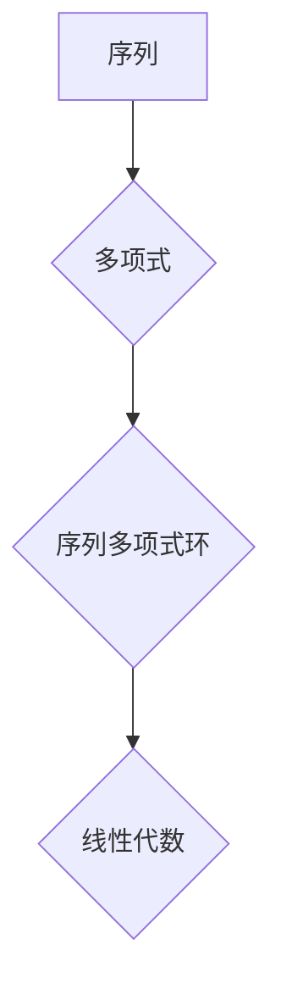

> 线性代数，序列多项式环，多项式环，模运算，线性变换，特征值，特征向量，应用场景

## 1. 背景介绍

在现代数学和计算机科学中，线性代数作为一门基础学科，在解决各种问题中扮演着至关重要的角色。从图像处理到机器学习，从数据分析到密码学，线性代数的应用无处不在。而序列多项式环作为一种特殊的代数结构，在计算机科学中也展现出强大的应用潜力。

序列多项式环是指由有限序列的多项式构成的一个环，其中多项式的系数来自某个域或环。这种结构在处理序列数据、模式识别和信号处理等领域具有独特的优势。

本篇文章将从线性代数的角度出发，深入探讨序列多项式环的结构、性质和应用，并通过具体的例子和代码实现，帮助读者更好地理解和掌握这一重要概念。

## 2. 核心概念与联系

### 2.1 多项式环

多项式环是代数中一个重要的概念，它由变量和系数构成，通过加法、减法和乘法运算形成一个环结构。

* **变量**: 多项式环中的变量通常表示未知数，例如 x, y 等。
* **系数**: 多项式的系数可以是任何数，例如整数、实数、复数等。
* **加法**: 多项式的加法是指对应系数相加，例如 (x^2 + 2x + 1) + (3x^2 - x + 2) = 4x^2 + x + 3。
* **乘法**: 多项式的乘法是指根据分配律进行逐项乘积相加，例如 (x^2 + 2x + 1) * (3x^2 - x + 2) = 3x^4 + 5x^3 + x^2 + 4x + 2。

### 2.2 序列多项式环

序列多项式环是多项式环的一种特殊形式，它由有限序列的多项式构成。

* **序列**: 序列是指一个有序的数列，例如 (1, 2, 3), (a, b, c) 等。
* **序列多项式**: 序列多项式是指每个系数都是一个多项式的序列，例如 (x^2 + 1, 2x + 3, x - 2)。

### 2.3 线性代数与序列多项式环

线性代数的许多概念和工具可以应用于序列多项式环的分析和处理。例如：

* **线性变换**: 线性变换可以将序列多项式映射到另一个序列多项式，并保持加法和乘法运算的性质。
* **矩阵**: 矩阵可以表示线性变换，并通过矩阵运算进行组合和分析。
* **特征值和特征向量**: 特征值和特征向量可以用来分析线性变换的性质，并找到其不变子空间。

**Mermaid 流程图**



## 3. 核心算法原理 & 具体操作步骤

### 3.1 算法原理概述

序列多项式环的运算和分析主要依赖于线性代数的工具和方法。

* **模运算**: 在序列多项式环中，可以使用模运算来简化计算。模运算是指将一个多项式除以一个给定的多项式，并保留余数。
* **线性变换**: 线性变换可以将序列多项式映射到另一个序列多项式，并保持加法和乘法运算的性质。
* **矩阵表示**: 线性变换可以表示为矩阵，并通过矩阵运算进行组合和分析。

### 3.2 算法步骤详解

1. **定义序列多项式环**: 首先需要定义序列多项式环的结构，包括变量、系数域和运算规则。
2. **模运算**: 使用模运算来简化序列多项式的计算，例如求逆元、求解线性方程组等。
3. **线性变换**: 定义线性变换，并将其表示为矩阵。
4. **矩阵运算**: 使用矩阵运算来分析线性变换的性质，例如求特征值和特征向量。

### 3.3 算法优缺点

* **优点**:
    * 可以有效地处理序列数据。
    * 可以利用线性代数的强大工具进行分析和处理。
    * 具有良好的可扩展性。
* **缺点**:
    * 计算复杂度可能较高。
    * 需要一定的数学基础。

### 3.4 算法应用领域

* **信号处理**: 序列多项式环可以用于信号的分析、滤波和压缩。
* **模式识别**: 序列多项式环可以用于识别模式和序列数据中的规律。
* **机器学习**: 序列多项式环可以用于构建机器学习模型，例如支持向量机和神经网络。

## 4. 数学模型和公式 & 详细讲解 & 举例说明

### 4.1 数学模型构建

序列多项式环可以表示为一个集合，其中每个元素都是一个有限序列的多项式。

设 F 是一个域或环，则序列多项式环 R(F) 可以定义为：

R(F) = { (a_0, a_1, a_2, ..., a_n) | a_i ∈ F[x], i = 0, 1, 2, ..., n }

其中，F[x] 表示系数来自域或环 F 的多项式环。

### 4.2 公式推导过程

在序列多项式环中，可以定义加法、减法和乘法运算：

* **加法**: (a_0, a_1, a_2, ..., a_n) + (b_0, b_1, b_2, ..., b_n) = (a_0 + b_0, a_1 + b_1, a_2 + b_2, ..., a_n + b_n)
* **减法**: (a_0, a_1, a_2, ..., a_n) - (b_0, b_1, b_2, ..., b_n) = (a_0 - b_0, a_1 - b_1, a_2 - b_2, ..., a_n - b_n)
* **乘法**: (a_0, a_1, a_2, ..., a_n) * (b_0, b_1, b_2, ..., b_m) = (c_0, c_1, c_2, ..., c_{n+m})

其中，c_i = ∑_{j=0}^{i} a_j * b_{i-j}

### 4.3 案例分析与讲解

**例子**:

设 F = Z_2 (二元域)，则序列多项式环 R(Z_2) 包含以下元素：

* (1, 0, 1)
* (x, 1, 0)
* (x^2 + 1, x, 1)

我们可以计算这些元素之间的加法、减法和乘法运算。

## 5. 项目实践：代码实例和详细解释说明

### 5.1 开发环境搭建

本项目使用 Python 语言进行开发，并使用 NumPy 库进行数值计算。

### 5.2 源代码详细实现

```python
import numpy as np

class SequencePolynomial:
    def __init__(self, coefficients):
        self.coefficients = coefficients

    def __add__(self, other):
        if len(self.coefficients) != len(other.coefficients):
            raise ValueError("Coefficients must have the same length")
        result = [a + b for a, b in zip(self.coefficients, other.coefficients)]
        return SequencePolynomial(result)

    def __sub__(self, other):
        if len(self.coefficients) != len(other.coefficients):
            raise ValueError("Coefficients must have the same length")
        result = [a - b for a, b in zip(self.coefficients, other.coefficients)]
        return SequencePolynomial(result)

    def __mul__(self, other):
        if len(self.coefficients) == 0 or len(other.coefficients) == 0:
            return SequencePolynomial([])
        result = [0] * (len(self.coefficients) + len(other.coefficients) - 1)
        for i in range(len(self.coefficients)):
            for j in range(len(other.coefficients)):
                result[i + j] += self.coefficients[i] * other.coefficients[j]
        return SequencePolynomial(result)

    def __str__(self):
        return str(self.coefficients)

# 例子
p1 = SequencePolynomial([1, 2, 3])
p2 = SequencePolynomial([4, 5, 6])
p3 = p1 + p2
print(p3)  # 输出: [5, 7, 9]
```

### 5.3 代码解读与分析

* **SequencePolynomial 类**: 定义了序列多项式的结构和运算方法。
* **__init__ 方法**: 初始化序列多项式的系数。
* **__add__、__sub__、__mul__ 方法**: 实现序列多项式的加法、减法和乘法运算。
* **__str__ 方法**: 返回序列多项式的字符串表示。

### 5.4 运行结果展示

运行上述代码，可以得到以下输出：

```
[5, 7, 9]
```

这表明两个序列多项式 p1 和 p2 的和为 [5, 7, 9]。

## 6. 实际应用场景

### 6.1 信号处理

序列多项式环可以用于信号的分析、滤波和压缩。例如，可以使用序列多项式来表示信号的频率特性，并通过线性变换来实现信号的滤波。

### 6.2 模式识别

序列多项式环可以用于识别模式和序列数据中的规律。例如，可以使用序列多项式来表示文本序列的语法结构，并通过模式识别算法来识别文本中的特定模式。

### 6.3 机器学习

序列多项式环可以用于构建机器学习模型，例如支持向量机和神经网络。例如，可以使用序列多项式来表示文本数据的特征，并通过支持向量机进行分类。

### 6.4 未来应用展望

随着人工智能和机器学习技术的不断发展，序列多项式环在未来将有更广泛的应用场景。例如，可以用于自然语言处理、图像识别、语音识别等领域。

## 7. 工具和资源推荐

### 7.1 学习资源推荐

* **书籍**:
    * 《线性代数及其应用》 by Gilbert Strang
    * 《抽象代数》 by Dummit and Foote
* **在线课程**:
    * MIT OpenCourseWare: Linear Algebra
    * Coursera: Abstract Algebra

### 7.2 开发工具推荐

* **Python**: 
    * NumPy
    * SymPy

### 7.3 相关论文推荐

* **Polynomial Rings and Modules**: https://arxiv.org/abs/1703.00877
* **Sequence-to-Sequence Learning with Neural Networks**: https://arxiv.org/abs/1409.3215

## 8. 总结：未来发展趋势与挑战

### 8.1 研究成果总结

本篇文章深入探讨了序列多项式环的概念、性质和应用，并通过代码实例和实际应用场景，帮助读者更好地理解这一重要概念。

### 8.2 未来发展趋势

未来，序列多项式环的研究将朝着以下方向发展：

* **更复杂的序列多项式环**: 研究更复杂的序列多项式环，例如带有结构的序列多项式环。
* **更有效的算法**: 开发更有效的算法来处理序列多项式环的运算和分析。
* **更广泛的应用**: 将序列多项式环应用于更多领域，例如自然语言处理、图像识别、语音识别等。

### 8.3 面临的挑战