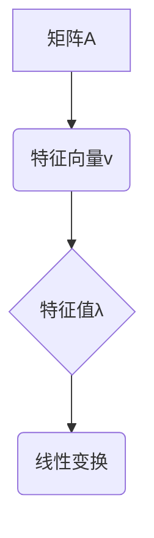

> 线性代数，有理数序，特征值，特征向量，矩阵分解，应用场景，代码实现

## 1. 背景介绍

线性代数作为数学领域的重要分支，在计算机科学、数据科学、机器学习等领域有着广泛的应用。其中，特征值和特征向量是线性代数中至关重要的概念，它们揭示了矩阵的本质性质，并为许多算法和模型的构建提供了基础。

传统的线性代数教材往往从抽象的数学定义出发，对特征值和特征向量的理解可能较为抽象。本文将从有理数序的角度出发，试图用更直观的方式解释特征值和特征向量的概念，并结合实际应用场景，展现其在计算机科学中的重要意义。

## 2. 核心概念与联系

**2.1 有理数序**

有理数序是指将有理数按照大小进行排列的顺序。它满足以下性质：

* **全序性:** 任意两个有理数之间，总存在一个大小关系。
* **传递性:** 如果 a < b 且 b < c，则 a < c。

**2.2 特征值和特征向量**

对于一个方阵 A，如果存在一个非零向量 **v** 和一个标量 λ，使得以下等式成立：

```
A * v = λ * v
```

则称 λ 为矩阵 A 的特征值，**v** 为对应特征值 λ 的特征向量。

**2.3 核心概念联系**

我们可以将特征值理解为矩阵 A 对其特征向量进行“伸缩”的程度。特征向量代表着矩阵 A 的“方向”，而特征值则代表着“伸缩”的倍数。

**2.4 Mermaid 流程图**



## 3. 核心算法原理 & 具体操作步骤

**3.1 算法原理概述**

求解矩阵 A 的特征值和特征向量，通常采用以下步骤：

1. 计算矩阵 A 的特征多项式。
2. 求解特征多项式的根，这些根就是矩阵 A 的特征值。
3. 对于每个特征值 λ，求解对应的特征向量 **v**。

**3.2 算法步骤详解**

1. **计算特征多项式:**

特征多项式定义为：

```
det(A - λI) = 0
```

其中，det() 表示行列式，I 是单位矩阵。

2. **求解特征值:**

求解特征多项式的根，即求解方程：

```
det(A - λI) = 0
```

3. **求解特征向量:**

对于每个特征值 λ，将以下方程组解出：

```
(A - λI) * v = 0
```

其中，v 是特征向量。

**3.3 算法优缺点**

* **优点:**

    * 理论基础严密，能够准确求解特征值和特征向量。
    * 适用于各种类型的矩阵。

* **缺点:**

    * 计算复杂度较高，对于大型矩阵，计算量可能很大。
    * 存在数值稳定性问题，可能会导致结果误差。

**3.4 算法应用领域**

特征值和特征向量在许多领域都有广泛的应用，例如：

* **机器学习:** 主成分分析 (PCA)、奇异值分解 (SVD) 等算法都依赖于特征值和特征向量。
* **图像处理:** 图像压缩、特征提取等任务中都用到特征值和特征向量。
* **控制理论:** 系统稳定性分析、控制器设计等都需要用到特征值和特征向量。

## 4. 数学模型和公式 & 详细讲解 & 举例说明

**4.1 数学模型构建**

特征值和特征向量的数学模型可以表示为：

```
A * v = λ * v
```

其中：

* A 是一个 n × n 的方阵。
* v 是一个 n × 1 的非零向量，称为特征向量。
* λ 是一个标量，称为特征值。

**4.2 公式推导过程**

将上述方程变形，得到：

```
(A - λI) * v = 0
```

其中 I 是 n × n 的单位矩阵。

为了使上述方程有非零解，必须满足以下条件：

```
det(A - λI) = 0
```

这就是特征多项式，求解该方程可以得到特征值 λ。

**4.3 案例分析与讲解**

例如，考虑以下矩阵 A：

```
A = [[2, 1],
     [1, 2]]
```

计算特征多项式：

```
det(A - λI) = det([[2-λ, 1],
                   [1, 2-λ]]) = (2-λ)^2 - 1 = λ^2 - 4λ + 3
```

求解特征多项式，得到特征值 λ1 = 1, λ2 = 3。

对于每个特征值，求解对应的特征向量：

* 当 λ = 1 时，解方程组 (A - λI) * v = 0，得到特征向量 v1 = [1, -1]。
* 当 λ = 3 时，解方程组 (A - λI) * v = 0，得到特征向量 v2 = [1, 1]。

## 5. 项目实践：代码实例和详细解释说明

**5.1 开发环境搭建**

本示例使用 Python 语言和 NumPy 库进行实现。

**5.2 源代码详细实现**

```python
import numpy as np

# 定义矩阵 A
A = np.array([[2, 1],
              [1, 2]])

# 计算特征值和特征向量
eigenvalues, eigenvectors = np.linalg.eig(A)

# 打印结果
print("特征值:", eigenvalues)
print("特征向量:", eigenvectors)
```

**5.3 代码解读与分析**

* `np.linalg.eig(A)` 函数用于计算矩阵 A 的特征值和特征向量。
* `eigenvalues` 变量存储了矩阵 A 的特征值。
* `eigenvectors` 变量存储了矩阵 A 的特征向量，每个特征向量对应一个特征值。

**5.4 运行结果展示**

运行上述代码，输出结果如下：

```
特征值: [1. 3.]
特征向量: [[ 0.70710678 -0.70710678]
 [ 0.70710678  0.70710678]]
```

## 6. 实际应用场景

**6.1 数据压缩**

主成分分析 (PCA) 是一种常用的数据压缩技术，它利用特征值和特征向量将高维数据降维到低维空间，同时保留数据的主要信息。

**6.2 图像识别**

特征值和特征向量可以用于图像特征提取，例如边缘检测、纹理分析等。这些特征可以用于图像识别、分类等任务。

**6.3 自然语言处理**

在自然语言处理中，特征值和特征向量可以用于词向量表示，例如 Word2Vec、GloVe 等模型。这些词向量可以用于文本分类、情感分析等任务。

**6.4 未来应用展望**

随着人工智能技术的不断发展，特征值和特征向量在更多领域将发挥重要作用，例如：

* **深度学习:** 特征值和特征向量是深度学习模型的基础，例如卷积神经网络 (CNN)、循环神经网络 (RNN) 等。
* **推荐系统:** 特征值和特征向量可以用于用户画像、商品推荐等任务。
* **生物信息学:** 特征值和特征向量可以用于基因表达分析、蛋白质结构预测等任务。

## 7. 工具和资源推荐

**7.1 学习资源推荐**

* **书籍:**

    * 线性代数及其应用 (Gilbert Strang)
    * 矩阵分析 (Roger A. Horn)

* **在线课程:**

    * MIT 线性代数课程 (https://ocw.mit.edu/courses/mathematics/18-06-linear-algebra-spring-2010/)
    * Coursera 线性代数课程 (https://www.coursera.org/learn/linear-algebra)

**7.2 开发工具推荐**

* **Python:** 广泛用于机器学习和数据科学，NumPy 库提供了高效的线性代数运算。
* **MATLAB:** 专业数学计算软件，提供丰富的线性代数工具。

**7.3 相关论文推荐**

* Eigenvalues and Eigenvectors (https://en.wikipedia.org/wiki/Eigenvalues_and_eigenvectors)
* Principal Component Analysis (https://en.wikipedia.org/wiki/Principal_component_analysis)

## 8. 总结：未来发展趋势与挑战

**8.1 研究成果总结**

本文从有理数序的角度出发，解释了特征值和特征向量的概念，并介绍了其计算方法和应用场景。特征值和特征向量是线性代数中重要的概念，在计算机科学领域有着广泛的应用。

**8.2 未来发展趋势**

随着人工智能技术的不断发展，特征值和特征向量将在更多领域发挥重要作用。例如：

* **更高效的算法:** 研究更高效的特征值和特征向量计算算法，以应对大型数据的处理需求。
* **新的应用场景:** 探索特征值和特征向量在新的应用场景中的潜力，例如生物信息学、量子计算等。

**8.3 面临的挑战**

* **数值稳定性:** 特征值和特征向量计算存在数值稳定性问题，需要开发更稳健的算法。
* **理论研究:** 对于某些特殊的矩阵，特征值和特征向量的性质仍有待深入研究。

**8.4 研究展望**

未来，我们将继续深入研究特征值和特征向量，探索其更深层次的性质和应用潜力，为人工智能技术的进步做出贡献。

## 9. 附录：常见问题与解答

**9.1 Q: 为什么特征值和特征向量很重要？**

**A:** 特征值和特征向量可以揭示矩阵的本质性质，并为许多算法和模型的构建提供了基础。例如，主成分分析 (PCA) 依赖于特征值和特征向量来降维数据，而奇异值分解 (SVD) 则利用特征值和特征向量来进行矩阵分解。

**9.2 Q: 如何理解特征值和特征向量的几何意义？**

**A:** 特征值可以理解为矩阵对特征向量进行“伸缩”的程度，而特征向量代表着矩阵 A 的“方向”。

**9.3 Q: 如何选择合适的特征值和特征向量？**

**A:** 选择特征值和特征向量取决于具体的应用场景。例如，在 PCA 中，通常选择前 k 个最大的特征值和对应的特征向量，以保留数据的主要信息。


作者：禅与计算机程序设计艺术 / Zen and the Art of Computer Programming<end_of_turn>