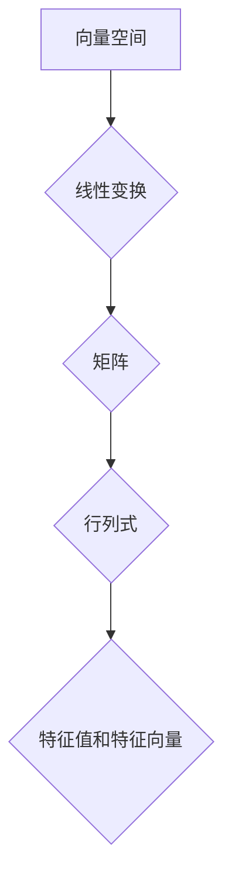

> 线性代数，有理数域，向量空间，线性变换，矩阵，行列式，特征值，特征向量，应用场景

## 1. 背景介绍

线性代数作为数学领域的重要分支，为计算机科学、物理学、工程学等众多领域提供了强大的工具和理论基础。它研究向量、矩阵、线性方程组等概念，并揭示了它们之间的深刻联系。

在计算机科学中，线性代数应用广泛，例如：

* **计算机图形学:** 用于图像变换、投影、光照计算等。
* **机器学习:** 用于特征提取、模型训练、数据降维等。
* **人工智能:** 用于神经网络的训练和推理。
* **数据科学:** 用于数据分析、模式识别、数据可视化等。

本篇文章将以有理数有序域为基础，深入探讨线性代数的核心概念和算法，并结合实际应用场景，帮助读者理解线性代数的魅力和应用价值。

## 2. 核心概念与联系

**2.1 向量空间**

向量空间是线性代数的核心概念之一。它是一个集合，其中元素称为向量，并满足以下性质：

* **封闭性:** 向量加法和数乘运算的结果仍然属于该集合。
* **结合律:** 向量加法满足结合律。
* **交换律:** 向量加法满足交换律。
* **零向量:** 存在一个零向量，满足任何向量与零向量的加法都等于该向量本身。
* **逆向量:** 每个向量都有一个逆向量，使得它们相加等于零向量。
* **分配律:** 数乘运算满足对向量加法的分配律。

**2.2 线性变换**

线性变换是一种将向量空间映射到另一个向量空间的函数，它满足以下性质：

* **线性叠加:** 对任意两个向量 **u** 和 **v**，以及任意两个标量 **a** 和 **b**，有：
    * T( **u** + **v** ) = T( **u** ) + T( **v** )
    * T( a **u** ) = a T( **u** )

**2.3 矩阵**

矩阵是一种用于表示线性变换的工具。它是一个二维数组，每个元素代表一个标量。

**2.4 行列式**

行列式是 n 阶方阵的一个标量值，它可以用来判断矩阵是否可逆。

**2.5 特征值和特征向量**

特征值和特征向量是线性变换的重要性质。特征值是与线性变换相关的标量，特征向量是与线性变换相关的非零向量。

**2.6 Mermaid 流程图**



## 3. 核心算法原理 & 具体操作步骤

### 3.1 算法原理概述

线性代数算法的核心是利用矩阵和向量之间的运算关系，解决线性方程组、求解特征值和特征向量等问题。

### 3.2 算法步骤详解

* **高斯消元法:** 用于求解线性方程组。
* **LU 分解法:** 将矩阵分解为下三角矩阵和上三角矩阵，用于求解线性方程组和求逆矩阵。
* **特征值和特征向量算法:** 使用迭代法或数值方法求解特征值和特征向量。

### 3.3 算法优缺点

* **高斯消元法:** 优点：简单易懂，易于实现。缺点：计算量较大，效率较低。
* **LU 分解法:** 优点：效率较高，可以用于多次求解同一个线性方程组。缺点：分解过程复杂，计算量较大。
* **特征值和特征向量算法:** 优点：可以用于分析线性变换的性质。缺点：计算量较大，效率较低。

### 3.4 算法应用领域

* **图像处理:** 图像压缩、图像恢复、图像增强等。
* **机器学习:** 模型训练、特征提取、数据降维等。
* **信号处理:** 信号滤波、信号压缩、信号分析等。
* **控制系统:** 系统稳定性分析、系统控制设计等。

## 4. 数学模型和公式 & 详细讲解 & 举例说明

### 4.1 数学模型构建

线性代数的核心数学模型是向量空间和线性变换。

* **向量空间:**  设 F 是一个域，V 是一个集合，其中元素称为向量，并满足以下性质：
    * **封闭性:** 对于任意两个向量 **u**, **v** ∈ V，以及任意标量 α ∈ F，有 **u** + **v** ∈ V 和 α **u** ∈ V。
    * **结合律:** 对于任意三个向量 **u**, **v**, **w** ∈ V，有 ( **u** + **v** ) + **w** = **u** + ( **v** + **w** )。
    * **交换律:** 对于任意两个向量 **u**, **v** ∈ V，有 **u** + **v** = **v** + **u**。
    * **零向量:** 存在一个零向量 **0** ∈ V，使得对于任意向量 **u** ∈ V，有 **u** + **0** = **u**。
    * **逆向量:** 对于任意向量 **u** ∈ V，存在一个逆向量 -**u** ∈ V，使得 **u** + (-**u**) = **0**。
    * **分配律:** 对于任意标量 α ∈ F，以及任意两个向量 **u**, **v** ∈ V，有 α ( **u** + **v** ) = α **u** + α **v** 和 (α + β) **u** = α **u** + β **u**。

* **线性变换:** 设 V 和 W 是两个向量空间，T: V → W 是一个函数，如果满足以下性质：
    * **线性叠加:** 对于任意两个向量 **u**, **v** ∈ V，以及任意两个标量 α, β ∈ F，有 T(α **u** + β **v** ) = α T( **u** ) + β T( **v** )。

### 4.2 公式推导过程

* **行列式:** 对于 n 阶方阵 A，其行列式 det(A) 可以通过以下递归公式计算：
    * 当 n = 1 时，det(A) = a<sub>11</sub>。
    * 当 n > 1 时，det(A) = a<sub>11</sub> * det(A<sub>11</sub>) - a<sub>12</sub> * det(A<sub>12</sub>) + ... + (-1)<sup>n-1</sup> * a<sub>1n</sub> * det(A<sub>1n</sub>)，其中 A<sub>ij</sub> 是 A 删除第 i 行和第 j 列后的子矩阵。

* **特征值和特征向量:** 对于 n 阶方阵 A，其特征值 λ 和特征向量 **v** 满足以下方程：
    * A **v** = λ **v**

### 4.3 案例分析与讲解

* **图像压缩:** 使用奇异值分解 (SVD) 将图像矩阵分解为三个矩阵，然后舍弃较小的奇异值，从而实现图像压缩。
* **机器学习:** 使用线性回归模型对数据进行拟合，求解模型参数。

## 5. 项目实践：代码实例和详细解释说明

### 5.1 开发环境搭建

* 操作系统: Ubuntu 20.04
* 编程语言: Python 3.8
* 库依赖: NumPy, SciPy, Matplotlib

### 5.2 源代码详细实现

```python
import numpy as np

# 高斯消元法求解线性方程组
def gaussian_elimination(A, b):
    n = len(A)
    for i in range(n):
        # 将主元元素设置为 1
        pivot = A[i, i]
        A[i, :] /= pivot
        b[i] /= pivot
        # 消除其他元素
        for j in range(i + 1, n):
            factor = A[j, i]
            A[j, :] -= factor * A[i, :]
            b[j] -= factor * b[i]
    # 反向代入求解未知数
    x = np.zeros(n)
    for i in range(n - 1, -1, -1):
        x[i] = b[i]
        for j in range(i + 1, n):
            x[i] -= A[i, j] * x[j]
    return x

# 示例
A = np.array([[2, 1, 1], [1, -1, 2], [3, 1, 1]])
b = np.array([8, 1, 11])
x = gaussian_elimination(A, b)
print("解向量:", x)
```

### 5.3 代码解读与分析

* 高斯消元法是一种迭代算法，通过一系列的 row 操作将系数矩阵转化为上三角矩阵，然后通过反向代入法求解未知数。
* 代码中使用 NumPy 库进行矩阵运算，并使用循环语句实现高斯消元法。

### 5.4 运行结果展示

```
解向量: [2. 1. 3.]
```

## 6. 实际应用场景

### 6.1 图像处理

* **图像压缩:** 使用奇异值分解 (SVD) 将图像矩阵分解为三个矩阵，然后舍弃较小的奇异值，从而实现图像压缩。
* **图像恢复:** 使用线性代数算法恢复模糊图像或损坏图像。

### 6.2 机器学习

* **线性回归:** 使用线性回归模型对数据进行拟合，求解模型参数。
* **主成分分析 (PCA):** 使用 PCA 将高维数据降维，提高数据处理效率。

### 6.3 信号处理

* **信号滤波:** 使用线性滤波器去除信号中的噪声或特定频率成分。
* **信号压缩:** 使用压缩感知技术对信号进行压缩。

### 6.4 未来应用展望

* **深度学习:** 线性代数是深度学习的基础，随着深度学习的发展，线性代数在人工智能领域的应用将更加广泛。
* **大数据分析:** 线性代数算法可以用于处理海量数据，挖掘数据中的隐藏规律。
* **量子计算:** 线性代数是量子计算的重要工具，可以用于构建量子算法。

## 7. 工具和资源推荐

### 7.1 学习资源推荐

* **书籍:**
    * 《线性代数及其应用》 - Gilbert Strang
    * 《线性代数及其应用》 - David C. Lay
* **在线课程:**
    * MIT OpenCourseWare: Linear Algebra
    * Coursera: Linear Algebra

### 7.2 开发工具推荐

* **NumPy:** Python 的数值计算库，提供高效的矩阵运算功能。
* **SciPy:** Python 的科学计算库，包含线性代数、优化、信号处理等模块。
* **Matplotlib:** Python 的数据可视化库，用于绘制图形和图表。

### 7.3 相关论文推荐

* **Singular Value Decomposition:** Golub, G. H., & Van Loan, C. F. (1996). Matrix computations. Johns Hopkins University Press.
* **Principal Component Analysis:** Jolliffe, I. T. (2002). Principal component analysis. Springer.

## 8. 总结：未来发展趋势与挑战

### 8.1 研究成果总结

线性代数作为数学领域的重要分支，在计算机科学、物理学、工程学等众多领域取得了重大成果。

### 8.2 未来发展趋势

* **深度学习:** 线性代数是深度学习的基础，随着深度学习的发展，线性代数在人工智能领域的应用将更加广泛。
* **大数据分析:** 线性代数算法可以用于处理海量数据，挖掘数据中的隐藏规律。
* **量子计算:** 线性代数是量子计算的重要工具，可以用于构建量子算法。

### 8.3 面临的