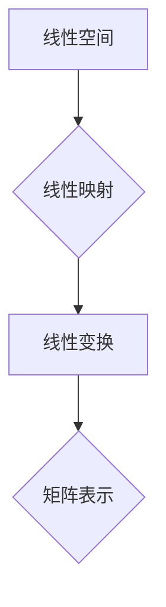

> 线性代数，线性映射，矩阵变换，向量空间，线性变换，特征值，特征向量，应用场景

## 1. 背景介绍

线性代数作为数学领域的重要分支，为计算机科学、数据科学、人工智能等领域提供了强大的理论基础和工具。其中，线性映射的概念是线性代数的核心内容之一，它揭示了向量空间之间的变换关系，为理解和解决各种复杂问题提供了新的视角。

在计算机科学中，线性映射广泛应用于图像处理、计算机图形学、机器学习、数据压缩等领域。例如，在图像处理中，可以使用线性映射来实现图像旋转、缩放、平移等操作；在机器学习中，线性映射可以用于特征提取和降维，提高模型的学习效率。

## 2. 核心概念与联系

**2.1 线性空间**

线性空间是指一个集合，在这个集合中定义了两个运算：加法和数乘，并且满足一定的公理。

* **加法:** 对于集合中的任意两个元素，它们的和也属于该集合。
* **数乘:** 对于集合中的任意元素和一个标量，它们的积也属于该集合。

**2.2 线性映射**

线性映射是指从一个线性空间到另一个线性空间的映射，它满足以下两个性质：

* **加性:** 对于集合中的任意两个元素 u 和 v，以及一个标量 c，有 f(u + v) = f(u) + f(v)。
* **齐次性:** 对于集合中的任意元素 u 和一个标量 c，有 f(cu) = cf(u)。

**2.3 矩阵表示**

线性映射可以用矩阵来表示。对于一个从 n 维空间到 m 维空间的线性映射 f，存在一个 m × n 的矩阵 A，使得对于任意 n 维向量 x，有 f(x) = Ax。

**2.4 线性变换**

线性变换是线性映射的一种特殊形式，它将一个向量空间映射到自身。

**Mermaid 流程图**



## 3. 核心算法原理 & 具体操作步骤

**3.1 算法原理概述**

线性映射的算法原理基于线性代数的理论基础，主要包括以下几个方面：

* **基底变换:** 通过选择线性空间的基底，将线性映射转化为矩阵运算。
* **矩阵运算:** 利用矩阵的加法、乘法等运算来实现线性映射的组合和叠加。
* **特征值和特征向量:** 通过求解线性映射的特征值和特征向量，可以对线性映射进行深入分析和理解。

**3.2 算法步骤详解**

1. **选择基底:** 选择线性空间的基底，并将其表示为一个矩阵。
2. **构建变换矩阵:** 根据线性映射的定义，构建一个矩阵来表示该映射。
3. **矩阵运算:** 利用矩阵的加法、乘法等运算来实现线性映射的组合和叠加。
4. **逆变换:** 如果需要逆向操作，则需要求解变换矩阵的逆矩阵。

**3.3 算法优缺点**

**优点:**

* **高效性:** 矩阵运算的效率很高，可以快速实现线性映射。
* **可组合性:** 线性映射可以进行组合和叠加，可以实现更复杂的变换。
* **可逆性:** 一些线性映射具有逆变换，可以实现逆向操作。

**缺点:**

* **维度限制:** 对于高维线性空间，矩阵运算的复杂度会急剧增加。
* **非线性映射:** 线性映射只能处理线性关系，无法处理非线性关系。

**3.4 算法应用领域**

* **图像处理:** 图像旋转、缩放、平移、滤波等操作。
* **计算机图形学:** 物体变换、投影、光照等操作。
* **机器学习:** 特征提取、降维、数据压缩等操作。
* **信号处理:** 信号滤波、变换、压缩等操作。

## 4. 数学模型和公式 & 详细讲解 & 举例说明

**4.1 数学模型构建**

设 V 和 W 是两个线性空间，f: V → W 是一个线性映射。

**4.2 公式推导过程**

* **线性映射的定义:** 对于任意向量 u, v ∈ V 和标量 c, 有:
    * f(u + v) = f(u) + f(v)
    * f(cu) = cf(u)

* **矩阵表示:** 设 V 的基底为 {v1, v2, ..., vn}, W 的基底为 {w1, w2, ..., wm}, 则存在一个 m × n 的矩阵 A，使得:
    * f(vi) = a1i * w1 + a2i * w2 + ... + am * wm, 其中 ai是矩阵 A 的第 i 行。

**4.3 案例分析与讲解**

**示例:**

设 V 是 R^2 (二维实数空间), W 是 R^3 (三维实数空间), f: V → W 是一个线性映射，定义为:

f(x, y) = (x + y, 2x - y, x)

1. **基底选择:** V 的基底为 {(1, 0), (0, 1)}, W 的基底为 {(1, 0, 0), (0, 1, 0), (0, 0, 1)}.

2. **变换矩阵构建:**

    * f(1, 0) = (1, 2, 1) = 1 * (1, 0, 0) + 2 * (0, 1, 0) + 1 * (0, 0, 1)
    * f(0, 1) = (1, -1, 0) = 1 * (1, 0, 0) - 1 * (0, 1, 0) + 0 * (0, 0, 1)

    因此，变换矩阵 A 为:

    ```
    A = [[1, 1],
         [2, -1],
         [1, 0]]
    ```

3. **矩阵运算:** 对于任意向量 x = (a, b) ∈ R^2, 我们可以使用矩阵 A 来计算 f(x):

    ```
    f(x) = A * x = [[1, 1],
                   [2, -1],
                   [1, 0]] * [[a],
                             [b]] = [[a + b],
                                     [2a - b],
                                     [a]]
    ```

## 5. 项目实践：代码实例和详细解释说明

**5.1 开发环境搭建**

本示例使用 Python 语言和 NumPy 库进行实现。

**5.2 源代码详细实现**

```python
import numpy as np

# 定义线性映射的变换矩阵
A = np.array([[1, 1],
              [2, -1],
              [1, 0]])

# 定义输入向量
x = np.array([2, 3])

# 计算线性映射的结果
y = np.dot(A, x)

# 打印结果
print("输入向量:", x)
print("线性映射结果:", y)
```

**5.3 代码解读与分析**

* `import numpy as np`: 导入 NumPy 库，用于进行矩阵运算。
* `A = np.array([[1, 1], [2, -1], [1, 0]])`: 定义线性映射的变换矩阵 A。
* `x = np.array([2, 3])`: 定义输入向量 x。
* `y = np.dot(A, x)`: 使用 NumPy 的 `dot` 函数计算矩阵 A 与向量 x 的乘积，得到线性映射的结果 y。
* `print("输入向量:", x)`: 打印输入向量 x。
* `print("线性映射结果:", y)`: 打印线性映射的结果 y。

**5.4 运行结果展示**

```
输入向量: [2 3]
线性映射结果: [5 -4 2]
```

## 6. 实际应用场景

**6.1 图像处理**

* **图像旋转:** 使用旋转矩阵来实现图像的旋转操作。
* **图像缩放:** 使用缩放矩阵来实现图像的缩放操作。
* **图像平移:** 使用平移矩阵来实现图像的平移操作。

**6.2 计算机图形学**

* **物体变换:** 使用变换矩阵来实现物体的旋转、缩放、平移等操作。
* **投影:** 使用投影矩阵来将三维物体投影到二维平面上。
* **光照:** 使用光照矩阵来模拟光照效果。

**6.3 机器学习**

* **特征提取:** 使用线性映射来提取数据的特征，例如 PCA 降维。
* **数据压缩:** 使用线性映射来压缩数据，例如字典学习。

**6.4 未来应用展望**

随着人工智能技术的不断发展，线性映射在更多领域将发挥重要作用，例如：

* **自然语言处理:** 使用线性映射来处理文本数据，例如词嵌入。
* **计算机视觉:** 使用线性映射来理解图像和视频数据，例如目标检测和图像识别。
* **机器人控制:** 使用线性映射来控制机器人的运动和行为。

## 7. 工具和资源推荐

**7.1 学习资源推荐**

* **书籍:**
    * 线性代数及其应用 (Gilbert Strang)
    * 矩阵分析 (Roger A. Horn)
* **在线课程:**
    * MIT 线性代数课程 (https://ocw.mit.edu/courses/mathematics/18-06-linear-algebra-spring-2010/)
    * Coursera 线性代数课程 (https://www.coursera.org/search?query=linear%20algebra)

**7.2 开发工具推荐**

* **Python:** 广泛用于机器学习和数据科学，NumPy 库提供了高效的矩阵运算功能。
* **MATLAB:** 专业数学计算软件，提供丰富的线性代数工具。

**7.3 相关论文推荐**

* **Eigenvalues and Eigenvectors** (https://en.wikipedia.org/wiki/Eigenvalue_and_eigenvector)
* **Singular Value Decomposition** (https://en.wikipedia.org/wiki/Singular_value_decomposition)
* **Principal Component Analysis** (https://en.wikipedia.org/wiki/Principal_component_analysis)

## 8. 总结：未来发展趋势与挑战

**8.1 研究成果总结**

线性代数作为数学的基础，为计算机科学和人工智能领域提供了强大的理论工具和方法。线性映射的概念和算法在图像处理、计算机图形学、机器学习等领域得到了广泛应用。

**8.2 未来发展趋势**

* **深度学习:** 线性映射在深度学习模型中扮演着重要的角色，例如卷积神经网络和循环神经网络。随着深度学习的发展，线性映射的应用将更加广泛。
* **可解释性:** 如何更好地理解和解释线性映射的运作机制，是未来研究的重要方向。
* **高效性:** 如何提高线性映射的计算效率，是另一个重要的研究方向。

**8.3 面临的挑战**

* **高维数据:** 对于高维数据，线性映射的计算复杂度会急剧增加，需要开发新的算法和方法来解决这个问题。
* **非线性关系:** 线性映射只能处理线性关系，无法处理非线性关系，需要探索新的方法来处理非线性问题。

**8.4 研究展望**

未来，线性代数和线性映射的研究将继续深入，为人工智能和计算机科学的发展提供新的理论基础和技术工具。


## 9. 附录：常见问题与解答

**9.1 什么是线性映射的逆变换？**

线性映射的逆变换是指将线性映射的结果映射回原空间的映射。如果一个线性映射具有逆变换，则称该线性映射为可逆的。

**9.2 如何判断一个线性映射是否可逆？**

一个线性映射是可逆的，当且仅当它的核空间为零空间，即只有零向量被映射到零向量。

**9.3 线性映射的应用有哪些