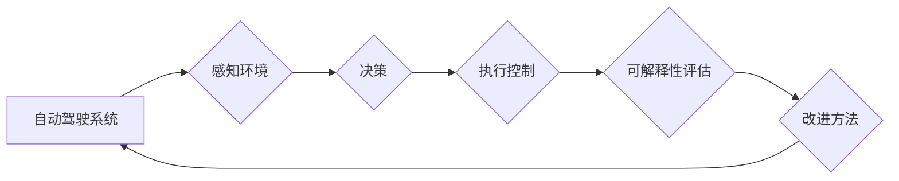

> 自动驾驶, 可解释性, 评估方法, 改进方法, 深度学习, 模型透明度

## 1. 背景介绍

自动驾驶技术作为人工智能领域的重要分支，近年来取得了显著进展，但其安全性、可靠性和可信度仍然面临着严峻挑战。其中，可解释性问题尤为突出。

自动驾驶系统通常依赖于复杂的深度学习模型，这些模型的决策过程往往是“黑箱”式的，难以被人类理解和解释。当自动驾驶系统发生事故或出现异常行为时，缺乏可解释性将严重阻碍事故调查、责任追究和技术改进。

因此，如何评估和改进自动驾驶系统的可解释性，使其决策过程更加透明、可理解和可信，是当前自动驾驶技术发展面临的重要课题。

## 2. 核心概念与联系

**2.1 可解释性 (Explainability)**

可解释性是指人工智能模型的决策过程能够被人类理解和解释的能力。对于自动驾驶系统而言，可解释性意味着能够清楚地了解系统是如何感知周围环境、做出决策的，以及决策背后的逻辑和推理过程。

**2.2 透明度 (Transparency)**

透明度是指人工智能模型的内部结构和工作机制能够被公开透明地展示。对于自动驾驶系统而言，透明度意味着能够公开模型的架构、参数、训练数据等信息，以便于外部人员进行审阅和分析。

**2.3 可信度 (Trustworthiness)**

可信度是指人们对人工智能模型的信任程度。对于自动驾驶系统而言，可信度意味着人们能够相信系统的决策是安全、可靠和合理的。

**2.4 核心概念关系**

可解释性、透明度和可信度是相互关联的三个关键概念。

* 透明度是可解释性的基础，只有模型的内部结构和工作机制能够被公开透明地展示，才能实现可解释性。
* 可解释性是可信度的保障，只有能够理解和解释模型的决策过程，人们才能对系统的决策结果产生信任。

**2.5 Mermaid 流程图**



## 3. 核心算法原理 & 具体操作步骤

**3.1 算法原理概述**

可解释性评估方法主要分为以下几类：

* **模型分析方法:** 通过分析模型的内部结构和参数，例如权重、激活函数等，来理解模型的决策过程。
* **输入输出分析方法:** 通过分析模型的输入和输出之间的关系，来解释模型的决策依据。
* **局部解释方法:** 通过分析单个样本的决策过程，来解释模型对特定样本的决策结果。
* **全局解释方法:** 通过分析模型对所有样本的决策过程，来解释模型的整体决策模式。

**3.2 算法步骤详解**

以模型分析方法为例，其具体操作步骤如下：

1. **选择模型分析方法:** 根据模型类型和可解释性需求，选择合适的模型分析方法。
2. **提取模型特征:** 从模型中提取关键特征，例如权重、激活函数等。
3. **分析特征重要性:** 通过分析特征的重要性，了解哪些特征对模型的决策结果有重要影响。
4. **可视化模型决策过程:** 将模型的决策过程可视化，例如使用决策树、规则列表等形式，以便于人类理解。

**3.3 算法优缺点**

* **优点:** 可以深入理解模型的决策过程，发现模型的潜在问题。
* **缺点:** 算法复杂度较高，需要一定的专业知识和技术能力。

**3.4 算法应用领域**

* 自动驾驶系统安全性和可靠性评估
* 自动驾驶系统故障诊断和维修
* 自动驾驶系统决策过程优化

## 4. 数学模型和公式 & 详细讲解 & 举例说明

**4.1 数学模型构建**

假设一个自动驾驶系统模型为 f(x)，其中 x 为输入特征，例如图像、传感器数据等，f(x) 为输出决策，例如转向、加速等。

可解释性评估的目标是找到一个解释函数 g(x, f(x))，使得 g(x, f(x)) 可以解释 f(x) 的决策过程。

**4.2 公式推导过程**

可解释性评估方法的具体公式推导过程取决于所选用的算法类型。

例如，对于基于梯度的可解释性方法，可以利用梯度信息来分析模型对输入特征的敏感度，并将其可视化。

**4.3 案例分析与讲解**

假设一个自动驾驶系统模型用于识别交通信号灯。

通过可解释性评估方法，可以分析模型对不同颜色信号灯的响应情况，例如红色信号灯时模型的输出决策是减速，黄色信号灯时模型的输出决策是减速或继续行驶，绿色信号灯时模型的输出决策是加速。

通过分析模型对不同颜色信号灯的响应情况，可以了解模型的识别能力和决策逻辑，并进行相应的改进。

## 5. 项目实践：代码实例和详细解释说明

**5.1 开发环境搭建**

* 操作系统：Ubuntu 20.04
* Python 版本：3.8
* 必要的库：TensorFlow、PyTorch、NumPy、Matplotlib等

**5.2 源代码详细实现**

```python
import tensorflow as tf

# 定义一个简单的自动驾驶模型
model = tf.keras.models.Sequential([
    tf.keras.layers.Dense(128, activation='relu', input_shape=(100,)),
    tf.keras.layers.Dense(64, activation='relu'),
    tf.keras.layers.Dense(1, activation='sigmoid')
])

# 训练模型
model.compile(optimizer='adam', loss='binary_crossentropy', metrics=['accuracy'])
model.fit(x_train, y_train, epochs=10)

# 使用可解释性评估方法分析模型
# 例如，使用梯度提升树模型进行局部解释
interpreter = tf.lite.Interpreter(model_path='model.tflite')
interpreter.allocate_tensors()

# 获取模型输入和输出张量
input_details = interpreter.get_input_details()
output_details = interpreter.get_output_details()

# 使用梯度提升树模型进行局部解释
# ...
```

**5.3 代码解读与分析**

* 代码首先定义了一个简单的自动驾驶模型，该模型用于预测车辆是否需要刹车。
* 然后，代码使用梯度提升树模型进行局部解释，分析模型对特定样本的决策结果。

**5.4 运行结果展示**

运行结果将显示模型对特定样本的决策结果以及模型对该样本的哪些特征最为敏感。

## 6. 实际应用场景

**6.1 自动驾驶系统安全评估**

可解释性评估方法可以用于评估自动驾驶系统的安全性，例如分析模型对不同天气条件、道路环境和交通场景的响应情况，识别潜在的安全风险。

**6.2 自动驾驶系统故障诊断**

当自动驾驶系统发生故障时，可解释性评估方法可以帮助诊断故障原因，例如分析模型的决策过程，识别导致故障的输入特征或模型参数。

**6.3 自动驾驶系统决策优化**

可解释性评估方法可以帮助优化自动驾驶系统的决策过程，例如分析模型对不同决策策略的响应情况，选择最优的决策策略。

**6.4 未来应用展望**

随着自动驾驶技术的不断发展，可解释性评估方法将发挥越来越重要的作用。

未来，可解释性评估方法将更加深入、更加智能，能够更好地理解和解释自动驾驶系统的决策过程，从而提高自动驾驶系统的安全性、可靠性和可信度。

## 7. 工具和资源推荐

**7.1 学习资源推荐**

* **书籍:**
    * "Interpretable Machine Learning" by Christoph Molnar
    * "Deep Learning" by Ian Goodfellow, Yoshua Bengio, and Aaron Courville
* **在线课程:**
    * Coursera: "Machine Learning" by Andrew Ng
    * edX: "Deep Learning" by Microsoft

**7.2 开发工具推荐**

* **TensorFlow:** https://www.tensorflow.org/
* **PyTorch:** https://pytorch.org/
* **SHAP:** https://github.com/slundberg/shap

**7.3 相关论文推荐**

* "Towards a Rigorous Science of Interpretable Machine Learning" by Christoph Molnar
* "SHAP: A Unified Approach to Interpreting Model Predictions" by Scott Lundberg and Su-In Lee

## 8. 总结：未来发展趋势与挑战

**8.1 研究成果总结**

近年来，自动驾驶系统可解释性研究取得了显著进展，涌现出多种可解释性评估方法，例如模型分析方法、输入输出分析方法、局部解释方法和全局解释方法。

这些方法为理解和解释自动驾驶系统的决策过程提供了新的思路和工具。

**8.2 未来发展趋势**

未来，自动驾驶系统可解释性研究将朝着以下几个方向发展：

* **更加智能的解释方法:** 开发更加智能的解释方法，能够自动生成人类可理解的解释结果。
* **更加全面的解释:** 除了解释模型的决策过程，还需要解释模型的训练数据、模型参数等信息。
* **更加交互式的解释:** 开发更加交互式的解释工具，允许用户根据自己的需求进行定制化解释。

**8.3 面临的挑战**

自动驾驶系统可解释性研究还面临着一些挑战：

* **算法复杂度:** 一些可解释性评估方法的算法复杂度较高，难以在实际应用中部署。
* **解释结果的可信度:** 一些解释结果可能存在偏差或误差，需要进一步验证和评估。
* **解释结果的可理解性:** 一些解释结果可能过于技术化，难以被非专业人员理解。

**8.4 研究展望**

尽管面临着挑战，但自动驾驶系统可解释性研究的前景依然光明。

随着人工智能技术的不断发展，相信未来将涌现出更加智能、更加全面的可解释性评估方法，为自动驾驶技术的安全、可靠和可信性提供强有力的保障。

## 9. 附录：常见问题与解答

**9.1 如何选择合适的可解释性评估方法？**

选择合适的可解释性评估方法需要根据具体的应用场景和模型类型进行选择。

例如，对于需要解释模型对特定样本的决策结果的场景，可以使用局部解释方法；对于需要解释模型的整体决策模式的场景，可以使用全局解释方法。

**9.2 可解释性评估方法的解释结果如何验证？**

可解释性评估方法的解释结果需要进行验证，例如通过与专家意见进行比较、通过实验验证解释结果的准确性等。

**9.3 如何提高可解释性评估方法的可理解性？**

可以通过使用更加直观的可视化方式、使用更加简洁易懂的语言进行解释等方式提高可解释性评估方法的可理解性。


作者：禅与计算机程序设计艺术 / Zen and the Art of Computer Programming 
<end_of_turn>