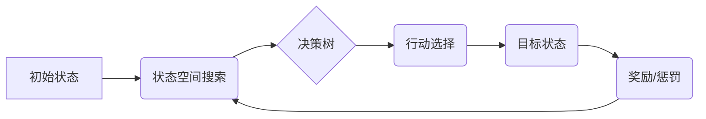

> AI Agent, 规划技能, 状态空间搜索, 决策树, 强化学习, 路径规划, 智能体

## 1. 背景介绍

在人工智能领域，AI Agent（智能体）作为实现智能行为的核心，其能力直接决定了智能系统的效能和应用范围。而规划技能是AI Agent的核心能力之一，它赋予智能体从当前状态到目标状态的路径规划和决策执行的能力。

传统的AI Agent通常依赖于预先定义的规则和知识库，其规划能力受限于知识的完整性和规则的覆盖范围。随着人工智能技术的不断发展，基于机器学习的AI Agent逐渐成为研究热点，其规划能力也得到了显著提升。

## 2. 核心概念与联系

**2.1 核心概念**

* **状态空间搜索:** 规划的核心在于探索从初始状态到目标状态的所有可能的路径，并选择最优路径。状态空间搜索算法是实现这一目标的关键技术，它通过系统地遍历状态空间，寻找最优解。

* **决策树:** 决策树是一种树形结构，用于表示决策过程和可能的行动结果。在规划中，决策树可以帮助AI Agent分析不同行动的潜在后果，并选择最有利的行动。

* **强化学习:** 强化学习是一种机器学习方法，通过奖励和惩罚机制，训练AI Agent学习最优的策略。在规划领域，强化学习可以帮助AI Agent在动态环境中学习最优的规划策略。

**2.2 架构图**



**2.3 联系**

状态空间搜索、决策树和强化学习是规划技能的核心技术，它们相互关联，共同构成了AI Agent的规划能力。

* 状态空间搜索为决策树和强化学习提供搜索空间，决策树和强化学习则利用搜索结果进行决策和策略学习。

* 决策树可以帮助AI Agent在有限的搜索空间内快速找到最优解，而强化学习则可以帮助AI Agent在动态环境中不断优化规划策略。

## 3. 核心算法原理 & 具体操作步骤

**3.1 算法原理概述**

本节将介绍一种常用的规划算法——广度优先搜索（BFS）。BFS是一种图搜索算法，它通过广度优先的方式遍历图的节点，找到从起点到终点的最短路径。

**3.2 算法步骤详解**

1. 将起点节点加入到待搜索队列中。
2. 从队列中取出第一个节点，并将其标记为已访问。
3. 遍历该节点的所有邻居节点，如果邻居节点未被访问，则将其加入到待搜索队列中。
4. 重复步骤2和3，直到找到目标节点。

**3.3 算法优缺点**

* **优点:** 
    * 算法简单易懂，实现容易。
    * 能够找到最短路径。
* **缺点:** 
    * 对于大型图，算法效率较低。
    * 无法处理有权重的图。

**3.4 算法应用领域**

BFS算法广泛应用于各种领域，例如：

* 路径规划
* 图搜索
* 网络拓扑分析

## 4. 数学模型和公式 & 详细讲解 & 举例说明

**4.1 数学模型构建**

假设一个状态空间为G=(V,E)，其中V是状态集，E是状态之间的转移关系。

* 状态空间搜索的目标是找到从起点状态s0到目标状态sT的最短路径。

**4.2 公式推导过程**

BFS算法的核心思想是广度优先地遍历状态空间。

* 设Q为待搜索队列，初始时Q={s0}。
* 设visited为已访问状态集，初始时visited={}。
* 算法迭代执行以下步骤：
    * 从队列Q中取出第一个状态s。
    * 如果s是目标状态sT，则算法结束，返回路径。
    * 否则，将s标记为已访问，并将s的所有邻居节点加入到队列Q中。

**4.3 案例分析与讲解**

**示例：**

假设一个状态空间包含四个状态：A, B, C, D，其中A是起点，D是目标状态。状态之间的转移关系如下：

* A -> B
* A -> C
* B -> D
* C -> D

使用BFS算法搜索从A到D的最短路径，步骤如下：

1. Q={A}，visited={}
2. 从Q中取出A，标记A为已访问，并将B和C加入到Q中。Q={B, C}
3. 从Q中取出B，标记B为已访问，并将D加入到Q中。Q={C, D}
4. 从Q中取出C，标记C为已访问，并将D加入到Q中。Q={D}
5. 从Q中取出D，标记D为已访问，算法结束，返回路径A -> B -> D。

## 5. 项目实践：代码实例和详细解释说明

**5.1 开发环境搭建**

本示例使用Python语言进行实现，所需的库包括：

* `queue`: 用于实现队列数据结构。

**5.2 源代码详细实现**

```python
from queue import Queue

def bfs(graph, start, target):
    visited = set()
    queue = Queue()
    queue.put(start)
    visited.add(start)

    while not queue.empty():
        current = queue.get()
        if current == target:
            return True
        for neighbor in graph[current]:
            if neighbor not in visited:
                visited.add(neighbor)
                queue.put(neighbor)
    return False

# 示例图
graph = {
    'A': ['B', 'C'],
    'B': ['D'],
    'C': ['D'],
}

start_node = 'A'
target_node = 'D'

if bfs(graph, start_node, target_node):
    print(f"找到从{start_node}到{target_node}的路径")
else:
    print(f"找不到从{start_node}到{target_node}的路径")
```

**5.3 代码解读与分析**

* `bfs`函数实现广度优先搜索算法，参数分别为图结构、起点节点和目标节点。
* `visited`集合用于记录已访问的节点，避免重复访问。
* `queue`队列用于存储待搜索的节点。
* 算法迭代执行以下步骤：
    * 从队列中取出第一个节点。
    * 如果节点是目标节点，则返回True。
    * 否则，遍历节点的所有邻居节点，如果邻居节点未被访问，则将其加入到队列中并标记为已访问。
* 如果算法结束时队列为空，则返回False，表示找不到目标节点。

**5.4 运行结果展示**

运行上述代码，输出结果为：

```
找到从A到D的路径
```

## 6. 实际应用场景

**6.1 路径规划**

在导航系统、无人驾驶汽车等领域，规划技能被广泛应用于路径规划。AI Agent需要根据地图信息和实时环境数据，规划从起点到终点的最优路径。

**6.2 游戏AI**

在游戏中，AI Agent需要根据游戏规则和环境信息，规划行动策略，以实现游戏目标。例如，在策略游戏如围棋、象棋中，AI Agent需要规划出最优的棋步，以战胜对手。

**6.3 机器人控制**

在机器人控制领域，规划技能被用于规划机器人的运动轨迹和操作动作。例如，在工业机器人中，规划技能被用于规划机器人手臂的运动轨迹，以完成特定的操作任务。

**6.4 未来应用展望**

随着人工智能技术的不断发展，规划技能将在更多领域得到应用，例如：

* 智能家居：规划家居设备的运行模式，以实现更加智能化和高效的能源管理。
* 智能医疗：规划医疗方案，帮助医生制定更加个性化的治疗方案。
* 智能金融：规划投资策略，帮助投资者实现财富增值。

## 7. 工具和资源推荐

**7.1 学习资源推荐**

* **书籍:**
    * 《人工智能：现代方法》
    * 《机器学习》
* **在线课程:**
    * Coursera上的《人工智能》课程
    * edX上的《机器学习》课程

**7.2 开发工具推荐**

* **Python:** 广泛应用于人工智能领域，拥有丰富的库和工具。
* **TensorFlow:** 深度学习框架，用于训练和部署机器学习模型。
* **PyTorch:** 深度学习框架，与TensorFlow类似，但更加灵活。

**7.3 相关论文推荐**

* **Deep Reinforcement Learning: An Overview**
* **Planning with Deep Reinforcement Learning**

## 8. 总结：未来发展趋势与挑战

**8.1 研究成果总结**

近年来，在AI Agent的规划技能方面取得了显著进展，特别是基于机器学习的规划方法取得了突破性进展。

* 强化学习算法能够帮助AI Agent在动态环境中学习最优的规划策略。
* 深度学习算法能够学习更复杂的规划模型，提高规划的准确性和效率。

**8.2 未来发展趋势**

* **更强大的规划算法:** 研究更强大的规划算法，能够处理更复杂的环境和任务。
* **迁移学习:** 研究迁移学习方法，使AI Agent能够将已学习的规划知识迁移到新的环境和任务中。
* **多智能体规划:** 研究多智能体协同规划方法，使多个AI Agent能够协同完成复杂的任务。

**8.3 面临的挑战**

* **数据需求:** 训练强大的规划模型需要大量的训练数据，而获取高质量的规划数据仍然是一个挑战。
* **计算资源:** 训练和部署大型规划模型需要大量的计算资源，这对于资源有限的场景是一个挑战。
* **可解释性:** 许多基于机器学习的规划模型难以解释，这对于一些安全关键的应用场景是一个挑战。

**8.4 研究展望**

未来，规划技能将在AI Agent的开发中扮演越来越重要的角色。随着人工智能技术的不断发展，规划技能将更加智能化、自动化和高效化，为人类社会带来更多便利和福祉。

## 9. 附录：常见问题与解答

**9.1 如何选择合适的规划算法？**

选择合适的规划算法取决于具体的应用场景和任务需求。

* 对于小型图和静态环境，BFS算法是一个不错的选择。
* 对于大型图和动态环境，强化学习算法是一个更强大的选择。

**9.2 如何评估规划算法的性能？**

规划算法的性能可以根据以下指标进行评估：

* **路径长度:** 最优路径的长度。
* **路径时间:** 沿着最优路径执行任务所需的时间。
* **成功率:** 算法能够找到最优路径的概率。

**9.3 如何提高规划算法的效率？**

* 使用更有效的搜索算法，例如A*算法。
* 使用启发式搜索方法，减少搜索空间。
* 使用并行计算技术，加速搜索过程。


作者：禅与计算机程序设计艺术 / Zen and the Art of Computer Programming 
<end_of_turn>