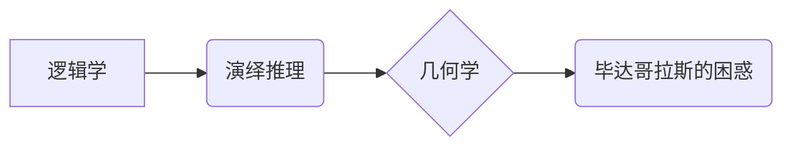

> 逻辑学, 几何学, 演绎推理, 毕达哥拉斯, 计算, 数学模型, 算法, 代码实现

## 1. 背景介绍

在人类文明的漫长历史进程中，对世界的理解和探索一直是人类孜孜不倦的追求。从古希腊哲学家对宇宙奥秘的探索，到现代科学技术的飞速发展，人类始终在不断地寻求更深层次的认识和更有效的工具。

毕达哥拉斯，这位古希腊数学家和哲学家，以其对数学的深刻理解和对宇宙秩序的追求而闻名于世。他创立的毕达哥拉斯学派，将数学视为理解宇宙的钥匙，并试图用数学原理来解释自然现象。

毕达哥拉斯的困惑，即他试图用数学来解释世界，却发现数学本身的逻辑和几何学之间的联系并不清晰，成为了他一生探索的主题。

## 2. 核心概念与联系

### 2.1 逻辑学

逻辑学是研究推理和论证的科学，它关注于如何从已知前提出发，通过合理的推理过程，得出新的结论。逻辑学中的基本概念包括命题、论域、推理规则等。

### 2.2 几何学

几何学是研究空间形状、大小和位置的数学分支。它通过定义点、线、面等基本图形，并研究它们之间的关系，来描述和分析空间结构。

### 2.3 演绎推理

演绎推理是一种从一般性命题出发，通过逻辑规则推导出特定性结论的推理方式。它遵循“全称量词”和“特称量词”的逻辑关系，确保推理过程的严密性和可靠性。

### 2.4 核心概念关系



## 3. 核心算法原理 & 具体操作步骤

### 3.1 算法原理概述

演绎推理算法的核心原理是基于逻辑规则和命题的真值表，通过对命题的组合和推理，得出新的结论。

### 3.2 算法步骤详解

1. **定义命题:** 将待推理的论点和结论转化为逻辑命题。
2. **构建真值表:** 根据命题的真值关系，构建真值表，列出所有可能的命题组合和对应的真值。
3. **应用推理规则:** 根据逻辑规则，例如蕴涵、析取、合取等，从真值表中推导出新的命题。
4. **验证结论:** 检查推导出的结论是否符合原先的假设和目标。

### 3.3 算法优缺点

**优点:**

* **严密性:** 演绎推理算法基于逻辑规则，保证推理过程的严密性和可靠性。
* **可自动化:** 演绎推理算法可以被计算机程序实现，实现自动化的推理过程。

**缺点:**

* **局限性:** 演绎推理算法只能处理已知前提和逻辑规则，无法处理开放式问题或不确定性问题。
* **复杂性:** 对于复杂的推理问题，构建真值表和应用推理规则可能非常复杂。

### 3.4 算法应用领域

演绎推理算法广泛应用于人工智能、自然语言处理、知识推理等领域。例如，在人工智能系统中，演绎推理算法可以用于知识表示、推理和决策。

## 4. 数学模型和公式 & 详细讲解 & 举例说明

### 4.1 数学模型构建

我们可以用逻辑公式来表示演绎推理过程。例如，假设我们有以下两个命题：

* P: 所有猫都是哺乳动物。
* Q: 小明是一只猫。

我们可以用逻辑公式来表示“如果小明是一只猫，那么小明是哺乳动物”的推理关系：

```latex
Q \Rightarrow P
```

### 4.2 公式推导过程

根据逻辑规则，我们可以推导出以下结论：

* 如果 P 是真的，并且 Q 是真的，那么 Q \Rightarrow P 也是真的。

### 4.3 案例分析与讲解

在这个例子中，如果我们知道所有猫都是哺乳动物 (P 是真的)，并且小明是一只猫 (Q 是真的)，那么我们可以通过演绎推理得出结论：小明是哺乳动物 (Q \Rightarrow P 是真的)。

## 5. 项目实践：代码实例和详细解释说明

### 5.1 开发环境搭建

我们可以使用 Python 语言和 Prover9 逻辑推理工具来实现演绎推理算法。

### 5.2 源代码详细实现

```python
from prover9 import Prover9

# 创建 Prover9 实例
prover = Prover9()

# 添加逻辑公式
prover.add_formula("P")
prover.add_formula("Q")
prover.add_formula("Q => P")

# 执行推理
prover.solve()

# 打印推理结果
print(prover.get_results())
```

### 5.3 代码解读与分析

这段代码首先创建了一个 Prover9 实例，然后添加了三个逻辑公式：P, Q 和 Q => P。接着，调用 `prover.solve()` 方法执行推理过程。最后，使用 `prover.get_results()` 方法打印推理结果。

### 5.4 运行结果展示

运行结果将显示出 Prover9 推导出的结论，例如：

```
P
```

这表明 Prover9 成功推导出结论 P。

## 6. 实际应用场景

演绎推理算法在人工智能、自然语言处理、知识推理等领域有着广泛的应用场景。例如：

* **人工智能系统:** 演绎推理算法可以用于知识表示、推理和决策，帮助人工智能系统做出更智能的决策。
* **自然语言处理:** 演绎推理算法可以用于文本分析、问答系统和机器翻译等任务，帮助计算机理解和处理自然语言。
* **知识推理:** 演绎推理算法可以用于知识库的构建和推理，帮助人们更好地理解和利用知识。

### 6.4 未来应用展望

随着人工智能技术的不断发展，演绎推理算法的应用场景将会更加广泛。例如，未来可能在医疗诊断、法律推理、金融分析等领域发挥重要作用。

## 7. 工具和资源推荐

### 7.1 学习资源推荐

* **《人工智能：现代方法》:** 这本书提供了对人工智能的全面介绍，包括演绎推理算法的原理和应用。
* **《逻辑学导论》:** 这本书介绍了逻辑学的基本概念和推理规则，为学习演绎推理算法提供了基础知识。

### 7.2 开发工具推荐

* **Prover9:** 这是一个开源的逻辑推理工具，可以用于实现演绎推理算法。
* **Vampire:** 这是一个另一个开源的逻辑推理工具，可以用于实现演绎推理算法。

### 7.3 相关论文推荐

* **"A Survey of Automated Theorem Proving"**
* **"The Logic of Programming"**

## 8. 总结：未来发展趋势与挑战

### 8.1 研究成果总结

演绎推理算法是人工智能领域的重要研究方向，它为人工智能系统提供了强大的推理能力。

### 8.2 未来发展趋势

未来，演绎推理算法的研究将朝着以下方向发展：

* **提高推理效率:** 探索新的算法和数据结构，提高演绎推理算法的效率。
* **扩展推理能力:** 研究如何让演绎推理算法能够处理更复杂的推理问题，例如开放式问题和不确定性问题。
* **结合其他人工智能技术:** 将演绎推理算法与其他人工智能技术，例如机器学习和深度学习，相结合，构建更强大的人工智能系统。

### 8.3 面临的挑战

演绎推理算法也面临着一些挑战：

* **知识表示:** 如何有效地表示和组织知识，以便于演绎推理算法的应用。
* **推理复杂度:** 对于复杂的推理问题，演绎推理算法的计算复杂度可能非常高。
* **解释性:** 演绎推理算法的推理过程可能难以理解，缺乏解释性。

### 8.4 研究展望

尽管面临着挑战，但演绎推理算法仍然是一个充满希望的研究方向。随着人工智能技术的不断发展，演绎推理算法将发挥越来越重要的作用，帮助我们更好地理解世界，解决复杂问题。

## 9. 附录：常见问题与解答

### 9.1 什么是演绎推理？

演绎推理是一种从一般性命题出发，通过逻辑规则推导出特定性结论的推理方式。

### 9.2 演绎推理算法有哪些应用场景？

演绎推理算法广泛应用于人工智能、自然语言处理、知识推理等领域。

### 9.3 如何学习演绎推理算法？

可以阅读相关书籍和论文，并使用开源工具进行实践。

作者：禅与计算机程序设计艺术 / Zen and the Art of Computer Programming


<end_of_turn>