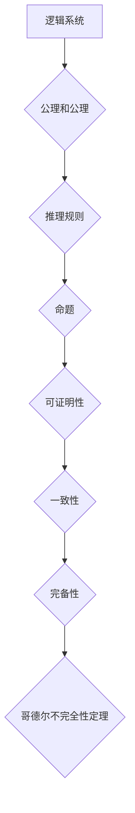

> 哥德尔不完全性定理，计算理论，逻辑系统，证明，可计算性，终结者

## 1. 背景介绍

在计算机科学的蓬勃发展中，我们不断探索计算的边界，试图理解计算机能够解决哪些问题，哪些问题却无法解决。哥德尔不完全性定理，作为计算机科学和数学领域的一座里程碑，揭示了计算的局限性，为我们提供了深刻的思考。

哥德尔不完全性定理，由美国逻辑学家、数学家艾伦·图灵在20世纪30年代提出，证明了任何一个足够强大且一致的逻辑系统，都无法证明自身所有真命题。换句话说，无论多么完善的逻辑系统，都存在一些无法被证明的真命题。

## 2. 核心概念与联系

**2.1 逻辑系统**

逻辑系统是一个形式化的符号系统，用于推理和证明命题的真假。它包含一系列的规则，用于从已知的命题推导出新的命题。

**2.2 可证明性**

一个命题在逻辑系统中是可证明的，如果可以通过该逻辑系统的规则从已知的公理和公理推导出来。

**2.3 一致性**

一个逻辑系统是相容的，如果它不能同时证明一个命题和它的否定。

**2.4 完备性**

一个逻辑系统是完备的，如果它能够证明所有在该系统中真命题。

**2.5 哥德尔不完全性定理**

哥德尔不完全性定理指出，任何一个足够强大且一致的逻辑系统，都无法证明自身所有真命题。换句话说，任何一个逻辑系统都存在一些无法被证明的真命题。

**Mermaid 流程图**

## 3. 核心算法原理 & 具体操作步骤

哥德尔不完全性定理并非一个具体的算法，而是一个数学定理。它揭示了计算的局限性，而不是提供一种解决问题的算法。

### 3.1  算法原理概述

哥德尔不完全性定理的证明依赖于逻辑系统中的自我引用和矛盾的概念。哥德尔通过构造一个特殊的命题，这个命题能够表达自身不可证明性，从而证明了逻辑系统不可能证明所有真命题。

### 3.2  算法步骤详解

哥德尔不完全性定理的证明过程非常复杂，涉及到逻辑学、数学和计算机科学的多个领域。

### 3.3  算法优缺点

哥德尔不完全性定理本身没有优缺点，因为它是一个数学定理，而不是一种算法。

### 3.4  算法应用领域

哥德尔不完全性定理对计算机科学和数学领域产生了深远的影响，它启发了人们对计算能力和逻辑系统的理解，并推动了人工智能、形式化验证等领域的进步。

## 4. 数学模型和公式 & 详细讲解 & 举例说明

哥德尔不完全性定理的证明依赖于复杂的数学模型和公式。

### 4.1  数学模型构建

哥德尔构建了一个特殊的数学模型，称为“哥德尔数”，用于将自然语言中的语句编码为数字。

### 4.2  公式推导过程

哥德尔通过一系列的逻辑推理和数学证明，最终证明了哥德尔不完全性定理。

### 4.3  案例分析与讲解

哥德尔不完全性定理的证明过程非常复杂，需要深入理解逻辑学、数学和计算机科学的知识。

## 5. 项目实践：代码实例和详细解释说明

由于哥德尔不完全性定理是一个数学定理，而不是一个具体的算法，因此无法直接用代码实现。

## 6. 实际应用场景

哥德尔不完全性定理的应用场景主要集中在以下几个方面：

* **人工智能：**哥德尔不完全性定理表明，任何人工智能系统都无法完全模拟人类的智能，因为人类的智能包含着无法被形式化表达的因素。
* **形式化验证：**哥德尔不完全性定理表明，任何形式化验证系统都无法验证所有程序的正确性，因为存在一些程序的错误无法被形式化表达。
* **哲学：**哥德尔不完全性定理引发了人们对知识、真理和计算的本质的思考。

## 7. 工具和资源推荐

### 7.1  学习资源推荐

* **《逻辑学基础》** by  艾伦·图灵
* **《哥德尔、埃舍尔、巴赫》** by  Douglas Hofstadter
* **《计算的本质》** by  Roger Penrose

### 7.2  开发工具推荐

* **Coq**
* **Isabelle**
* **HOL Light**

### 7.3  相关论文推荐

* **On Formally Undecidable Propositions of Principia Mathematica and Related Systems** by Kurt Gödel
* **The Undecidability of the Entscheidungsproblem** by Alan Turing

## 8. 总结：未来发展趋势与挑战

哥德尔不完全性定理是一个重要的里程碑，它揭示了计算的局限性，并对计算机科学和数学领域产生了深远的影响。

### 8.1  研究成果总结

哥德尔不完全性定理证明了任何一个足够强大且一致的逻辑系统都无法证明自身所有真命题，这表明计算能力存在边界。

### 8.2  未来发展趋势

未来，研究人员将继续探索计算的边界，并试图找到新的方法来解决哥德尔不完全性定理带来的挑战。

### 8.3  面临的挑战

哥德尔不完全性定理带来的挑战包括：

* 如何设计更强大的逻辑系统，以解决更多的问题。
* 如何开发新的算法和方法，以克服计算的局限性。
* 如何理解哥德尔不完全性定理对人工智能和哲学的意义。

### 8.4  研究展望

未来，哥德尔不完全性定理的研究将继续推动计算机科学和数学领域的进步，并为我们提供更深刻的理解计算和知识的本质。

## 9. 附录：常见问题与解答

**Q1：哥德尔不完全性定理证明了哪些问题无法解决？**

A1：哥德尔不完全性定理证明了任何一个足够强大且一致的逻辑系统都无法证明自身所有真命题。这意味着存在一些问题，即使在逻辑上是正确的，也无法被证明。

**Q2：哥德尔不完全性定理对人工智能有什么影响？**

A2：哥德尔不完全性定理表明，任何人工智能系统都无法完全模拟人类的智能，因为人类的智能包含着无法被形式化表达的因素。

**Q3：哥德尔不完全性定理对哲学有什么影响？**

A3：哥德尔不完全性定理引发了人们对知识、真理和计算的本质的思考。它表明，知识和真理并非总是可以通过计算来获得的。

作者：禅与计算机程序设计艺术 / Zen and the Art of Computer Programming 
<end_of_turn>