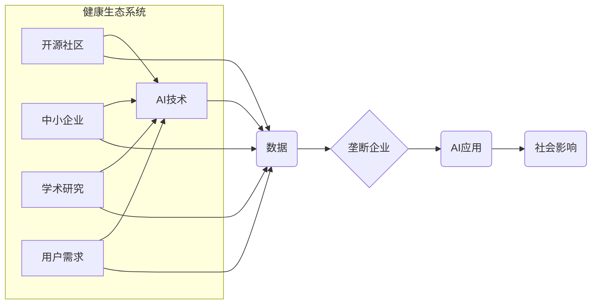

> AI 垄断，生态系统，公平竞争，开源，监管，伦理

## 1. 背景介绍

人工智能（AI）技术近年来发展迅速，已渗透到各个领域，为社会带来了巨大变革。然而，随着AI技术的进步，也引发了关于AI垄断的担忧。

目前，一些科技巨头凭借其雄厚的资金、海量数据和技术优势，在AI领域占据主导地位，形成了AI技术和应用的集中趋势。这种集中趋势可能会导致以下问题：

* **创新受阻:**  垄断企业可能控制关键技术和数据，阻碍其他企业和研究机构的创新发展。
* **市场失衡:**  垄断企业可能利用其市场地位，压低竞争对手的价格，甚至排除竞争对手，导致市场失衡。
* **社会不公平:**  垄断企业可能利用AI技术进行歧视性算法，加剧社会不平等。

为了避免AI技术垄断带来的负面影响，维护AI技术的健康发展和社会公平正义，我们需要采取措施防止AI垄断，构建一个更加公平、开放、包容的AI生态系统。

## 2. 核心概念与联系

**2.1 AI 垄断**

AI 垄断是指少数企业或机构控制AI技术和应用的关键资源，从而对市场和社会产生垄断性影响。

**2.2 健康生态系统**

健康生态系统是指一个多元化、竞争激烈的市场环境，其中各种参与者能够公平竞争，共同推动技术创新和社会进步。

**2.3 关系图**



**2.4 核心概念联系**

AI 垄断会破坏健康生态系统，导致市场失衡、创新受阻、社会不公平等问题。

## 3. 核心算法原理 & 具体操作步骤

**3.1 算法原理概述**

为了防止AI垄断，我们需要开发和应用一些核心算法，例如：

* **联邦学习:**  允许多个参与者在不共享原始数据的情况下，共同训练一个AI模型。
* **可解释性AI:**  使AI模型的决策过程更加透明，更容易被理解和解释。
* **公平性算法:**  旨在减少AI模型中潜在的偏见和歧视。

**3.2 算法步骤详解**

以联邦学习为例，其具体操作步骤如下：

1. **数据分发:**  将原始数据分散到不同的参与者手中。
2. **模型训练:**  每个参与者在本地数据上训练一个模型，并将其参数上传到一个中央服务器。
3. **参数聚合:**  中央服务器将所有参与者的模型参数进行聚合，得到一个更新的全局模型。
4. **模型更新:**  更新的全局模型被分发回每个参与者，重复步骤2-3，直到模型收敛。

**3.3 算法优缺点**

**优点:**

* 保护数据隐私
* 提高模型鲁棒性
* 促进数据共享

**缺点:**

* 计算成本较高
* 通信延迟可能影响训练效率
* 需要协调多个参与者的合作

**3.4 算法应用领域**

联邦学习在医疗保健、金融、零售等领域具有广泛的应用前景，例如：

* **医疗保健:**  联合训练疾病诊断模型，保护患者隐私。
* **金融:**  开发个性化金融服务，降低欺诈风险。
* **零售:**  预测客户需求，优化库存管理。

## 4. 数学模型和公式 & 详细讲解 & 举例说明

**4.1 数学模型构建**

我们可以使用博弈论模型来分析AI垄断问题。假设有两个AI企业，A和B，它们在市场上竞争。每个企业可以选择合作或竞争两种策略。

**4.2 公式推导过程**

我们可以定义一个支付矩阵，表示每个企业在不同策略组合下的收益。

```
支付矩阵
     B合作  B竞争
A合作  (a, a)   (b, c)
A竞争  (d, c)   (e, e)
```

其中：

* a: A和B合作时的收益
* b: A合作，B竞争时的收益
* c: A竞争，B合作时的收益
* d: A和B都竞争时的收益
* e: A和B都竞争时的收益

**4.3 案例分析与讲解**

如果a>b和c>d，那么合作是双方都愿意选择的策略。但是，如果b>a和c>d，那么竞争是双方都愿意选择的策略。

## 5. 项目实践：代码实例和详细解释说明

**5.1 开发环境搭建**

可以使用Python语言和相关的AI库，例如TensorFlow或PyTorch，搭建AI开发环境。

**5.2 源代码详细实现**

以下是一个简单的联邦学习代码示例：

```python
# 联邦学习代码示例
import tensorflow as tf

# 定义模型
model = tf.keras.models.Sequential([
    tf.keras.layers.Dense(10, activation='relu'),
    tf.keras.layers.Dense(1)
])

# 定义训练函数
def train_model(model, data):
    # 使用数据训练模型
    # ...

# 分布训练
for epoch in range(num_epochs):
    # 每个参与者在本地数据上训练模型
    for client in clients:
        train_model(model, client_data)

    # 参数聚合
    global_model = aggregate_parameters(clients)

    # 更新全局模型
    model = global_model

```

**5.3 代码解读与分析**

代码示例展示了联邦学习的基本流程，包括模型定义、训练函数、分布式训练和参数聚合。

**5.4 运行结果展示**

运行结果可以展示模型在不同参与者数据上的训练效果，以及全局模型的最终性能。

## 6. 实际应用场景

**6.1 医疗保健**

* 联合训练疾病诊断模型，保护患者隐私。
* 开发个性化治疗方案，提高医疗效率。

**6.2 金融**

* 开发个性化金融服务，降低欺诈风险。
* 预测市场趋势，优化投资策略。

**6.3 零售**

* 预测客户需求，优化库存管理。
* 提供个性化商品推荐，提高销售额。

**6.4 未来应用展望**

随着AI技术的不断发展，联邦学习和其他AI技术将应用于更多领域，例如教育、交通、能源等。

## 7. 工具和资源推荐

**7.1 学习资源推荐**

* **书籍:**
    * 《联邦学习:原理与实践》
    * 《深度学习》
* **在线课程:**
    * Coursera上的“机器学习”课程
    * edX上的“深度学习”课程

**7.2 开发工具推荐**

* **TensorFlow:**  开源机器学习框架
* **PyTorch:**  开源机器学习框架
* **FedML:**  联邦学习开源平台

**7.3 相关论文推荐**

* 《Federated Learning: Strategies for Improving Communication Efficiency》
* 《On the Dangers of Stochastic Parrots: Can Language Models Be Too Big?》

## 8. 总结：未来发展趋势与挑战

**8.1 研究成果总结**

近年来，AI技术取得了长足进步，联邦学习等技术为防止AI垄断提供了新的思路和方法。

**8.2 未来发展趋势**

未来，AI技术将继续发展，联邦学习等技术将得到更广泛的应用。

**8.3 面临的挑战**

* **数据安全:**  确保数据在联邦学习过程中不被泄露。
* **模型公平性:**  防止AI模型中潜在的偏见和歧视。
* **监管政策:**  制定合理的监管政策，引导AI技术健康发展。

**8.4 研究展望**

未来研究方向包括：

* 开发更安全、更有效的联邦学习算法。
* 研究AI模型的公平性问题，并提出解决方案。
* 探索AI技术与社会伦理的相互关系，制定相应的伦理规范。

## 9. 附录：常见问题与解答

**9.1 Q: 联邦学习的安全性如何保证？**

**A:** 联邦学习通过在本地训练模型，并将模型参数进行聚合，避免了原始数据共享，从而提高了数据安全性。

**9.2 Q: 联邦学习的效率如何？**

**A:** 联邦学习的效率取决于网络带宽、参与者数量和模型复杂度等因素。

**9.3 Q: 联邦学习的应用场景有哪些？**

**A:** 联邦学习在医疗保健、金融、零售等领域具有广泛的应用前景。


作者：禅与计算机程序设计艺术 / Zen and the Art of Computer Programming 
<end_of_turn>