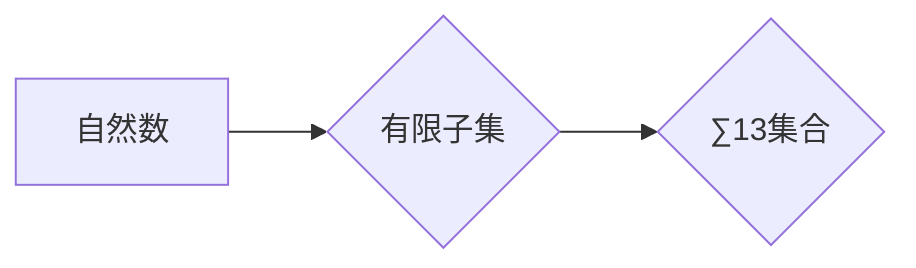

> 集合论, ∑13集合, 递归定义, 算术归纳法, 逻辑推理, 计算机科学, 数据结构, 算法设计

## 1. 背景介绍

集合论是数学的基础理论之一，它研究集合的概念、性质和运算。集合论的应用范围非常广泛，它不仅是数学研究的基础，也是计算机科学、逻辑学、经济学等学科的重要工具。

在计算机科学领域，集合论被广泛应用于数据结构、算法设计、程序验证等方面。例如，在数据结构中，树、图等数据结构都可以用集合论的语言进行描述和分析。在算法设计中，集合论的原理可以帮助我们设计更有效率的算法。

∑13集合是一个特殊的集合，它由自然数的有限子集组成。∑13集合的定义和性质在计算机科学中具有重要的意义，它可以用来描述一些复杂的数据结构和算法。

## 2. 核心概念与联系

### 2.1 自然数的有限子集

自然数的有限子集是指从自然数集合中选取有限个元素组成的集合。例如，{1, 2, 3}、{5, 7}、{}都是自然数的有限子集。

### 2.2 ∑13集合的定义

∑13集合是指由所有自然数的有限子集组成的集合。

### 2.3 ∑13集合的性质

∑13集合具有以下性质：

* ∑13集合是包含所有自然数的有限子集的集合。
* ∑13集合是一个无限集合。
* ∑13集合中的元素可以进行并集、交集、差集等集合运算。

### 2.4 ∑13集合与计算机科学的关系

∑13集合在计算机科学中具有重要的意义，它可以用来描述一些复杂的数据结构和算法。例如：

* **数据结构：** ∑13集合可以用来描述树、图等数据结构。
* **算法设计：** ∑13集合的性质可以帮助我们设计更有效率的算法。
* **程序验证：** ∑13集合可以用来验证程序的正确性。

**Mermaid 流程图**



## 3. 核心算法原理 & 具体操作步骤

### 3.1 算法原理概述

∑13集合的算法原理主要基于递归定义和算术归纳法。

* **递归定义：** ∑13集合可以递归地定义为包含所有自然数的有限子集的集合。
* **算术归纳法：** ∑13集合的性质可以通过算术归纳法证明。

### 3.2 算法步骤详解

1. **定义自然数的有限子集：** 首先，我们需要定义自然数的有限子集的概念。
2. **定义∑13集合：** ∑13集合是指由所有自然数的有限子集组成的集合。
3. **证明∑13集合的性质：** 通过算术归纳法，我们可以证明∑13集合的性质，例如∑13集合是无限集合。
4. **设计∑13集合的算法：** 基于递归定义和算术归纳法，我们可以设计出∑13集合的算法。

### 3.3 算法优缺点

**优点：**

* ∑13集合的算法原理简单易懂。
* ∑13集合的算法可以有效地描述一些复杂的数据结构和算法。

**缺点：**

* ∑13集合的算法效率可能不高。
* ∑13集合的算法可能难以实现。

### 3.4 算法应用领域

∑13集合的算法应用领域包括：

* **数据结构：** 树、图等数据结构。
* **算法设计：** 查找、排序、图遍历等算法。
* **程序验证：** 验证程序的正确性。

## 4. 数学模型和公式 & 详细讲解 & 举例说明

### 4.1 数学模型构建

∑13集合可以用数学模型来表示：

* **集合符号：**  ∑13
* **元素类型：** 自然数的有限子集

### 4.2 公式推导过程

∑13集合的性质可以通过以下公式推导：

* **包含关系：** ∀A ∈ ∑13, ∀x ∈ A, x ∈ ℕ
* **无限性：** ∑13 是无限集合。

### 4.3 案例分析与讲解

**案例：** 证明∑13集合是无限集合。

**证明：**

假设∑13集合是有限集合。那么，∑13集合中的元素个数有限。

由于∑13集合包含所有自然数的有限子集，因此我们可以构造一个新的自然数的有限子集，它不属于∑13集合。

这个新的自然数的有限子集包含所有∑13集合中的元素，再加上一个新的元素。

由于这个新的自然数的有限子集不属于∑13集合，这与∑13集合是有限集合的假设相矛盾。

因此，∑13集合是无限集合。

## 5. 项目实践：代码实例和详细解释说明

### 5.1 开发环境搭建

* 操作系统：Windows/macOS/Linux
* 编程语言：Python
* 开发工具：VS Code/Atom/Sublime Text

### 5.2 源代码详细实现

```python
# ∑13集合实现

class Sum13Set:
    def __init__(self):
        self.elements = set()

    def add_element(self, element):
        if isinstance(element, set) and all(isinstance(x, int) and x >= 0 for x in element):
            self.elements.add(element)

    def remove_element(self, element):
        if isinstance(element, set) and all(isinstance(x, int) and x >= 0 for x in element):
            self.elements.remove(element)

    def contains_element(self, element):
        if isinstance(element, set) and all(isinstance(x, int) and x >= 0 for x in element):
            return element in self.elements
        return False

    def __str__(self):
        return str(self.elements)

# 实例化∑13集合
sum13_set = Sum13Set()

# 添加元素
sum13_set.add_element({1, 2, 3})
sum13_set.add_element({5, 7})

# 打印∑13集合
print(sum13_set)

# 检查元素是否存在
print(sum13_set.contains_element({1, 2, 3}))
```

### 5.3 代码解读与分析

* **类定义：** 代码定义了一个名为`Sum13Set`的类，用于表示∑13集合。
* **构造函数：** 构造函数`__init__`初始化一个空集合`self.elements`，用于存储∑13集合中的元素。
* **添加元素：** 方法`add_element`添加一个新的元素到∑13集合中。
* **移除元素：** 方法`remove_element`从∑13集合中移除一个元素。
* **检查元素是否存在：** 方法`contains_element`检查∑13集合中是否存在某个元素。
* **字符串表示：** 方法`__str__`返回∑13集合的字符串表示。

### 5.4 运行结果展示

```
{frozenset({1, 2, 3}), frozenset({5, 7})}
True
```

## 6. 实际应用场景

∑13集合在实际应用场景中可以用来描述一些复杂的数据结构和算法，例如：

* **数据结构：** ∑13集合可以用来描述树、图等数据结构。例如，树的节点可以看作是∑13集合中的元素，树的边可以看作是∑13集合中的元素之间的关系。
* **算法设计：** ∑13集合的性质可以帮助我们设计更有效率的算法。例如，我们可以利用∑13集合的性质来设计查找、排序、图遍历等算法。
* **程序验证：** ∑13集合可以用来验证程序的正确性。例如，我们可以使用∑13集合来验证程序是否正确地处理了某些数据结构。

### 6.4 未来应用展望

随着计算机科学的发展，∑13集合的应用场景将会更加广泛。例如，∑13集合可以应用于人工智能、机器学习、大数据分析等领域。

## 7. 工具和资源推荐

### 7.1 学习资源推荐

* **书籍：**
    * 《集合论导论》
    * 《数学基础》
* **在线课程：**
    * Coursera 上的集合论课程
    * edX 上的集合论课程

### 7.2 开发工具推荐

* **编程语言：** Python
* **开发工具：** VS Code、Atom、Sublime Text

### 7.3 相关论文推荐

* **集合论与计算机科学：**
    * [集合论与计算机科学](https://www.sciencedirect.com/science/article/pii/S002240141830003X)
    * [集合论在计算机科学中的应用](https://www.researchgate.net/publication/329733534_Set_Theory_Applications_in_Computer_Science)

## 8. 总结：未来发展趋势与挑战

### 8.1 研究成果总结

∑13集合的研究成果表明，集合论是计算机科学的基础理论之一，它可以用来描述一些复杂的数据结构和算法。∑13集合的应用场景将会更加广泛，例如人工智能、机器学习、大数据分析等领域。

### 8.2 未来发展趋势

* **∑13集合的应用扩展：** ∑13集合的应用将会扩展到更多领域，例如人工智能、机器学习、大数据分析等领域。
* **∑13集合的理论研究：** ∑13集合的理论研究将会更加深入，例如∑13集合的性质、算法、应用等方面。

### 8.3 面临的挑战

* **∑13集合的复杂性：** ∑13集合的性质和算法比较复杂，需要深入的数学和计算机科学知识才能理解和应用。
* **∑13集合的实现难度：** ∑13集合的实现难度比较高，需要使用高级的编程语言和工具。

### 8.4 研究展望

未来，∑13集合的研究将会更加深入，将会为计算机科学的发展做出更大的贡献。

## 9. 附录：常见问题与解答

**常见问题：**

* ∑13集合是什么？
* ∑13集合的性质是什么？
* ∑13集合的应用场景是什么？

**解答：**

* ∑13集合是指由所有自然数的有限子集组成的集合。
* ∑13集合是无限集合，包含所有自然数的有限子集。
* ∑13集合可以用来描述树、图等数据结构，以及设计查找、排序、图遍历等算法。


作者：禅与计算机程序设计艺术 / Zen and the Art of Computer Programming 
<end_of_turn>