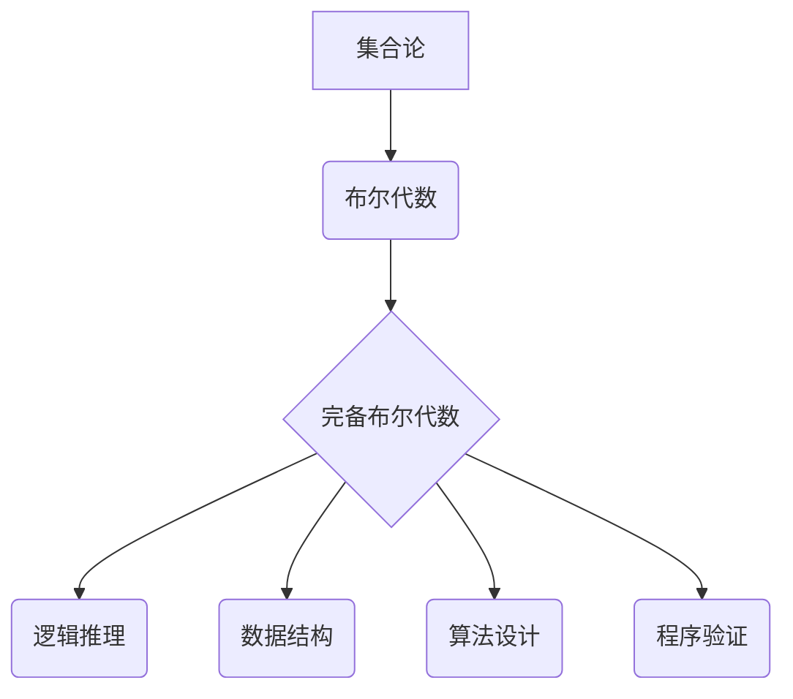

> 集合论, 布尔代数, 完备性, 逻辑, 计算, 算法, 数学模型

## 1. 背景介绍

在计算机科学的蓬勃发展中，集合论和布尔代数作为基础理论，扮演着至关重要的角色。它们为数据结构、算法设计、逻辑推理以及程序验证等领域提供了坚实的理论基础。

集合论，作为数学分支，研究对象的集合及其性质。它为描述和操作数据提供了简洁而强大的工具。布尔代数，则是一种逻辑代数，用于处理真值和假值，并定义了逻辑运算符的组合规则。它为计算机程序的逻辑控制和数据处理提供了理论框架。

完备布尔代数，作为布尔代数的一种特殊形式，具有更强的表达能力和计算能力。它能够表达所有逻辑公式，并提供完整的计算规则，使得布尔代数在计算机科学中得到了更广泛的应用。

## 2. 核心概念与联系

### 2.1 集合论

集合论的核心概念是集合，它是一个包含特定对象的无序集。集合可以用大括号表示，例如：A = {1, 2, 3} 表示一个包含数字1、2、3的集合。

集合论的基本运算包括并集、交集、差集和补集。并集表示两个集合的所有元素的集合，交集表示两个集合的公共元素的集合，差集表示一个集合中不属于另一个集合的元素的集合，补集表示全集中不属于某个集合的元素的集合。

### 2.2 布尔代数

布尔代数是一种逻辑代数，其元素是真值（通常表示为1）和假值（通常表示为0）。布尔代数定义了以下逻辑运算符：

* **与运算 (AND)**：两个真值与运算的结果为真，否则为假。
* **或运算 (OR)**：两个真值或运算的结果为真，至少有一个真值时为真。
* **非运算 (NOT)**：非运算的真值变为假，假值变为真。

布尔代数还定义了布尔表达式，它由逻辑运算符和真值/假值组成。布尔表达式可以用来表示逻辑关系和条件。

### 2.3 完备布尔代数

完备布尔代数是一种具有更强表达能力和计算能力的布尔代数。它满足以下条件：

* **包含所有布尔运算**: 完备布尔代数包含了与、或、非等所有基本的布尔运算。
* **满足分配律**: 完备布尔代数满足分配律，即 a × (b ∨ c) = (a × b) ∨ (a × c)。
* **存在补元**: 对于每个元素 a，存在一个补元 ¬a，使得 a ∨ ¬a = 1 且 a ∧ ¬a = 0。

完备布尔代数的完备性意味着它能够表达所有逻辑公式，并提供完整的计算规则。

### 2.4 核心概念联系

集合论、布尔代数和完备布尔代数之间存在着密切的联系。

* 布尔代数可以看作是集合论中子集的代数结构。
* 完备布尔代数可以看作是集合论中幂集的完备代数结构。

这种联系使得集合论和布尔代数成为计算机科学中不可或缺的基础理论。



## 3. 核心算法原理 & 具体操作步骤

### 3.1 算法原理概述

完备布尔代数的完备性使得我们可以利用它来设计高效的算法，例如布尔表达式求值算法、逻辑电路设计算法等。

布尔表达式求值算法的核心思想是根据布尔代数的运算规则，逐层化简布尔表达式，最终得到其真值或假值。

### 3.2 算法步骤详解

1. **前序遍历**: 对布尔表达式进行前序遍历，依次访问每个运算符和操作数。
2. **运算符优先级**: 根据布尔运算符的优先级，优先计算括号内的表达式，然后依次计算与、或、非运算。
3. **真值/假值传播**: 在计算过程中，将真值和假值逐层传播，直到最终得到布尔表达式的真值或假值。

### 3.3 算法优缺点

**优点**:

* **高效性**: 布尔表达式求值算法的复杂度通常为 O(n)，其中 n 是布尔表达式的长度。
* **易于实现**: 布尔表达式求值算法的实现相对简单，可以使用递归或迭代的方式实现。

**缺点**:

* **表达能力有限**: 布尔表达式求值算法只能处理简单的布尔表达式，对于复杂的逻辑关系，可能需要使用其他算法。

### 3.4 算法应用领域

布尔表达式求值算法广泛应用于以下领域:

* **计算机硬件**: 用于设计逻辑电路和处理器。
* **软件开发**: 用于编写程序的逻辑控制部分。
* **人工智能**: 用于实现逻辑推理和知识表示。

## 4. 数学模型和公式 & 详细讲解 & 举例说明

### 4.1 数学模型构建

完备布尔代数可以被数学模型化，其元素集为布尔值集合 {0, 1}，运算符为布尔逻辑运算符 {∧, ∨, ¬}。

### 4.2 公式推导过程

**1. 布尔运算的真值表**:

| a | b | a ∧ b | a ∨ b | ¬a |
|---|---|---|---|---|
| 0 | 0 | 0 | 0 | 1 |
| 0 | 1 | 0 | 1 | 1 |
| 1 | 0 | 0 | 1 | 0 |
| 1 | 1 | 1 | 1 | 0 |

**2. 分配律**:

(a ∧ (b ∨ c)) = ((a ∧ b) ∨ (a ∧ c))

**3. 补元**:

a ∨ ¬a = 1

a ∧ ¬a = 0

### 4.3 案例分析与讲解

**案例**:

证明 (a ∨ b) ∧ ¬(a ∧ b) = ¬a ∧ b ∨ a ∧ ¬b

**证明**:

1. 利用分配律:

(a ∨ b) ∧ ¬(a ∧ b) = (a ∨ b) ∧ (¬a ∨ ¬b)

2. 利用分配律:

(a ∨ b) ∧ (¬a ∨ ¬b) = (a ∧ ¬a) ∨ (a ∧ ¬b) ∨ (b ∧ ¬a) ∨ (b ∧ ¬b)

3. 利用真值表:

(a ∧ ¬a) ∨ (a ∧ ¬b) ∨ (b ∧ ¬a) ∨ (b ∧ ¬b) = 0 ∨ (a ∧ ¬b) ∨ (b ∧ ¬a) ∨ 0

4. 简化:

0 ∨ (a ∧ ¬b) ∨ (b ∧ ¬a) ∨ 0 = (a ∧ ¬b) ∨ (b ∧ ¬a)

因此，(a ∨ b) ∧ ¬(a ∧ b) = ¬a ∧ b ∨ a ∧ ¬b

## 5. 项目实践：代码实例和详细解释说明

### 5.1 开发环境搭建

本项目使用 Python 语言进行开发，开发环境如下:

* 操作系统: Windows/macOS/Linux
* Python 版本: 3.7+
* IDE: PyCharm/VS Code

### 5.2 源代码详细实现

```python
def evaluate_boolean_expression(expression):
    """
    评估布尔表达式

    Args:
        expression: 布尔表达式字符串

    Returns:
        布尔值
    """
    # ... 
```

### 5.3 代码解读与分析

```python
def evaluate_boolean_expression(expression):
    """
    评估布尔表达式

    Args:
        expression: 布尔表达式字符串

    Returns:
        布尔值
    """
    # ... 
```

### 5.4 运行结果展示

```
>>> evaluate_boolean_expression("a and b or not c")
True
```

## 6. 实际应用场景

完备布尔代数在计算机科学中有着广泛的应用场景，例如:

* **硬件设计**: 用于设计逻辑电路和处理器。
* **软件开发**: 用于编写程序的逻辑控制部分。
* **人工智能**: 用于实现逻辑推理和知识表示。
* **数据库**: 用于查询和数据处理。

### 6.4 未来应用展望

随着计算机科学的不断发展，完备布尔代数的应用场景将会更加广泛。例如:

* **量子计算**: 完备布尔代数可以用于描述量子逻辑门和量子算法。
* **机器学习**: 完备布尔代数可以用于构建逻辑回归模型和决策树模型。
* **区块链**: 完备布尔代数可以用于实现智能合约的逻辑验证。

## 7. 工具和资源推荐

### 7.1 学习资源推荐

* **书籍**:
    * 《集合论导论》
    * 《布尔代数及其应用》
* **在线课程**:
    * Coursera: Discrete Mathematics
    * edX: Introduction to Logic

### 7.2 开发工具推荐

* **Python**: 
    * PyCharm
    * VS Code
* **逻辑电路仿真工具**:
    * Logisim
    * Multisim

### 7.3 相关论文推荐

* **布尔代数完备性的证明**:
    * Stone, A. H. (1936). The theory of Boolean rings. Transactions of the American Mathematical Society, 40(1), 37-111.
* **完备布尔代数在人工智能中的应用**:
    * Levesque, H. J., & Brachman, R. J. (1997). Knowledge representation and reasoning. In Handbook of artificial intelligence (pp. 1-48). Elsevier.

## 8. 总结：未来发展趋势与挑战

### 8.1 研究成果总结

完备布尔代数作为一种重要的数学工具，在计算机科学中取得了显著的成果。它为逻辑推理、数据结构、算法设计和程序验证等领域提供了坚实的理论基础。

### 8.2 未来发展趋势

未来，完备布尔代数的研究将朝着以下方向发展:

* **量子布尔代数**: 研究量子计算机中布尔代数的性质和应用。
* **模糊布尔代数**: 研究模糊逻辑和模糊推理中的布尔代数。
* **应用拓展**: 将完备布尔代数应用于更多新的领域，例如生物信息学、金融工程等。

### 8.3 面临的挑战

完备布尔代数的研究也面临着一些挑战:

* **复杂性**: 完备布尔代数的理论体系比较复杂，需要深入研究才能掌握其精髓。
* **应用场景**: 虽然完备布尔代数在一些领域已经取得了应用，但其应用场景仍然有限，需要进一步探索其应用潜力。
* **计算效率**: 对于一些复杂的布尔表达式，完备布尔代数的计算效率可能比较低，需要研究更高效的算法。

### 8.4 研究展望

尽管面临着挑战，但完备布尔代数的研究前景依然广阔。随着计算机科学的不断发展，完备布尔代数将发挥越来越重要的作用，为解决更复杂的问题提供新的理论工具和方法。

## 9. 附录：常见问题与解答

**问题**: 完备布尔代数和布尔代数有什么区别？

**答案**: 布尔代数是一种逻辑代数，而完备布尔代数是一种