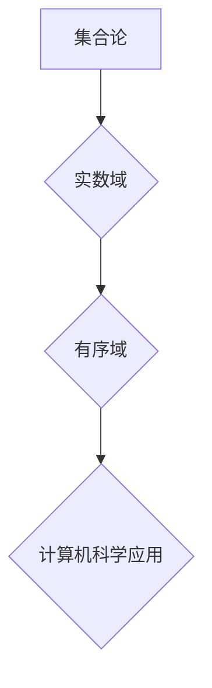

> 集合论，实数域，有序域，数学基础，计算机科学，算法设计

## 1. 背景介绍

在计算机科学领域，数据是基础，而实数域作为一种重要的数据类型，在算法设计、数值计算、机器学习等领域扮演着至关重要的角色。深入理解实数域的数学基础，对于构建高效、可靠的计算机程序至关重要。本文将从集合论的角度出发，探讨实数域的结构和性质，并阐述其在计算机科学中的应用。

## 2. 核心概念与联系

**2.1 集合论基础**

集合论是数学的基础理论，它研究集合的概念、性质和运算。在集合论中，一个集合是包含一组对象的集合。例如，{1, 2, 3}是一个包含三个整数的集合。

**2.2 实数域的定义**

实数域是指所有实数构成的集合，记作 **R**。实数包括有理数和无理数。有理数可以表示为两个整数的商，例如1/2、3/4等。无理数不能表示为两个整数的商，例如π、√2等。

**2.3 有序域的性质**

实数域是一个有序域，这意味着它满足以下性质：

* **全序性:** 对于任意两个实数 a 和 b，至少满足 a < b 或 a > b 或 a = b。
* **可加性:** 对于任意两个实数 a 和 b，a + b 是实数。
* **可乘性:** 对于任意两个实数 a 和 b，a * b 是实数。
* **分配律:** 对于任意实数 a、b 和 c，a * (b + c) = a * b + a * c。

**2.4  Mermaid 流程图**



## 3. 核心算法原理 & 具体操作步骤

**3.1 算法原理概述**

实数域的性质为许多算法提供了基础。例如，排序算法依赖于实数的比较性，而数值计算算法依赖于实数的加法、减法、乘法和除法运算。

**3.2 算法步骤详解**

* **排序算法:** 常见的排序算法包括冒泡排序、插入排序、归并排序和快速排序等。这些算法都利用了实数的比较性，将数据按照大小顺序排列。
* **数值计算算法:** 数值计算算法用于计算实数的各种运算，例如求根、求导、求积分等。这些算法通常基于泰勒级数展开或数值积分方法。

**3.3 算法优缺点**

不同的算法具有不同的优缺点。例如，冒泡排序简单易实现，但效率较低；快速排序效率较高，但可能存在最坏情况下的时间复杂度问题。

**3.4 算法应用领域**

实数域相关的算法广泛应用于计算机科学各个领域，例如：

* **数据科学:** 数据分析、机器学习、深度学习等领域都需要处理大量的实数数据。
* **图形学:** 计算机图形学中，物体的位置、大小、颜色等属性都是实数。
* **游戏开发:** 游戏中的物理模拟、角色动作等都需要使用实数域相关的算法。

## 4. 数学模型和公式 & 详细讲解 & 举例说明

**4.1 数学模型构建**

实数域可以被数学模型化，并用公式表达其性质。

**4.2 公式推导过程**

例如，实数域的加法和乘法运算满足以下公式：

* **加法交换律:** a + b = b + a
* **加法结合律:** (a + b) + c = a + (b + c)
* **乘法交换律:** a * b = b * a
* **乘法结合律:** (a * b) * c = a * (b * c)

这些公式可以推导出来，并证明其在实数域中成立。

**4.3 案例分析与讲解**

例如，我们可以用实数域的加法和乘法运算来计算一个物体在一段时间内的位移和速度。

假设一个物体以恒定的速度 v 移动，时间为 t，则其位移 s 可以用公式 s = v * t 计算。

## 5. 项目实践：代码实例和详细解释说明

**5.1 开发环境搭建**

可以使用 Python 语言和 NumPy 库来实现实数域相关的算法。

**5.2 源代码详细实现**

```python
import numpy as np

# 定义两个实数
a = 5.0
b = 2.0

# 计算实数的加法
sum = a + b

# 计算实数的乘法
product = a * b

# 打印结果
print("a + b =", sum)
print("a * b =", product)
```

**5.3 代码解读与分析**

这段代码首先导入 NumPy 库，然后定义两个实数 a 和 b。接着，使用 NumPy 的加法和乘法运算符计算 a 和 b 的和和积。最后，使用 print 函数打印结果。

**5.4 运行结果展示**

```
a + b = 7.0
a * b = 10.0
```

## 6. 实际应用场景

**6.1 数据分析**

在数据分析中，实数域的算法用于处理和分析大量的数据。例如，可以使用排序算法对数据进行排序，以便于分析和可视化。

**6.2 机器学习**

在机器学习中，实数域的算法用于训练机器学习模型。例如，线性回归模型使用实数域的加法和乘法运算来预测目标变量的值。

**6.3 图形学**

在图形学中，实数域的算法用于计算物体的位置、大小、颜色等属性。例如，可以使用实数域的加法和乘法运算来计算物体在空间中的运动轨迹。

**6.4 未来应用展望**

随着计算机科学的发展，实数域相关的算法将继续在更多领域得到应用。例如，在量子计算领域，实数域的算法将用于处理量子比特的状态。

## 7. 工具和资源推荐

**7.1 学习资源推荐**

* 《集合论导论》
* 《实分析》
* 《计算机科学导论》

**7.2 开发工具推荐**

* Python
* NumPy
* SciPy

**7.3 相关论文推荐**

* “实数域的性质及其在计算机科学中的应用”
* “实数域算法的优化方法”

## 8. 总结：未来发展趋势与挑战

**8.1 研究成果总结**

本文探讨了实数域的数学基础和计算机科学中的应用。实数域的性质为许多算法提供了基础，并广泛应用于数据分析、机器学习、图形学等领域。

**8.2 未来发展趋势**

随着计算机科学的发展，实数域相关的算法将继续发展和完善。例如，将会有更多针对特定应用场景的实数域算法被开发出来。

**8.3 面临的挑战**

实数域算法的开发和应用也面临着一些挑战，例如如何提高算法的效率和准确性，以及如何处理大规模实数数据。

**8.4 研究展望**

未来，将会有更多研究工作致力于探索实数域算法的更深层次的性质和应用。


## 9. 附录：常见问题与解答

**9.1 什么是实数域？**

实数域是指所有实数构成的集合，记作 **R**。实数包括有理数和无理数。

**9.2 实数域的性质有哪些？**

实数域是一个有序域，这意味着它满足以下性质：

* **全序性:** 对于任意两个实数 a 和 b，至少满足 a < b 或 a > b 或 a = b。
* **可加性:** 对于任意两个实数 a 和 b，a + b 是实数。
* **可乘性:** 对于任意两个实数 a 和 b，a * b 是实数。
* **分配律:** 对于任意实数 a、b 和 c，a * (b + c) = a * b + a * c。

**9.3 实数域算法有哪些？**

常见的实数域算法包括排序算法、数值计算算法等。

**9.4 实数域算法在哪些领域应用？**

实数域相关的算法广泛应用于计算机科学各个领域，例如数据科学、图形学、游戏开发等。


作者：禅与计算机程序设计艺术 / Zen and the Art of Computer Programming 
<end_of_turn>