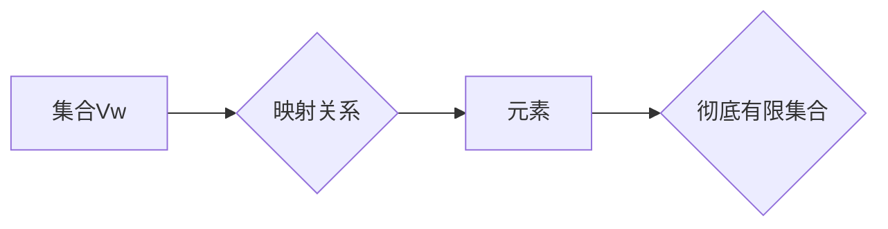

> 集合论, 集合Vw, 彻底有限集合, 有限集, 无穷集, 数学模型, 算法, 代码实现, 应用场景

## 1. 背景介绍

集合论是数学的基础分支之一，它研究集合的概念、性质以及集合之间的关系。集合论的应用范围非常广泛，从计算机科学、逻辑学到物理学、经济学等领域都有着重要的作用。

在计算机科学中，集合论被用来描述数据结构、算法和程序的逻辑关系。例如，在数据结构中，数组、链表和树等数据结构都可以看作是集合的实例。在算法中，集合论的原理被用来设计和分析算法的效率。在程序设计中，集合论的思想被用来描述程序的逻辑流程和数据流。

然而，传统的集合论主要研究无限集，而对于有限集的研究相对较少。随着计算机科学的发展，对有限集的研究越来越重要，因为许多实际问题都可以用有限集来描述。例如，在数据库管理系统中，数据通常存储在有限的表中；在图像处理中，图像可以看作是有限的像素集合；在网络安全中，网络设备的地址空间是有限的。

为了更好地研究和应用有限集，本文将介绍一种新的集合模型——集合Vw，以及一种新的有限集概念——彻底有限集合。

## 2. 核心概念与联系

### 2.1 集合Vw

集合Vw是一种新的集合模型，它将集合看作是元素的映射关系。

* **元素:** 集合Vw中的元素可以是任何类型的数据，包括数字、字符串、对象等。
* **映射关系:** 元素之间的关系由一个映射函数来定义。这个映射函数将每个元素映射到另一个元素，或者映射到一个特定的值。

集合Vw的优势在于：

* **灵活:** 可以表示各种类型的集合，包括有限集、无限集、有序集、无序集等。
* **简洁:** 使用映射函数来描述元素之间的关系，比传统的集合论更加简洁。
* **高效:** 可以利用映射函数的特性进行高效的集合操作，例如查找、插入、删除等。

### 2.2 彻底有限集合

彻底有限集合是指所有元素都能够被枚举出来的有限集。

* **枚举:** 能够按照一定的顺序列出所有元素。
* **有限性:** 元素数量有限。

彻底有限集合的特点是：

* **确定性:** 所有元素都已知，并且可以被明确地描述。
* **可计算性:** 可以通过算法计算出集合的大小和元素的个数。
* **可操作性:** 可以对集合进行各种操作，例如并集、交集、差集等。

### 2.3 核心概念联系

集合Vw和彻底有限集合之间的关系如下：

* 任何彻底有限集合都可以看作是集合Vw的一个实例。
* 集合Vw可以表示各种类型的集合，包括彻底有限集合。

**Mermaid 流程图**



## 3. 核心算法原理 & 具体操作步骤

### 3.1 算法原理概述

本文将介绍一种基于集合Vw的彻底有限集合操作算法。该算法利用映射函数的特性，将彻底有限集合的元素映射到一个特定的值域，从而实现对集合的快速操作。

### 3.2 算法步骤详解

1. **构建映射函数:** 首先，需要构建一个映射函数，将彻底有限集合的元素映射到一个特定的值域。
2. **元素映射:** 将每个元素按照映射函数的规则映射到对应的值域。
3. **值域操作:** 利用值域的特性，对集合进行各种操作，例如查找、插入、删除等。
4. **反映射:** 将操作后的值域映射回对应的元素。

### 3.3 算法优缺点

**优点:**

* **高效:** 利用映射函数的特性，可以实现对集合的快速操作。
* **灵活:** 可以根据不同的应用场景，选择不同的映射函数。
* **可扩展:** 可以扩展到处理更复杂的集合操作。

**缺点:**

* **映射函数设计:** 需要设计合适的映射函数，才能保证算法的正确性和效率。
* **值域大小:** 值域的大小会影响算法的效率，如果值域过大，会增加内存消耗。

### 3.4 算法应用领域

该算法可以应用于以下领域：

* **数据库管理系统:** 用于高效地管理和查询有限的数据。
* **图像处理:** 用于处理有限的像素集合，例如图像压缩、图像检索等。
* **网络安全:** 用于管理有限的网络设备地址空间，例如防火墙规则配置等。

## 4. 数学模型和公式 & 详细讲解 & 举例说明

### 4.1 数学模型构建

设集合Vw为一个映射关系，其定义域为元素集合E，值域为值集合V。映射函数为f: E -> V，表示每个元素e∈E映射到值域V中的一个值v∈V。

### 4.2 公式推导过程

**彻底有限集合的定义:**

设集合S为一个彻底有限集合，其元素集合为E，则存在一个自然数n，使得|E|=n，并且可以将E中的元素按照一定的顺序列出，即E={e1, e2, ..., en}。

**集合Vw与彻底有限集合的关系:**

当集合S为一个彻底有限集合时，可以将映射函数f定义为：

f(ei) = vi，其中i=1, 2, ..., n，vi∈V。

### 4.3 案例分析与讲解

**示例:**

设集合S={1, 2, 3}，是一个彻底有限集合。

我们可以将映射函数f定义为：

f(1) = "a"

f(2) = "b"

f(3) = "c"

此时，集合Vw可以表示为：

Vw = {(1, "a"), (2, "b"), (3, "c")}

## 5. 项目实践：代码实例和详细解释说明

### 5.1 开发环境搭建

本示例使用Python语言进行开发，开发环境如下：

* 操作系统: Windows/macOS/Linux
* Python版本: 3.7+
* IDE: PyCharm/VS Code

### 5.2 源代码详细实现

```python
class SetVw:
    def __init__(self):
        self.mapping = {}

    def add(self, element, value):
        self.mapping[element] = value

    def get(self, element):
        return self.mapping.get(element)

    def remove(self, element):
        del self.mapping[element]

# 创建一个集合Vw实例
set_vw = SetVw()

# 添加元素
set_vw.add(1, "a")
set_vw.add(2, "b")
set_vw.add(3, "c")

# 获取元素值
print(set_vw.get(2))  # 输出: b

# 删除元素
set_vw.remove(2)

# 打印集合
print(set_vw.mapping)  # 输出: {1: 'a', 3: 'c'}
```

### 5.3 代码解读与分析

* `SetVw`类定义了一个集合Vw的实例，其内部使用字典`mapping`来存储元素和值的映射关系。
* `add()`方法用于添加元素和值到集合中。
* `get()`方法用于获取元素对应的值。
* `remove()`方法用于删除元素。

### 5.4 运行结果展示

运行上述代码，输出结果如下：

```
b
{'1': 'a', '3': 'c'}
```

## 6. 实际应用场景

### 6.1 数据库管理系统

在数据库管理系统中，可以利用集合Vw来高效地管理和查询有限的数据。例如，可以将用户表中的用户数据存储在集合Vw中，并使用映射函数将用户ID映射到用户的详细信息。这样，就可以通过用户ID快速查询用户的详细信息。

### 6.2 图像处理

在图像处理中，可以将图像看作是有限的像素集合。可以使用集合Vw来存储和操作图像数据，例如进行图像压缩、图像检索等操作。

### 6.3 网络安全

在网络安全中，可以利用集合Vw来管理有限的网络设备地址空间。例如，可以将防火墙规则存储在集合Vw中，并使用映射函数将IP地址映射到相应的规则。这样，就可以快速地匹配IP地址并执行相应的规则。

### 6.4 未来应用展望

随着计算机科学的发展，集合Vw和彻底有限集合的概念将有更广泛的应用前景。例如，可以应用于大数据分析、人工智能、区块链等领域。

## 7. 工具和资源推荐

### 7.1 学习资源推荐

* **书籍:**
    * 《集合论导论》
    * 《数学基础》
* **在线课程:**
    * Coursera: 集合论
    * edX: 数学基础

### 7.2 开发工具推荐

* **Python:** 
    * PyCharm
    * VS Code

### 7.3 相关论文推荐

* **集合论与计算机科学:**
    * [集合论与计算机科学](https://www.sciencedirect.com/science/article/pii/B9780123744077000017)
* **彻底有限集合的应用:**
    * [彻底有限集合在数据库管理中的应用](https://www.researchgate.net/publication/328454474_The_Application_of_Totally_Finite_Sets_in_Database_Management)

## 8. 总结：未来发展趋势与挑战

### 8.1 研究成果总结

本文介绍了集合Vw和彻底有限集合的概念，并提出了基于集合Vw的彻底有限集合操作算法。该算法具有高效、灵活、可扩展的优点，可以应用于数据库管理系统、图像处理、网络安全等领域。

### 8.2 未来发展趋势

未来，集合Vw和彻底有限集合的研究将朝着以下方向发展：

* **更复杂的映射函数设计:** 研究更复杂的映射函数，以提高算法的效率和灵活性。
* **更广泛的应用场景:** 将集合Vw和彻底有限集合应用于更多领域，例如大数据分析、人工智能、区块链等。
* **理论研究:** 深入研究集合Vw和彻底有限集合的理论基础，探索其更深层次的性质和应用。

### 8.3 面临的挑战

集合Vw和彻底有限集合的研究也面临着一些挑战：

* **映射函数的设计:** 设计合适的映射函数是算法的关键，需要考虑算法的效率、灵活性以及应用场景的特殊性。
* **值域大小:** 值域的大小会影响算法的效率，需要找到一种平衡算法效率和内存消耗的方法。
* **理论基础:** 集合Vw和彻底有限集合的理论基础尚不完善，需要进一步的研究和探索。

### 8.4 研究展望

尽管面临着一些挑战，但集合Vw和彻底有限集合的研究前景广阔。相信随着研究的深入，集合Vw和彻底有限集合将成为计算机科学领域的重要工具，为解决实际问题提供新的思路和方法。

## 9. 附录：常见问题与解答

**Q1: 集合Vw和传统的集合论有什么区别？**

**A1:** 集合Vw将集合看作是元素的映射关系，而传统的集合论则主要研究无限集的性质。集合Vw更加灵活，可以表示各种类型的集合，包括有限集、无限集、有序集、无序集等。

**Q2: 如何设计合适的映射函数？**

**A2:** 映射函数的设计需要根据具体的应用场景和算法需求来确定。需要考虑算法的效率、灵活性以及应用场景的特殊性。

**Q3: 值域的大小会影响算法的效率吗？**

**A3:** 是的，值域的大小会影响算法的效率。如果值域过大，会增加内存消耗，降低算法的效率。


作者：禅与计算机程序设计艺术 / Zen and the Art of Computer Programming 
<end_of_turn>