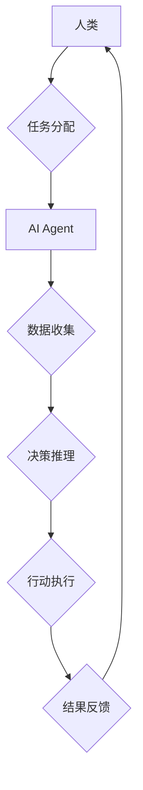

> AI Agent, 智能协作, 协作机器人, 人机交互, 深度学习, 自然语言处理, 决策推理

## 1. 背景介绍

随着人工智能技术的飞速发展，AI Agent（智能代理）已成为智能协作领域的核心技术之一。AI Agent是一种能够感知环境、做出决策并执行行动的软件实体，它可以自主学习、适应环境变化，并与人类或其他AI Agent进行协作。

智能协作是指多个智能体（包括人类和AI Agent）共同完成复杂任务的过程。在智能协作中，AI Agent可以发挥其独特的优势，例如：

* **提高效率:** AI Agent可以24/7工作，并以更高的速度和精度完成重复性任务，从而提高整体协作效率。
* **增强决策能力:** AI Agent可以分析海量数据，并利用机器学习算法进行预测和决策，帮助人类做出更明智的决策。
* **扩展协作范围:** AI Agent可以跨越地域限制，与全球各地的智能体进行协作，拓展协作范围。

## 2. 核心概念与联系

**2.1 AI Agent的类型**

AI Agent可以根据其智能水平和功能特点分为不同的类型：

* **简单反射式Agent:** 仅根据当前感知信息做出反应，缺乏记忆和学习能力。
* **模型-基于Agent:** 建立环境模型，并根据模型预测未来状态做出决策。
* **基于目标的Agent:** 拥有明确的目标，并根据目标制定行动计划。
* **学习式Agent:** 能够从经验中学习，不断改进其行为策略。

**2.2 智能协作的架构**

智能协作系统通常由以下几个关键组件组成：

* **智能体:** 包括人类和AI Agent。
* **环境:** 智能体所处的外部世界。
* **任务:** 智能体需要共同完成的目标。
* **通信机制:** 智能体之间进行信息交换的机制。
* **协作策略:** 智能体之间合作完成任务的规则和策略。

**2.3 Mermaid 流程图**



## 3. 核心算法原理 & 具体操作步骤

**3.1 算法原理概述**

在智能协作中，AI Agent通常采用以下核心算法：

* **强化学习:** AI Agent通过与环境交互，学习最优的行为策略，以最大化奖励。
* **图神经网络:** 用于建模智能体之间的关系，并进行协作决策。
* **自然语言处理:** 允许AI Agent理解和生成人类语言，进行自然流畅的交互。
* **决策树:** 用于表示决策规则，并帮助AI Agent做出选择。

**3.2 算法步骤详解**

以强化学习为例，其基本步骤如下：

1. **环境建模:** 建立环境模型，描述环境状态、智能体行为和奖励机制。
2. **策略初始化:** 初始化AI Agent的行为策略，例如随机策略或贪婪策略。
3. **环境交互:** AI Agent与环境交互，根据策略选择行动，并获得环境反馈（奖励或惩罚）。
4. **策略更新:** 根据环境反馈，更新AI Agent的行为策略，使其朝着最大化奖励的方向发展。
5. **重复步骤3-4:** 持续与环境交互，更新策略，直到达到预设的目标或收敛。

**3.3 算法优缺点**

* **优点:** 能够学习复杂行为，适应动态环境，并不断改进性能。
* **缺点:** 训练过程可能需要大量数据和计算资源，并且难以解释AI Agent的决策过程。

**3.4 算法应用领域**

* **机器人协作:** 多个机器人协同完成任务，例如搬运、组装等。
* **自动驾驶:** 多辆无人驾驶汽车协同行驶，避免碰撞，提高交通效率。
* **医疗诊断:** AI Agent辅助医生诊断疾病，提高诊断准确率。

## 4. 数学模型和公式 & 详细讲解 & 举例说明

**4.1 数学模型构建**

在强化学习中，常用的数学模型包括状态空间、动作空间、奖励函数和价值函数。

* **状态空间:** 描述环境的所有可能状态。
* **动作空间:** 描述智能体可以执行的所有动作。
* **奖励函数:** 将环境状态和智能体动作映射到奖励值。
* **价值函数:** 估计从当前状态执行某个策略的长期奖励总和。

**4.2 公式推导过程**

强化学习的目标是找到最优策略，即能够最大化长期奖励的策略。常用的策略优化算法包括Q学习和SARSA。

* **Q学习:** 通过迭代更新Q值表，Q值表存储了从每个状态执行每个动作的期望奖励。
* **SARSA:** 与Q学习类似，但SARSA在更新Q值时使用的是实际执行的动作，而不是贪婪策略。

**4.3 案例分析与讲解**

假设有一个简单的环境，智能体可以向左或向右移动，目标是到达终点。

* 状态空间: 智能体的当前位置。
* 动作空间: 向左或向右移动。
* 奖励函数: 抵达终点获得最大奖励，其他状态获得较小奖励。

使用Q学习算法，可以训练智能体找到到达终点的最优策略。

## 5. 项目实践：代码实例和详细解释说明

**5.1 开发环境搭建**

* Python 3.x
* TensorFlow 或 PyTorch 深度学习框架
* OpenAI Gym 或其他强化学习环境

**5.2 源代码详细实现**

```python
import gym
import numpy as np

# 定义环境
env = gym.make('CartPole-v1')

# 定义Q值表
q_table = np.zeros((env.observation_space.n, env.action_space.n))

# 学习参数
alpha = 0.1  # 学习率
gamma = 0.99  # 折扣因子
epsilon = 0.1  # 探索率

# Q学习算法
for episode in range(1000):
    state = env.reset()
    done = False

    while not done:
        # 探索与利用
        if np.random.uniform(0, 1) < epsilon:
            action = env.action_space.sample()
        else:
            action = np.argmax(q_table[state])

        # 执行动作
        next_state, reward, done, _ = env.step(action)

        # 更新Q值
        q_table[state, action] = (1 - alpha) * q_table[state, action] + alpha * (reward + gamma * np.max(q_table[next_state]))

        state = next_state

# 测试策略
state = env.reset()
while True:
    action = np.argmax(q_table[state])
    state, reward, done, _ = env.step(action)
    env.render()
    if done:
        break
env.close()
```

**5.3 代码解读与分析**

* 代码首先定义了环境和Q值表。
* 然后使用Q学习算法迭代更新Q值表。
* 在训练过程中，智能体会根据探索率随机选择动作，或者根据Q值表选择最优动作。
* 每次执行动作后，智能体会根据奖励和折扣因子更新Q值表。
* 最后，测试训练好的策略，并观察智能体的行为。

**5.4 运行结果展示**

运行代码后，可以观察到智能体在环境中学习并最终能够完成任务。

## 6. 实际应用场景

**6.1 智能协作机器人**

在制造业、物流业等领域，AI Agent可以与机器人协作，完成复杂的任务，例如：

* **协同组装:** 多个机器人协同完成产品组装，提高效率和精度。
* **协同搬运:** 多个机器人协同搬运重物，减轻人工负担。

**6.2 自动驾驶**

AI Agent可以与其他自动驾驶汽车协作，实现更安全、高效的交通系统。

* **协同行驶:** 多辆无人驾驶汽车协同行驶，避免碰撞，提高交通效率。
* **协同避障:** 多辆无人驾驶汽车协同避障，提高安全性。

**6.3 医疗诊断**

AI Agent可以辅助医生进行诊断，提高诊断准确率。

* **图像分析:** AI Agent可以分析医学图像，辅助医生诊断疾病。
* **数据分析:** AI Agent可以分析患者的病历数据，提供诊断建议。

**6.4 未来应用展望**

随着人工智能技术的不断发展，AI Agent在智能协作领域的应用将更加广泛。

* **个性化协作:** AI Agent可以根据用户的需求和喜好，提供个性化的协作体验。
* **跨领域协作:** AI Agent可以跨越不同领域，与不同类型的智能体协作，解决更复杂的问题。

## 7. 工具和资源推荐

**7.1 学习资源推荐**

* **书籍:**
    * 《Reinforcement Learning: An Introduction》
    * 《Deep Learning》
* **在线课程:**
    * Coursera: Reinforcement Learning Specialization
    * Udacity: Deep Learning Nanodegree

**7.2 开发工具推荐**

* **TensorFlow:** 开源深度学习框架
* **PyTorch:** 开源深度学习框架
* **OpenAI Gym:** 强化学习环境

**7.3 相关论文推荐**

* **AlphaGo:** DeepMind发布的围棋AI，利用深度学习技术战胜人类世界冠军。
* **GPT-3:** OpenAI发布的文本生成模型，能够生成高质量的文本内容。

## 8. 总结：未来发展趋势与挑战

**8.1 研究成果总结**

近年来，AI Agent在智能协作领域取得了显著进展，例如：

* 强化学习算法取得了突破性进展，能够训练智能体完成复杂的任务。
* 图神经网络能够有效建模智能体之间的关系，提高协作效率。
* 自然语言处理技术的发展，使得AI Agent能够与人类进行更自然流畅的交互。

**8.2 未来发展趋势**

* **更智能的AI Agent:** 未来AI Agent将更加智能，能够更好地理解环境、做出更明智的决策。
* **更广泛的应用场景:** AI Agent将在更多领域得到应用，例如教育、医疗、金融等。
* **更安全的协作环境:** 随着AI Agent的应用越来越广泛，安全性和可靠性将成为更加重要的研究方向。

**8.3 面临的挑战**

* **数据获取和隐私保护:** AI Agent的训练需要大量数据，如何获取高质量数据并保护用户隐私是一个挑战。
* **算法解释性和可解释性:** 许多AI算法难以解释，如何提高算法的可解释性，让人类能够理解AI Agent的决策过程是一个挑战。
* **伦理问题:** AI Agent的应用可能会带来一些伦理问题，例如责任归属、偏见等，需要进行深入研究和探讨。

**8.4 研究展望**

未来，AI Agent在智能协作领域的应用将更加广泛和深入。我们需要继续加强对AI Agent算法、安全性和伦理问题的研究，推动AI技术朝着更加安全、可靠、可解释的方向发展。

## 9. 附录：常见问题与解答

**9.1 如何选择合适的AI Agent类型？**

选择合适的AI Agent类型取决于具体的应用场景。

* 如果任务简单，可以考虑使用简单反射式Agent。
* 如果任务复杂，需要建模环境，可以考虑使用模型-基于Agent。
* 如果任务有明确的目标，可以考虑使用基于目标的Agent。
* 如果任务需要学习和适应环境变化，可以考虑使用学习式Agent。

**9.2 如何评估AI Agent的性能？**

AI Agent的性能可以根据具体的应用场景进行评估。

* 在强化学习中，可以使用奖励总和作为评估指标。
* 在机器人协作中，可以使用完成任务的时间和精度作为评估指标。
* 在医疗诊断中，可以使用诊断准确率作为评估指标。

**9.3 如何解决AI Agent的安全性问题？**

解决AI