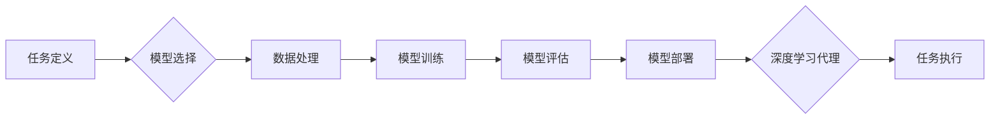

> 深度学习、代理、工作流、人工智能、算法、模型、应用

## 1. 背景介绍

深度学习作为人工智能领域最前沿的研究方向之一，近年来取得了令人瞩目的成就。从图像识别、自然语言处理到语音合成，深度学习算法在各个领域展现出强大的应用潜力。然而，随着深度学习模型规模的不断扩大，训练和部署成本也随之增加，如何更高效地利用深度学习资源，并将其应用于更广泛的场景，成为一个亟待解决的问题。

深度学习代理和工作流研究方向正是为了应对这一挑战而提出的。深度学习代理是指能够自主学习和执行特定任务的智能体，它可以根据输入数据和环境反馈，不断调整自己的行为策略，以达到预设的目标。深度学习工作流则是一种自动化执行任务的流程，它可以将多个深度学习模型和工具串联起来，形成一个完整的任务执行流程。

## 2. 核心概念与联系

**2.1 深度学习代理**

深度学习代理的核心概念是将深度学习模型嵌入到一个智能体框架中，使其能够自主学习和执行任务。代理通常由以下几个部分组成：

* **感知模块:** 用于接收来自环境的输入信息，例如图像、文本、传感器数据等。
* **决策模块:** 基于感知模块获取的信息，利用深度学习模型进行决策，选择下一步行动。
* **执行模块:** 将决策模块的输出转化为实际行动，例如控制机器人运动、生成文本、执行代码等。

**2.2 深度学习工作流**

深度学习工作流是一种自动化执行任务的流程，它可以将多个深度学习模型和工具串联起来，形成一个完整的任务执行流程。工作流通常由以下几个部分组成：

* **任务定义:** 明确需要完成的任务目标和输入输出数据。
* **模型选择:** 根据任务需求选择合适的深度学习模型。
* **数据处理:** 对输入数据进行预处理，例如清洗、转换、增强等。
* **模型训练:** 利用训练数据训练深度学习模型。
* **模型评估:** 对训练好的模型进行评估，验证其性能。
* **模型部署:** 将训练好的模型部署到实际应用环境中。

**2.3 深度学习代理与工作流的联系**

深度学习代理和工作流可以相互补充，共同推动深度学习技术的应用。

* 深度学习代理可以作为工作流中的一个环节，负责执行特定任务。例如，在图像识别工作流中，深度学习代理可以负责识别图像中的物体。
* 深度学习工作流可以为深度学习代理提供一个执行环境，并提供数据、模型和工具等资源支持。例如，在自然语言处理工作流中，深度学习工作流可以为深度学习代理提供文本数据、语言模型和文本生成工具等资源。

**2.4 深度学习代理与工作流的架构**



## 3. 核心算法原理 & 具体操作步骤

### 3.1 算法原理概述

深度学习代理和工作流的实现依赖于多种深度学习算法，例如卷积神经网络（CNN）、循环神经网络（RNN）、Transformer等。这些算法通过多层神经网络结构，学习数据中的复杂特征和模式，从而实现对任务的理解和执行。

### 3.2 算法步骤详解

**3.2.1 深度学习模型训练**

* **数据准备:** 收集和预处理训练数据，例如清洗、转换、增强等。
* **模型选择:** 根据任务需求选择合适的深度学习模型架构。
* **模型参数初始化:** 为模型参数赋予初始值。
* **反向传播算法:** 利用反向传播算法，计算模型参数的梯度，并根据梯度更新模型参数。
* **损失函数:** 使用损失函数衡量模型预测结果与真实值的差异。
* **优化算法:** 使用优化算法，例如梯度下降、Adam等，更新模型参数，降低损失函数值。

**3.2.2 深度学习代理执行**

* **感知:** 代理接收来自环境的输入信息。
* **决策:** 代理利用深度学习模型对输入信息进行处理，并做出决策。
* **执行:** 代理将决策转化为实际行动，与环境交互。
* **反馈:** 环境反馈代理的行动结果，代理根据反馈信息更新模型参数，改进决策策略。

**3.2.3 深度学习工作流执行**

* **任务调度:** 工作流引擎根据任务定义和资源情况，调度任务执行。
* **模型调用:** 工作流引擎调用相应的深度学习模型，执行任务步骤。
* **数据传递:** 工作流引擎将数据传递给各个模型，并接收模型输出结果。
* **流程控制:** 工作流引擎根据任务流程，控制模型执行顺序和数据流向。

### 3.3 算法优缺点

**优点:**

* **自动化:** 深度学习代理和工作流可以自动化执行任务，提高效率。
* **智能化:** 深度学习模型可以学习和适应环境变化，提高任务执行的智能化水平。
* **可扩展性:** 深度学习代理和工作流可以灵活扩展，支持多种任务和模型。

**缺点:**

* **数据依赖:** 深度学习模型需要大量数据进行训练，数据质量和数量直接影响模型性能。
* **计算资源:** 深度学习模型训练和部署需要大量的计算资源，成本较高。
* **可解释性:** 深度学习模型的决策过程较为复杂，难以解释模型的决策逻辑。

### 3.4 算法应用领域

深度学习代理和工作流在各个领域都有广泛的应用，例如：

* **图像识别:** 自动识别图像中的物体、场景和人物。
* **自然语言处理:** 自动理解和生成文本，例如机器翻译、文本摘要、聊天机器人等。
* **语音识别:** 自动识别语音信号，将语音转换为文本。
* **机器人控制:** 自动控制机器人的运动和行为。
* **医疗诊断:** 辅助医生进行疾病诊断和治疗方案制定。

## 4. 数学模型和公式 & 详细讲解 & 举例说明

### 4.1 数学模型构建

深度学习模型通常采用多层神经网络结构，每个神经元接收多个输入信号，并通过激活函数进行处理，输出一个信号。神经网络的训练过程就是通过调整神经元权重和偏置，使得模型输出结果与真实值尽可能接近的过程。

**4.1.1 神经网络结构**

一个典型的深度学习模型由以下几个部分组成：

* **输入层:** 接收原始数据，每个神经元对应一个输入特征。
* **隐藏层:** 多层神经元组成的层，用于提取数据特征。
* **输出层:** 输出模型预测结果，每个神经元对应一个输出类别或值。

**4.1.2 激活函数**

激活函数用于引入非线性，使得神经网络能够学习复杂的数据模式。常见的激活函数包括：

* **ReLU (Rectified Linear Unit):** f(x) = max(0, x)
* **Sigmoid:** f(x) = 1 / (1 + exp(-x))
* **Tanh (Hyperbolic tangent):** f(x) = (exp(x) - exp(-x)) / (exp(x) + exp(-x))

**4.1.3 损失函数**

损失函数用于衡量模型预测结果与真实值的差异。常见的损失函数包括：

* **均方误差 (MSE):** L = (y - y')^2
* **交叉熵损失 (Cross-entropy loss):** L = -sum(y * log(y'))

### 4.2 公式推导过程

深度学习模型的训练过程基于梯度下降算法，其核心思想是通过不断调整模型参数，降低损失函数值。

**4.2.1 梯度下降算法**

梯度下降算法的基本公式为：

```
θ = θ - α * ∇L(θ)
```

其中：

* θ: 模型参数
* α: 学习率
* ∇L(θ): 损失函数对模型参数的梯度

**4.2.2 反向传播算法**

反向传播算法用于计算梯度，其核心思想是通过链式法则，将损失函数对输出层的误差反向传播到各层神经元，并计算每个神经元的梯度。

### 4.3 案例分析与讲解

**4.3.1 图像分类**

假设我们训练一个图像分类模型，目标是识别图像中的猫和狗。

* **输入数据:** 图像数据，每个图像对应一个类别标签（猫或狗）。
* **模型结构:** 使用卷积神经网络（CNN）作为模型架构，提取图像特征。
* **损失函数:** 使用交叉熵损失函数，衡量模型预测结果与真实标签的差异。
* **训练过程:** 利用反向传播算法，根据损失函数梯度，更新模型参数，使得模型能够准确识别图像中的猫和狗。

## 5. 项目实践：代码实例和详细解释说明

### 5.1 开发环境搭建

* **操作系统:** Ubuntu 20.04
* **编程语言:** Python 3.8
* **深度学习框架:** TensorFlow 2.0
* **其他工具:** Jupyter Notebook

### 5.2 源代码详细实现

```python
import tensorflow as tf

# 定义模型结构
model = tf.keras.models.Sequential([
    tf.keras.layers.Conv2D(32, (3, 3), activation='relu', input_shape=(28, 28, 1)),
    tf.keras.layers.MaxPooling2D((2, 2)),
    tf.keras.layers.Conv2D(64, (3, 3), activation='relu'),
    tf.keras.layers.MaxPooling2D((2, 2)),
    tf.keras.layers.Flatten(),
    tf.keras.layers.Dense(10, activation='softmax')
])

# 定义损失函数和优化器
model.compile(loss='sparse_categorical_crossentropy',
              optimizer='adam',
              metrics=['accuracy'])

# 加载训练数据
(x_train, y_train), (x_test, y_test) = tf.keras.datasets.mnist.load_data()

# 训练模型
model.fit(x_train, y_train, epochs=5)

# 评估模型
loss, accuracy = model.evaluate(x_test, y_test)
print('Test loss:', loss)
print('Test accuracy:', accuracy)
```

### 5.3 代码解读与分析

* **模型结构:** 代码定义了一个简单的卷积神经网络模型，用于识别手写数字。模型包含两层卷积层、两层池化层、一层全连接层和一层输出层。
* **损失函数和优化器:** 使用交叉熵损失函数和Adam优化器训练模型。
* **数据加载:** 使用MNIST数据集进行训练和测试。
* **模型训练:** 使用`model.fit()`方法训练模型，训练5个 epochs。
* **模型评估:** 使用`model.evaluate()`方法评估模型在测试集上的性能。

### 5.4 运行结果展示

训练完成后，模型可以达到较高的准确率，例如在MNIST数据集上，模型可以达到98%以上的准确率。

## 6. 实际应用场景

### 6.1 图像识别

深度学习代理可以用于自动识别图像中的物体、场景和人物，应用于：

* **自动驾驶:** 识别道路标志、车辆和行人。
* **医疗诊断:** 识别病灶、肿瘤和骨折。
* **安防监控:** 识别嫌疑人、入侵者和异常行为。

### 6.2 自然语言处理

深度学习代理可以用于理解和生成文本，应用于：

* **机器翻译:** 将文本从一种语言翻译成另一种语言。
* **文本摘要:** 自动生成文本的简短摘要。
* **聊天机器人:** 与用户进行自然语言对话