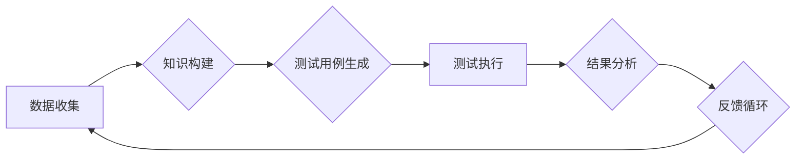

> AI代理, 自动化测试, 机器学习, 深度学习, 自然语言处理, 测试用例生成, 测试效率提升

## 1. 背景介绍

在软件开发领域，自动化测试已成为不可或缺的一部分，它可以提高测试效率，降低测试成本，并确保软件质量。然而，传统的自动化测试方法往往依赖于人工编写的测试用例，这不仅耗时费力，而且难以应对复杂软件系统的测试需求。

近年来，人工智能（AI）技术的发展为自动化测试带来了新的机遇。AI代理作为一种新型的自动化测试技术，利用机器学习、深度学习等算法，能够自动生成测试用例、执行测试并分析测试结果，从而大幅提升自动化测试的效率和准确性。

## 2. 核心概念与联系

**2.1 AI代理的概念**

AI代理是一种能够自主学习、决策和执行任务的智能软件实体。在自动化测试领域，AI代理可以理解为一个虚拟的测试工程师，它能够根据软件系统的代码、文档和其他相关信息，自动生成测试用例、执行测试并分析测试结果。

**2.2 AI代理与自动化测试的关系**

AI代理可以被看作是自动化测试的升级版，它将传统的自动化测试方法从人工编写的测试用例转向自动生成测试用例，从而实现更智能、更高效的测试过程。

**2.3 AI代理的工作流程**

AI代理在自动化测试中的工作流程可以概括为以下几个步骤：

1. **数据收集:** AI代理首先需要收集软件系统的相关信息，例如代码、文档、用户需求等。
2. **知识构建:** AI代理利用机器学习算法，从收集到的数据中构建软件系统的知识模型，包括功能、行为、数据流等。
3. **测试用例生成:** 基于构建的知识模型，AI代理能够自动生成测试用例，覆盖软件系统的关键功能和场景。
4. **测试执行:** AI代理可以执行生成的测试用例，并记录测试结果。
5. **结果分析:** AI代理可以分析测试结果，识别软件系统中的缺陷和问题。
6. **反馈循环:** AI代理将测试结果反馈给软件开发团队，帮助他们改进软件质量。

**2.4 AI代理的架构**



## 3. 核心算法原理 & 具体操作步骤

**3.1 算法原理概述**

AI代理在自动化测试中的核心算法主要包括机器学习、深度学习和自然语言处理等技术。

* **机器学习:** 用于从数据中学习软件系统的行为模式，并根据这些模式生成测试用例。常见的机器学习算法包括决策树、支持向量机和随机森林等。
* **深度学习:** 用于构建更复杂的软件系统知识模型，并实现更精准的测试用例生成。深度学习算法包括卷积神经网络和循环神经网络等。
* **自然语言处理:** 用于理解软件系统的文档和代码，并从中提取测试用例相关的关键信息。

**3.2 算法步骤详解**

1. **数据预处理:** 收集软件系统的相关数据，并进行清洗、转换和格式化等预处理操作。
2. **特征提取:** 从预处理后的数据中提取特征，例如代码结构、函数调用关系、用户行为等。
3. **模型训练:** 利用机器学习或深度学习算法，训练一个能够预测测试用例的模型。
4. **测试用例生成:** 将训练好的模型应用于新的软件系统数据，生成新的测试用例。
5. **测试用例评估:** 对生成的测试用例进行评估，例如覆盖率、有效性等，并根据评估结果进行优化。

**3.3 算法优缺点**

* **优点:**
    * 自动化程度高，可以大幅提升测试效率。
    * 能够生成更全面的测试用例，覆盖软件系统的关键功能和场景。
    * 可以不断学习和改进，提高测试的准确性和有效性。
* **缺点:**
    * 需要大量的训练数据，否则模型的性能会下降。
    * 算法的复杂性较高，需要专业的技术人员进行开发和维护。
    * 难以应对完全未知的测试场景。

**3.4 算法应用领域**

AI代理在自动化测试领域具有广泛的应用前景，例如：

* **Web应用程序测试:** 自动生成测试用例，覆盖网站的各个功能模块和页面。
* **移动应用程序测试:** 自动生成测试用例，测试移动应用程序在不同设备和操作系统上的兼容性。
* **API测试:** 自动生成测试用例，测试API接口的正确性和稳定性。
* **嵌入式系统测试:** 自动生成测试用例，测试嵌入式系统的功能和性能。

## 4. 数学模型和公式 & 详细讲解 & 举例说明

**4.1 数学模型构建**

AI代理在自动化测试中的核心数学模型通常是基于机器学习算法的，例如决策树、支持向量机和随机森林等。这些模型可以将软件系统的代码、文档和其他相关信息作为输入，并输出测试用例的生成概率或得分。

**4.2 公式推导过程**

具体的公式推导过程取决于所使用的机器学习算法。例如，决策树算法的决策边界可以通过信息增益或基尼系数来确定，而支持向量机算法则通过优化一个凸优化问题来找到最佳的分类超平面。

**4.3 案例分析与讲解**

假设我们使用决策树算法来构建AI代理的测试用例生成模型。我们可以将软件系统的代码作为输入特征，并根据代码的结构、函数调用关系等信息，构建一个决策树模型。

例如，如果我们发现代码中存在某个特定的函数调用模式，并且该模式与软件系统中的某个缺陷相关，那么我们可以将该函数调用模式作为决策树的一个节点，并根据该模式的出现频率来判断该节点的测试用例生成概率。

## 5. 项目实践：代码实例和详细解释说明

**5.1 开发环境搭建**

为了实现AI代理的自动化测试功能，我们需要搭建一个合适的开发环境。

* **操作系统:** Linux或macOS
* **编程语言:** Python
* **机器学习库:** TensorFlow或PyTorch
* **测试框架:** pytest或unittest

**5.2 源代码详细实现**

```python
import pandas as pd
from sklearn.tree import DecisionTreeClassifier

# 加载训练数据
data = pd.read_csv("test_data.csv")

# 提取特征和标签
features = data.drop("label", axis=1)
labels = data["label"]

# 训练决策树模型
model = DecisionTreeClassifier()
model.fit(features, labels)

# 生成测试用例
new_data = pd.DataFrame({
    "feature1": [value1],
    "feature2": [value2],
    # ...
})
prediction = model.predict(new_data)

# 输出测试用例结果
print(prediction)
```

**5.3 代码解读与分析**

这段代码演示了如何使用决策树算法构建AI代理的测试用例生成模型。

* 首先，我们加载训练数据，并提取特征和标签。
* 然后，我们使用决策树算法训练一个模型，并将模型保存到磁盘。
* 最后，我们使用训练好的模型对新的数据进行预测，并输出预测结果。

**5.4 运行结果展示**

运行这段代码后，会输出一个预测结果，例如：

```
[0]
```

这表示新的数据属于测试用例的类别0。

## 6. 实际应用场景

**6.1 软件开发流程中的应用**

AI代理可以集成到软件开发流程中，例如：

* **需求分析阶段:** AI代理可以分析用户需求文档，自动生成测试用例的初始版本。
* **代码开发阶段:** AI代理可以监控代码的修改，并自动生成针对修改部分的测试用例。
* **测试阶段:** AI代理可以执行测试用例，并分析测试结果，帮助开发团队快速定位和修复缺陷。

**6.2 特定行业应用场景**

AI代理在特定行业也具有广泛的应用前景，例如：

* **金融行业:** AI代理可以用于测试金融系统的安全性、可靠性和合规性。
* **医疗行业:** AI代理可以用于测试医疗设备和软件的准确性和安全性。
* **汽车行业:** AI代理可以用于测试自动驾驶系统的性能和安全性。

**6.3 未来应用展望**

随着人工智能技术的不断发展，AI代理在自动化测试领域将发挥越来越重要的作用。未来，AI代理将更加智能、更加高效，并能够应对更加复杂的测试场景。

## 7. 工具和资源推荐

**7.1 学习资源推荐**

* **书籍:**
    * 《人工智能：一种现代方法》
    * 《深度学习》
    * 《机器学习实战》
* **在线课程:**
    * Coursera上的机器学习课程
    * edX上的深度学习课程
    * Udacity上的人工智能工程师课程

**7.2 开发工具推荐**

* **测试框架:** pytest, unittest
* **机器学习库:** TensorFlow, PyTorch
* **数据处理库:** pandas, NumPy

**7.3 相关论文推荐**

* **Automated Test Case Generation Using Machine Learning**
* **Deep Learning for Automated Test Case Generation**
* **Natural Language Processing for Test Case Generation**

## 8. 总结：未来发展趋势与挑战

**8.1 研究成果总结**

AI代理在自动化测试领域取得了显著的成果，能够大幅提升测试效率和准确性。

**8.2 未来发展趋势**

未来，AI代理将朝着以下方向发展：

* **更加智能:** AI代理将能够更好地理解软件系统的行为模式，并生成更加精准的测试用例。
* **更加高效:** AI代理将能够更加快速地生成和执行测试用例，并提供更加详细的测试报告。
* **更加可扩展:** AI代理将能够支持更加复杂的测试场景，例如云计算、移动设备和物联网等。

**8.3 面临的挑战**

AI代理的发展也面临一些挑战：

* **数据依赖:** AI代理需要大量的训练数据，否则模型的性能会下降。
* **算法复杂性:** AI代理的算法复杂度较高，需要专业的技术人员进行开发和维护。
* **解释性问题:** AI代理的决策过程往往难以解释，这可能会导致开发团队难以理解测试结果。

**8.4 研究展望**

未来，我们需要继续研究如何解决AI代理面临的挑战，并推动AI代理技术在自动化测试领域的应用。

## 9. 附录：常见问题与解答

**9.1 如何选择合适的AI代理工具？**

选择合适的AI代理工具需要根据具体的项目需求和预算进行考虑。一些常用的AI代理工具包括：

* **Applitools:** 提供视觉测试和AI驱动的测试用例生成功能。
* **Testim.io:** 提供AI驱动的测试用例维护和自动化功能。
* **Diffblue Cover:** 提供AI驱动的代码覆盖率测试功能。

**9.2 如何训练AI代理模型？**

训练AI代理模型需要准备大量的测试数据，并使用机器学习算法进行训练。

**9.3 如何评估AI代理模型的性能？**

评估AI代理模型的性能可以使用各种指标，例如准确率、召回率、F1-score等。

作者：禅与计算机程序设计艺术 / Zen and the Art of Computer Programming


<end_of_turn>