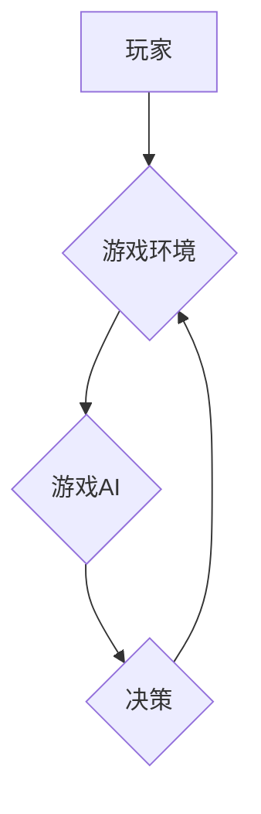

> 人工智能，游戏AI，深度学习，强化学习，围棋，星际争霸，游戏开发

## 1. 背景介绍

游戏行业作为全球最大的娱乐产业之一，近年来迎来了前所未有的发展机遇。随着人工智能技术的飞速发展，游戏领域也迎来了新的变革。从简单的脚本行为到复杂的策略决策，AI正在逐渐改变着游戏体验，并引发了人们对未来游戏发展趋势的广泛思考。

传统的游戏AI通常基于有限状态机或规则引擎，其行为模式相对简单，缺乏灵活性。随着深度学习和强化学习等技术的成熟，游戏AI开始展现出更强大的学习和适应能力。例如，AlphaGo的成功挑战围棋世界冠军，以及OpenAI Five在Dota 2比赛中的出色表现，都证明了AI在游戏领域的巨大潜力。

## 2. 核心概念与联系

### 2.1 深度学习

深度学习是一种机器学习的子领域，它利用多层神经网络来模拟人类大脑的学习过程。通过大量的训练数据，深度学习模型能够自动学习特征和模式，从而实现对复杂问题的解决。

### 2.2 强化学习

强化学习是一种基于奖励机制的机器学习算法。在强化学习中，智能体通过与环境交互，不断尝试不同的行动，并根据环境的反馈获得奖励或惩罚。通过不断调整策略，智能体最终能够学习到最优的行动方案。

### 2.3 游戏AI

游戏AI是指在游戏中模拟智能行为的系统。游戏AI通常利用深度学习和强化学习等技术，使游戏角色能够做出更逼真、更智能的决策。

**Mermaid 流程图**



## 3. 核心算法原理 & 具体操作步骤

### 3.1 算法原理概述

游戏AI的算法原理主要基于深度学习和强化学习。深度学习模型用于学习游戏环境的特征和模式，而强化学习算法则用于优化游戏角色的策略决策。

### 3.2 算法步骤详解

1. **环境建模:** 将游戏环境建模为一个状态空间和动作空间。状态空间表示游戏中的所有可能状态，动作空间表示游戏角色可以执行的所有动作。

2. **深度学习模型训练:** 利用深度学习模型学习游戏环境的特征和模式。训练数据通常包括游戏历史记录、玩家行为和游戏结果等。

3. **强化学习策略优化:** 利用强化学习算法优化游戏角色的策略决策。强化学习算法通过不断与环境交互，并根据环境的反馈获得奖励或惩罚，来调整策略，最终学习到最优的行动方案。

4. **决策执行:** 根据优化后的策略，游戏角色执行相应的动作，并观察环境的变化。

5. **循环迭代:** 重复上述步骤，不断优化策略，提高游戏角色的智能水平。

### 3.3 算法优缺点

**优点:**

* 能够学习复杂的游戏环境和策略。
* 具有较强的适应性和泛化能力。
* 可以生成更逼真、更智能的游戏角色行为。

**缺点:**

* 训练过程需要大量的计算资源和时间。
* 算法的复杂性较高，需要专业的技术人员进行开发和维护。
* 算法的性能受训练数据质量的影响较大。

### 3.4 算法应用领域

* 游戏角色行为设计
* 游戏策略决策
* 游戏难度调节
* 游戏内容生成

## 4. 数学模型和公式 & 详细讲解 & 举例说明

### 4.1 数学模型构建

在强化学习中，常用的数学模型是马尔可夫决策过程 (MDP)。MDP 由以下几个要素组成:

* 状态空间 S: 表示游戏中的所有可能状态。
* 动作空间 A: 表示游戏角色可以执行的所有动作。
* 转移概率 P(s', r | s, a): 表示从状态 s 执行动作 a 后，转移到状态 s' 的概率，以及获得奖励 r 的概率。
* 奖励函数 R(s, a): 表示在状态 s 执行动作 a 后获得的奖励。
* 折扣因子 γ: 表示未来奖励的权重。

### 4.2 公式推导过程

强化学习的目标是找到一个最优策略 π(s)，使得在该策略下，期望累积奖励最大化。

最优策略的定义如下:

π*(s) = argmax<sub>a∈A</sub> Σ<sub>s'∈S</sub> P(s' | s, a) [R(s', a) + γ max<sub>a'∈A</sub> Σ<sub>s''∈S</sub> P(s'' | s', a') [R(s'', a') + γ max<sub>a''∈A</sub> Σ<sub>s'''∈S</sub> P(s''' | s'', a'') [R(s''', a'') + ...]]]

### 4.3 案例分析与讲解

例如，在围棋游戏中，状态空间包含所有可能的棋盘状态，动作空间包含所有可能的落子位置。通过训练深度学习模型，可以学习到棋盘状态和落子位置之间的关系，并利用强化学习算法优化落子策略。

## 5. 项目实践：代码实例和详细解释说明

### 5.1 开发环境搭建

* Python 3.x
* TensorFlow 或 PyTorch
* OpenAI Gym

### 5.2 源代码详细实现

```python
import gym
import tensorflow as tf

# 定义游戏环境
env = gym.make('CartPole-v1')

# 定义神经网络模型
model = tf.keras.models.Sequential([
    tf.keras.layers.Dense(128, activation='relu', input_shape=(4,)),
    tf.keras.layers.Dense(64, activation='relu'),
    tf.keras.layers.Dense(2, activation='softmax')
])

# 定义损失函数和优化器
loss_fn = tf.keras.losses.CategoricalCrossentropy()
optimizer = tf.keras.optimizers.Adam()

# 训练模型
for episode in range(1000):
    state = env.reset()
    done = False
    total_reward = 0

    while not done:
        # 获取模型预测
        action_probs = model(tf.expand_dims(state, axis=0))
        action = tf.random.categorical(tf.math.log(action_probs), num_samples=1)[0, 0]

        # 执行动作
        next_state, reward, done, _ = env.step(action)

        # 更新模型参数
        with tf.GradientTape() as tape:
            loss = loss_fn(tf.one_hot(action, depth=2), action_probs)
        gradients = tape.gradient(loss, model.trainable_variables)
        optimizer.apply_gradients(zip(gradients, model.trainable_variables))

        # 更新状态
        state = next_state

        # 更新总奖励
        total_reward += reward

    print(f'Episode {episode+1}, Total Reward: {total_reward}')

# 保存模型
model.save('cartpole_model.h5')
```

### 5.3 代码解读与分析

这段代码实现了基于深度学习和强化学习的CartPole游戏AI。

* 首先，定义了游戏环境和神经网络模型。
* 然后，定义了损失函数和优化器，并开始训练模型。
* 在训练过程中，模型会根据环境的反馈调整参数，最终学习到最优的策略。
* 最后，保存训练好的模型。

### 5.4 运行结果展示

训练完成后，模型能够控制游戏角色稳定地平衡木杆，并获得较高的奖励。

## 6. 实际应用场景

### 6.1 游戏角色行为设计

游戏AI可以用于设计更逼真、更智能的游戏角色。例如，在RPG游戏中，AI可以控制NPC的行为，使其能够做出更自然的对话和行动。

### 6.2 游戏策略决策

游戏AI可以用于优化游戏策略决策。例如，在策略类游戏中，AI可以帮助玩家制定更有效的战术和策略。

### 6.3 游戏难度调节

游戏AI可以用于调节游戏难度。例如，在动作游戏中，AI可以控制敌人的难度，使其更具挑战性。

### 6.4 未来应用展望

随着人工智能技术的不断发展，游戏AI将有更广泛的应用场景。例如，AI可以用于生成游戏内容，设计游戏关卡，甚至开发全新的游戏类型。

## 7. 工具和资源推荐

### 7.1 学习资源推荐

* **书籍:**
    * 《深度学习》
    * 《强化学习：原理、算法和应用》
* **在线课程:**
    * Coursera: 深度学习
    * Udacity: 强化学习
* **开源项目:**
    * OpenAI Gym
    * TensorFlow
    * PyTorch

### 7.2 开发工具推荐

* **游戏引擎:** Unity, Unreal Engine
* **深度学习框架:** TensorFlow, PyTorch
* **强化学习库:** Stable Baselines3

### 7.3 相关论文推荐

* AlphaGo: Mastering the Game of Go with Deep Neural Networks and Tree Search
* OpenAI Five: Mastering Dota 2 with a General Game Playing Algorithm

## 8. 总结：未来发展趋势与挑战

### 8.1 研究成果总结

近年来，游戏AI取得了显著的进展，从围棋到星际争霸，AI已经展现出强大的学习和适应能力。深度学习和强化学习等技术为游戏AI的发展提供了强大的工具。

### 8.2 未来发展趋势

* **更逼真的游戏角色:** AI将能够设计更逼真、更智能的游戏角色，使其行为更加自然和富有表现力。
* **更丰富的游戏内容:** AI将能够帮助开发者生成更丰富的游戏内容，例如游戏关卡、剧情和道具。
* **更个性化的游戏体验:** AI将能够根据玩家的喜好和行为模式，提供更个性化的游戏体验。

### 8.3 面临的挑战

* **计算资源:** 训练复杂的AI模型需要大量的计算资源，这对于小型游戏开发团队来说是一个挑战。
* **数据获取:** 训练AI模型需要大量的游戏数据，获取高质量的游戏数据是一个难题。
* **伦理问题:** AI在游戏中的应用可能会引发一些伦理问题，例如游戏成瘾和虚假信息传播。

### 8.4 研究展望

未来，游戏AI的研究将继续朝着更智能、更逼真、更个性化的方向发展。同时，我们需要关注AI在游戏中的伦理问题，并制定相应的规范和政策，确保AI技术能够健康、可持续地发展。

## 9. 附录：常见问题与解答

### 9.1 如何选择合适的AI算法？

选择合适的AI算法取决于游戏的具体需求。例如，对于需要快速决策的游戏，可以选择强化学习算法；对于需要学习复杂规则的游戏，可以选择深度学习算法。

### 9.2 如何获取高质量的游戏数据？

可以通过游戏录制、玩家行为分析等方式获取高质量的游戏数据。

### 9.3 如何解决AI在游戏中出现的偏差问题？

可以通过数据预处理、算法调优、人工干预等方式解决AI在游戏中出现的偏差问题。


作者：禅与计算机程序设计艺术 / Zen and the Art of Computer Programming 
<end_of_turn>