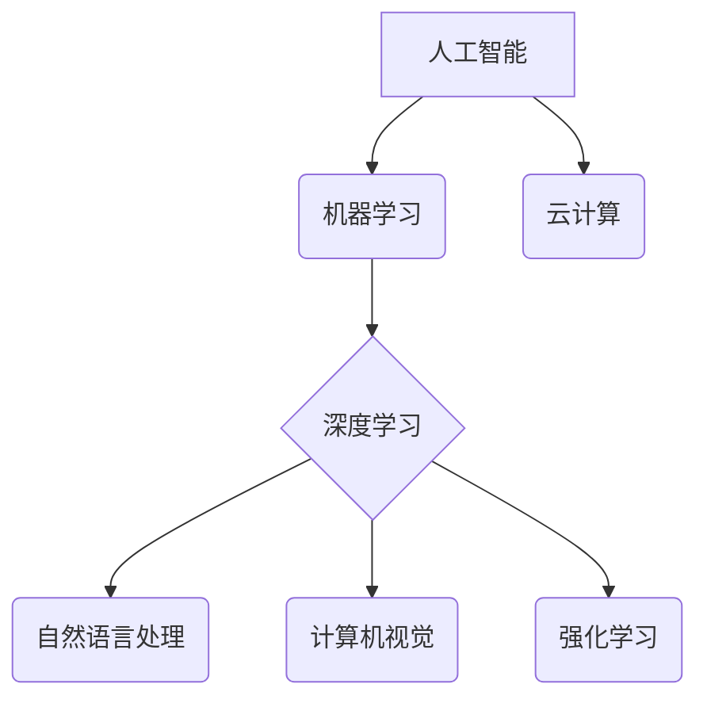

> 人工智能，深度学习，机器学习，自然语言处理，计算机视觉，强化学习，云计算

## 1. 背景介绍

人工智能（AI）正以惊人的速度发展，深刻地改变着我们生活的方方面面。从智能手机的语音助手到自动驾驶汽车，AI技术正在不断突破边界，为人类社会带来前所未有的机遇和挑战。

近年来，深度学习的兴起为AI发展注入了强劲动力。深度学习算法能够从海量数据中自动学习特征，从而实现更精准、更智能的决策。这使得AI技术在图像识别、语音识别、自然语言处理等领域取得了突破性进展。

## 2. 核心概念与联系

**2.1  人工智能（AI）**

人工智能是指模拟人类智能行为的计算机系统。它涵盖了广泛的领域，包括学习、推理、决策、感知和语言理解等。

**2.2  机器学习（ML）**

机器学习是人工智能的一个子领域，它使计算机能够从数据中学习，无需明确编程。机器学习算法通过分析数据模式，建立数学模型，从而预测未来结果或做出决策。

**2.3  深度学习（DL）**

深度学习是机器学习的一个子领域，它使用多层神经网络来模拟人类大脑的结构和功能。深度学习算法能够从复杂的数据中提取更深层次的特征，从而实现更精准的预测和识别。

**2.4  自然语言处理（NLP）**

自然语言处理是指使计算机能够理解、处理和生成人类语言的技术。NLP应用广泛，包括机器翻译、文本摘要、情感分析等。

**2.5  计算机视觉（CV）**

计算机视觉是指使计算机能够“看”和理解图像的技术。CV应用广泛，包括图像识别、物体检测、图像分割等。

**2.6  强化学习（RL）**

强化学习是一种机器学习方法，它通过奖励和惩罚机制来训练智能体，使其在特定环境中做出最优决策。RL应用广泛，包括游戏、机器人控制、自动驾驶等。

**2.7  云计算**

云计算是指使用互联网提供计算资源、存储空间和软件服务的模式。云计算为AI发展提供了强大的计算能力和数据存储能力。

**2.8  核心概念联系**



## 3. 核心算法原理 & 具体操作步骤

### 3.1  算法原理概述

深度学习算法的核心是多层神经网络。神经网络由多个层组成，每层包含多个神经元。每个神经元接收来自上一层的输入信号，并通过激活函数进行处理，输出到下一层。

深度学习算法通过训练神经网络，调整神经元的权重和偏差，使网络能够从数据中学习特征。训练过程通常使用反向传播算法，通过计算误差并反向传播到各层神经元，调整权重和偏差，最终使网络的输出与真实值尽可能接近。

### 3.2  算法步骤详解

1. **数据预处理:** 将原始数据转换为深度学习算法可以处理的格式，例如归一化、编码等。
2. **网络结构设计:** 根据任务需求设计神经网络的结构，包括层数、神经元数量、激活函数等。
3. **参数初始化:** 为神经网络的参数（权重和偏差）赋初值。
4. **前向传播:** 将输入数据通过神经网络进行前向传播，得到输出结果。
5. **损失函数计算:** 计算输出结果与真实值的误差，使用损失函数衡量误差大小。
6. **反向传播:** 将误差反向传播到各层神经元，计算梯度。
7. **参数更新:** 使用梯度下降算法更新神经网络的参数，减小误差。
8. **迭代训练:** 重复步骤4-7，直到误差达到预设阈值或训练次数达到上限。

### 3.3  算法优缺点

**优点:**

* 能够从复杂的数据中自动学习特征，无需人工特征工程。
* 性能优异，在图像识别、语音识别、自然语言处理等领域取得了突破性进展。

**缺点:**

* 训练数据量大，需要大量的计算资源和时间。
* 模型解释性差，难以理解模型的决策过程。
* 对数据质量要求高，数据噪声或偏差会影响模型性能。

### 3.4  算法应用领域

* **图像识别:** 人脸识别、物体检测、图像分类等。
* **语音识别:** 语音转文本、语音助手等。
* **自然语言处理:** 机器翻译、文本摘要、情感分析等。
* **推荐系统:** 商品推荐、内容推荐等。
* **医疗诊断:** 病情诊断、疾病预测等。
* **金融风险控制:** 欺诈检测、信用评估等。

## 4. 数学模型和公式 & 详细讲解 & 举例说明

### 4.1  数学模型构建

深度学习算法的核心是多层神经网络。神经网络可以看作是一个复杂的数学模型，其输出结果由输入数据和网络参数共同决定。

**4.1.1  激活函数**

激活函数是神经网络中一个重要的组成部分，它决定了神经元的输出。常见的激活函数包括 sigmoid 函数、ReLU 函数、tanh 函数等。

**4.1.2  损失函数**

损失函数用于衡量模型的预测结果与真实值的误差。常见的损失函数包括均方误差（MSE）、交叉熵损失（Cross-Entropy Loss）等。

**4.1.3  梯度下降算法**

梯度下降算法是深度学习算法训练的核心算法，它通过计算梯度来更新网络参数，减小损失函数的值。

### 4.2  公式推导过程

**4.2.1  前向传播公式**

```
z = Wx + b
a = f(z)
```

其中：

* z 是神经元的输入值。
* W 是权重矩阵。
* x 是输入数据。
* b 是偏置项。
* f 是激活函数。
* a 是神经元的输出值。

**4.2.2  损失函数公式**

```
L = (1/N) * Σ(y_i - a_i)^2
```

其中：

* L 是损失函数的值。
* N 是样本数量。
* y_i 是真实值。
* a_i 是预测值。

**4.2.3  梯度下降公式**

```
W = W - α * ∂L/∂W
b = b - α * ∂L/∂b
```

其中：

* α 是学习率。
* ∂L/∂W 是损失函数对权重的梯度。
* ∂L/∂b 是损失函数对偏置项的梯度。

### 4.3  案例分析与讲解

**4.3.1  图像分类**

假设我们有一个图像分类任务，目标是将图像分类为不同的类别，例如猫、狗、鸟等。我们可以使用卷积神经网络（CNN）来解决这个问题。

CNN 是一种专门用于处理图像数据的深度学习算法。它利用卷积层和池化层来提取图像特征，并使用全连接层进行分类。

**4.3.2  文本生成**

假设我们有一个文本生成任务，目标是根据给定的文本生成新的文本。我们可以使用循环神经网络（RNN）来解决这个问题。

RNN 是一种专门用于处理序列数据的深度学习算法。它能够记住之前的信息，并根据上下文生成新的文本。

## 5. 项目实践：代码实例和详细解释说明

### 5.1  开发环境搭建

* **操作系统:** Ubuntu 20.04 LTS
* **编程语言:** Python 3.8
* **深度学习框架:** TensorFlow 2.0
* **其他工具:** Jupyter Notebook、Git

### 5.2  源代码详细实现

```python
import tensorflow as tf

# 定义模型结构
model = tf.keras.models.Sequential([
    tf.keras.layers.Conv2D(32, (3, 3), activation='relu', input_shape=(28, 28, 1)),
    tf.keras.layers.MaxPooling2D((2, 2)),
    tf.keras.layers.Conv2D(64, (3, 3), activation='relu'),
    tf.keras.layers.MaxPooling2D((2, 2)),
    tf.keras.layers.Flatten(),
    tf.keras.layers.Dense(10, activation='softmax')
])

# 编译模型
model.compile(optimizer='adam',
              loss='sparse_categorical_crossentropy',
              metrics=['accuracy'])

# 加载数据
(x_train, y_train), (x_test, y_test) = tf.keras.datasets.mnist.load_data()

# 数据预处理
x_train = x_train.astype('float32') / 255.0
x_test = x_test.astype('float32') / 255.0
x_train = x_train.reshape((x_train.shape[0], 28, 28, 1))
x_test = x_test.reshape((x_test.shape[0], 28, 28, 1))

# 训练模型
model.fit(x_train, y_train, epochs=5)

# 评估模型
loss, accuracy = model.evaluate(x_test, y_test)
print('Test loss:', loss)
print('Test accuracy:', accuracy)
```

### 5.3  代码解读与分析

这段代码实现了使用 TensorFlow 框架训练一个简单的 MNIST 手写数字识别模型。

* **模型结构:** 代码定义了一个简单的卷积神经网络，包含两层卷积层、两层池化层、一层 Flatten 层和一层全连接层。
* **模型编译:** 代码使用 Adam 优化器、交叉熵损失函数和准确率作为评估指标来编译模型。
* **数据加载:** 代码使用 TensorFlow 的 MNIST 数据集加载器加载 MNIST 数据集。
* **数据预处理:** 代码将数据类型转换为 float32，并将像素值归一化到 0 到 1 之间。
* **模型训练:** 代码使用 `model.fit()` 方法训练模型，训练 5 个 epochs。
* **模型评估:** 代码使用 `model.evaluate()` 方法评估模型在测试集上的性能。

### 5.4  运行结果展示

训练完成后，模型的测试准确率通常在 98% 以上。

## 6. 实际应用场景

### 6.1  医疗诊断

* **病症诊断:** 利用深度学习算法分析患者的影像数据（如 X 光片、CT 扫描、MRI 图像）和病历信息，辅助医生诊断疾病。
* **疾病预测:** 根据患者的个人信息、生活习惯和医疗历史数据，预测患者患特定疾病的风险。

### 6.2  金融风险控制

* **欺诈检测:** 分析交易数据、用户行为和网络活动，识别异常交易和潜在的欺诈行为。
* **信用评估:** 根据用户的信用记录、收入、支出等信息，评估用户的信用风险。

### 6.3  智能客服

* **聊天机器人:** 利用自然语言处理技术，构建能够与用户进行自然对话的聊天机器人，提供客户服务、咨询和信息查询等功能。

### 6.4  未来应用展望

* **个性化教育:** 根据学生的学习进度、学习风格和兴趣爱好，提供个性化的学习内容和教学方法。
* **自动驾驶:** 利用计算机视觉、强化学习和传感器数据，实现自动驾驶汽车的感知、决策和控制。
* **智能制造:** 利用机器学习和深度学习算法，优化生产流程、提高生产效率和产品质量。

## 7. 工具和资源推荐

### 7.1  学习资源推荐

* **在线课程:** Coursera、edX、Udacity 等平台提供丰富的 AI 和深度学习课程。
* **书籍:** 《深度学习》、《机器学习》、《人工智能》等经典书籍。
* **博客和论坛:** TensorFlow、Py