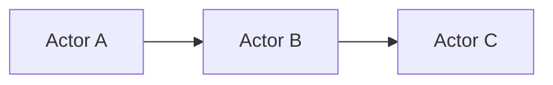

> Actor Model, 并发编程, 分布式系统, 消息传递, 异步编程, Erlang

## 1. 背景介绍

在现代软件开发中，处理并发和分布式系统越来越重要。传统的线程模型在面对复杂并发场景时，容易出现死锁、竞争条件等问题，难以保证程序的可靠性和可维护性。为了解决这些问题，Actor Model 应运而生。

Actor Model 是一种基于消息传递的并发编程模型，它将系统分解成独立的“Actor”，每个 Actor 都是一个轻量级的进程，负责处理消息并产生新的消息。Actor 之间通过消息传递进行通信，这种异步、无共享内存的通信方式，有效避免了传统线程模型中的并发问题。

## 2. 核心概念与联系

### 2.1  Actor

Actor 是 Actor Model 的基本单元，它是一个独立的、轻量级的进程，负责处理消息并产生新的消息。每个 Actor 都有一个状态，以及处理消息的逻辑。

### 2.2  消息

消息是 Actor 之间通信的载体，它包含了发送者、接收者以及消息内容。Actor 通过发送消息来请求其他 Actor 的服务，或者通知其他 Actor 发生事件。

### 2.3  消息传递

Actor 之间通过异步消息传递进行通信。发送消息的 Actor 不需要等待接收消息的 Actor 处理完消息，而是继续执行自己的逻辑。接收消息的 Actor 在收到消息后，会根据消息内容执行相应的逻辑，并可能产生新的消息。

### 2.4  Actor 通信模型

Actor 模型中的通信是基于消息传递的，并且是异步的。



## 3. 核心算法原理 & 具体操作步骤

### 3.1  算法原理概述

Actor Model 的核心算法原理是基于消息传递和异步处理。每个 Actor 维护一个消息队列，接收来自其他 Actor 的消息。当 Actor 收到消息时，它会根据消息内容执行相应的逻辑，并可能产生新的消息发送给其他 Actor。

### 3.2  算法步骤详解

1. **创建 Actor:** 创建一个新的 Actor 对象，并指定其状态和处理消息的逻辑。
2. **发送消息:** 使用 Actor 的 `send` 方法发送消息给其他 Actor。
3. **接收消息:** Actor 会不断从消息队列中取出消息，并执行相应的逻辑。
4. **处理消息:** Actor 根据消息内容执行相应的逻辑，并可能产生新的消息发送给其他 Actor。

### 3.3  算法优缺点

**优点:**

* **并发性:** Actor Model 可以有效地处理并发任务，因为每个 Actor 都是独立的进程，可以并行执行。
* **分布式性:** Actor Model 可以轻松地扩展到分布式系统，因为 Actor 可以分布在不同的机器上。
* **容错性:** Actor Model 具有良好的容错性，因为每个 Actor 都是独立的，如果一个 Actor 崩溃，不会影响其他 Actor 的运行。

**缺点:**

* **复杂性:** Actor Model 相比于传统的线程模型更加复杂，需要学习新的概念和编程模式。
* **性能:** 在某些情况下，消息传递的开销可能会影响性能。

### 3.4  算法应用领域

Actor Model 广泛应用于各种领域，例如：

* **分布式系统:** Actor Model 可以用于构建分布式数据库、缓存系统、消息队列等。
* **并发编程:** Actor Model 可以用于构建高并发、高性能的应用程序，例如游戏、金融交易系统等。
* **人工智能:** Actor Model 可以用于构建智能代理、机器人控制系统等。

## 4. 数学模型和公式 & 详细讲解 & 举例说明

### 4.1  数学模型构建

Actor Model 可以用状态机模型来描述。每个 Actor 都是一个状态机，其状态由其内部数据结构决定，而消息传递是状态机的驱动因素。

### 4.2  公式推导过程

Actor Model 中没有固定的数学公式，但我们可以用概率论和图论来分析 Actor 模型的性能和行为。例如，我们可以用概率论来分析消息传递的成功率，用图论来分析 Actor 之间的通信拓扑结构。

### 4.3  案例分析与讲解

假设我们有一个简单的 Actor 模型，其中有两个 Actor：

* **Actor A:** 负责接收用户输入，并将其发送给 Actor B。
* **Actor B:** 负责处理用户输入，并返回结果给 Actor A。

我们可以用状态机模型来描述这两个 Actor 的行为：

* **Actor A:**

```
状态：等待输入
事件：接收用户输入
动作：发送用户输入给 Actor B

状态：等待结果
事件：接收结果
动作：返回结果给用户
```

* **Actor B:**

```
状态：等待输入
事件：接收用户输入
动作：处理用户输入，并返回结果

```

## 5. 项目实践：代码实例和详细解释说明

### 5.1  开发环境搭建

本示例使用 Python 语言和 `asyncio` 库实现 Actor Model。

### 5.2  源代码详细实现

```python
import asyncio

class Actor:
    def __init__(self, name):
        self.name = name
        self.mailbox = asyncio.Queue()

    async def send(self, message):
        await self.mailbox.put(message)

    async def receive(self):
        while True:
            message = await self.mailbox.get()
            await self.handle_message(message)

    async def handle_message(self, message):
        print(f"{self.name} received message: {message}")

async def main():
    actor_a = Actor("Actor A")
    actor_b = Actor("Actor B")

    async def actor_a_task():
        await actor_a.send("Hello, Actor B!")

    async def actor_b_task():
        await actor_b.receive()

    asyncio.create_task(actor_a_task())
    asyncio.create_task(actor_b_task())

    await asyncio.sleep(1)

if __name__ == "__main__":
    asyncio.run(main())
```

### 5.3  代码解读与分析

* `Actor` 类定义了 Actor 的基本结构，包括名称、消息队列和处理消息的逻辑。
* `send` 方法用于发送消息给 Actor。
* `receive` 方法用于接收消息并处理消息。
* `handle_message` 方法用于处理消息内容。
* `main` 函数创建了两个 Actor，并启动了两个任务，分别负责发送消息和接收消息。

### 5.4  运行结果展示

```
Actor A received message: Hello, Actor B!
```

## 6. 实际应用场景

Actor Model 在实际应用场景中具有广泛的应用前景，例如：

* **分布式数据库:** Actor Model 可以用于构建分布式数据库，每个 Actor 负责管理数据库的一部分数据，并通过消息传递进行数据同步和一致性维护。
* **消息队列:** Actor Model 可以用于构建消息队列，每个 Actor 负责处理消息，并根据消息内容执行相应的逻辑。
* **游戏开发:** Actor Model 可以用于构建游戏，每个 Actor 负责控制游戏中的一个角色或物体，并通过消息传递进行交互。

### 6.4  未来应用展望

随着分布式系统和并发编程需求的不断增长，Actor Model 将在未来得到更广泛的应用。例如，Actor Model 可以用于构建更复杂的分布式系统，例如微服务架构、云计算平台等。

## 7. 工具和资源推荐

### 7.1  学习资源推荐

* **书籍:**
    * "Programming Erlang" by Joe Armstrong
    * "Concurrency in Action" by  Robert C. Martin
* **在线课程:**
    * Coursera: Concurrency and Parallelism
    * Udemy: Actor Model Programming with Akka

### 7.2  开发工具推荐

* **Erlang:** Erlang 是 Actor Model 的发明语言，它提供了强大的并发和分布式编程支持。
* **Akka:** Akka 是一个基于 Actor Model 的 Java 库，它提供了丰富的 Actor API 和工具。
* **Elixir:** Elixir 是一个基于 Erlang 的动态语言，它也支持 Actor Model。

### 7.3  相关论文推荐

* "Actor Model" by Carl Hewitt
* "Concurrency and Communication in Parallel Programming" by  Tony Hoare

## 8. 总结：未来发展趋势与挑战

### 8.1  研究成果总结

Actor Model 是一种成熟的并发编程模型，它已经成功应用于各种领域。Actor Model 的优势在于其并发性、分布式性、容错性和易于维护性。

### 8.2  未来发展趋势

未来，Actor Model 将继续发展和完善，例如：

* **更强大的工具和库:** 将会有更多基于 Actor Model 的工具和库出现，提供更丰富的功能和更易于使用的 API。
* **更广泛的应用场景:** Actor Model 将应用于更多领域，例如人工智能、物联网等。
* **更深入的研究:** 研究人员将继续深入研究 Actor Model 的理论和实践，探索其更深层次的特性和应用潜力。

### 8.3  面临的挑战

Actor Model 也面临一些挑战，例如：

* **复杂性:** Actor Model 相比于传统的编程模型更加复杂，需要学习新的概念和编程模式。
* **性能:** 在某些情况下，消息传递的开销可能会影响性能。
* **调试:** 调试 Actor 模型的程序可能更加困难，因为 Actor 之间是异步通信的。

### 8.4  研究展望

未来，研究人员将继续努力解决 Actor Model 的挑战，并探索其更广泛的应用潜力。


## 9. 附录：常见问题与解答

### 9.1  Actor 和线程的区别是什么？

Actor 和线程都是并发编程的机制，但它们的工作方式不同。

* **线程:** 线程是操作系统提供的轻量级进程，它们共享相同的内存空间。
* **Actor:** Actor 是一个独立的进程，它拥有自己的内存空间，并且通过消息传递进行通信。

### 9.2  Actor Model 的优点是什么？

Actor Model 的优点包括：

* **并发性:** Actor Model 可以有效地处理并发任务。
* **分布式性:** Actor Model 可以轻松地扩展到分布式系统。
* **容错性:** Actor Model 具有良好的容错性。

### 9.3  Actor Model 的缺点是什么？

Actor Model 的缺点包括：

* **复杂性:** Actor Model 相比于传统的编程模型更加复杂。
* **性能:** 在某些情况下，消息传递的开销可能会影响性能。
* **调试:** 调试 Actor 模型的程序可能更加困难。


作者：禅与计算机程序设计艺术 / Zen and the Art of Computer Programming 
<end_of_turn>