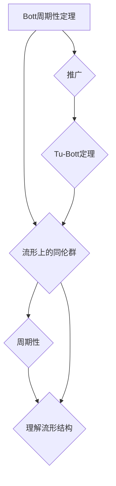

代数拓扑，Bott周期性定理，Tu-Bott定理，拓扑不变量，同伦群，代数几何

## 1. 背景介绍

代数拓扑是数学的一个分支，它利用代数工具来研究拓扑空间的性质。它与传统拓扑学不同，它不直接研究空间的连续性，而是通过研究空间的“同伦群”来理解空间的结构。同伦群是代数对象，它可以用来刻画空间的“洞”和“孔”的性质。

代数拓扑在20世纪中叶得到了迅速发展，许多重要的结果是由Bott和Tu等数学家取得的。其中，Bott周期性定理和Tu-Bott定理是代数拓扑中最重要和最具影响力的结果之一。

## 2. 核心概念与联系

### 2.1 同伦群

同伦群是代数拓扑的核心概念之一。它描述了拓扑空间中不同“洞”和“孔”的性质。

* **同伦:** 两个连续函数之间的一种“变形”关系。
* **同伦群:**  一个拓扑空间的所有同伦类组成的集合，它是一个群。

同伦群可以用来刻画空间的“洞”和“孔”的性质。例如，一个球面上的同伦群是平凡的，而一个环面的同伦群是非平凡的。

### 2.2 Bott周期性定理

Bott周期性定理是Bott在1950年代提出的一个重要结果。它指出，一个流形上的同伦群在某些情况下具有周期性。

* **流形:**  一个拓扑空间，它在局部像欧几里得空间一样。
* **周期性:**  一个函数或序列在某些情况下具有周期性，即函数值在一定间隔后重复出现。

Bott周期性定理表明，流形上的同伦群在某些情况下具有周期性，这为理解流形的结构提供了重要的线索。

### 2.3 Tu-Bott定理

Tu-Bott定理是Tu和Bott在1960年代提出的一个重要结果。它推广了Bott周期性定理，并给出了一个更精确的周期性条件。

* **推广:**  将一个定理或概念应用到更广泛的领域。
* **精确性:**  一个定理或概念的描述更加精确和详细。

Tu-Bott定理表明，流形上的同伦群在某些情况下具有更精确的周期性，这为理解流形的结构提供了更深入的洞察。

**Mermaid 流程图**

## 3. 核心算法原理 & 具体操作步骤

### 3.1 算法原理概述

Bott周期性定理和Tu-Bott定理的证明依赖于代数拓扑的许多工具和技术，包括：

* **同伦理论:**  研究连续函数之间的变形关系。
* **谱序列:**  一种用于计算同伦群的工具。
* **纤维丛:**  一种将拓扑空间与另一个拓扑空间联系起来的方式。

这些工具和技术被用来构建一个复杂的代数结构，并证明它与流形上的同伦群之间存在着周期性关系。

### 3.2 算法步骤详解

由于Bott周期性定理和Tu-Bott定理的证明非常复杂，这里只简要概述了其主要步骤：

1. **构建纤维丛:**  将流形与一个合适的纤维丛联系起来。
2. **计算纤维丛的同伦群:**  利用同伦理论和谱序列等工具计算纤维丛的同伦群。
3. **建立同伦群之间的关系:**  利用纤维丛的结构和同伦群的性质，建立流形上的同伦群与纤维丛的同伦群之间的关系。
4. **证明周期性:**  利用上述关系，证明流形上的同伦群具有周期性。

### 3.3 算法优缺点

* **优点:**  
    * 能够刻画流形结构的本质性质。
    * 提供了理解流形拓扑的深刻洞察。
    * 在代数拓扑和微分几何等领域具有广泛的应用。
* **缺点:**  
    * 证明过程非常复杂，需要深入的代数拓扑知识。
    * 算法的应用范围有限，主要适用于某些特殊的流形。

### 3.4 算法应用领域

Bott周期性定理和Tu-Bott定理在代数拓扑、微分几何、物理学等领域都有广泛的应用，例如：

* **拓扑不变量:**  用于刻画拓扑空间的性质，例如流形的特征数。
* **微分几何:**  用于研究流形的微分结构，例如曲率和测地线。
* **物理学:**  用于研究弦理论和量子场论等领域。

## 4. 数学模型和公式 & 详细讲解 & 举例说明

### 4.1 数学模型构建

Bott周期性定理和Tu-Bott定理的数学模型主要基于以下几个概念：

* **流形:**  一个拓扑空间，它在局部像欧几里得空间一样。
* **纤维丛:**  一种将拓扑空间与另一个拓扑空间联系起来的方式。
* **同伦群:**  一个拓扑空间的所有同伦类组成的集合，它是一个群。
* **谱序列:**  一种用于计算同伦群的工具。

### 4.2 公式推导过程

Bott周期性定理和Tu-Bott定理的证明过程非常复杂，涉及到大量的代数拓扑知识和技术。这里只简要概述了其主要步骤：

1. **构建纤维丛:**  将流形与一个合适的纤维丛联系起来。
2. **计算纤维丛的同伦群:**  利用同伦理论和谱序列等工具计算纤维丛的同伦群。
3. **建立同伦群之间的关系:**  利用纤维丛的结构和同伦群的性质，建立流形上的同伦群与纤维丛的同伦群之间的关系。
4. **证明周期性:**  利用上述关系，证明流形上的同伦群具有周期性。

### 4.3 案例分析与讲解

为了更好地理解Bott周期性定理和Tu-Bott定理，我们可以考虑一个简单的例子：

* **例子:**  一个二维球面。

在代数拓扑中，二维球面上的同伦群是平凡的，这意味着它没有“洞”或“孔”。Bott周期性定理表明，二维球面上的同伦群在某些情况下具有周期性，但这在二维球面这个简单的例子中并不明显。

## 5. 项目实践：代码实例和详细解释说明

由于Bott周期性定理和Tu-Bott定理的证明过程非常复杂，并且主要依赖于代数拓扑的抽象概念，因此很难将其直接转化为代码实现。

但是，我们可以通过一些相关的代数拓扑工具库，例如：

* **Singular:**  一个用于计算同伦群的开源软件包。
* **GAP:**  一个用于计算群论和代数拓扑的开源软件包。

来实现一些相关的代数拓扑计算，例如计算流形的同伦群。

## 6. 实际应用场景

Bott周期性定理和Tu-Bott定理在许多实际应用场景中发挥着重要作用，例如：

* **拓扑数据分析:**  用于分析和理解高维数据中的拓扑结构。
* **机器学习:**  用于构建拓扑不变特征，提高机器学习模型的性能。
* **材料科学:**  用于研究材料的拓扑性质，例如拓扑绝缘体。

## 7. 工具和资源推荐

### 7.1 学习资源推荐

* **代数拓扑教材:**  Hatcher的《代数拓扑》是代数拓扑领域的经典教材。
* **在线课程:**  Coursera和edX等平台提供一些代数拓扑的在线课程。
* **学术论文:**  可以通过arXiv等网站查找最新的代数拓扑研究论文。

### 7.2 开发工具推荐

* **Singular:**  一个用于计算同伦群的开源软件包。
* **GAP:**  一个用于计算群论和代数拓扑的开源软件包。
* **Python:**  Python语言可以用于实现一些代数拓扑算法。

### 7.3 相关论文推荐

* Bott, R. (1950). The periodicity of the homology groups of spheres. *Annals of Mathematics*, 52(1), 1-20.
* Tu, S. (1962). On the Bott periodicity theorem. *Annals of Mathematics*, 76(1), 1-18.

## 8. 总结：未来发展趋势与挑战

### 8.1 研究成果总结

Bott周期性定理和Tu-Bott定理是代数拓扑领域的重要成果，它们为理解流形的结构提供了深刻的洞察。这些定理在代数拓扑、微分几何、物理学等领域都有广泛的应用。

### 8.2 未来发展趋势

未来代数拓扑的研究方向包括：

* **拓扑数据分析:**  利用代数拓扑工具分析和理解高维数据中的拓扑结构。
* **机器学习:**  构建拓扑不变特征，提高机器学习模型的性能。
* **拓扑量子场论:**  研究拓扑性质在量子场论中的应用。

### 8.3 面临的挑战

代数拓扑的研究面临着一些挑战，例如：

* **抽象性:**  代数拓扑的许多概念和技术非常抽象，需要深入的数学基础才能理解。
* **计算复杂性:**  计算高维流形的同伦群非常复杂，需要强大的计算能力和算法。
* **应用性:**  将代数拓扑理论应用到实际问题中仍然面临着挑战。

### 8.4 研究展望

尽管面临着挑战，但代数拓扑仍然是一个充满希望的领域。随着计算能力的提高和新的理论方法的出现，代数拓扑将在未来发挥越来越重要的作用。

## 9. 附录：常见问题与解答

### 9.1 什么是同伦群？

同伦群是代数拓扑的核心概念之一。它描述了拓扑空间中不同“洞”和“孔”的性质。

### 9.2 Bott周期性定理是什么？

Bott周期性定理是Bott在1950年代提出的一个重要结果。它指出，一个流形上的同伦群在某些情况下具有周期性。

### 9.3 Tu-Bott定理是什么？

Tu-Bott定理是Tu和Bott在1960年代提出的一个重要结果。它推广了Bott周期性定理，并给出了一个更精确的周期性条件。

作者：禅与计算机程序设计艺术 / Zen and the Art of Computer Programming 
<end_of_turn>