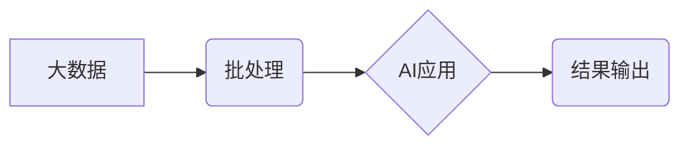

> AI, 大数据, 批处理, 计算原理, 代码实例, 算法, 数学模型, 项目实践, 应用场景

## 1. 背景介绍

在当今数据爆炸的时代，海量数据的处理和分析已成为各行各业的核心竞争力。人工智能 (AI) 技术的快速发展，为大数据分析提供了强大的工具和方法。其中，批处理作为一种高效处理大规模数据的计算模式，在 AI 应用中扮演着至关重要的角色。

批处理是指将大量数据一次性处理，并将其结果存储到数据库或文件系统中。与流式处理相比，批处理更适合处理静态数据，并能够利用分布式计算框架进行并行处理，从而提高处理效率。

## 2. 核心概念与联系

**2.1  核心概念**

* **大数据:** 指规模庞大、结构复杂、速度快、多样化的数据。
* **人工智能 (AI):**  模拟人类智能的计算机系统，包括机器学习、深度学习等技术。
* **批处理:**  一次性处理大量数据的计算模式，通常用于离线数据分析和处理。
* **分布式计算:** 将计算任务分解成多个子任务，并分别在不同的计算节点上执行，从而提高处理效率。

**2.2  核心概念联系**

大数据和 AI 技术的结合，催生了对高效处理大规模数据的需求。批处理作为一种高效的计算模式，为 AI 应用提供了强大的支持。

**2.3  架构图**



## 3. 核心算法原理 & 具体操作步骤

**3.1  算法原理概述**

批处理算法通常基于以下核心原理：

* **数据分片:** 将大规模数据划分为多个小块，方便并行处理。
* **并行计算:** 将数据分片分别分配给不同的计算节点，并行执行计算任务。
* **数据聚合:** 将各个计算节点处理的结果进行汇总和聚合，得到最终结果。

**3.2  算法步骤详解**

1. **数据预处理:** 对原始数据进行清洗、转换和格式化，使其适合批处理算法的处理。
2. **数据分片:** 将预处理后的数据划分为多个小块，每个小块称为数据分片。
3. **数据分配:** 将数据分片分配给不同的计算节点，每个节点负责处理一个或多个数据分片。
4. **并行计算:** 各个计算节点分别对分配到的数据分片进行计算，并生成中间结果。
5. **数据聚合:** 将各个计算节点的中间结果进行汇总和聚合，得到最终结果。
6. **结果输出:** 将最终结果存储到数据库或文件系统中。

**3.3  算法优缺点**

**优点:**

* **高效率:** 利用并行计算，可以大幅提高处理效率。
* **易于实现:** 许多开源框架和工具可以简化批处理算法的实现。
* **可扩展性强:** 可以根据需要增加计算节点，扩展处理能力。

**缺点:**

* **延迟:** 批处理需要等待所有数据分片处理完成后，才能得到最终结果，存在一定的延迟。
* **数据一致性:** 需要保证数据分片在处理过程中的一致性，避免数据冲突。

**3.4  算法应用领域**

* **机器学习模型训练:** 批处理可以用于训练大型机器学习模型，处理海量训练数据。
* **数据分析和挖掘:** 批处理可以用于对大规模数据进行分析和挖掘，发现隐藏的模式和趋势。
* **报表生成和数据可视化:** 批处理可以用于生成报表和数据可视化图表，帮助用户理解数据。

## 4. 数学模型和公式 & 详细讲解 & 举例说明

**4.1  数学模型构建**

假设我们有 N 个数据点，每个数据点包含 m 个特征。我们可以用一个 m 维向量来表示每个数据点，记为 x_i，其中 i = 1, 2, ..., N。

**4.2  公式推导过程**

批处理算法通常基于以下数学公式：

* **数据分片:** 将数据点划分为 k 个数据分片，每个数据分片包含 N/k 个数据点。
* **并行计算:** 每个计算节点负责处理一个数据分片，并对该数据分片进行计算。
* **数据聚合:** 将各个计算节点的计算结果进行汇总和聚合，得到最终结果。

**4.3  案例分析与讲解**

例如，我们使用批处理算法训练一个线性回归模型。

* **数据分片:** 将训练数据划分为 10 个数据分片。
* **并行计算:** 每个计算节点负责处理一个数据分片，并计算该数据分片的模型参数。
* **数据聚合:** 将各个计算节点计算出的模型参数进行平均，得到最终的模型参数。

## 5. 项目实践：代码实例和详细解释说明

**5.1  开发环境搭建**

* 操作系统: Ubuntu 20.04
* 编程语言: Python 3.8
* 框架: Apache Spark 3.2.1

**5.2  源代码详细实现**

```python
from pyspark.sql import SparkSession

# 创建 SparkSession
spark = SparkSession.builder.appName("BatchProcessing").getOrCreate()

# 读取数据
data = spark.read.csv("data.csv", header=True, inferSchema=True)

# 数据处理
processed_data = data.select("feature1", "feature2", "target")

# 模型训练
# ...

# 结果输出
processed_data.write.csv("output.csv", header=True)

# 关闭 SparkSession
spark.stop()
```

**5.3  代码解读与分析**

* `SparkSession`: Spark 的入口点，用于创建 Spark 上下文。
* `read.csv()`: 从 CSV 文件读取数据。
* `select()`: 选择需要处理的列。
* `write.csv()`: 将处理后的数据写入 CSV 文件。

**5.4  运行结果展示**

运行代码后，将生成一个名为 "output.csv" 的文件，其中包含处理后的数据。

## 6. 实际应用场景

**6.1  电商推荐系统**

批处理可以用于处理用户行为数据，训练推荐模型，并生成个性化推荐结果。

**6.2  金融风险控制**

批处理可以用于分析交易数据，识别异常交易，并进行风险控制。

**6.3  医疗诊断辅助**

批处理可以用于分析患者数据，辅助医生进行诊断。

**6.4  未来应用展望**

随着大数据和 AI 技术的不断发展，批处理将在更多领域得到应用，例如：

* **智能制造:** 批处理可以用于分析生产数据，优化生产流程。
* **智慧城市:** 批处理可以用于分析城市数据，提高城市管理效率。
* **个性化教育:** 批处理可以用于分析学生数据，提供个性化学习方案。

## 7. 工具和资源推荐

**7.1  学习资源推荐**

* Apache Spark 官方文档: https://spark.apache.org/docs/latest/
* 大数据与人工智能课程: https://www.coursera.org/

**7.2  开发工具推荐**

* Apache Spark: https://spark.apache.org/
* Hadoop: https://hadoop.apache.org/

**7.3  相关论文推荐**

* Apache Spark: https://spark.apache.org/docs/latest/
* MapReduce: https://en.wikipedia.org/wiki/MapReduce

## 8. 总结：未来发展趋势与挑战

**8.1  研究成果总结**

批处理算法在处理大规模数据方面取得了显著的成果，为 AI 应用提供了强大的支持。

**8.2  未来发展趋势**

* **更高效的算法:** 研究更高效的批处理算法，例如基于图计算的批处理算法。
* **更灵活的架构:** 设计更灵活的批处理架构，能够适应不同的数据类型和应用场景。
* **更智能的自动化:** 开发更智能的自动化工具，简化批处理任务的配置和管理。

**8.3  面临的挑战**

* **数据规模增长:** 数据规模的不断增长，对批处理算法的效率提出了更高的要求。
* **数据多样性:** 数据类型和结构的多样性，对批处理算法的通用性和适应性提出了更高的要求。
* **数据安全和隐私:** 处理海量数据，需要考虑数据安全和隐私保护问题。

**8.4  研究展望**

未来，批处理算法将继续朝着更高效、更灵活、更智能的方向发展，并将在更多领域发挥重要作用。


## 9. 附录：常见问题与解答

**9.1  问题:** 批处理和流式处理哪个更适合处理实时数据？

**9.2  答案:** 流式处理更适合处理实时数据，而批处理更适合处理离线数据。

**9.3  问题:** 如何选择合适的批处理框架？

**9.4  答案:** 选择合适的批处理框架需要考虑数据规模、数据类型、应用场景等因素。

**9.5  问题:** 如何保证批处理任务的可靠性？

**9.6  答案:** 可以使用分布式存储和容错机制来保证批处理任务的可靠性。


作者：禅与计算机程序设计艺术 / Zen and the Art of Computer Programming 
<end_of_turn>