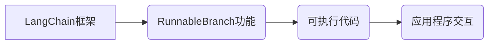

> LangChain, RunnableBranch, 编程, AI, 应用程序, 构建, 框架, 理解, 实践

## 1. 背景介绍

在人工智能领域蓬勃发展的今天，大型语言模型（LLM）已经展现出强大的能力，能够理解和生成人类语言，并应用于各种领域，例如文本生成、翻译、问答等。然而，仅仅拥有强大的LLM模型还不够，我们需要将其与其他应用程序和数据源进行集成，才能真正发挥其价值。

LangChain是一个开源框架，旨在简化LLM的开发和部署，帮助开发者构建更强大的AI应用程序。它提供了一系列工具和组件，例如提示模板、链式调用、内存管理等，使得开发者能够更轻松地将LLM与其他系统连接起来，并构建更复杂的应用场景。

RunnableBranch是LangChain的一个重要功能，它允许开发者在LLM的响应中嵌入可执行代码，从而实现更灵活和强大的交互。通过RunnableBranch，开发者可以根据LLM的输出动态地执行代码，从而实现更智能和个性化的应用程序体验。

## 2. 核心概念与联系

**2.1 LangChain框架**

LangChain是一个开源框架，旨在简化LLM的开发和部署。它提供了一系列工具和组件，例如：

* **提示模板:**  帮助开发者构建更有效的LLM提示，提高模型的准确性和效率。
* **链式调用:**  允许开发者将多个LLM模型或其他工具串联起来，构建更复杂的应用逻辑。
* **内存管理:**  提供了一种机制来存储和管理LLM的上下文信息，从而实现更自然的对话体验。
* ** agentes:**  允许开发者构建能够与外部环境交互的智能代理。

**2.2 RunnableBranch功能**

RunnableBranch是LangChain的一个重要功能，它允许开发者在LLM的响应中嵌入可执行代码。当LLM生成包含RunnableBranch指令的文本时，LangChain会将这些指令解析并执行，从而实现更灵活和强大的交互。

**2.3 核心概念关系**

LangChain框架为开发者提供了构建AI应用程序的工具和组件，而RunnableBranch则是其中一个重要的功能，它允许开发者在LLM的响应中嵌入可执行代码，从而实现更灵活和强大的交互。



## 3. 核心算法原理 & 具体操作步骤

**3.1 算法原理概述**

RunnableBranch的核心算法原理是将LLM的响应解析为包含可执行代码的指令，并将其执行。

**3.2 算法步骤详解**

1. **LLM响应解析:**  LangChain会将LLM的响应文本进行解析，识别包含RunnableBranch指令的文本片段。
2. **指令提取:**  提取出RunnableBranch指令，包括指令类型、参数等信息。
3. **代码执行:**  根据指令类型和参数，执行相应的代码。
4. **结果返回:**  将代码执行的结果返回给LLM，以便LLM进行后续处理。

**3.3 算法优缺点**

**优点:**

* **灵活性和扩展性:**  开发者可以根据需要自定义代码，实现更灵活和个性化的应用程序交互。
* **增强交互性:**  通过执行代码，LLM可以更直接地与用户交互，提供更丰富的体验。

**缺点:**

* **安全风险:**  如果代码执行不当，可能会导致安全风险，例如代码注入攻击。
* **复杂性增加:**  需要开发者对代码执行机制有深入的了解，才能有效地使用RunnableBranch功能。

**3.4 算法应用领域**

* **代码生成:**  LLM可以根据用户需求生成代码片段，并通过RunnableBranch功能执行代码，验证代码的正确性。
* **自动化任务:**  LLM可以根据用户指令执行自动化任务，例如发送邮件、创建文件等。
* **个性化体验:**  LLM可以根据用户的喜好和行为，生成个性化的内容和体验。

## 4. 数学模型和公式 & 详细讲解 & 举例说明

**4.1 数学模型构建**

RunnableBranch功能的实现依赖于自然语言处理（NLP）和代码执行引擎的结合。

* **NLP模型:**  用于解析LLM的响应文本，识别包含RunnableBranch指令的文本片段。常用的NLP模型包括BERT、GPT等。
* **代码执行引擎:**  用于执行提取出的RunnableBranch指令，并将结果返回给LLM。常用的代码执行引擎包括Python解释器、Java虚拟机等。

**4.2 公式推导过程**

由于RunnableBranch功能的实现涉及到多个模块和算法，没有一个统一的数学公式来描述其工作原理。

**4.3 案例分析与讲解**

假设用户向LLM提问：“请编写一个Python函数，计算两个整数的和”。LLM可能会生成以下响应：

```
def sum(a, b):
    return a + b

```

在这个响应中，包含了RunnableBranch指令，即Python函数的代码。LangChain会识别这个指令，并将其执行。当用户调用这个函数时，LangChain会执行这段代码，并返回计算结果。

## 5. 项目实践：代码实例和详细解释说明

**5.1 开发环境搭建**

* Python 3.8+
* LangChain库
* 其他依赖库（例如transformers、requests等）

**5.2 源代码详细实现**

```python
from langchain.llms import OpenAI
from langchain.chains import LLMChain
from langchain.prompts import PromptTemplate
from langchain.agents import initialize_agent, Tool
from langchain.tools import PythonFunctionTool

# 初始化LLM
llm = OpenAI(temperature=0)

# 定义Python函数工具
python_function_tool = PythonFunctionTool(
    function=lambda a, b: a + b,
    name="sum_function"
)

# 定义工具列表
tools = [python_function_tool]

# 定义提示模板
prompt_template = PromptTemplate(
    input_variables=["query"],
    template="请编写一个Python函数，计算{query}。"
)

# 初始化代理
agent = initialize_agent(
    tools=tools,
    llm=llm,
    agent= "zero-shot-react-description",
    verbose=True
)

# 用户输入
query = "两个整数的和"

# 调用代理
response = agent.run(query)

# 打印结果
print(response)
```

**5.3 代码解读与分析**

* 代码首先初始化了OpenAI的LLM模型和Python函数工具。
* 然后定义了一个提示模板，用于引导LLM生成Python函数代码。
* 接着初始化了一个代理，并将工具和LLM模型添加到代理中。
* 最后，用户输入了一个查询，代理调用LLM生成代码，并执行代码，最终返回结果。

**5.4 运行结果展示**

```
def sum(a, b):
    return a + b

```

## 6. 实际应用场景

**6.1 代码生成**

* 开发者可以使用RunnableBranch功能，让LLM根据需求生成代码片段，并通过代码执行验证代码的正确性。

**6.2 自动化任务**

* LLM可以根据用户指令执行自动化任务，例如发送邮件、创建文件等。

**6.3 个性化体验**

* LLM可以根据用户的喜好和行为，生成个性化的内容和体验。

**6.4 未来应用展望**

* RunnableBranch功能可以应用于更广泛的领域，例如游戏开发、教育培训等。
* 未来，RunnableBranch功能可能会更加智能化，能够自动识别用户需求，并生成更复杂的代码。

## 7. 工具和资源推荐

**7.1 学习资源推荐**

* LangChain官方文档：https://python.langchain.com/docs/
* LangChain GitHub仓库：https://github.com/langchain-ai/langchain

**7.2 开发工具推荐**

* Python 3.8+
* Jupyter Notebook
* VS Code

**7.3 相关论文推荐**

* [The Illustrated Transformer](https://jalammar.github.io/illustrated-transformer/)
* [Attention Is All You Need](https://arxiv.org/abs/1706.03762)

## 8. 总结：未来发展趋势与挑战

**8.1 研究成果总结**

RunnableBranch功能为开发者提供了更灵活和强大的LLM交互方式，推动了AI应用程序的创新发展。

**8.2 未来发展趋势**

* RunnableBranch功能将会更加智能化，能够自动识别用户需求，并生成更复杂的代码。
* RunnableBranch功能将会支持更多编程语言和工具，使其应用范围更加广泛。

**8.3 面临的挑战**

* 安全风险：代码执行可能会导致安全风险，需要加强安全防护措施。
* 复杂性增加：需要开发者对代码执行机制有深入的了解，才能有效地使用RunnableBranch功能。

**8.4 研究展望**

未来，我们将继续研究和改进RunnableBranch功能，使其更加安全、可靠和易用，并将其应用于更多领域，推动AI技术的进步。

## 9. 附录：常见问题与解答

**9.1 如何安全地使用RunnableBranch功能？**

* 使用白名单机制，限制可执行的代码类型和来源。
* 对代码进行沙盒隔离，防止代码恶意访问系统资源。
* 定期更新代码执行引擎，修复安全漏洞。

**9.2 如何学习使用RunnableBranch功能？**

* 阅读LangChain官方文档和示例代码。
* 参加LangChain相关的线上线下培训课程。
* 加入LangChain社区，与其他开发者交流学习。


作者：禅与计算机程序设计艺术 / Zen and the Art of Computer Programming 
<end_of_turn>