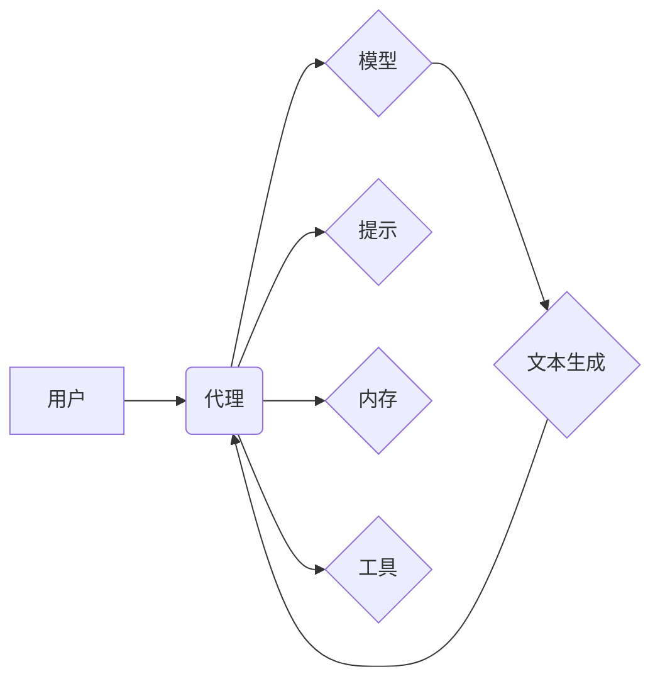

> LangChain, 大语言模型, 应用开发, 编程框架, 工具推荐, 学习资源, 开发工具

## 1. 背景介绍

近年来，大语言模型（LLM）的快速发展掀起了人工智能领域的热潮。这些强大的模型能够理解和生成人类语言，为各种应用场景提供了无限可能。然而，直接与LLM交互往往需要复杂的代码编写和数据处理，这对于普通开发者来说是一个门槛。为了降低开发门槛，并促进LLM技术的广泛应用，LangChain应运而生。

LangChain是一个开源的框架，旨在简化与LLM的交互，并提供构建复杂应用的工具和组件。它提供了一套通用的接口和模块，可以轻松地连接不同的LLM、数据源和工具，从而构建更强大的应用程序。

## 2. 核心概念与联系

LangChain的核心概念包括：

* **代理 (Agent):**  代理是LangChain的核心概念，它是一个能够执行任务的智能实体。代理可以与LLM和其他工具交互，并根据任务目标做出决策。
* **模型 (Model):**  模型是指用于处理文本的LLM，例如OpenAI的GPT-3、Google的PaLM等。LangChain支持多种模型，并提供灵活的接口进行调用。
* **提示 (Prompt):**  提示是用户向LLM发送的指令或问题，它决定了LLM的输出结果。LangChain提供了一系列工具来构建和管理提示，并优化其效果。
* **内存 (Memory):**  内存用于存储代理在执行任务过程中获取的信息，并将其用于后续决策。LangChain支持多种类型的内存，例如文本内存、向量内存等。
* **工具 (Tool):**  工具是指可以执行特定任务的外部程序或服务，例如搜索引擎、数据库、计算器等。LangChain允许代理调用工具，以扩展其功能。

**LangChain 架构图**



## 3. 核心算法原理 & 具体操作步骤

### 3.1  算法原理概述

LangChain的核心算法原理是基于**代理驱动的任务执行**。代理通过接收用户指令，并利用模型、提示、内存和工具，完成预定的任务。

### 3.2  算法步骤详解

1. **接收用户指令:** 代理首先接收用户的指令，并将其转换为可理解的格式。
2. **构建提示:** 根据用户指令，代理构建相应的提示，并将其发送给模型。
3. **模型处理:** 模型根据提示进行处理，并生成相应的文本输出。
4. **内存更新:** 代理将模型的输出结果存储到内存中，以便后续决策使用。
5. **工具调用:** 如果需要，代理可以调用工具来获取更多信息或执行特定操作。
6. **决策与执行:** 代理根据内存中的信息和工具的返回结果，做出决策并执行相应的操作，最终完成用户指令。

### 3.3  算法优缺点

**优点:**

* **灵活性和可扩展性:**  LangChain提供了一套通用的接口和模块，可以轻松地连接不同的LLM、数据源和工具，从而构建更强大的应用程序。
* **易于使用:**  LangChain提供了简洁易用的API，即使是初学者也能快速上手。
* **开源和社区支持:**  LangChain是一个开源项目，拥有活跃的社区支持，可以获得丰富的学习资源和技术帮助。

**缺点:**

* **依赖于LLM:**  LangChain的性能和功能依赖于所使用的LLM模型，如果模型能力不足，则会影响最终效果。
* **安全性和隐私性:**  使用LLM可能会带来安全性和隐私性问题，需要谨慎处理用户数据和敏感信息。

### 3.4  算法应用领域

LangChain的应用领域非常广泛，包括：

* **聊天机器人:**  构建更智能、更自然的聊天机器人，能够理解用户意图并提供更精准的回复。
* **文本生成:**  自动生成各种类型的文本内容，例如文章、故事、诗歌等。
* **代码生成:**  根据用户需求自动生成代码，提高开发效率。
* **数据分析:**  利用LLM的文本理解能力，对文本数据进行分析和挖掘。
* **教育和培训:**  提供个性化的学习体验，帮助用户更好地理解和掌握知识。

## 4. 数学模型和公式 & 详细讲解 & 举例说明

LangChain的核心算法并不依赖于复杂的数学模型，而是基于概率统计和机器学习的原理。

### 4.1  数学模型构建

LangChain主要使用神经网络模型，例如Transformer模型，来处理文本数据。这些模型通过大量的训练数据学习语言的规律和模式，并能够生成符合语法和语义的文本。

### 4.2  公式推导过程

神经网络模型的训练过程涉及到大量的数学公式，例如梯度下降算法、激活函数等。这些公式用于优化模型的参数，使其能够更好地预测文本序列。

### 4.3  案例分析与讲解

例如，在文本生成任务中，LangChain会使用Transformer模型来预测下一个词。模型会根据之前生成的词序列和训练数据中的统计信息，计算出每个词出现的概率，并选择概率最高的词作为下一个词。

## 5. 项目实践：代码实例和详细解释说明

### 5.1  开发环境搭建

为了使用LangChain，需要安装Python和必要的库。可以使用pip命令安装LangChain和相关的依赖库：

```bash
pip install langchain
```

### 5.2  源代码详细实现

以下是一个简单的LangChain代码示例，演示如何使用LLM生成文本：

```python
from langchain.llms import OpenAI
from langchain.prompts import PromptTemplate

# 初始化OpenAI模型
llm = OpenAI(temperature=0.7)

# 定义提示模板
template = """
你是一个专业的作家，请写一篇关于{topic}的文章。
"""

# 创建提示对象
prompt = PromptTemplate(template=template, input_variables=["topic"])

# 设置主题
topic = "人工智能"

# 生成文本
response = llm(prompt.format(topic=topic))

# 打印结果
print(response)
```

### 5.3  代码解读与分析

这段代码首先初始化了OpenAI模型，并定义了一个提示模板，用于生成关于特定主题的文章。然后，代码设置了主题为"人工智能"，并使用提示模板生成文本。最后，代码打印了生成的文本。

### 5.4  运行结果展示

运行这段代码后，会输出一篇关于人工智能的文章。

## 6. 实际应用场景

LangChain在实际应用场景中展现出强大的潜力，例如：

### 6.1  聊天机器人

LangChain可以用于构建更智能、更自然的聊天机器人，例如客服机器人、陪伴机器人等。

### 6.2  文本摘要

LangChain可以利用LLM的文本理解能力，自动生成文本摘要，帮助用户快速获取关键信息。

### 6.3  代码生成

LangChain可以根据用户需求自动生成代码，提高开发效率。

### 6.4  未来应用展望

随着LLM技术的不断发展，LangChain的应用场景将会更加广泛，例如：

* **个性化教育:**  根据用户的学习进度和需求，提供个性化的学习内容和辅导。
* **创意写作:**  帮助用户突破思维瓶颈，激发创意，生成更丰富的文本内容。
* **科学研究:**  利用LLM的文本分析能力，加速科学研究的进展。

## 7. 工具和资源推荐

### 7.1  学习资源推荐

* **LangChain官方文档:** https://python.langchain.com/docs/
* **LangChain GitHub仓库:** https://github.com/langchain-org/langchain
* **HuggingFace Transformers库:** https://huggingface.co/docs/transformers/index

### 7.2  开发工具推荐

* **Python:** https://www.python.org/
* **Jupyter Notebook:** https://jupyter.org/

### 7.3  相关论文推荐

* **Attention Is All You Need:** https://arxiv.org/abs/1706.03762
* **BERT: Pre-training of Deep Bidirectional Transformers for Language Understanding:** https://arxiv.org/abs/1810.04805

## 8. 总结：未来发展趋势与挑战

LangChain作为一种开源的LLM应用框架，在促进LLM技术的普及和应用方面发挥着重要作用。未来，LangChain的发展趋势包括：

* **更强大的模型支持:**  LangChain将支持更多类型的LLM模型，包括开源模型和定制模型。
* **更丰富的功能模块:**  LangChain将提供更多功能模块，例如对话管理、知识图谱、多模态理解等。
* **更完善的生态系统:**  LangChain的社区将不断壮大，并提供更多学习资源、开发工具和应用案例。

然而，LangChain也面临着一些挑战，例如：

* **模型性能和效率:**  LLM模型的计算成本较高，需要不断优化模型架构和训练方法，提高模型性能和效率。
* **数据安全和隐私:**  使用LLM需要处理大量用户数据，需要加强数据安全和隐私保护措施。
* **伦理和社会影响:**  LLM技术的应用可能带来一些伦理和社会问题，需要进行深入研究和探讨。

## 9. 附录：常见问题与解答

### 9.1  常见问题

* **如何选择合适的LLM模型？**

选择合适的LLM模型取决于具体的应用场景和需求。例如，对于文本生成任务，可以选择GPT-3等生成型模型；对于文本分类任务，可以选择BERT等分类型模型。

* **如何优化LLM的性能？**

可以尝试调整模型参数、优化训练数据、使用更强大的硬件设备等方法来优化LLM的性能。

* **如何解决LLM生成的文本质量问题？**

可以尝试使用更精细的提示、进行文本后处理、结合其他技术手段等方法来提高LLM生成的文本质量。

### 9.2  解答

以上只是一些常见问题和解答，对于更具体的疑问，可以参考LangChain官方文档或社区论坛。

作者：禅与计算机程序设计艺术 / Zen and the Art of Computer Programming


<end_of_turn>