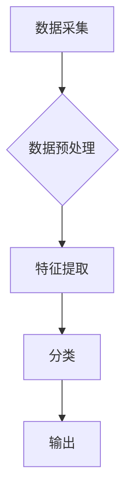

> 深度学习，手势识别，卷积神经网络，循环神经网络，计算机视觉，人机交互

## 1. 背景介绍

随着人工智能技术的飞速发展，人机交互方式也日益多样化。传统的键盘、鼠标等输入方式逐渐被更直观、更自然的交互方式所取代。手势识别作为一种新兴的人机交互技术，凭借其便捷、高效、直观的优势，在智能家居、虚拟现实、游戏、医疗等领域展现出广阔的应用前景。

手势识别技术的核心是识别用户的手部动作并将其转换为计算机可理解的指令。传统的基于特征的手势识别方法依赖于人工提取特征，识别精度受限于特征选择和提取的复杂性。而深度学习技术的出现为手势识别带来了新的突破。深度学习算法能够自动学习手势特征，提高识别精度和鲁棒性。

## 2. 核心概念与联系

手势识别系统通常由以下几个模块组成：

* **数据采集模块:** 用于采集手势图像或视频数据。常见的采集设备包括摄像头、深度传感器等。
* **数据预处理模块:** 对采集到的数据进行预处理，例如图像增强、尺寸调整、数据归一化等，以提高模型的训练效率和识别精度。
* **特征提取模块:** 用于提取手势图像或视频中的关键特征。深度学习模型能够自动学习特征，无需人工设计特征。
* **分类模块:** 用于将提取的特征映射到相应的动作类别。常见的分类算法包括支持向量机、决策树、神经网络等。
* **输出模块:** 将分类结果转换为计算机可理解的指令，例如控制设备、执行操作等。

**Mermaid 流程图:**



## 3. 核心算法原理 & 具体操作步骤

### 3.1  算法原理概述

深度学习在手势识别中的应用主要基于卷积神经网络（CNN）和循环神经网络（RNN）。

* **卷积神经网络 (CNN):** CNN擅长于提取图像特征，能够自动学习图像中的边缘、纹理、形状等特征。在手势识别中，CNN可以用于提取手势图像中的关键特征，例如手指的形状、位置、方向等。

* **循环神经网络 (RNN):** RNN擅长于处理序列数据，能够捕捉时间序列中的依赖关系。在手势识别中，RNN可以用于分析手势动作的动态变化，例如手指的运动轨迹、速度、加速度等。

### 3.2  算法步骤详解

1. **数据收集和预处理:** 收集大量手势图像或视频数据，并进行预处理，例如图像增强、尺寸调整、数据归一化等。
2. **模型构建:** 根据具体的应用场景，选择合适的CNN和RNN模型架构。
3. **模型训练:** 使用训练数据训练模型，调整模型参数，使模型能够准确识别手势动作。
4. **模型评估:** 使用测试数据评估模型的识别精度、召回率、F1-score等指标。
5. **模型部署:** 将训练好的模型部署到实际应用场景中，用于识别用户的手势动作。

### 3.3  算法优缺点

**优点:**

* **高识别精度:** 深度学习算法能够自动学习手势特征，提高识别精度。
* **鲁棒性强:** 深度学习模型对光照、角度、姿态等变化具有较强的鲁棒性。
* **可扩展性强:** 深度学习模型可以很容易地扩展到新的手势动作。

**缺点:**

* **训练数据量大:** 深度学习模型需要大量的训练数据才能达到较高的识别精度。
* **计算资源消耗大:** 深度学习模型的训练和推理需要大量的计算资源。
* **模型解释性差:** 深度学习模型的内部工作机制比较复杂，难以解释模型的决策过程。

### 3.4  算法应用领域

深度学习在手势识别领域的应用非常广泛，例如：

* **智能家居:** 控制灯光、空调、电视等家电设备。
* **虚拟现实:** 控制虚拟角色的动作和交互。
* **游戏:** 控制游戏角色的动作和操作。
* **医疗:** 手术辅助、康复训练等。
* **教育:** 手势识别辅助教学。

## 4. 数学模型和公式 & 详细讲解 & 举例说明

### 4.1  数学模型构建

深度学习模型的构建主要基于神经网络的结构和参数。

* **神经网络结构:** 神经网络由多个层组成，每层包含多个神经元。神经元之间通过权重连接，传递信息。常见的深度学习模型结构包括卷积神经网络（CNN）、循环神经网络（RNN）、长短期记忆网络（LSTM）等。

* **参数:** 神经网络的参数包括权重和偏置。参数的学习是深度学习模型训练的核心过程。

### 4.2  公式推导过程

深度学习模型的训练过程基于梯度下降算法。梯度下降算法的目标是找到使损失函数最小的参数值。

* **损失函数:** 损失函数用于衡量模型预测结果与真实结果之间的差异。常见的损失函数包括均方误差（MSE）、交叉熵损失（Cross-Entropy Loss）等。

* **梯度:** 梯度表示损失函数对参数的偏导数，指示参数调整的方向。

* **更新规则:** 参数更新规则用于根据梯度更新参数值。常见的更新规则包括随机梯度下降（SGD）、动量法（Momentum）、Adam等。

### 4.3  案例分析与讲解

以手势识别为例，假设我们使用CNN模型进行手势识别。

* **输入数据:** 手势图像

* **输出结果:** 手势类别

* **损失函数:** 交叉熵损失

* **梯度下降算法:** Adam

通过训练数据，模型会学习到手势图像与类别之间的映射关系。

## 5. 项目实践：代码实例和详细解释说明

### 5.1  开发环境搭建

* **操作系统:** Ubuntu 18.04

* **编程语言:** Python 3.6

* **深度学习框架:** TensorFlow 2.0

* **其他依赖库:** OpenCV, NumPy, Matplotlib等

### 5.2  源代码详细实现

```python
import tensorflow as tf
from tensorflow.keras.models import Sequential
from tensorflow.keras.layers import Conv2D, MaxPooling2D, Flatten, Dense

# 定义CNN模型
model = Sequential()
model.add(Conv2D(32, (3, 3), activation='relu', input_shape=(64, 64, 3)))
model.add(MaxPooling2D((2, 2)))
model.add(Conv2D(64, (3, 3), activation='relu'))
model.add(MaxPooling2D((2, 2)))
model.add(Flatten())
model.add(Dense(10, activation='softmax'))

# 编译模型
model.compile(optimizer='adam',
              loss='sparse_categorical_crossentropy',
              metrics=['accuracy'])

# 训练模型
model.fit(x_train, y_train, epochs=10, batch_size=32)

# 评估模型
loss, accuracy = model.evaluate(x_test, y_test)
print('Test Loss:', loss)
print('Test Accuracy:', accuracy)
```

### 5.3  代码解读与分析

* **模型定义:** 代码定义了一个简单的CNN模型，包含两个卷积层、两个最大池化层、一个全连接层和一个输出层。

* **模型编译:** 使用Adam优化器、交叉熵损失函数和准确率作为评估指标编译模型。

* **模型训练:** 使用训练数据训练模型，设置训练轮数和批处理大小。

* **模型评估:** 使用测试数据评估模型的性能，打印测试损失和准确率。

### 5.4  运行结果展示

训练完成后，可以将模型应用于新的手势图像，预测手势类别。

## 6. 实际应用场景

### 6.1  智能家居

手势识别技术可以用于控制智能家居设备，例如灯光、空调、电视等。用户可以通过手势操作，实现更便捷、更直观的设备控制。

### 6.2  虚拟现实

在虚拟现实场景中，手势识别技术可以用于控制虚拟角色的动作和交互。用户可以通过手势操作虚拟物体，体验更沉浸式的虚拟现实体验。

### 6.3  游戏

手势识别技术可以用于游戏控制，例如控制游戏角色的动作和操作。用户可以通过手势操作游戏角色，体验更直观、更自然的操控方式。

### 6.4  未来应用展望

随着深度学习技术的不断发展，手势识别技术将有更广泛的应用场景。例如：

* **医疗领域:** 手势识别可以辅助医生进行手术操作、康复训练等。
* **教育领域:** 手势识别可以辅助教学，例如手势识别辅助课堂互动、手势识别辅助学习。
* **艺术领域:** 手势识别可以用于创作艺术作品，例如手势识别辅助绘画、手势识别辅助音乐创作。

## 7. 工具和资源推荐

### 7.1  学习资源推荐

* **书籍:**
    * 深度学习
    * 人工智能：一种现代方法
* **在线课程:**
    * Coursera: 深度学习
    * Udacity: 深度学习工程师
* **博客:**
    * TensorFlow Blog
    * PyTorch Blog

### 7.2  开发工具推荐

* **深度学习框架:** TensorFlow, PyTorch, Keras
* **图像处理库:** OpenCV
* **数据可视化库:** Matplotlib, Seaborn

### 7.3  相关论文推荐

* **手势识别论文:**
    * Real-Time Hand Gesture Recognition Using Deep Learning
    * A Survey on Hand Gesture Recognition Techniques

## 8. 总结：未来发展趋势与挑战

### 8.1  研究成果总结

深度学习技术在手势识别领域取得了显著的成果，提高了识别精度和鲁棒性。

### 8.2  未来发展趋势

* **更准确、更鲁棒的模型:** 研究更深、更复杂的深度学习模型，提高识别精度和鲁棒性。
* **更少数据训练:** 研究更有效的训练方法，例如迁移学习、自监督学习，减少对训练数据的依赖。
* **更灵活、更自然的人机交互:** 研究更灵活、更自然的交互方式，例如多手势识别、手势语义理解等。

### 8.3  面临的挑战

* **数据标注成本高:** 手势识别数据标注成本较高，需要大量人工标注。
* **模型解释性差:** 深度学习模型的内部工作机制比较复杂，难以解释模型的决策过程。
* **实时性要求高:** 一些应用场景对实时性要求较高，需要开发更快速的识别算法。

### 8.4  研究展望

未来，手势识别技术将继续发展，在更多领域得到应用。研究人员将继续探索更准确、更鲁棒、更灵活的人机交互方式，为人类生活带来更多便利。

## 9. 附录：常见问题与解答

* **Q1: 深度学习模型训练需要多少数据？**

* **A1:** 深度学习模型训练的数据量取决于模型复杂度和任务难度。一般来说，需要至少几千到几万条数据才能训练出一个相对准确的模型。

* **Q2: 如何评估手势识别模型的性能？**

* **A2:** 手势识别模型的性能通常用识别精度、召回率、F1-score等指标来评估。

* **Q3: 如何解决手势识别模型的鲁棒性问题？**

* **A3:** 可以通过数据增强、模型正则化等方法提高模型的鲁棒性。


作者：禅与计算机程序设计艺术 / Zen and the Art of Computer Programming 
<end_of_turn>