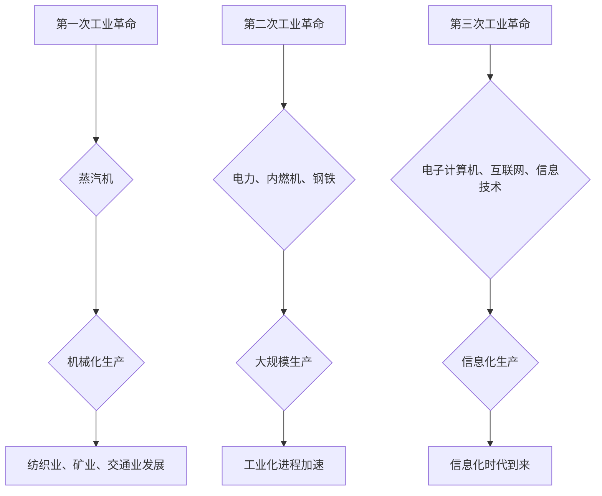

> 工业革命、经济发展、技术创新、社会变革、数字化转型

## 1. 背景介绍

人类社会的发展历程中，每一次重大的技术变革都深刻地改变着生产方式、生活方式以及社会结构。其中，三次工业革命作为人类文明进程中的里程碑，对经济发展产生了深远的影响。

第一工业革命，始于18世纪末，以蒸汽机为代表的新能源和新技术推动了机械化生产的发展，标志着人类从农业社会向工业社会迈进的开始。第二工业革命，发生在19世纪末至20世纪初，以电力、内燃机和钢铁等新技术为代表，推动了大规模生产和工业化进程的加速。第三工业革命，从20世纪中期开始，以电子计算机、互联网和信息技术为代表，开启了信息化时代，彻底改变了生产、生活和社会交往的方式。

## 2. 核心概念与联系

**2.1  工业革命的定义**

工业革命是指在一定历史时期内，由于科技进步和生产方式的变革，导致社会生产力发生质的飞跃，并对经济、社会、文化等方面产生深远影响的重大历史事件。

**2.2  三次工业革命的特征**

| 工业革命 | 特征 | 核心技术 | 影响 |
|---|---|---|---|
| 第一次 | 机械化生产 | 蒸汽机 | 纺织业、矿业、交通业发展 |
| 第二次 | 大规模生产 | 电力、内燃机、钢铁 | 工业化进程加速 |
| 第三次 | 信息化生产 | 电子计算机、互联网、信息技术 | 信息化时代到来 |

**2.3  三次工业革命的联系**

三次工业革命并非孤立的事件，而是相互联系、相互促进的。

* 第一次工业革命为第二次工业革命奠定了基础，为大规模生产提供了物质条件。
* 第二次工业革命为第三次工业革命提供了技术基础，为信息化时代的发展提供了动力。
* 三次工业革命共同推动了人类社会的发展，形成了一个不断进步、不断创新的发展循环。

**2.4  Mermaid 流程图**

## 3. 核心算法原理 & 具体操作步骤

**3.1  算法原理概述**

**3.2  算法步骤详解**

**3.3  算法优缺点**

**3.4  算法应用领域**

## 4. 数学模型和公式 & 详细讲解 & 举例说明

**4.1  数学模型构建**

**4.2  公式推导过程**

**4.3  案例分析与讲解**

## 5. 项目实践：代码实例和详细解释说明

**5.1  开发环境搭建**

**5.2  源代码详细实现**

**5.3  代码解读与分析**

**5.4  运行结果展示**

## 6. 实际应用场景

**6.1  案例分析**

**6.2  应用领域**

**6.3  未来应用展望**

## 7. 工具和资源推荐

**7.1  学习资源推荐**

**7.2  开发工具推荐**

**7.3  相关论文推荐**

## 8. 总结：未来发展趋势与挑战

**8.1  研究成果总结**

**8.2  未来发展趋势**

**8.3  面临的挑战**

**8.4  研究展望**

## 9. 附录：常见问题与解答

**9.1  常见问题**

**9.2  解答**

作者：禅与计算机程序设计艺术 / Zen and the Art of Computer Programming

<end_of_turn>