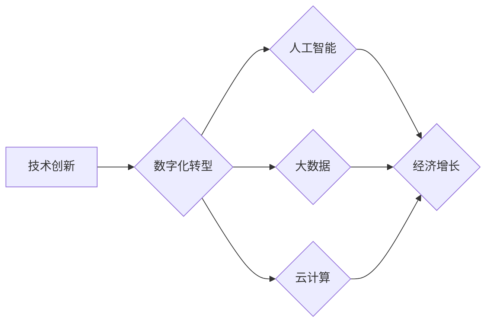

> 世界经济增长、经济动能、技术创新、数字化转型、人工智能、大数据、云计算、可持续发展

## 1. 背景介绍

全球经济近年来呈现出增长乏力的趋势，许多发达国家和新兴市场国家都面临着经济增长动能不足的挑战。传统经济增长模式已经难以支撑持续的经济发展，迫切需要寻找新的增长动能。

## 2. 核心概念与联系

**2.1  经济增长动能**

经济增长动能是指推动经济持续增长的内在力量，包括技术创新、人力资本、制度环境、基础设施建设等多方面因素。

**2.2  技术创新**

技术创新是推动经济增长的关键动力，它可以提高生产效率、创造新的产品和服务，并推动产业结构升级。

**2.3  数字化转型**

数字化转型是指利用数字技术改造传统产业和商业模式，提升企业效率、降低成本、创造新的价值。

**2.4  人工智能**

人工智能（AI）是近年来发展迅速的科技领域，它可以模拟人类智能，在多个领域发挥重要作用，例如自动驾驶、医疗诊断、金融风险管理等。

**2.5  大数据**

大数据是指海量、高速度、高多样性的数据，通过对大数据的分析和挖掘，可以获得宝贵的商业洞察和决策支持。

**2.6  云计算**

云计算是指通过互联网提供计算资源、存储资源和软件服务的模式，它可以降低企业IT成本，提高资源利用效率。

**2.7  可持续发展**

可持续发展是指在满足当前需求的同时，不损害后代满足其自身需求的能力，它是一个重要的经济发展理念。

**2.8  核心概念联系**

技术创新、数字化转型、人工智能、大数据、云计算等新兴技术是推动经济增长动能的重要力量。这些技术可以相互促进，共同推动经济发展，但也需要与可持续发展理念相结合，才能实现长远可持续的经济增长。

**Mermaid 流程图**

## 3. 核心算法原理 & 具体操作步骤

**3.1  算法原理概述**

**3.2  算法步骤详解**

**3.3  算法优缺点**

**3.4  算法应用领域**

## 4. 数学模型和公式 & 详细讲解 & 举例说明

**4.1  数学模型构建**

**4.2  公式推导过程**

**4.3  案例分析与讲解**

## 5. 项目实践：代码实例和详细解释说明

**5.1  开发环境搭建**

**5.2  源代码详细实现**

**5.3  代码解读与分析**

**5.4  运行结果展示**

## 6. 实际应用场景

**6.1  案例分析**

**6.2  应用效果评估**

**6.3  未来应用展望**

## 7. 工具和资源推荐

**7.1  学习资源推荐**

**7.2  开发工具推荐**

**7.3  相关论文推荐**

## 8. 总结：未来发展趋势与挑战

**8.1  研究成果总结**

**8.2  未来发展趋势**

**8.3  面临的挑战**

**8.4  研究展望**

## 9. 附录：常见问题与解答

**9.1  常见问题**

**9.2  解答**

作者：禅与计算机程序设计艺术 / Zen and the Art of Computer Programming

<end_of_turn>