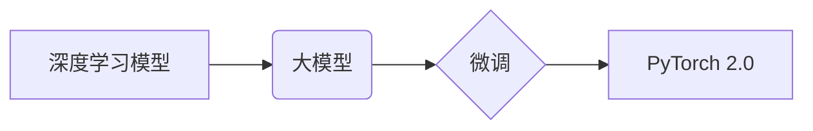

> PyTorch 2.0, 大模型开发, 微调, 深度学习, 自然语言处理, 计算机视觉, 模型训练, 模型评估

## 1. 背景介绍

近年来，深度学习技术取得了令人瞩目的成就，在自然语言处理、计算机视觉、语音识别等领域取得了突破性的进展。这些成就离不开大规模模型的训练和微调。大模型是指拥有数亿甚至数十亿参数的深度学习模型，其强大的表达能力和泛化能力使其能够处理复杂的任务。

PyTorch 是一个开源的深度学习框架，以其灵活性和易用性而闻名。PyTorch 2.0 带来了一系列新功能和改进，包括对大模型训练和微调的支持，使得开发和部署大模型更加便捷高效。

本篇文章将以 PyTorch 2.0 为基础，带领读者从零开始学习大模型开发和微调的知识，并通过一个简单的“Hello PyTorch”示例，演示如何使用 PyTorch 2.0 构建和训练一个简单的深度学习模型。

## 2. 核心概念与联系

### 2.1 深度学习模型

深度学习模型是一种基于多层神经网络的机器学习模型。它通过学习数据中的特征表示，并将其映射到目标输出，从而实现对复杂数据的理解和预测。

### 2.2 大模型

大模型是指拥有数亿甚至数十亿参数的深度学习模型。其强大的表达能力和泛化能力使其能够处理复杂的任务，例如自然语言理解、图像识别、语音合成等。

### 2.3 微调

微调是指在预训练模型的基础上，对模型进行进一步的训练，使其能够适应特定任务的需求。微调可以有效地提高模型的性能，并减少训练时间和数据量。

### 2.4 PyTorch 2.0

PyTorch 2.0 是一个开源的深度学习框架，提供了一系列功能和工具，用于开发和部署深度学习模型。PyTorch 2.0 对大模型训练和微调提供了更好的支持，包括分布式训练、模型压缩和加速等。

**核心概念与联系流程图:**



## 3. 核心算法原理 & 具体操作步骤

### 3.1 算法原理概述

深度学习模型的训练基于反向传播算法。反向传播算法通过计算模型输出与真实值的误差，并根据误差反向传播，更新模型参数，从而使模型的预测结果越来越接近真实值。

### 3.2 算法步骤详解

1. **前向传播:** 将输入数据输入到模型中，并计算模型输出。
2. **损失函数计算:** 计算模型输出与真实值的误差，即损失函数值。
3. **反向传播:** 计算损失函数对模型参数的梯度。
4. **参数更新:** 使用梯度下降算法更新模型参数，从而减小损失函数值。
5. **重复步骤1-4:** 迭代训练模型，直到损失函数值达到预设阈值。

### 3.3 算法优缺点

**优点:**

* 能够学习复杂的数据模式。
* 性能优异，在许多任务中取得了突破性进展。

**缺点:**

* 训练时间长，需要大量的计算资源。
* 对训练数据质量要求高，容易过拟合。

### 3.4 算法应用领域

深度学习算法广泛应用于以下领域:

* 自然语言处理: 文本分类、机器翻译、问答系统等。
* 计算机视觉: 图像识别、目标检测、图像分割等。
* 语音识别: 语音转文本、语音合成等。
* 其他领域: 医疗诊断、金融预测、推荐系统等。

## 4. 数学模型和公式 & 详细讲解 & 举例说明

### 4.1 数学模型构建

深度学习模型通常由多层神经网络组成，每层神经网络包含多个神经元。每个神经元接收来自上一层的输入，并通过激活函数进行处理，输出到下一层。

**神经网络模型:**

```
y = f(W * x + b)
```

其中:

* y: 模型输出
* x: 输入数据
* W: 权重矩阵
* b: 偏置向量
* f: 激活函数

### 4.2 公式推导过程

反向传播算法的核心是计算损失函数对模型参数的梯度。梯度表示参数变化对损失函数的影响方向和大小。

**梯度计算公式:**

```
dW = ∂L/∂W
db = ∂L/∂b
```

其中:

* ∂L/∂W: 损失函数对权重矩阵的偏导数
* ∂L/∂b: 损失函数对偏置向量的偏导数

### 4.3 案例分析与讲解

假设我们有一个简单的线性回归模型，目标是预测房价。输入特征包括房屋面积和房间数量，输出是房价。

**模型公式:**

```
y = W1 * x1 + W2 * x2 + b
```

其中:

* y: 房价
* x1: 房屋面积
* x2: 房间数量
* W1, W2: 权重
* b: 偏置

我们可以使用反向传播算法训练这个模型，并通过梯度下降算法更新模型参数，使其能够准确预测房价。

## 5. 项目实践：代码实例和详细解释说明

### 5.1 开发环境搭建

1. 安装 Python 3.7 或更高版本。
2. 安装 PyTorch 2.0。

```bash
pip install torch torchvision torchaudio
```

### 5.2 源代码详细实现

```python
import torch
import torch.nn as nn

# 定义一个简单的线性回归模型
class LinearRegression(nn.Module):
    def __init__(self, input_size, output_size):
        super(LinearRegression, self).__init__()
        self.linear = nn.Linear(input_size, output_size)

    def forward(self, x):
        return self.linear(x)

# 创建模型实例
model = LinearRegression(input_size=2, output_size=1)

# 定义损失函数和优化器
criterion = nn.MSELoss()
optimizer = torch.optim.SGD(model.parameters(), lr=0.01)

# 训练数据
inputs = torch.randn(100, 2)
targets = torch.randn(100, 1)

# 训练模型
for epoch in range(100):
    # 前向传播
    outputs = model(inputs)
    loss = criterion(outputs, targets)

    # 反向传播
    optimizer.zero_grad()
    loss.backward()

    # 参数更新
    optimizer.step()

    # 打印损失值
    print(f'Epoch [{epoch+1}/{100}], Loss: {loss.item():.4f}')

# 保存模型
torch.save(model.state_dict(), 'linear_regression_model.pth')
```

### 5.3 代码解读与分析

* **模型定义:** 我们定义了一个简单的线性回归模型，包含一个线性层。
* **损失函数和优化器:** 我们使用均方误差损失函数和随机梯度下降优化器。
* **训练数据:** 我们使用随机生成的输入和目标数据进行训练。
* **训练循环:** 我们使用一个循环进行训练，每次迭代计算损失值，并根据梯度更新模型参数。
* **模型保存:** 我们将训练好的模型保存为文件，以便后续使用。

### 5.4 运行结果展示

训练完成后，我们可以使用保存的模型预测新的数据。

```python
# 加载模型
model.load_state_dict(torch.load('linear_regression_model.pth'))

# 预测新的数据
new_inputs = torch.randn(1, 2)
predictions = model(new_inputs)
print(f'Predictions: {predictions.item():.4f}')
```

## 6. 实际应用场景

### 6.1 自然语言处理

* **文本分类:** 使用深度学习模型对文本进行分类，例如情感分析、主题分类等。
* **机器翻译:** 使用深度学习模型将文本从一种语言翻译成另一种语言。
* **问答系统:** 使用深度学习模型回答用户的问题，例如基于知识库的问答系统。

### 6.2 计算机视觉

* **图像识别:** 使用深度学习模型识别图像中的物体，例如人脸识别、物体检测等。
* **图像分割:** 使用深度学习模型将图像分割成不同的区域，例如医学图像分割。
* **图像生成:** 使用深度学习模型生成新的图像，例如图像修复、图像风格迁移等。

### 6.3 语音识别

* **语音转文本:** 使用深度学习模型将语音转换为文本，例如语音助手、语音输入等。
* **语音合成:** 使用深度学习模型将文本转换为语音，例如语音播报、语音合成等。

### 6.4 其他领域

* **医疗诊断:** 使用深度学习模型辅助医生诊断疾病，例如癌症检测、疾病预测等。
* **金融预测:** 使用深度学习模型预测股票价格、信用风险等。
* **推荐系统:** 使用深度学习模型推荐用户感兴趣的内容，例如商品推荐、电影推荐等。

### 6.5 未来应用展望

随着深度学习技术的不断发展，大模型将在更多领域得到应用，例如：

* **个性化教育:** 根据学生的学习情况，提供个性化的学习内容和教学方法。
* **智能客服:** 使用深度学习模型构建智能客服系统，自动回答用户问题，提高客户服务效率。
* **自动驾驶:** 使用深度学习模型构建自动驾驶系统，实现无人驾驶汽车。

## 7. 工具和资源推荐

### 7.1 学习资源推荐

* **PyTorch 官方文档:** https://pytorch.org/docs/stable/
* **深度学习入门书籍:**
    * 深度学习
    * 深度学习实践
    * 深度学习与自然语言处理

### 7.2 开发工具推荐

* **Jupyter Notebook:** https://jupyter.org/
* **VS Code:** https://code.visualstudio.com/

### 7.3 相关论文推荐

* **Attention Is All You Need:** https://arxiv.org/abs/1706.03762
* **BERT: Pre-training of Deep Bidirectional Transformers for Language Understanding:** https://arxiv.org/abs/1810.04805

## 8. 总结：未来发展趋势与挑战

### 8.1 研究成果总结

近年来，深度学习技术取得了令人瞩目的成就，大模型的训练和微调技术也取得了长足进步。PyTorch 2.0 为大模型开发和部署提供了更好的支持，使得开发和部署大模型更加便捷高效。

### 8.2 未来发展趋势

* **模型规模的进一步扩大:** 未来，大模型的规模将继续扩大，模型参数数量将达到数千亿甚至万亿级别。
* **模型训练效率的提升:** 研究人员将继续探索新的训练方法和算法，提高模型训练效率。
* **模型泛化能力的增强:** 研究人员将继续探索新的方法，提高模型的泛化能力，使其能够更好地适应不同的任务和数据。
* **模型解释性和可解释性的提升:** 研究人员将继续探索新的方法，提高模型的解释性和可解释性，使其能够更好地被理解和应用。

### 8.3 面临的挑战

* **计算资源需求:** 大模型的训练需要大量的计算资源，这对于资源有限的机构和个人来说是一个挑战。
* **数据获取和标注:** 大模型的训练需要大量的训练数据，而获取和标注高质量的训练数据是一个耗时和费力的过程。
* **模型安全性和可靠性:** 大模型的训练和部署需要考虑安全性和可靠性问题，例如模型的公平性、隐私性等。

### 