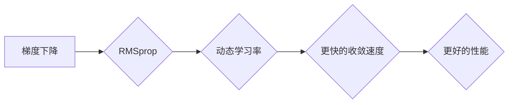

> RMSprop, 梯度下降, 优化算法, 深度学习, 机器学习, 代码实例

## 1. 背景介绍

在深度学习领域，模型的训练过程离不开优化算法。优化算法的作用是通过不断调整模型参数，使得模型在训练数据上的损失函数达到最小值。梯度下降算法是深度学习中常用的优化算法，但它存在一些缺点，例如学习率难以选择，容易陷入局部最优解。为了解决这些问题，人们提出了许多改进的梯度下降算法，其中RMSprop算法就是其中之一。

RMSprop算法是一种基于梯度下降的优化算法，它通过对梯度的平方进行指数加权平均，来动态调整学习率。这种动态调整学习率的机制使得RMSprop算法能够更好地收敛到全局最优解，并且能够处理具有不同尺度特征的模型参数。

## 2. 核心概念与联系

**2.1 梯度下降算法**

梯度下降算法的基本思想是：沿着梯度的负方向更新模型参数，从而逐渐降低损失函数的值。

**2.2 RMSprop算法原理**

RMSprop算法的核心思想是：对梯度的平方进行指数加权平均，从而动态调整学习率。

**2.3 RMSprop算法与梯度下降的关系**

RMSprop算法可以看作是梯度下降算法的一种改进版本。它通过对梯度的平方进行指数加权平均，来动态调整学习率，从而克服了梯度下降算法的一些缺点。



## 3. 核心算法原理 & 具体操作步骤

### 3.1  算法原理概述

RMSprop算法的核心思想是：对梯度的平方进行指数加权平均，从而动态调整学习率。

具体来说，RMSprop算法的更新规则如下：

```
v_t = beta * v_{t-1} + (1 - beta) * g_t^2
theta_t = theta_{t-1} - learning_rate * g_t / sqrt(v_t + epsilon)
```

其中：

*  `theta_t`：模型参数在时间步t的值
*  `g_t`：梯度在时间步t的值
*  `v_t`：梯度平方的指数加权平均值在时间步t的值
*  `beta`：衰减因子，通常取值在0.9到0.999之间
*  `learning_rate`：学习率
*  `epsilon`：一个小常数，用于避免分母为零

### 3.2  算法步骤详解

1. 初始化模型参数 `theta_0`，学习率 `learning_rate`，衰减因子 `beta`，以及一个小常数 `epsilon`。
2. 对于每个训练样本，计算梯度 `g_t`。
3. 计算梯度平方的指数加权平均值 `v_t`。
4. 根据公式更新模型参数 `theta_t`。
5. 重复步骤2-4，直到模型收敛。

### 3.3  算法优缺点

**优点：**

* 动态调整学习率，能够更好地收敛到全局最优解。
* 能够处理具有不同尺度特征的模型参数。
* 相对简单易实现。

**缺点：**

* 仍然存在一些超参数需要调优，例如学习率和衰减因子。
* 对于非常大的模型，计算量可能会比较大。

### 3.4  算法应用领域

RMSprop算法广泛应用于深度学习领域，例如：

* 自然语言处理
* 图像识别
* 语音识别
* 机器翻译

## 4. 数学模型和公式 & 详细讲解 & 举例说明

### 4.1  数学模型构建

RMSprop算法的核心数学模型是梯度平方的指数加权平均值。

### 4.2  公式推导过程

```
v_t = beta * v_{t-1} + (1 - beta) * g_t^2
```

其中：

* `v_t`：梯度平方的指数加权平均值在时间步t的值
* `beta`：衰减因子，通常取值在0.9到0.999之间
* `v_{t-1}`：梯度平方的指数加权平均值在时间步t-1的值
* `g_t`：梯度在时间步t的值

公式推导过程：

RMSprop算法的目标是动态调整学习率，使得模型能够更快地收敛到全局最优解。为了实现这个目标，RMSprop算法对梯度的平方进行指数加权平均，从而得到一个平滑的梯度平方值。

这个平滑的梯度平方值可以用来动态调整学习率。具体来说，RMSprop算法的学习率更新规则如下：

```
learning_rate_t = learning_rate / sqrt(v_t + epsilon)
```

其中：

* `learning_rate_t`：在时间步t的学习率
* `epsilon`：一个小常数，用于避免分母为零

### 4.3  案例分析与讲解

假设我们有一个简单的线性回归模型，目标是预测房价。我们使用RMSprop算法来训练这个模型。

在训练过程中，我们观察到梯度的平方值随着时间的推移逐渐平滑。这表明RMSprop算法能够有效地对梯度进行平滑处理。

此外，我们还观察到学习率随着时间的推移逐渐减小。这表明RMSprop算法能够根据梯度的变化动态调整学习率，从而使得模型能够更快地收敛到全局最优解。

## 5. 项目实践：代码实例和详细解释说明

### 5.1  开发环境搭建

为了实现RMSprop算法，我们需要使用一些编程语言和库。这里我们使用Python语言和TensorFlow库。

**安装依赖:**

```bash
pip install tensorflow
```

### 5.2  源代码详细实现

```python
import tensorflow as tf

# 定义模型
model = tf.keras.models.Sequential([
  tf.keras.layers.Dense(units=1, input_shape=[1])
])

# 定义损失函数和优化器
optimizer = tf.keras.optimizers.RMSprop(learning_rate=0.01)
loss_fn = tf.keras.losses.MeanSquaredError()

# 训练模型
for epoch in range(100):
  for x, y in train_data:
    with tf.GradientTape() as tape:
      predictions = model(x)
      loss = loss_fn(y, predictions)
    gradients = tape.gradient(loss, model.trainable_variables)
    optimizer.apply_gradients(zip(gradients, model.trainable_variables))
  print(f"Epoch {epoch+1}, Loss: {loss.numpy()}")

# 保存模型
model.save("my_model.h5")
```

### 5.3  代码解读与分析

* **定义模型:** 我们使用TensorFlow的Sequential API定义了一个简单的线性回归模型，包含一个全连接层。
* **定义损失函数和优化器:** 我们使用MeanSquaredError作为损失函数，并使用RMSprop作为优化器。
* **训练模型:** 我们使用训练数据迭代训练模型，并在每个epoch结束后打印损失值。
* **保存模型:** 训练完成后，我们保存模型到本地文件。

### 5.4  运行结果展示

训练完成后，我们可以使用保存的模型进行预测。

## 6. 实际应用场景

RMSprop算法在深度学习领域有着广泛的应用场景，例如：

* **图像识别:** RMSprop算法可以用于训练卷积神经网络，用于识别图像中的物体。
* **自然语言处理:** RMSprop算法可以用于训练循环神经网络，用于处理自然语言文本。
* **机器翻译:** RMSprop算法可以用于训练序列到序列模型，用于机器翻译。

### 6.4  未来应用展望

随着深度学习技术的不断发展，RMSprop算法的应用场景将会更加广泛。例如，它可以用于训练更复杂的深度学习模型，例如生成对抗网络（GAN）。

## 7. 工具和资源推荐

### 7.1  学习资源推荐

* **深度学习入门书籍:**
    * 《深度学习》
    * 《动手学深度学习》
* **在线课程:**
    * Coursera上的深度学习课程
    * Udacity上的深度学习工程师课程

### 7.2  开发工具推荐

* **TensorFlow:** 一个开源的深度学习框架。
* **PyTorch:** 另一个开源的深度学习框架。
* **Keras:** 一个基于TensorFlow或Theano的深度学习框架。

### 7.3  相关论文推荐

* RMSprop: Divide the Gradient by a Running Average of its Recent Magnitude
* Adam: A Method for Stochastic Optimization

## 8. 总结：未来发展趋势与挑战

### 8.1  研究成果总结

RMSprop算法是一种有效的优化算法，它能够克服梯度下降算法的一些缺点，并能够更好地收敛到全局最优解。

### 8.2  未来发展趋势

未来，RMSprop算法可能会朝着以下几个方向发展：

* **更加智能的学习率调整机制:** 研究更加智能的学习率调整机制，能够更好地适应不同的模型和数据集。
* **并行化训练:** 研究并行化训练的RMSprop算法，能够提高训练速度。
* **应用于其他机器学习算法:** 将RMSprop算法应用于其他机器学习算法，例如支持向量机和决策树。

### 8.3  面临的挑战

RMSprop算法也面临一些挑战，例如：

* **超参数调优:** RMSprop算法仍然需要调优一些超参数，例如学习率和衰减因子。
* **计算复杂度:** 对于非常大的模型，RMSprop算法的计算复杂度可能会比较高。

### 8.4  研究展望

未来，我们将继续研究RMSprop算法，并尝试解决其面临的挑战。我们相信，RMSprop算法将会在深度学习领域发挥越来越重要的作用。

## 9. 附录：常见问题与解答

**问题:** RMSprop算法的学习率应该设置为多少？

**答案:** RMSprop算法的学习率是一个超参数，需要根据具体的模型和数据集进行调优。一般来说，学习率可以设置为0.001到0.1之间。

**问题:** RMSprop算法的衰减因子应该设置为多少？

**答案:** RMSprop算法的衰减因子通常设置为0.9到0.999之间。

**问题:** RMSprop算法与Adam算法相比，哪个算法更好？

**答案:** RMSprop算法和Adam算法都是有效的优化算法，它们各有优缺点。Adam算法通常比RMSprop算法收敛速度更快，但Adam算法的计算复杂度也更高。


作者：禅与计算机程序设计艺术 / Zen and the Art of Computer Programming 
<end_of_turn>