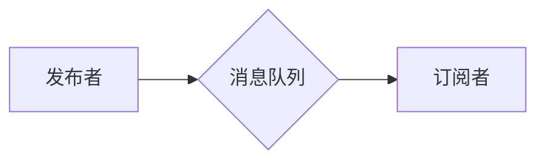

> 发布订阅模式，消息队列，事件驱动，异步通信，消息中间件，RabbitMQ，Kafka

## 1. 背景介绍

在现代软件架构中，系统之间需要进行频繁的通信和数据交换。传统的点对点通信模式在系统规模扩大时，会带来维护成本高、耦合度高、扩展性差等问题。为了解决这些问题，发布订阅模式应运而生。

发布订阅模式是一种基于消息的通信模式，它将消息发送者（发布者）和消息接收者（订阅者）解耦，允许多个订阅者接收同一消息。这种模式具有以下优点：

* **解耦:** 发布者和订阅者之间没有直接的依赖关系，可以独立开发和部署。
* **灵活:** 订阅者可以根据自己的需求订阅特定主题的消息，实现灵活的消息过滤。
* **可扩展:** 系统可以轻松添加新的发布者和订阅者，提高系统的可扩展性。
* **可靠:** 消息队列可以保证消息的可靠传递，即使发布者或订阅者出现故障，消息也不会丢失。

## 2. 核心概念与联系

发布订阅模式的核心概念包括：

* **发布者:** 发送消息的实体。
* **订阅者:** 接收消息的实体。
* **主题:** 消息的分类标签，用于区分不同类型的消息。
* **消息队列:** 用于存储消息的中间件，保证消息的可靠传递。

**Mermaid 流程图:**



## 3. 核心算法原理 & 具体操作步骤

### 3.1  算法原理概述

发布订阅模式的核心算法是消息路由算法。该算法根据消息的主题信息，将消息路由到相应的订阅者。常见的路由算法包括：

* **基于主题的路由:** 根据消息主题匹配订阅者的主题订阅列表。
* **基于规则的路由:** 根据预定义的规则匹配消息，将消息路由到相应的订阅者。

### 3.2  算法步骤详解

1. **发布者发布消息:** 发布者将消息封装成消息对象，并指定消息的主题信息。
2. **消息队列接收消息:** 消息队列接收发布者的消息，并将其存储在队列中。
3. **订阅者订阅主题:** 订阅者向消息队列注册订阅主题，并指定接收消息的回调函数。
4. **消息队列路由消息:** 当有新的消息到达消息队列时，消息队列会根据消息主题信息，将消息路由到相应的订阅者。
5. **订阅者接收消息:** 订阅者收到消息后，会调用注册的回调函数处理消息。

### 3.3  算法优缺点

**优点:**

* **解耦:** 发布者和订阅者之间没有直接的依赖关系，可以独立开发和部署。
* **灵活:** 订阅者可以根据自己的需求订阅特定主题的消息，实现灵活的消息过滤。
* **可扩展:** 系统可以轻松添加新的发布者和订阅者，提高系统的可扩展性。

**缺点:**

* **复杂性:** 消息队列的管理和维护相对复杂。
* **性能:** 消息队列的性能会影响系统的整体性能。

### 3.4  算法应用领域

发布订阅模式广泛应用于以下领域:

* **消息驱动架构:** 用于构建基于消息的分布式系统。
* **事件驱动架构:** 用于处理事件通知和响应。
* **实时数据处理:** 用于处理实时数据流，例如股票行情、传感器数据等。
* **分布式任务调度:** 用于调度和管理分布式任务。

## 4. 数学模型和公式 & 详细讲解 & 举例说明

### 4.1  数学模型构建

发布订阅模式可以抽象为一个图模型，其中：

* 节点代表发布者、订阅者和消息队列。
* 边代表消息的传递关系。

**图模型:**

```
G = (V, E)
```

其中：

* V 是节点集合，包含发布者、订阅者和消息队列。
* E 是边集合，包含消息传递关系。

### 4.2  公式推导过程

消息路由算法可以表示为一个函数：

```
route(message, topic)
```

其中：

* message 是消息对象。
* topic 是消息主题。

该函数根据消息主题和订阅者的订阅列表，将消息路由到相应的订阅者。

### 4.3  案例分析与讲解

假设有三个订阅者订阅主题 "news"，分别是订阅者 A、B 和 C。当发布者发布一条主题为 "news" 的消息时，消息队列会将消息路由到订阅者 A、B 和 C。

## 5. 项目实践：代码实例和详细解释说明

### 5.1  开发环境搭建

本示例使用 Python 语言和 RabbitMQ 消息队列进行开发。

**依赖:**

* Python 3.x
* pika (RabbitMQ Python client)

### 5.2  源代码详细实现

**发布者代码:**

```python
import pika

# 连接 RabbitMQ
connection = pika.BlockingConnection(pika.ConnectionParameters('localhost'))
channel = connection.channel()

# 声明队列
channel.queue_declare(queue='news')

# 发布消息
message = 'Hello, world!'
channel.basic_publish(exchange='', routing_key='news', body=message)

print(" [x] Sent %r" % message)

# 关闭连接
connection.close()
```

**订阅者代码:**

```python
import pika

# 连接 RabbitMQ
connection = pika.BlockingConnection(pika.ConnectionParameters('localhost'))
channel = connection.channel()

# 声明队列
channel.queue_declare(queue='news')

# 接收消息
def callback(ch, method, properties, body):
    print(" [x] Received %r" % body)

# 绑定回调函数
channel.basic_consume(queue='news', on_message_callback=callback, auto_ack=True)

print(' [*] Waiting for messages. To exit press CTRL+C')
channel.start_consuming()
```

### 5.3  代码解读与分析

* 发布者代码：
    * 连接 RabbitMQ 服务器。
    * 声明一个名为 "news" 的队列。
    * 发布一条消息到 "news" 队列。
* 订阅者代码：
    * 连接 RabbitMQ 服务器。
    * 声明一个名为 "news" 的队列。
    * 绑定一个回调函数，用于处理接收到的消息。
    * 启动消息消费，等待接收消息。

### 5.4  运行结果展示

运行上述代码，发布者会将消息发送到 RabbitMQ 服务器，订阅者会接收并打印消息内容。

## 6. 实际应用场景

发布订阅模式在实际应用场景中广泛应用，例如：

* **电商平台:** 商品发布、订单处理、用户行为分析等。
* **社交媒体:** 消息推送、评论通知、好友动态等。
* **金融系统:** 交易记录、风险预警、账户变更等。

### 6.4  未来应用展望

随着云计算、大数据、物联网等技术的快速发展，发布订阅模式在未来将有更广泛的应用场景，例如：

* **实时数据分析:** 处理海量实时数据流，进行实时分析和决策。
* **边缘计算:** 在边缘设备上实现消息发布和订阅，提高数据处理效率。
* **工业互联网:** 连接工业设备，实现设备数据共享和协同控制。

## 7. 工具和资源推荐

### 7.1  学习资源推荐

* **RabbitMQ 官方文档:** https://www.rabbitmq.com/documentation.html
* **Kafka 官方文档:** https://kafka.apache.org/documentation/
* **Spring Cloud Stream:** https://spring.io/projects/spring-cloud-stream

### 7.2  开发工具推荐

* **RabbitMQ:** https://www.rabbitmq.com/
* **Kafka:** https://kafka.apache.org/
* **ActiveMQ:** https://activemq.apache.org/

### 7.3  相关论文推荐

* **Kafka: A Distributed Streaming Platform:** https://static.googleusercontent.com/media/research.google.com/en//pubs/archive/43111.pdf
* **RabbitMQ: A Message Broker for Distributed Systems:** https://www.rabbitmq.com/whitepapers/rabbitmq-architecture.pdf

## 8. 总结：未来发展趋势与挑战

### 8.1  研究成果总结

发布订阅模式是一种成熟的通信模式，在实际应用中得到了广泛的应用。

### 8.2  未来发展趋势

未来，发布订阅模式将朝着以下方向发展：

* **更强大的消息路由能力:** 支持更复杂的路由规则和消息过滤机制。
* **更强的可靠性和安全性:** 提高消息的可靠传递和安全性。
* **更低的延迟和更高的吞吐量:** 满足对实时数据处理的需求。

### 8.3  面临的挑战

发布订阅模式也面临一些挑战，例如：

* **消息队列的管理和维护:** 消息队列的规模和复杂度不断增加，管理和维护难度不断提高。
* **消息的持久性和容错性:** 确保消息的持久性和容错性，避免消息丢失和数据不一致。
* **消息的安全性:** 保护消息的安全性，防止消息被篡改或窃取。

### 8.4  研究展望

未来，研究者将继续探索发布订阅模式的优化和改进，以满足不断增长的应用需求。

## 9. 附录：常见问题与解答

### 9.1  常见问题

* **消息队列的存储机制是什么？**
* **如何保证消息的可靠传递？**
* **如何实现消息的持久化？**
* **如何配置消息路由规则？**

### 9.2  解答

* **消息队列的存储机制:** 消息队列通常使用磁盘或内存来存储消息。
* **如何保证消息的可靠传递:** 消息队列通常使用确认机制来保证消息的可靠传递。
* **如何实现消息的持久化:** 消息队列可以将消息持久化到磁盘，即使服务器重启也不会丢失消息。
* **如何配置消息路由规则:** 消息路由规则可以配置在消息队列的配置文件中，也可以通过编程接口进行配置。


作者：禅与计算机程序设计艺术 / Zen and the Art of Computer Programming 
<end_of_turn>