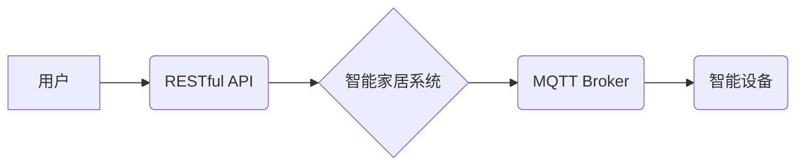

> MQTT, RESTful API, 智能家居, 场景模式, 智能调整, 物联网, 协议, 架构

## 1. 背景介绍

随着物联网技术的快速发展，智能家居已成为现代生活的重要组成部分。智能家居系统能够通过传感器、 actuators 和网络连接，实现对家居环境的智能控制和管理，为用户提供更加舒适、便捷的生活体验。

场景模式是智能家居系统中的一种重要功能，它可以根据用户的需求和习惯，预先设定一系列设备的运行状态，例如“起床模式”、“睡眠模式”等。当用户触发相应的场景模式时，系统会自动执行预设的设备控制动作，简化用户操作，提升生活效率。

然而，传统的场景模式往往缺乏灵活性，难以适应用户的个性化需求和动态变化的环境。例如，当用户在不同时间段或不同地点使用智能家居时，场景模式的执行效果可能并不理想。

为了解决上述问题，本文提出了一种基于MQTT协议和RESTful API的智能家居场景模式智能调整方案。该方案利用MQTT协议的轻量级、低功耗和实时性特点，实现设备之间的实时通信和状态同步。同时，RESTful API提供了灵活的接口，方便用户和应用程序与智能家居系统进行交互，实现场景模式的动态调整和个性化定制。

## 2. 核心概念与联系

### 2.1 MQTT协议

MQTT（Message Queuing Telemetry Transport）是一种轻量级、低功耗的机器对机器（M2M）通信协议，广泛应用于物联网领域。

MQTT协议采用发布/订阅模型，其中设备可以作为发布者或订阅者。发布者发布消息到特定的主题，订阅者订阅特定的主题，接收相关消息。

MQTT协议的特点：

* 轻量级：协议本身非常简洁，占用资源少，适合资源受限的设备。
* 低功耗：MQTT协议采用断线重连机制，可以有效降低设备的功耗。
* 实时性：MQTT协议支持消息的实时传输，可以满足智能家居系统对实时响应的需求。

### 2.2 RESTful API

RESTful API（Representational State Transfer Application Programming Interface）是一种基于互联网协议的软件架构风格，它使用HTTP协议进行资源的访问和操作。

RESTful API的特点：

* 标准化：RESTful API遵循HTTP协议标准，易于理解和使用。
* 可扩展性：RESTful API可以轻松扩展，支持多个资源和操作。
* 灵活性：RESTful API可以使用多种数据格式，例如JSON和XML，方便与不同系统进行交互。

### 2.3 场景模式智能调整架构

基于MQTT协议和RESTful API的智能家居场景模式智能调整方案的架构如图所示：



**架构说明：**

* 用户通过RESTful API与智能家居系统进行交互，例如触发场景模式、修改场景参数等。
* 智能家居系统接收用户请求后，通过MQTT Broker与智能设备进行通信，执行相应的设备控制动作。
* 智能设备通过MQTT Broker发送状态信息回智能家居系统，实现场景模式的实时监控和调整。

## 3. 核心算法原理 & 具体操作步骤

### 3.1  算法原理概述

场景模式智能调整算法的核心思想是根据用户的行为模式和环境变化，动态调整场景模式的执行策略，以实现更加智能化和个性化的家居体验。

该算法主要包括以下步骤：

1. **用户行为分析：** 收集用户的设备使用记录、时间段、地点等信息，分析用户的行为模式。
2. **环境感知：** 利用传感器获取环境信息，例如温度、湿度、光照等，感知环境变化。
3. **场景模式匹配：** 根据用户的行为模式和环境感知信息，匹配相应的场景模式。
4. **场景参数调整：** 动态调整场景模式的参数，例如设备的运行状态、时间段、强度等，以满足用户的个性化需求。
5. **场景执行与反馈：** 执行场景模式，并收集设备运行状态和用户反馈信息，用于后续算法优化。

### 3.2  算法步骤详解

1. **用户行为分析：**

* 收集用户设备使用记录：记录用户在不同时间段、不同地点使用哪些设备，以及设备的运行状态。
* 分析用户行为模式：利用机器学习算法，分析用户的设备使用习惯，识别出用户的行为模式，例如“早上起床使用灯光和咖啡机”、“晚上睡觉关闭所有灯光”。

2. **环境感知：**

* 利用传感器获取环境信息：安装温度、湿度、光照等传感器，实时获取环境信息。
* 环境信息分析：根据环境信息，判断当前环境是否适合执行特定的场景模式，例如“温度过高时开启空调”、“光照不足时开启灯光”。

3. **场景模式匹配：**

* 建立场景模式库：预先定义多种场景模式，例如“起床模式”、“睡眠模式”、“聚会模式”等，并设置相应的设备控制动作和时间段。
* 根据用户行为和环境信息，匹配最合适的场景模式。例如，当用户在早上起床时，系统会匹配“起床模式”，并自动开启灯光、咖啡机等设备。

4. **场景参数调整：**

* 动态调整场景参数：根据用户的个性化需求和环境变化，动态调整场景模式的参数，例如设备的运行状态、时间段、强度等。例如，用户可以自定义“睡眠模式”的灯光亮度和温度，以满足自己的睡眠习惯。

5. **场景执行与反馈：**

* 执行场景模式：根据匹配的场景模式，控制智能设备执行相应的动作。
* 收集用户反馈：收集用户对场景模式执行效果的反馈，例如是否满意、是否需要调整等。
* 算法优化：利用用户反馈信息，不断优化场景模式匹配和参数调整算法，提高场景模式的智能化和个性化程度。

### 3.3  算法优缺点

**优点：**

* 智能化：根据用户行为和环境变化，动态调整场景模式，实现更加智能化的家居体验。
* 个性化：用户可以自定义场景模式的参数，满足个性化需求。
* 灵活性：场景模式可以根据用户的需求进行添加、删除和修改。

**缺点：**

* 数据依赖：算法需要大量用户行为和环境数据进行训练和优化。
* 计算复杂度：场景模式匹配和参数调整算法的计算复杂度较高，需要强大的计算能力。

### 3.4  算法应用领域

场景模式智能调整算法可以应用于各种智能家居场景，例如：

* 智能照明：根据用户的活动和环境光线，自动调节灯光亮度和色彩。
* 智能空调：根据用户的温度偏好和环境温度，自动调节空调温度和风速。
* 智能安防：根据用户的行为模式和环境变化，自动触发安防报警。
* 智能娱乐：根据用户的观看习惯和环境音响，自动调节电视音量和音效。

## 4. 数学模型和公式 & 详细讲解 & 举例说明

### 4.1  数学模型构建

场景模式智能调整算法可以采用基于机器学习的数学模型进行构建。例如，可以使用决策树、支持向量机或神经网络等算法，根据用户的行为模式和环境信息，预测用户对场景模式的偏好程度。

### 4.2  公式推导过程

假设我们使用决策树算法构建场景模式智能调整模型，决策树的构建过程可以概括为以下公式：

```
决策树 = 决策节点集合 ∪ 边集合
```

其中，决策节点代表着用户行为和环境信息的特征，边代表着从一个决策节点到另一个决策节点的决策规则。

决策树的构建过程可以利用训练数据进行迭代优化，例如使用信息增益或基尼系数等指标来评估决策规则的有效性。

### 4.3  案例分析与讲解

例如，我们可以构建一个“起床模式”场景模式智能调整模型，其决策树如下：

```
决策节点1：用户是否在早上起床时间段？
    - 是：决策节点2
    - 否：结束
决策节点2：用户是否在卧室？
    - 是：决策节点3
    - 否：结束
决策节点3：用户是否打开手机？
    - 是：执行“起床模式”，开启灯光、咖啡机等设备
    - 否：结束
```

在这个例子中，决策树根据用户的行为模式和环境信息，判断是否需要执行“起床模式”。

## 5. 项目实践：代码实例和详细解释说明

### 5.1  开发环境搭建

* 操作系统：Ubuntu 20.04 LTS
* 编程语言：Python 3.8
* 开发工具：VS Code
* MQTT Broker：Mosquitto

### 5.2  源代码详细实现

```python
# 导入必要的库
import paho.mqtt.client as mqtt
import requests

# MQTT Broker地址和端口
MQTT_BROKER_ADDRESS = "mqtt.example.com"
MQTT_BROKER_PORT = 1883

# RESTful API地址
RESTFUL_API_ADDRESS = "http://api.example.com"

# MQTT客户端实例
client = mqtt.Client()

# 连接MQTT Broker
client.connect(MQTT_BROKER_ADDRESS, MQTT_BROKER_PORT)

# 订阅场景模式主题
client.subscribe("smart_home/scene_mode")

# 处理MQTT消息
def on_message(client, userdata, message):
    # 获取场景模式信息
    scene_mode_data = message.payload.decode("utf-8")

    # 调用RESTful API更新场景模式
    response = requests.post(RESTFUL_API_ADDRESS + "/scene_mode", json=scene_mode_data)

    # 处理RESTful API响应
    if response.status_code == 200:
        print("场景模式更新成功")
    else:
        print("场景模式更新失败")

# 设置消息处理回调函数
client.on_message = on_message

# 启动MQTT客户端
client.loop_forever()
```

### 5.3  代码解读与分析

* 代码首先导入必要的库，并设置MQTT Broker地址、端口和RESTful API地址。
* 创建MQTT客户端实例，并连接MQTT Broker。
* 订阅场景模式主题，以便接收场景模式更新信息。
* 定义消息处理回调函数`on_message`，用于处理接收到的场景模式信息。
* 在`on_message`函数中，解析场景模式信息，并调用RESTful API更新场景模式。
* 处理RESTful API响应，并打印结果。
* 启动MQTT客户端，开始监听消息。

### 5.4  运行结果展示

当用户通过RESTful API触发场景模式更新时，MQTT Broker会将场景模式信息发布到“smart_home/scene_mode”主题。MQTT客户端会接收该消息，并调用RESTful API更新场景模式。

## 6. 实际应用场景

### 6.1  智能家居场景模式智能调整应用场景

* **个性化家居体验：** 根据用户的行为模式和环境变化，动态调整场景模式，提供更加个性化的家居体验。例如，根据用户的睡眠习惯，自动调节灯光亮度、温度和音响等设备，营造舒适的睡眠环境。
* **提高家居效率：** 自动执行场景模式，简化用户的操作，提高家居效率。例如，当用户离开家时，自动关闭所有灯光和空调，节省能源。
* **增强家居安全：** 根据用户的行为模式和环境变化，自动触发安防报警，增强家居安全。例如，当用户不在家时，自动开启安防系统，并监控家中环境。

### 6.2  智能家居场景模式智能调整的未来应用展望

* **更智能的场景模式：** 利用人工智能技术，开发更智能的场景模式，能够根据用户的意图和需求，自动执行更加复杂的场景控制。
* **更广泛的应用场景：** 场景模式智能调整技术可以应用于更广泛的智能家居场景，例如智能厨房、智能浴室、智能办公室等。
* **更便捷的用户体验：** 通过语音控制、图像识别等技术，实现更便捷的用户体验，让用户能够更轻松地控制智能家居设备。