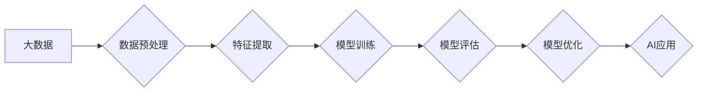

> 大数据，人工智能，机器学习，深度学习，数据驱动，算法优化，模型训练

## 1. 背景介绍

人工智能（AI）近年来发展迅速，已渗透到各个领域，从自动驾驶到医疗诊断，从个性化推荐到金融风险控制，AI技术的应用正在改变着我们的生活。而推动AI发展的重要驱动力之一就是大数据。

大数据是指海量、高速、多样化的数据，其规模、速度和复杂性远远超过传统数据处理能力。大数据蕴含着丰富的知识和价值，为AI算法的训练和优化提供了充足的燃料。

传统的AI算法依赖于人工特征工程，需要专家手动提取数据的关键特征，这不仅耗时费力，而且难以捕捉数据的复杂关系。而大数据驱动AI学习则通过机器学习和深度学习算法，自动从海量数据中学习特征和模式，从而实现更精准、更智能的决策。

## 2. 核心概念与联系

### 2.1 大数据与人工智能的关系

大数据和人工智能是相互促进、相互依存的关系。大数据为AI提供了训练数据和优化算法的依据，而AI则帮助我们更好地理解和挖掘大数据的价值。

**数据驱动AI学习的流程:**



### 2.2 核心概念

* **大数据:** 海量、高速、多样化的数据。
* **人工智能 (AI):** 使计算机能够像人类一样思考、学习和解决问题的能力。
* **机器学习 (ML):** 一种AI技术，通过算法从数据中学习，无需明确编程。
* **深度学习 (DL):** 一种机器学习的子集，使用多层神经网络模拟人类大脑的学习过程。

## 3. 核心算法原理 & 具体操作步骤

### 3.1 算法原理概述

深度学习算法的核心是多层神经网络。神经网络由多个节点（神经元）组成，每个节点连接着其他节点，并通过权重来控制信息传递。

深度学习算法通过训练神经网络，调整每个节点的权重，使网络能够从数据中学习特征和模式。训练过程通常使用反向传播算法，通过不断调整权重，最小化预测误差。

### 3.2 算法步骤详解

1. **数据预处理:** 将原始数据清洗、转换和格式化，使其适合深度学习算法的训练。
2. **特征提取:** 从数据中提取关键特征，例如图像中的边缘、纹理和形状，文本中的关键词和语义。
3. **模型构建:** 设计和构建深度神经网络模型，包括网络结构、激活函数和损失函数。
4. **模型训练:** 使用训练数据训练神经网络模型，通过反向传播算法调整权重，最小化预测误差。
5. **模型评估:** 使用测试数据评估模型的性能，例如准确率、召回率和F1-score。
6. **模型优化:** 根据评估结果，调整模型参数或训练策略，提高模型性能。

### 3.3 算法优缺点

**优点:**

* 能够自动学习特征，无需人工特征工程。
* 能够处理复杂的数据关系，学习更精准的模式。
* 在图像识别、自然语言处理等领域取得了突破性进展。

**缺点:**

* 需要大量的训练数据，数据质量对模型性能影响很大。
* 训练过程耗时费力，需要强大的计算资源。
* 模型解释性较差，难以理解模型的决策过程。

### 3.4 算法应用领域

* **图像识别:** 人脸识别、物体检测、图像分类。
* **自然语言处理:** 文本分类、情感分析、机器翻译。
* **语音识别:** 语音转文本、语音助手。
* **推荐系统:** 产品推荐、内容推荐。
* **医疗诊断:** 病情预测、疾病诊断。

## 4. 数学模型和公式 & 详细讲解 & 举例说明

### 4.1 数学模型构建

深度学习算法的核心是神经网络，其数学模型可以表示为多层感知机（MLP）。

**MLP模型结构:**

```
输入层 -> 隐藏层1 -> 隐藏层2 -> ... -> 隐藏层n -> 输出层
```

每个隐藏层由多个神经元组成，每个神经元接收来自上一层的输入，并通过激活函数进行处理，输出到下一层。

**激活函数:**

激活函数的作用是引入非线性，使神经网络能够学习复杂的数据关系。常见的激活函数包括 sigmoid 函数、ReLU 函数和 tanh 函数。

### 4.2 公式推导过程

**损失函数:**

损失函数用于衡量模型预测结果与真实值的差异。常见的损失函数包括均方误差（MSE）和交叉熵损失（Cross-Entropy Loss）。

**反向传播算法:**

反向传播算法用于更新神经网络的权重，使其能够最小化损失函数。

**权重更新公式:**

```
权重 = 权重 - 学习率 * 梯度
```

其中，学习率是一个控制权重更新幅度的参数，梯度是损失函数对权重的偏导数。

### 4.3 案例分析与讲解

**图像分类案例:**

假设我们有一个图像分类任务，目标是将图像分类为猫、狗或鸟。

1. **数据预处理:** 将图像预处理成固定大小，并转换为数值格式。
2. **模型构建:** 设计一个包含多个隐藏层的卷积神经网络（CNN）模型。
3. **模型训练:** 使用训练数据训练CNN模型，并使用交叉熵损失函数和反向传播算法更新权重。
4. **模型评估:** 使用测试数据评估模型的准确率。

## 5. 项目实践：代码实例和详细解释说明

### 5.1 开发环境搭建

* Python 3.x
* TensorFlow 或 PyTorch 深度学习框架
* Jupyter Notebook 或 VS Code 开发环境

### 5.2 源代码详细实现

```python
import tensorflow as tf

# 定义模型结构
model = tf.keras.models.Sequential([
    tf.keras.layers.Conv2D(32, (3, 3), activation='relu', input_shape=(28, 28, 1)),
    tf.keras.layers.MaxPooling2D((2, 2)),
    tf.keras.layers.Conv2D(64, (3, 3), activation='relu'),
    tf.keras.layers.MaxPooling2D((2, 2)),
    tf.keras.layers.Flatten(),
    tf.keras.layers.Dense(10, activation='softmax')
])

# 编译模型
model.compile(optimizer='adam',
              loss='sparse_categorical_crossentropy',
              metrics=['accuracy'])

# 训练模型
model.fit(x_train, y_train, epochs=10)

# 评估模型
loss, accuracy = model.evaluate(x_test, y_test)
print('Test loss:', loss)
print('Test accuracy:', accuracy)
```

### 5.3 代码解读与分析

* **模型结构:** 代码定义了一个简单的卷积神经网络模型，包含两个卷积层、两个最大池化层、一个全连接层和一个输出层。
* **激活函数:** 使用ReLU函数作为激活函数，可以加速训练速度。
* **损失函数:** 使用交叉熵损失函数，适合多分类任务。
* **优化器:** 使用Adam优化器，可以有效地更新权重。
* **训练过程:** 使用训练数据训练模型，并设置训练轮数（epochs）。
* **评估过程:** 使用测试数据评估模型的性能，并打印测试损失和准确率。

### 5.4 运行结果展示

训练完成后，可以将模型应用于新的图像数据进行分类。

## 6. 实际应用场景

### 6.1 图像识别

* **人脸识别:** 用于身份验证、安全监控和人脸搜索。
* **物体检测:** 用于自动驾驶、机器人视觉和图像分析。
* **医学图像分析:** 用于疾病诊断、肿瘤检测和器官分割。

### 6.2 自然语言处理

* **机器翻译:** 将文本从一种语言翻译成另一种语言。
* **文本摘要:** 自动生成文本的简短摘要。
* **情感分析:** 分析文本中的情感倾向，例如正面、负面或中性。

### 6.3 其他应用场景

* **推荐系统:** 根据用户的历史行为和偏好，推荐相关产品或内容。
* **语音助手:** 理解用户的语音指令并执行相应的操作。
* **金融风险控制:** 检测欺诈交易和评估信用风险。

### 6.4 未来应用展望

随着大数据的不断积累和AI技术的不断发展，大数据驱动AI学习的可能性将更加广泛和深入。

* **个性化医疗:** 基于患者的基因信息、生活习惯和病史，提供个性化的医疗方案。
* **智能制造:** 利用AI技术优化生产流程、提高生产效率和产品质量。
* **智慧城市:** 利用AI技术解决城市交通、环境监测、公共安全等问题。

## 7. 工具和资源推荐

### 7.1 学习资源推荐

* **在线课程:** Coursera、edX、Udacity 等平台提供丰富的AI和机器学习课程。
* **书籍:** 《深度学习》、《机器学习实战》等书籍是学习AI和机器学习的经典教材。
* **开源项目:** TensorFlow、PyTorch 等开源深度学习框架提供了丰富的学习资源和示例代码。

### 7.2 开发工具推荐

* **Jupyter Notebook:** 用于编写和执行Python代码，并可视化数据和模型结果。
* **VS Code:** 一款功能强大的代码编辑器，支持多种编程语言和深度学习框架。
* **Google Colab:** 基于云计算的开发环境，提供免费的GPU资源，方便进行深度学习训练。

### 7.3 相关论文推荐

* **《ImageNet Classification with Deep Convolutional Neural Networks》:** 
* **《Attention Is All You Need》:** 
* **《BERT: Pre-training of Deep Bidirectional Transformers for Language Understanding》:** 

## 8. 总结：未来发展趋势与挑战

### 8.1 研究成果总结

大数据驱动AI学习取得了显著成果，在图像识别、自然语言处理、语音识别等领域取得了突破性进展。

### 8.2 未来发展趋势

* **模型规模和复杂度:** 未来AI模型将更加庞大复杂，拥有更多的参数和层数。
* **数据质量和多样性:** 随着AI模型的不断发展，对数据质量和多样性的要求将越来越高。
* **算法效率和可解释性:** 研究更高效、更可解释的AI算法将成为未来研究的重点。
* **边缘计算和联邦学习:** 将AI模型部署到边缘设备和分布式数据中心，保护数据隐私和提高计算效率。

### 8.3 面临的挑战

* **数据隐私和安全:** 大数据处理涉及大量敏感信息，如何保护数据隐私和安全是一个重要挑战。
* **算法偏见和公平性:** AI算法可能存在偏见，导致不公平的结果，需要研究如何消除算法偏见。
* **模型可解释性和信任度:** AI模型的决策过程往往难以理解，如何提高模型的可解释性和信任度是一个重要问题。

### 8.4 研究展望

未来，大数据驱动AI学习将继续推动人工智能的发展，并应用于更多领域，为人类社会带来更多福祉。


## 9. 附录：常见问题与解答

**Q1: 大数据和AI的关系是什么？**

**A1:** 大数据为AI提供了训练数据和优化算法的依据，而AI则帮助我们更好地理解和挖掘大数据的价值。

**Q2: 深度学习算法有哪些特点？**

**A2:** 深度学习算法能够自动学习特征，处理复杂的数据关系，并在图像识别、自然语言处理等领域取得突破性进展。

**Q3: 如何评估AI模型的性能？**

**A3:** 使用测试数据评估模型的准确率、召回率、F1-score等指标。

**Q4: 如何解决AI算法的偏见问题？**

**A4:** 通过收集更全面、更均衡的数据集