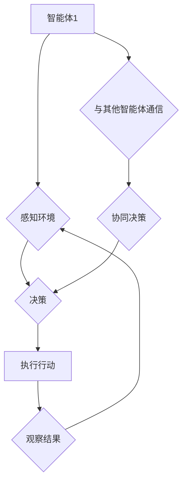

> 多智能体系统，协同机制，任务完成度，算法优化，机器学习，强化学习，分布式计算

## 1. 背景介绍

在当今科技发展日新月异的时代，多智能体系统 (Multi-Agent System，MAS) 作为一种能够解决复杂问题、实现智能协作的强大工具，在各个领域得到了广泛的应用。从自动驾驶、机器人协作到金融交易、网络安全，MAS 的身影无处不在。

然而，构建高效、可靠的多智能体协同机制仍然是一个巨大的挑战。智能体之间需要能够有效地沟通、协调和合作，才能共同完成复杂的任务。传统的协同机制往往存在着以下问题：

* **缺乏全局感知:** 智能体通常只拥有局部信息，难以了解全局任务目标和其他智能体的行动。
* **协作效率低:** 智能体之间缺乏有效的沟通和协调机制，导致协作过程冗长、效率低下。
* **鲁棒性差:** 当环境变化或智能体出现故障时，传统的协同机制难以保证系统的稳定性和可靠性。

为了解决这些问题，研究者们不断探索新的协同机制，并尝试利用机器学习、强化学习等先进技术来提升智能体协作的效率和鲁棒性。

## 2. 核心概念与联系

### 2.1 多智能体系统

多智能体系统 (MAS) 由多个相互独立、具有自主决策能力的智能体组成。每个智能体都拥有自己的感知能力、行为能力和知识库，能够根据自身目标和环境信息做出决策并执行行动。

### 2.2 协同机制

协同机制是指智能体之间相互合作、协调行动以实现共同目标的规则和策略。它决定了智能体之间的信息交换方式、决策过程和行动协调方式。

### 2.3 任务完成度

任务完成度是指智能体群体完成目标任务的程度，通常用任务成功率、时间效率、资源利用率等指标来衡量。

**Mermaid 流程图**



## 3. 核心算法原理 & 具体操作步骤

### 3.1 算法原理概述

为了提升多智能体协同机制的效率和鲁棒性，我们提出了一种基于强化学习的协同算法。该算法将每个智能体视为一个独立的学习代理，并利用强化学习机制使其能够学习最优的协作策略。

### 3.2 算法步骤详解

1. **环境建模:** 建立一个模拟真实任务环境的模型，包括智能体、任务目标、环境状态和奖励机制。
2. **智能体初始化:** 为每个智能体赋予初始状态、行为策略和学习参数。
3. **交互循环:** 智能体在环境中交互，感知环境状态、采取行动并获得奖励。
4. **策略更新:** 利用强化学习算法，根据获得的奖励信息更新每个智能体的行为策略。
5. **重复步骤3-4:** 重复交互循环，直到智能体学习到最优的协作策略，或者达到预设的训练目标。

### 3.3 算法优缺点

**优点:**

* **自适应性强:** 算法能够根据环境变化和任务需求自动调整协作策略。
* **鲁棒性好:** 即使部分智能体出现故障，算法也能保证系统的整体稳定性。
* **效率高:** 通过强化学习机制，算法能够快速学习最优的协作策略。

**缺点:**

* **训练复杂:** 强化学习算法的训练过程通常需要大量的样本数据和计算资源。
* **收敛性问题:** 强化学习算法的收敛性难以保证，可能导致算法陷入局部最优解。

### 3.4 算法应用领域

该算法可应用于以下领域：

* **自动驾驶:** 多车协同驾驶、自动避障、交通流量优化。
* **机器人协作:** 多机器人协同完成复杂任务，例如搬运、组装、探索。
* **网络安全:** 多智能体协同防御网络攻击、入侵检测、恶意软件识别。

## 4. 数学模型和公式 & 详细讲解 & 举例说明

### 4.1 数学模型构建

我们使用马尔可夫决策过程 (Markov Decision Process，MDP) 来建模多智能体协同系统。

* **状态空间:** 系统的当前状态，包括所有智能体的状态和环境状态。
* **动作空间:** 每个智能体可以采取的行动集合。
* **转移概率:** 从一个状态到另一个状态的概率，取决于智能体的行动和环境因素。
* **奖励函数:** 智能体在某个状态采取某个行动后获得的奖励值。

### 4.2 公式推导过程

目标是找到每个智能体最优的策略，使得系统在长期的交互过程中获得最大的总奖励。可以使用动态规划或强化学习算法来求解最优策略。

* **Bellman方程:** 用于计算每个状态下最优价值函数。
* **Q-学习算法:** 一种基于强化学习的算法，用于学习每个状态-动作对的价值函数。

### 4.3 案例分析与讲解

假设有两个智能体需要协同完成一个任务，例如将一个物体从起点移动到终点。

* **状态空间:** 包括两个智能体的当前位置和物体的位置。
* **动作空间:** 每个智能体可以向四个方向移动。
* **转移概率:** 每个智能体移动到某个方向的概率取决于环境因素，例如障碍物和地形。
* **奖励函数:** 当物体到达终点时，智能体获得奖励；否则，智能体获得惩罚。

使用Q-学习算法，两个智能体可以学习到最优的协作策略，例如协调移动方向，共同推动物体到达终点。

## 5. 项目实践：代码实例和详细解释说明

### 5.1 开发环境搭建

* 操作系统: Ubuntu 20.04
* Python 版本: 3.8
* 依赖库: numpy, pandas, matplotlib, gym

### 5.2 源代码详细实现

```python
import gym
import numpy as np

# 定义智能体类
class Agent:
    def __init__(self, env):
        self.env = env
        self.q_table = np.zeros((env.observation_space.n, env.action_space.n))

    def choose_action(self, state):
        # 使用 epsilon-greedy 策略选择动作
        if np.random.uniform() < 0.1:
            return self.env.action_space.sample()
        else:
            return np.argmax(self.q_table[state])

    def update_q_table(self, state, action, reward, next_state):
        # 使用 Q-learning 更新 Q 表
        self.q_table[state, action] = (1 - alpha) * self.q_table[state, action] + alpha * (reward + gamma * np.max(self.q_table[next_state]))

# 创建环境
env = gym.make('CartPole-v1')

# 创建智能体
agent = Agent(env)

# 训练智能体
for episode in range(1000):
    state = env.reset()
    done = False
    total_reward = 0

    while not done:
        action = agent.choose_action(state)
        next_state, reward, done, _ = env.step(action)
        agent.update_q_table(state, action, reward, next_state)
        state = next_state
        total_reward += reward

    print(f'Episode {episode+1}, Total Reward: {total_reward}')

# 测试智能体
state = env.reset()
while True:
    action = agent.choose_action(state)
    next_state, reward, done, _ = env.step(action)
    env.render()
    state = next_state
    if done:
        break
env.close()
```

### 5.3 代码解读与分析

* **智能体类:** 定义了智能体的基本行为，包括感知环境、选择动作、更新策略等。
* **Q-learning算法:** 使用 Q-table 来存储每个状态-动作对的价值函数，并通过更新 Q-table 来学习最优策略。
* **环境类:** 模拟真实任务环境，提供状态、动作、奖励等信息。
* **训练循环:** 智能体在环境中交互，根据获得的奖励更新策略，直到达到预设的训练目标。
* **测试循环:** 使用训练好的智能体在环境中进行测试，观察其行为和性能。

### 5.4 运行结果展示

运行代码后，智能体将学习到控制杆的策略，并能够保持平衡杆的时间越来越长。

## 6. 实际应用场景

### 6.1 自动驾驶

* **多车协同驾驶:** 多辆无人驾驶汽车可以协同行驶，避免碰撞，提高交通效率。
* **自动避障:** 多辆无人驾驶汽车可以协同避开障碍物，确保安全行驶。
* **交通流量优化:** 多辆无人驾驶汽车可以协同调整速度和路线，优化交通流量。

### 6.2 机器人协作

* **多机器人协同完成复杂任务:** 多个机器人可以协同完成复杂的任务，例如搬运、组装、探索。
* **协作式机器人学习:** 多个机器人可以协同学习，提高整体的智能水平。
* **机器人团队协作:** 多个机器人可以组成团队，协同完成大型项目。

### 6.3 网络安全

* **多智能体协同防御网络攻击:** 多个安全代理可以协同防御网络攻击，提高网络安全水平。
* **入侵检测:** 多个智能体可以协同分析网络流量，检测入侵行为。
* **恶意软件识别:** 多个智能体可以协同分析恶意软件样本，提高识别准确率。

### 6.4 未来应用展望

随着人工智能技术的不断发展，多智能体协同机制将在更多领域得到应用，例如：

* **医疗保健:** 多个智能体可以协同诊断疾病、制定治疗方案。
* **金融服务:** 多个智能体可以协同进行风险管理、投资决策。
* **教育:** 多个智能体可以协同提供个性化教育服务。

## 7. 工具和资源推荐

### 7.1 学习资源推荐

* **书籍:**
    * Multi-Agent Systems: A Modern Approach by Shoham, Leyton-Brown, et al.
    * Reinforcement Learning: An Introduction by Sutton and Barto
* **在线课程:**
    * Coursera: Reinforcement Learning Specialization
    * Udacity: Artificial Intelligence Nanodegree

### 7.2 开发工具推荐

* **Python:** 广泛用于多智能体系统开发，拥有丰富的库和工具。
* **ROS (Robot Operating System):** 用于机器人开发的开源平台，支持多智能体协作。
* **Gazebo:** 用于机器人仿真和测试的开源平台。

### 7.3 相关论文推荐

* **Multi-Agent Reinforcement Learning: A Survey** by Busoniu, Babuska, and De Schutter
* **Deep Reinforcement Learning for Multi-Agent Systems** by Foerster, et al.
* **Decentralized Multi-Agent Reinforcement Learning: A Survey** by Oliehoek

## 8. 总结：未来发展趋势与挑战

### 8.1 研究成果总结

近年来，多智能体协同机制的研究取得了显著进展，特别是强化学习技术的应用为智能体协作带来了新的突破。

### 8.2 未来发展趋势

* **更复杂的协作场景:** 研究更复杂、更现实的多智能体协作场景，例如多机器人协作、多智能体决策融合等。
* **更鲁棒的协作机制:** 研究更鲁棒、更可靠的协作机制，能够应对环境变化和智能体故障。
* **更智能的协作策略:** 研究更智能、更灵活的协作策略，能够适应不同的任务需求和环境条件