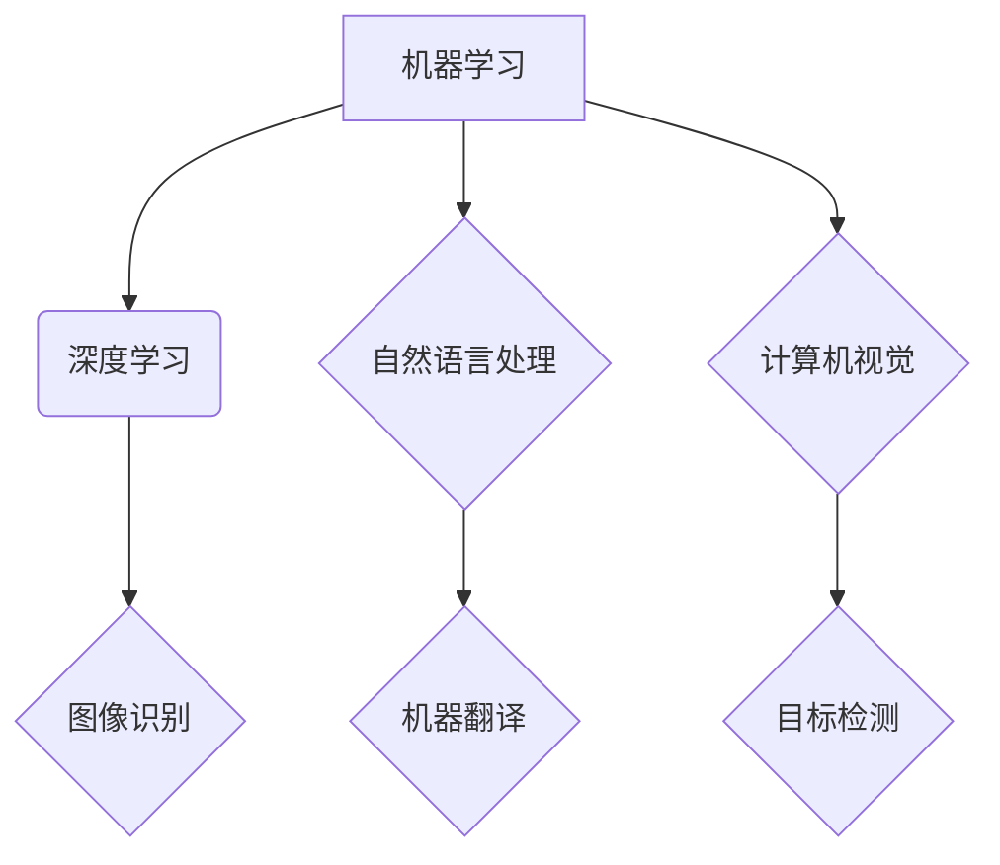

> 人工智能、机器学习、深度学习、大数据、云计算、自动化、经济增长

## 1. 背景介绍

自工业革命以来，人类社会经历了前所未有的变革。蒸汽机、电力、内燃机等技术的革新，推动了生产力的飞跃，带来了经济的爆发式增长和社会结构的深刻变化。如今，我们正站在一个新的历史节点上，人工智能（AI）的兴起，如同工业革命的再次降临，势必将重塑经济格局，引发一场新的经济爆发期。

人工智能技术的快速发展，得益于以下几个关键因素：

* **大数据时代的到来:**  互联网、移动互联网、物联网等技术的蓬勃发展，产生了海量的数据，为人工智能算法的训练提供了充足的燃料。
* **计算能力的飞跃:**  摩尔定律的持续推进，使得计算机的处理能力不断提升，能够支撑更复杂的算法模型。
* **算法创新:**  深度学习等新兴算法的出现，突破了传统机器学习的瓶颈，赋予人工智能更强大的学习和推理能力。

## 2. 核心概念与联系

人工智能的核心概念包括：

* **机器学习:**  让机器从数据中学习，无需明确编程，自动发现模式和规律。
* **深度学习:**  一种更高级的机器学习方法，利用多层神经网络模拟人类大脑的学习机制。
* **自然语言处理:**  使机器能够理解和生成人类语言。
* **计算机视觉:**  使机器能够“看”图像和视频，识别物体、场景和行为。

这些核心概念相互关联，共同构成了人工智能的生态系统。



## 3. 核心算法原理 & 具体操作步骤

### 3.1  算法原理概述

深度学习算法的核心是多层神经网络。神经网络由多个节点（神经元）组成，每个节点连接着其他节点，并通过权重来调节信号的传递强度。通过训练，神经网络可以学习到数据中的模式和规律，从而实现预测、分类、识别等任务。

### 3.2  算法步骤详解

1. **数据预处理:**  将原始数据清洗、转换、规范化，使其适合深度学习算法的训练。
2. **网络结构设计:**  根据任务需求，设计神经网络的层数、节点数量、激活函数等参数。
3. **参数初始化:**  为神经网络中的权重和偏置赋予初始值。
4. **前向传播:**  将输入数据通过神经网络层层传递，最终得到输出结果。
5. **损失函数计算:**  比较输出结果与真实值之间的差异，计算损失值。
6. **反向传播:**  根据损失值，调整神经网络中的权重和偏置，使损失值最小化。
7. **迭代训练:**  重复前向传播和反向传播的过程，直到模型达到预期的性能。

### 3.3  算法优缺点

**优点:**

* **学习能力强:**  能够从海量数据中自动学习复杂模式。
* **泛化能力好:**  能够对未见过的数据进行准确预测。
* **应用范围广:**  可应用于图像识别、自然语言处理、语音识别等多个领域。

**缺点:**

* **训练成本高:**  需要大量的计算资源和训练数据。
* **解释性差:**  深度学习模型的决策过程难以理解。
* **数据依赖性强:**  模型性能受训练数据质量的影响很大。

### 3.4  算法应用领域

深度学习算法已广泛应用于以下领域：

* **图像识别:**  人脸识别、物体检测、图像分类等。
* **自然语言处理:**  机器翻译、文本摘要、情感分析等。
* **语音识别:**  语音助手、语音搜索等。
* **医疗诊断:**  疾病预测、影像分析等。
* **金融风险控制:**  欺诈检测、信用评估等。

## 4. 数学模型和公式 & 详细讲解 & 举例说明

### 4.1  数学模型构建

深度学习模型通常采用多层感知机（MLP）或卷积神经网络（CNN）等结构。

**多层感知机（MLP）:**

MLP由多个全连接层组成，每个层的神经元都与上一层的每个神经元连接。

**卷积神经网络（CNN）:**

CNN利用卷积层和池化层来提取图像特征。卷积层通过卷积核对图像进行卷积运算，提取图像局部特征。池化层对卷积层的输出进行降维，提高模型的鲁棒性。

### 4.2  公式推导过程

深度学习模型的训练过程基于梯度下降算法。

**损失函数:**  衡量模型预测结果与真实值的差异。常用的损失函数包括均方误差（MSE）、交叉熵损失等。

**梯度:**  衡量损失函数对模型参数的导数。

**更新规则:**  根据梯度信息，更新模型参数，使损失函数最小化。

### 4.3  案例分析与讲解

以图像分类为例，假设我们训练一个CNN模型，用于识别猫和狗的图片。

1. **数据准备:**  收集大量猫和狗的图片，并进行标记。
2. **模型训练:**  将图片数据输入CNN模型，并使用交叉熵损失函数和梯度下降算法进行训练。
3. **模型评估:**  使用测试集评估模型的性能，例如准确率、召回率等。
4. **模型部署:**  将训练好的模型部署到实际应用场景中，例如手机APP、网站等。

## 5. 项目实践：代码实例和详细解释说明

### 5.1  开发环境搭建

* **操作系统:**  Linux、macOS、Windows
* **编程语言:**  Python
* **深度学习框架:**  TensorFlow、PyTorch
* **其他工具:**  Git、Jupyter Notebook

### 5.2  源代码详细实现

```python
import tensorflow as tf

# 定义模型结构
model = tf.keras.models.Sequential([
    tf.keras.layers.Conv2D(32, (3, 3), activation='relu', input_shape=(28, 28, 1)),
    tf.keras.layers.MaxPooling2D((2, 2)),
    tf.keras.layers.Conv2D(64, (3, 3), activation='relu'),
    tf.keras.layers.MaxPooling2D((2, 2)),
    tf.keras.layers.Flatten(),
    tf.keras.layers.Dense(10, activation='softmax')
])

# 编译模型
model.compile(optimizer='adam',
              loss='sparse_categorical_crossentropy',
              metrics=['accuracy'])

# 训练模型
model.fit(x_train, y_train, epochs=10)

# 评估模型
loss, accuracy = model.evaluate(x_test, y_test)
print('Test loss:', loss)
print('Test accuracy:', accuracy)
```

### 5.3  代码解读与分析

* **模型结构:**  该代码定义了一个简单的CNN模型，包含两层卷积层、两层池化层和一层全连接层。
* **编译模型:**  使用Adam优化器、交叉熵损失函数和准确率作为评估指标。
* **训练模型:**  使用训练数据训练模型，训练10个 epochs。
* **评估模型:**  使用测试数据评估模型的性能。

### 5.4  运行结果展示

训练完成后，可以查看模型的训练和测试损失以及准确率。

## 6. 实际应用场景

人工智能技术已广泛应用于各个行业，例如：

* **医疗保健:**  疾病诊断、药物研发、个性化医疗。
* **金融服务:**  欺诈检测、风险管理、客户服务。
* **制造业:**  智能制造、质量控制、预测维护。
* **零售业:**  个性化推荐、库存管理、客户服务。
* **交通运输:**  自动驾驶、交通管理、物流优化。

## 7. 工具和资源推荐

### 7.1  学习资源推荐

* **在线课程:**  Coursera、edX、Udacity
* **书籍:**  《深度学习》、《机器学习实战》
* **博客:**  Towards Data Science、Machine Learning Mastery

### 7.2  开发工具推荐

* **深度学习框架:**  TensorFlow、PyTorch、Keras
* **数据处理工具:**  Pandas、NumPy
* **可视化工具:**  Matplotlib、Seaborn

### 7.3  相关论文推荐

* **《ImageNet Classification with Deep Convolutional Neural Networks》**
* **《Attention Is All You Need》**
* **《BERT: Pre-training of Deep Bidirectional Transformers for Language Understanding》**

## 8. 总结：未来发展趋势与挑战

### 8.1  研究成果总结

人工智能技术取得了显著的进展，在多个领域取得了突破性成果。

### 8.2  未来发展趋势

* **模型规模和能力的提升:**  更大的模型、更复杂的架构、更强大的计算能力。
* **跨模态学习:**  融合文本、图像、音频等多种数据类型，实现更智能的交互。
* **可解释性增强:**  提高模型决策过程的可解释性，增强用户信任。
* **边缘计算:**  将人工智能模型部署到边缘设备，实现更低延迟、更高效率的应用。

### 8.3  面临的挑战

* **数据安全和隐私保护:**  人工智能模型依赖大量数据，如何保障数据安全和隐私是关键挑战。
* **算法偏见和公平性:**  人工智能模型可能存在算法偏见，需要进行公平性评估和改进。
* **伦理和社会影响:**  人工智能技术的发展可能带来伦理和社会问题，需要进行深入思考和讨论。

### 8.4  研究展望

未来，人工智能研究将继续朝着更智能、更安全、更可解释的方向发展，为人类社会带来更多福祉。

## 9. 附录：常见问题与解答

* **什么是深度学习？**

深度学习是一种机器学习方法，利用多层神经网络模拟人类大脑的学习机制。

* **深度学习有哪些应用场景？**

深度学习应用广泛，包括图像识别、自然语言处理、语音识别、医疗诊断等。

* **如何学习深度学习？**

可以通过在线课程、书籍、博客等资源学习深度学习。

作者：禅与计算机程序设计艺术 / Zen and the Art of Computer Programming


<end_of_turn>