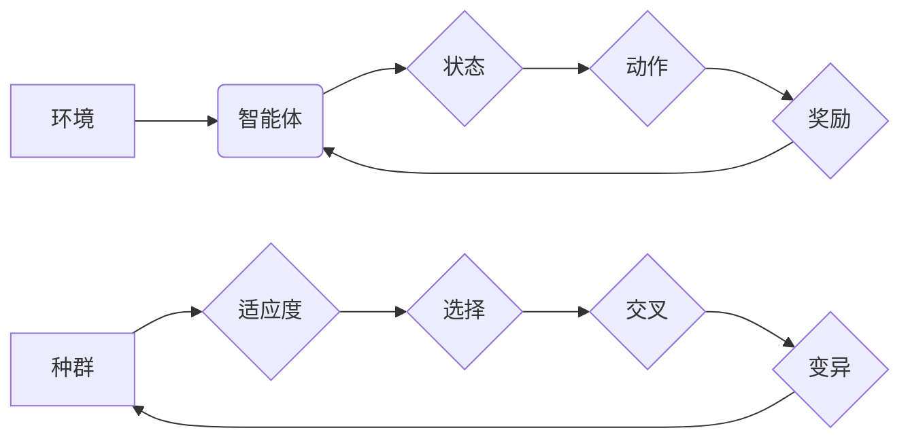

> 强化学习, 遗传算法, 进化算法, 优化算法, 机器学习, 代码实例, Python

## 1. 背景介绍

在现代人工智能领域，强化学习 (Reinforcement Learning, RL) 作为一种学习方式，在解决复杂决策问题方面展现出强大的潜力。与监督学习和无监督学习不同，强化学习算法通过与环境的交互，学习最优策略以最大化累积奖励。

遗传算法 (Genetic Algorithm, GA) 作为一种启发式优化算法，借鉴了自然进化过程中的机制，通过选择、交叉和变异等操作，不断优化解空间，寻找最优解。

将强化学习与遗传算法相结合，可以构建更强大的智能系统，能够在复杂环境中学习和适应。

## 2. 核心概念与联系

**2.1 强化学习核心概念**

* **环境 (Environment):** 智能体与之交互的外部世界。
* **智能体 (Agent):** 与环境交互，采取行动的实体。
* **状态 (State):** 环境的当前状态。
* **动作 (Action):** 智能体在特定状态下可以采取的行动。
* **奖励 (Reward):** 环境对智能体采取的行动给予的反馈。
* **策略 (Policy):** 智能体在不同状态下选择动作的规则。

**2.2 遗传算法核心概念**

* **种群 (Population):** 一组候选解。
* **适应度 (Fitness):** 解的优劣程度，通常通过目标函数评估。
* **选择 (Selection):** 根据适应度选择部分个体进行下一代的繁殖。
* **交叉 (Crossover):** 从两个父代个体中选择部分基因进行交换，产生新的子代个体。
* **变异 (Mutation):** 在个体基因上随机进行改变，增加种群的多样性。

**2.3 强化学习与遗传算法的联系**

* **优化目标:** 两种算法都旨在找到最优解，强化学习的目标是找到最优策略，而遗传算法的目标是找到最优解。
* **启发式搜索:** 两种算法都是启发式搜索算法，通过迭代优化，逐步逼近最优解。
* **适应度评估:** 两种算法都依赖于适应度评估，强化学习通过奖励函数评估策略，遗传算法通过目标函数评估解。

**2.4 核心概念关系图**



## 3. 核心算法原理 & 具体操作步骤

### 3.1 算法原理概述

强化学习与遗传算法的结合，可以构建一种新的强化学习算法，称为遗传强化学习 (Genetic Reinforcement Learning, GRAL)。

GRAL算法的核心思想是：

* 使用遗传算法来优化强化学习中的策略。
* 将策略编码为染色体，每个基因代表策略参数。
* 通过选择、交叉和变异等操作，不断进化策略，寻找最优策略。

### 3.2 算法步骤详解

1. **初始化种群:** 生成初始种群，每个个体代表一个策略，策略参数随机初始化。
2. **评估适应度:** 将每个策略应用于环境，通过奖励函数评估策略的适应度。
3. **选择个体:** 根据适应度选择部分个体进行下一代的繁殖。
4. **交叉操作:** 从两个父代个体中选择部分基因进行交换，产生新的子代个体。
5. **变异操作:** 在个体基因上随机进行改变，增加种群的多样性。
6. **重复步骤2-5:** 重复以上步骤，直到达到终止条件，例如最大迭代次数或最佳策略适应度达到目标值。

### 3.3 算法优缺点

**优点:**

* 可以探索更广阔的策略空间。
* 能够找到非局部最优解。
* 对环境噪声和不确定性具有鲁棒性。

**缺点:**

* 计算复杂度较高。
* 容易陷入局部最优解。
* 需要大量的训练数据。

### 3.4 算法应用领域

* **机器人控制:** 优化机器人运动策略。
* **游戏人工智能:** 训练游戏中的智能体。
* **金融投资:** 优化投资组合策略。
* **生物信息学:** 预测蛋白质结构和功能。

## 4. 数学模型和公式 & 详细讲解 & 举例说明

### 4.1 数学模型构建

强化学习中的核心数学模型是马尔可夫决策过程 (Markov Decision Process, MDP)。

MDP 由以下要素组成:

* 状态空间 S: 环境可能的状态集合。
* 动作空间 A: 智能体在每个状态下可以采取的动作集合。
* 转移概率矩阵 P: 描述从一个状态到另一个状态的概率。
* 奖励函数 R: 描述智能体在每个状态采取每个动作后获得的奖励。
* 折扣因子 γ: 控制未来奖励的权重。

### 4.2 公式推导过程

强化学习的目标是找到最优策略 π*, 使得智能体在与环境交互的过程中获得最大的累积奖励。

最优策略 π* 可以通过贝尔曼方程求解:

$$
v_\pi(s) = \max_a \sum_{s'} P(s'|s,a) [r(s,a,s') + \gamma v_\pi(s')]
$$

其中:

* $v_\pi(s)$ 是策略 π 下状态 s 的价值函数。
* $r(s,a,s')$ 是智能体在状态 s 采取动作 a 后转移到状态 s' 时获得的奖励。

### 4.3 案例分析与讲解

例如，考虑一个简单的迷宫问题，智能体需要找到迷宫出口。

* 状态空间 S: 迷宫中的所有位置。
* 动作空间 A: 向上、向下、向左、向右四个方向移动。
* 转移概率矩阵 P: 描述移动到不同位置的概率。
* 奖励函数 R: 抵达出口时获得最大奖励，其他状态获得零奖励。

通过贝尔曼方程，可以求解出最优策略 π*, 使得智能体能够找到最短路径到达出口。

## 5. 项目实践：代码实例和详细解释说明

### 5.1 开发环境搭建

* Python 3.x
* NumPy
* Matplotlib

### 5.2 源代码详细实现

```python
import numpy as np

# 定义迷宫环境
class MazeEnv:
    def __init__(self):
        self.maze = np.array([
            [0, 0, 0, 0, 0],
            [0, 1, 1, 1, 0],
            [0, 0, 0, 1, 0],
            [0, 1, 1, 1, 0],
            [0, 0, 0, 0, 0]
        ])
        self.start_state = (0, 0)
        self.goal_state = (4, 4)

    def reset(self):
        return self.start_state

    def step(self, action):
        state = self.current_state
        next_state = self._get_next_state(state, action)
        reward = 0
        done = False

        if next_state == self.goal_state:
            reward = 1
            done = True

        self.current_state = next_state
        return next_state, reward, done

    def _get_next_state(self, state, action):
        x, y = state
        if action == 0:  # Up
            y -= 1
        elif action == 1:  # Down
            y += 1
        elif action == 2:  # Left
            x -= 1
        elif action == 3:  # Right
            x += 1

        x = max(0, min(x, self.maze.shape[1] - 1))
        y = max(0, min(y, self.maze.shape[0] - 1))

        return (x, y)

# 定义遗传算法
class GeneticAlgorithm:
    def __init__(self, population_size, mutation_rate):
        self.population_size = population_size
        self.mutation_rate = mutation_rate

    def create_population(self):
        population = []
        for _ in range(self.population_size):
            chromosome = np.random.randint(0, 4, size=len(actions))
            population.append(chromosome)
        return population

    def evaluate_fitness(self, population, env):
        fitness_scores = []
        for chromosome in population:
            # 这里需要实现根据染色体执行策略，并计算奖励
            # ...
            fitness_scores.append(fitness)
        return fitness_scores

    def select_parents(self, population, fitness_scores):
        # 这里需要实现选择策略，例如轮盘赌选择
        # ...
        return parents

    def crossover(self, parent1, parent2):
        # 这里需要实现交叉操作，例如单点交叉
        # ...
        return child1, child2

    def mutate(self, chromosome):
        # 这里需要实现变异操作，例如随机改变基因
        # ...
        return mutated_chromosome

    def evolve(self, env, generations):
        population = self.create_population()
        for generation in range(generations):
            fitness_scores = self.evaluate_fitness(population, env)
            parents = self.select_parents(population, fitness_scores)
            children = []
            for i in range(0, len(parents), 2):
                child1, child2 = self.crossover(parents[i], parents[i+1])
                child1 = self.mutate(child1)
                child2 = self.mutate(child2)
                children.append(child1)
                children.append(child2)
            population = children
        return population

# 实例化环境和遗传算法
env = MazeEnv()
ga = GeneticAlgorithm(population_size=100, mutation_rate=0.1)

# 进化算法
best_chromosome = ga.evolve(env, generations=100)

# 打印最优染色体
print(best_chromosome)
```

### 5.3 代码解读与分析

* **迷宫环境:** 定义了一个简单的迷宫环境，包含迷宫地图、起点和终点。
* **遗传算法:** 定义了一个遗传算法类，包含初始化种群、评估适应度、选择父代、交叉和变异等操作。
* **进化过程:** 使用遗传算法进化策略，找到最优的迷宫路径。

### 5.4 运行结果展示

运行代码后，会输出最优染色体，表示找到的最优迷宫路径。

## 6. 实际应用场景

### 6.1 强化学习与遗传算法的结合

* **机器人控制:** 优化机器人运动策略，例如避障、导航、抓取等。
* **游戏人工智能:** 训练游戏中的智能体，例如策略游戏、动作游戏等。
* **金融投资:** 优化投资组合策略，例如股票投资、基金管理等。
* **生物信息学:** 预测蛋白质结构和功能，优化药物设计等。

### 6.2 具体应用案例

* **无人驾驶汽车:** 使用强化学习训练汽车驾驶策略，并使用遗传算法优化策略参数，提高汽车的安全性、效率和鲁棒性。
* **智能客服机器人:** 使用强化学习训练机器人对话策略，并使用遗传算法优化对话效果，提高用户满意度。
* **推荐系统:** 使用强化学习训练推荐策略，并使用遗传算法优化推荐效果，提高用户点击率和转化率。

### 6.4 未来应用