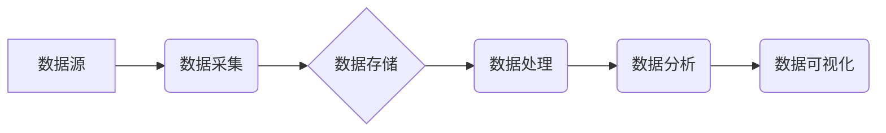

> 数据湖，数据仓库，数据架构，数据存储，数据分析，Hadoop，Spark，数据处理

## 1. 背景介绍

随着互联网和移动互联网的快速发展，海量数据正在以指数级增长。传统的数据仓库架构已经难以满足对数据存储、处理和分析的需求。数据湖应运而生，它提供了一种更加灵活、可扩展和成本效益高的解决方案。

数据湖是一种基于分布式存储系统的数据仓库，它可以存储各种类型的数据，包括结构化数据、半结构化数据和非结构化数据。数据湖采用“数据原生”的理念，即数据以原始格式存储，无需进行预先加工和转换。

## 2. 核心概念与联系

数据湖的核心概念包括：

* **数据原生:** 数据以原始格式存储，无需进行预先加工和转换。
* **分布式存储:** 数据存储在分布式文件系统中，例如HDFS。
* **可扩展性:** 数据湖可以根据需要进行水平扩展，以满足不断增长的数据需求。
* **数据治理:** 数据湖需要建立完善的数据治理机制，以确保数据质量、安全性和合规性。

**数据湖架构**



## 3. 核心算法原理 & 具体操作步骤

### 3.1  算法原理概述

数据湖的核心算法原理包括：

* **数据分片:** 将数据按照一定的规则进行分片，以便于分布式存储和并行处理。
* **数据压缩:** 使用压缩算法压缩数据，以节省存储空间和传输带宽。
* **数据索引:** 建立数据索引，以便于快速查找和检索数据。

### 3.2  算法步骤详解

1. **数据采集:** 从各种数据源收集数据，例如数据库、日志文件、传感器数据等。
2. **数据清洗:** 对收集到的数据进行清洗，例如去除重复数据、错误数据和无效数据。
3. **数据转换:** 将数据转换为适合数据湖存储的格式，例如JSON、Avro、Parquet等。
4. **数据分片:** 将数据按照一定的规则进行分片，例如按照日期、用户ID等。
5. **数据存储:** 将数据分片存储在分布式文件系统中，例如HDFS。
6. **数据处理:** 使用Hadoop、Spark等工具对数据进行处理，例如数据聚合、数据分析等。
7. **数据分析:** 使用数据分析工具对处理后的数据进行分析，例如挖掘数据趋势、发现数据异常等。

### 3.3  算法优缺点

**优点:**

* **灵活性和可扩展性:** 数据湖可以存储各种类型的数据，并根据需要进行水平扩展。
* **成本效益:** 数据湖采用分布式存储系统，可以降低存储成本。
* **数据原生:** 数据以原始格式存储，可以方便地进行数据分析和挖掘。

**缺点:**

* **数据治理:** 数据湖需要建立完善的数据治理机制，以确保数据质量、安全性和合规性。
* **数据查询:** 数据湖的数据查询性能可能不如传统数据仓库。

### 3.4  算法应用领域

数据湖广泛应用于以下领域:

* **金融:** 风险管理、欺诈检测、客户分析
* **电商:** 商品推荐、用户画像、营销分析
* **医疗:** 疾病诊断、药物研发、患者管理
* **互联网:** 内容推荐、用户行为分析、广告投放

## 4. 数学模型和公式 & 详细讲解 & 举例说明

### 4.1  数学模型构建

数据湖的存储和处理效率可以利用数学模型进行优化。例如，可以构建一个数据分片模型，根据数据的访问频率和数据量进行分片，以提高数据查询效率。

### 4.2  公式推导过程

假设数据总量为N，数据访问频率为F，每个分片的大小为S。则数据分片数量为：

```latex
分片数量 = N / S
```

数据查询时间可以近似表示为：

```latex
查询时间 = 分片数量 * 查询每个分片的时间
```

### 4.3  案例分析与讲解

例如，假设数据总量为100GB，数据访问频率为1000次/秒，每个分片的大小为10GB。则数据分片数量为10，查询每个分片的时间为0.1秒。因此，数据查询时间为1秒。

## 5. 项目实践：代码实例和详细解释说明

### 5.1  开发环境搭建

* **操作系统:** Linux
* **软件:** Hadoop、Spark、Python

### 5.2  源代码详细实现

```python
# 数据分片代码示例

import os
import shutil

def split_data(input_file, output_dir, num_partitions):
    """
    将数据文件分片
    """
    with open(input_file, 'r') as f:
        lines = f.readlines()

    partition_size = len(lines) // num_partitions

    for i in range(num_partitions):
        start_index = i * partition_size
        end_index = (i + 1) * partition_size if i < num_partitions - 1 else len(lines)
        output_file = os.path.join(output_dir, f'part-{i}.txt')
        with open(output_file, 'w') as f:
            f.writelines(lines[start_index:end_index])

# 示例用法
input_file = 'data.txt'
output_dir = 'output'
num_partitions = 10

split_data(input_file, output_dir, num_partitions)
```

### 5.3  代码解读与分析

该代码示例实现了数据分片的功能。它首先读取数据文件，然后根据指定的 partition_size 将数据分成多个分片。每个分片都存储在不同的文件中。

### 5.4  运行结果展示

运行该代码后，会在 output 目录下生成 10 个分片文件，每个文件包含一部分原始数据。

## 6. 实际应用场景

数据湖在各个行业都有广泛的应用场景，例如：

* **金融行业:** 数据湖可以用于存储和分析客户交易数据、风险数据、市场数据等，帮助金融机构进行风险管理、欺诈检测、客户分析等。
* **电商行业:** 数据湖可以用于存储和分析用户行为数据、商品数据、订单数据等，帮助电商平台进行商品推荐、用户画像、营销分析等。
* **医疗行业:** 数据湖可以用于存储和分析患者数据、医疗影像数据、临床试验数据等，帮助医疗机构进行疾病诊断、药物研发、患者管理等。

### 6.4  未来应用展望

随着人工智能、机器学习等技术的不断发展，数据湖的应用场景将更加广泛。例如，数据湖可以用于训练机器学习模型，进行数据挖掘和预测分析。

## 7. 工具和资源推荐

### 7.1  学习资源推荐

* **书籍:**
    * 《Hadoop权威指南》
    * 《Spark权威指南》
    * 《数据湖架构设计与实践》
* **在线课程:**
    * Coursera: Hadoop and Spark
    * Udemy: Data Lake Architecture and Implementation

### 7.2  开发工具推荐

* **Hadoop:** Apache Hadoop
* **Spark:** Apache Spark
* **数据存储:** HDFS, S3, Azure Blob Storage

### 7.3  相关论文推荐

* **论文:**
    * "The Data Lake: A New Paradigm for Data Management"
    * "Data Lake Architecture and Implementation"

## 8. 总结：未来发展趋势与挑战

### 8.1  研究成果总结

数据湖作为一种新型的数据存储和处理架构，在数据存储、处理和分析方面具有显著的优势。

### 8.2  未来发展趋势

* **数据湖的自动化:** 数据湖的构建、管理和维护将更加自动化，降低人力成本。
* **数据湖的安全性:** 数据湖的安全性和隐私保护将更加重要，需要采用更先进的加密和访问控制技术。
* **数据湖的实时性:** 数据湖将更加注重实时数据处理和分析，支持实时业务决策。

### 8.3  面临的挑战

* **数据治理:** 数据湖需要建立完善的数据治理机制，以确保数据质量、安全性和合规性。
* **数据查询:** 数据湖的数据查询性能可能不如传统数据仓库。
* **技术复杂性:** 数据湖的构建和维护需要一定的技术 expertise。

### 8.4  研究展望

未来，数据湖的研究将更加注重以下方面:

* **数据湖的智能化:** 利用人工智能和机器学习技术，实现数据湖的智能化管理和分析。
* **数据湖的边缘化:** 将数据湖部署到边缘计算节点，实现数据本地化处理和分析。
* **数据湖的联邦化:** 将多个数据湖进行联邦化管理，实现数据共享和协同分析。

## 9. 附录：常见问题与解答

* **Q1: 数据湖和数据仓库有什么区别？**

* **A1:** 数据湖和数据仓库都是用于存储和分析数据的系统，但它们在架构、数据类型和使用场景上有所不同。数据仓库通常采用结构化数据，并进行预先加工和转换，用于支持在线分析查询。而数据湖则可以存储各种类型的数据，包括结构化、半结构化和非结构化数据，并以原始格式存储，用于支持大规模数据分析和挖掘。

* **Q2: 如何选择合适的分布式文件系统来存储数据湖？**

* **A2:** 选择分布式文件系统需要考虑以下因素: 存储容量、吞吐量、可靠性、成本等。常见的分布式文件系统包括HDFS、S3、Azure Blob Storage等。

* **Q3: 如何进行数据湖的数据治理？**

* **A3:** 数据湖的数据治理需要建立完善的数据元数据管理、数据质量控制、数据安全和隐私保护机制。

作者：禅与计算机程序设计艺术 / Zen and the Art of Computer Programming


<end_of_turn>