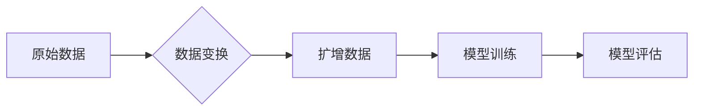

> 数据集扩增，数据增强，深度学习，机器学习，人工智能，小样本学习，迁移学习

## 1. 背景介绍

在深度学习时代，海量数据被视为训练高性能模型的基石。然而，现实世界中，许多领域的数据往往稀缺、昂贵或难以获取。这使得小样本学习成为一个重要的研究方向，旨在探索如何在有限数据下训练有效的机器学习模型。

数据集扩增 (Data Augmentation) 作为一种有效的技术手段，旨在通过对现有数据进行各种变换，生成新的、类似于原始数据的样本，从而有效地扩大数据集规模，提升模型的泛化能力。

## 2. 核心概念与联系

数据集扩增的核心概念是通过对原始数据进行一系列的变换，生成新的数据样本，从而扩大数据集规模。这些变换可以是图像、文本、音频等不同类型数据的，其目标是保持数据样本的本质特征，同时增加数据的多样性。

**数据增强流程图:**



## 3. 核心算法原理 & 具体操作步骤

### 3.1  算法原理概述

数据集扩增算法的原理是基于数据分布的假设，即原始数据分布可以被视为一个概率分布。通过对数据进行变换，可以生成新的数据样本，这些样本的分布应该与原始数据分布相似。

### 3.2  算法步骤详解

1. **数据预处理:** 对原始数据进行必要的预处理，例如图像的裁剪、缩放、归一化等。
2. **选择变换策略:** 根据数据类型和任务需求，选择合适的变换策略，例如图像的旋转、翻转、裁剪、添加噪声等。
3. **生成扩增数据:** 对原始数据应用选择的变换策略，生成新的数据样本。
4. **数据评估:** 对扩增数据进行评估，例如计算图像的质量、文本的语义相似度等，确保扩增数据的质量。

### 3.3  算法优缺点

**优点:**

* 可以有效地扩大数据集规模，提升模型的泛化能力。
* 相对简单易实现，成本较低。

**缺点:**

* 扩增数据可能与真实数据分布存在偏差，导致模型性能下降。
* 对于某些类型的任务，例如文本分类，扩增效果可能不明显。

### 3.4  算法应用领域

数据集扩增技术广泛应用于计算机视觉、自然语言处理、语音识别等领域，例如：

* **图像分类:** 通过旋转、翻转、裁剪等变换，生成更多图像样本，提高模型对不同角度、尺度和位置的图像的识别能力。
* **目标检测:** 通过添加噪声、改变亮度等变换，增强模型对目标的鲁棒性，提高其在复杂场景下的检测性能。
* **文本分类:** 通过 synonym replacement、back translation 等变换，增加文本数据的多样性，提高模型对不同表达方式的文本的理解能力。

## 4. 数学模型和公式 & 详细讲解 & 举例说明

### 4.1  数学模型构建

对于图像数据，我们可以使用线性变换来进行扩增。假设图像像素点坐标为 (x, y)，则线性变换可以表示为：

```latex
x' = ax + by + c
y' = dx + ey + f
```

其中，a, b, c, d, e, f 为变换参数。

### 4.2  公式推导过程

通过线性变换，我们可以实现图像的旋转、缩放、平移等操作。例如，旋转变换可以通过设置特定的参数值来实现。

### 4.3  案例分析与讲解

假设我们想要对图像进行90度旋转，则可以设置以下参数值：

```latex
a = 0, b = 1, c = 0
d = -1, e = 0, f = 0
```

将这些参数值代入线性变换公式，即可实现图像的90度旋转。

## 5. 项目实践：代码实例和详细解释说明

### 5.1  开发环境搭建

本项目使用Python语言进行开发，所需的库包括NumPy、OpenCV等。

### 5.2  源代码详细实现

```python
import numpy as np
import cv2

def rotate_image(image, angle):
    # 获取图像中心点
    height, width = image.shape[:2]
    center = (width / 2, height / 2)

    # 创建旋转矩阵
    rotation_matrix = cv2.getRotationMatrix2D(center, angle, 1.0)

    # 对图像进行旋转
    rotated_image = cv2.warpAffine(image, rotation_matrix, (width, height))

    return rotated_image

# 加载图像
image = cv2.imread('input.jpg')

# 对图像进行90度旋转
rotated_image = rotate_image(image, 90)

# 保存旋转后的图像
cv2.imwrite('output.jpg', rotated_image)
```

### 5.3  代码解读与分析

该代码首先加载图像，然后使用`cv2.getRotationMatrix2D()`函数创建旋转矩阵，并使用`cv2.warpAffine()`函数对图像进行旋转。

### 5.4  运行结果展示

运行该代码后，将生成一个旋转90度的图像文件。

## 6. 实际应用场景

### 6.1  医疗影像分析

在医疗影像分析领域，数据集扩增可以用于生成更多病理图像样本，提高模型对不同病症的识别能力。

### 6.2  自动驾驶

在自动驾驶领域，数据集扩增可以用于生成更多不同场景下的驾驶图像，提高模型对复杂路况的适应能力。

### 6.3  自然语言处理

在自然语言处理领域，数据集扩增可以用于生成更多不同风格和语境的文本样本，提高模型对语言的理解能力。

### 6.4  未来应用展望

随着人工智能技术的不断发展，数据集扩增技术将应用于更多领域，例如机器人控制、药物研发等。

## 7. 工具和资源推荐

### 7.1  学习资源推荐

* **书籍:**
    * 《Deep Learning》 by Ian Goodfellow, Yoshua Bengio, and Aaron Courville
    * 《Hands-On Machine Learning with Scikit-Learn, Keras & TensorFlow》 by Aurélien Géron
* **在线课程:**
    * Coursera: Deep Learning Specialization
    * Udacity: Machine Learning Engineer Nanodegree

### 7.2  开发工具推荐

* **图像处理:** OpenCV, Pillow
* **文本处理:** NLTK, SpaCy
* **深度学习框架:** TensorFlow, PyTorch

### 7.3  相关论文推荐

* **ImageNet Classification with Deep Convolutional Neural Networks** by Alex Krizhevsky, Ilya Sutskever, and Geoffrey E. Hinton
* **Generative Adversarial Networks** by Ian Goodfellow, Jean Pouget-Abadie, Mehdi Mirza, Bing Xu, David Warde-Farley, Sherjil Ozair, Aaron Courville, and Yoshua Bengio

## 8. 总结：未来发展趋势与挑战

### 8.1  研究成果总结

数据集扩增技术在小样本学习领域取得了显著的成果，有效地提升了模型的泛化能力。

### 8.2  未来发展趋势

未来，数据集扩增技术将朝着以下方向发展:

* **更智能的扩增策略:** 利用人工智能技术，自动学习更有效的扩增策略。
* **跨模态扩增:** 将图像、文本、音频等不同模态的数据进行联合扩增。
* **对抗性扩增:** 生成对抗性样本，提高模型的鲁棒性。

### 8.3  面临的挑战

数据集扩增技术还面临一些挑战:

* **扩增数据与真实数据分布的偏差:** 如何保证扩增数据与真实数据分布的相似性，是需要进一步研究的问题。
* **计算资源消耗:** 一些扩增策略计算量较大，需要更高效的算法和硬件支持。

### 8.4  研究展望

未来，我们将继续研究更智能、更有效的扩增策略，并将其应用于更多领域，推动人工智能技术的进步。

## 9. 附录：常见问题与解答

**Q1: 数据集扩增有哪些常见的变换策略？**

**A1:** 常见的变换策略包括图像的旋转、翻转、裁剪、缩放、添加噪声等。

**Q2: 数据集扩增对模型性能有什么影响？**

**A2:** 数据集扩增可以有效地扩大数据集规模，提升模型的泛化能力，从而提高模型性能。

**Q3: 如何评估扩增数据的质量？**

**A3:** 可以通过计算图像的质量、文本的语义相似度等指标来评估扩增数据的质量。


作者：禅与计算机程序设计艺术 / Zen and the Art of Computer Programming 
<end_of_turn>