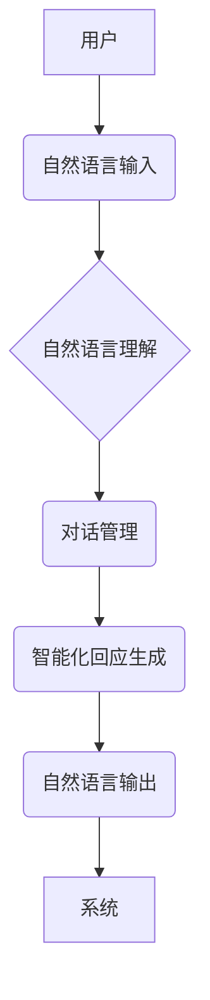

> 智能化回应技术，CUI，自然语言理解，对话系统，机器学习，深度学习，用户体验

## 1. 背景介绍

随着人工智能技术的飞速发展，智能化交互方式逐渐成为人们关注的焦点。传统的命令行界面 (CLI) 和图形用户界面 (GUI) 难以满足用户日益增长的个性化需求和交互体验期望。基于此，以自然语言为交互方式的对话式用户界面 (CUI) 应运而生，并逐渐成为未来交互方式的重要趋势。

CUI 旨在通过自然语言理解 (NLU) 和对话系统技术，使用户能够用类似于与人交流的方式与计算机进行交互。然而，传统的 CUI 系统往往局限于预设的指令和响应，缺乏灵活性，难以应对用户复杂的需求。

智能化回应技术作为 CUI 的重要组成部分，旨在提升 CUI 系统的智能化程度，使其能够更准确、更自然地理解用户意图，并提供更个性化、更符合用户需求的回应。

## 2. 核心概念与联系

**2.1 核心概念**

* **CUI (Conversational User Interface):**  对话式用户界面，以自然语言为交互方式，模拟人与人之间的对话，提供更直观、更自然的交互体验。
* **NLU (Natural Language Understanding):** 自然语言理解，是指计算机能够理解人类语言的含义和意图的技术。
* **对话系统:**  能够与用户进行自然语言对话的系统，通常由 NLU、对话管理和自然语言生成 (NLG) 等模块组成。
* **智能化回应技术:**  旨在提升 CUI 系统智能化程度的技术，使其能够更准确、更自然地理解用户意图，并提供更个性化、更符合用户需求的回应。

**2.2 架构关系**



## 3. 核心算法原理 & 具体操作步骤

**3.1 算法原理概述**

智能化回应技术通常基于机器学习和深度学习算法，通过训练大量的文本数据，学习用户意图和上下文信息，从而生成更准确、更自然的回应。常见的算法包括：

* **循环神经网络 (RNN):**  能够处理序列数据，例如文本，并捕捉文本中的上下文信息。
* **长短期记忆网络 (LSTM):**  一种 RNN 的变体，能够更好地处理长序列数据，并缓解 RNN 的梯度消失问题。
* **Transformer:**  一种基于注意力机制的网络结构，能够更有效地捕捉文本中的长距离依赖关系。

**3.2 算法步骤详解**

1. **数据预处理:**  收集和清洗文本数据，将其转换为模型可理解的格式。
2. **模型训练:**  使用机器学习或深度学习算法，训练模型以识别用户意图和生成回应。
3. **模型评估:**  使用测试数据评估模型的性能，并根据评估结果进行模型调优。
4. **模型部署:**  将训练好的模型部署到 CUI 系统中，使其能够实时处理用户请求。

**3.3 算法优缺点**

* **优点:**  能够生成更自然、更符合用户需求的回应，提升用户体验。
* **缺点:**  需要大量的训练数据，训练时间较长，模型部署成本较高。

**3.4 算法应用领域**

* **智能客服:**  自动处理用户咨询，提供快速、高效的客户服务。
* **虚拟助手:**  帮助用户完成日常任务，例如设置提醒、查询天气等。
* **教育机器人:**  与用户进行互动学习，提供个性化的学习体验。

## 4. 数学模型和公式 & 详细讲解 & 举例说明

**4.1 数学模型构建**

智能化回应技术通常使用概率模型来表示用户意图和回应之间的关系。例如，可以使用贝叶斯网络或隐马尔可夫模型来建模用户对话过程。

**4.2 公式推导过程**

假设我们使用贝叶斯网络来建模用户意图和回应之间的关系。

* **用户意图:**  用符号 U 表示，例如 U = {问天气、查询航班、预订酒店}。
* **回应:**  用符号 R 表示，例如 R = {天气晴朗、航班已满、酒店预订成功}。

贝叶斯网络中的概率关系可以用以下公式表示：

* P(U|R) = P(U) * P(R|U) / P(R)

其中：

* P(U|R) 是给定回应 R 的情况下用户意图 U 的概率。
* P(U) 是用户意图 U 的先验概率。
* P(R|U) 是给定用户意图 U 的情况下回应 R 的条件概率。
* P(R) 是回应 R 的边缘概率。

**4.3 案例分析与讲解**

例如，用户输入 "今天天气怎么样"，系统需要判断用户意图是 "问天气"，并根据天气预报生成相应的回应。

* P(问天气) 是用户意图为 "问天气" 的先验概率。
* P(天气晴朗|问天气) 是给定用户意图为 "问天气" 的情况下，天气晴朗的条件概率。
* P(天气晴朗) 是天气晴朗的边缘概率。

通过计算以上概率，系统可以得到用户意图为 "问天气" 的概率，并根据该概率生成相应的回应，例如 "今天天气晴朗"。

## 5. 项目实践：代码实例和详细解释说明

**5.1 开发环境搭建**

* 操作系统: Ubuntu 20.04
* Python 版本: 3.8
* 必要的库: TensorFlow, Keras, NLTK, SpaCy

**5.2 源代码详细实现**

```python
import tensorflow as tf
from tensorflow.keras.models import Sequential
from tensorflow.keras.layers import Embedding, LSTM, Dense

# 数据预处理
# ...

# 模型构建
model = Sequential()
model.add(Embedding(input_dim=vocab_size, output_dim=embedding_dim))
model.add(LSTM(units=128))
model.add(Dense(units=num_classes, activation='softmax'))

# 模型编译
model.compile(loss='categorical_crossentropy', optimizer='adam', metrics=['accuracy'])

# 模型训练
model.fit(X_train, y_train, epochs=10, batch_size=32)

# 模型评估
loss, accuracy = model.evaluate(X_test, y_test)
print('Loss:', loss)
print('Accuracy:', accuracy)

# 模型部署
# ...
```

**5.3 代码解读与分析**

* **数据预处理:**  将文本数据转换为模型可理解的格式，例如将文本转换为词向量。
* **模型构建:**  使用 TensorFlow 或 Keras 等深度学习框架构建模型，例如使用 LSTM 网络来处理文本序列数据。
* **模型编译:**  配置模型的损失函数、优化器和评价指标。
* **模型训练:**  使用训练数据训练模型，并根据评价指标调整模型参数。
* **模型评估:**  使用测试数据评估模型的性能。
* **模型部署:**  将训练好的模型部署到 CUI 系统中，使其能够实时处理用户请求。

**5.4 运行结果展示**

* 训练完成后，可以将模型部署到 CUI 系统中，并测试其性能。
* 可以使用测试数据评估模型的准确率、召回率等指标。
* 可以收集用户反馈，并根据反馈进行模型改进。

## 6. 实际应用场景

**6.1 智能客服**

智能客服系统可以利用智能化回应技术，自动处理用户咨询，提供快速、高效的客户服务。例如，用户可以向智能客服询问产品信息、订单状态等问题，智能客服可以根据用户输入理解用户意图，并提供相应的回复。

**6.2 虚拟助手**

虚拟助手可以帮助用户完成日常任务，例如设置提醒、查询天气、预订酒店等。智能化回应技术可以使虚拟助手更智能，能够更好地理解用户的需求，并提供更个性化的服务。

**6.3 教育机器人**

教育机器人可以利用智能化回应技术与用户进行互动学习，提供个性化的学习体验。例如，教育机器人可以根据用户的学习进度和能力，提供相应的学习内容和练习题。

**6.4 未来应用展望**

智能化回应技术在未来将有更广泛的应用场景，例如：

* **医疗保健:**  智能化问诊系统可以帮助医生更快、更准确地诊断疾病。
* **金融服务:**  智能化理财助手可以帮助用户制定个性化的理财计划。
* **娱乐休闲:**  智能化游戏助手可以提供更沉浸式的游戏体验。

## 7. 工具和资源推荐

**7.1 学习资源推荐**

* **书籍:**
    * 《深度学习》
    * 《自然语言处理》
* **在线课程:**
    * Coursera: 自然语言处理
    * Udacity: 深度学习
* **博客:**
    * TensorFlow Blog
    * Keras Blog

**7.2 开发工具推荐**

* **TensorFlow:**  开源深度学习框架
* **Keras:**  基于 TensorFlow 的高层深度学习 API
* **NLTK:**  自然语言处理工具包
* **SpaCy:**  工业级自然语言处理库

**7.3 相关论文推荐**

* **BERT: Pre-training of Deep Bidirectional Transformers for Language Understanding**
* **GPT-3: Language Models are Few-Shot Learners**
* **XLNet: Generalized Autoregressive Pretraining for Language Understanding**

## 8. 总结：未来发展趋势与挑战

**8.1 研究成果总结**

智能化回应技术在 CUI 的应用取得了显著进展，能够生成更自然、更符合用户需求的回应，提升用户体验。

**8.2 未来发展趋势**

* **更强大的模型:**  研究更强大的深度学习模型，例如 Transformer 的变体，以提高模型的性能。
* **更个性化的回应:**  利用用户数据，个性化定制回应，提供更符合用户需求的服务。
* **多模态交互:**  结合语音、图像等多模态信息，实现更丰富的交互体验。

**8.3 面临的挑战**

* **数据标注:**  高质量的训练数据是深度学习模型的关键，数据标注工作量大，成本高。
* **模型解释性:**  深度学习模型的决策过程难以解释，这可能会导致用户对模型的信任度降低。
* **伦理问题:**  智能化回应技术可能存在伦理问题，例如数据隐私、算法偏见等，需要引起重视。

**8.4 研究展望**

未来，智能化回应技术将继续发展，并应用于更广泛的领域。研究者需要关注模型的性能、解释性、伦理问题等方面，确保智能化回应技术能够安全、可靠地应用于实际场景。

## 9. 附录：常见问题与解答

**9.1 如何选择合适的深度学习模型？**

选择合适的深度学习模型需要根据具体应用场景和数据特点进行选择。例如，对于文本序列数据，可以使用 LSTM 或 Transformer 模型；对于图像数据，可以使用 CNN 模型。

**9.2 如何解决数据标注问题？**

数据标注工作量大，成本高，可以考虑使用自动化标注工具，或者利用众包平台进行标注。

**9.3 如何提高模型的解释性？**

可以使用可解释机器学习 (XAI) 技术，例如 LIME、SHAP 等，来解释模型的决策过程。

**9.4 如何应对智能化回应技术的伦理问题？**

需要制定相应的伦理规范，并加强对模型的监督和评估，确保智能化回应技术能够安全、可靠地应用于实际场景。


作者：禅与计算机程序设计艺术 / Zen and the Art of Computer Programming 
<end_of_turn>