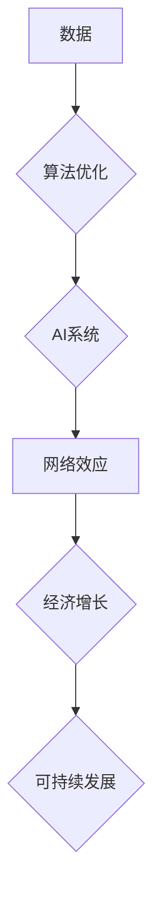

> 深层次问题、经济增长、人工智能、数据驱动、算法优化、可持续发展、伦理挑战、社会影响

## 1. 背景介绍

在当今数字时代，人工智能（AI）和数据驱动技术正在深刻地改变着世界各行各业，并对经济增长产生着越来越重要的影响。然而，随着AI技术的快速发展，一些深层次的问题也逐渐浮出水面，这些问题对经济增长的长期可持续性构成挑战。

传统经济学模型主要关注于资本、劳动力和技术要素对经济增长的影响，而忽略了数据、算法和网络效应等新兴因素。随着AI技术的兴起，数据已成为新的生产要素，算法成为新的生产工具，网络效应则成为新的市场竞争力。

## 2. 核心概念与联系

**2.1 深层次问题**

“深层次问题”是指在AI技术发展过程中，可能引发的一系列社会、伦理、经济和环境等方面的挑战。这些问题并非技术问题，而是需要跨学科合作和社会共识才能解决的复杂问题。

**2.2 核心概念与联系**

* **数据驱动:** AI技术的核心是数据，数据驱动了算法的训练和优化，也决定了AI系统的性能和应用范围。
* **算法优化:** 算法是AI系统的核心逻辑，算法的优化直接影响着AI系统的效率、准确性和可解释性。
* **网络效应:** AI系统通常具有网络效应，即随着用户数量的增加，系统价值会呈指数级增长。
* **可持续发展:** AI技术的发展应该与可持续发展目标相一致，避免造成环境污染、资源浪费和社会不平等。

**2.3 Mermaid 流程图**



## 3. 核心算法原理 & 具体操作步骤

**3.1 算法原理概述**

深度学习算法是AI技术发展的重要驱动力，其核心原理是通过多层神经网络模拟人类大脑的学习过程。深度学习算法能够从海量数据中自动提取特征，并进行复杂的模式识别和预测。

**3.2 算法步骤详解**

1. **数据预处理:** 将原始数据进行清洗、转换和格式化，使其适合深度学习算法的训练。
2. **网络结构设计:** 根据具体任务需求，设计深度神经网络的结构，包括层数、节点数量和激活函数等。
3. **参数初始化:** 为神经网络中的参数进行随机初始化，为训练过程提供初始值。
4. **前向传播:** 将输入数据通过神经网络层层传递，最终得到输出结果。
5. **反向传播:** 计算输出结果与真实值的误差，并根据误差反向传播，调整神经网络参数。
6. **梯度下降:** 使用梯度下降算法优化神经网络参数，不断降低误差。
7. **模型评估:** 使用测试数据评估模型的性能，并根据评估结果进行模型调优。

**3.3 算法优缺点**

**优点:**

* 能够从海量数据中自动提取特征，无需人工特征工程。
* 能够学习复杂模式，实现高精度预测。
* 具有良好的泛化能力，能够应用于不同领域的实际问题。

**缺点:**

* 训练数据量要求高，需要大量的标注数据。
* 计算资源消耗大，训练时间长。
* 模型解释性差，难以理解模型的决策过程。

**3.4 算法应用领域**

深度学习算法已广泛应用于图像识别、自然语言处理、语音识别、机器翻译、推荐系统等领域。

## 4. 数学模型和公式 & 详细讲解 & 举例说明

**4.1 数学模型构建**

深度学习模型可以抽象为一个多层神经网络，每个神经元接收多个输入信号，并通过激活函数进行处理，最终输出一个信号。

**4.2 公式推导过程**

* **激活函数:** 激活函数用于引入非线性，使神经网络能够学习复杂模式。常见的激活函数包括 sigmoid 函数、ReLU 函数等。
* **损失函数:** 损失函数用于衡量模型预测结果与真实值的差异。常见的损失函数包括均方误差、交叉熵等。
* **梯度下降:** 梯度下降算法用于优化神经网络参数，使其能够最小化损失函数。

**4.3 案例分析与讲解**

以图像识别为例，深度学习模型可以学习图像特征，并将其映射到类别标签。

* **输入:** 图像数据
* **输出:** 类别标签
* **损失函数:** 交叉熵损失函数
* **梯度下降:** 使用随机梯度下降算法优化模型参数

## 5. 项目实践：代码实例和详细解释说明

**5.1 开发环境搭建**

使用 Python 语言和 TensorFlow 或 PyTorch 等深度学习框架进行开发。

**5.2 源代码详细实现**

```python
import tensorflow as tf

# 定义模型结构
model = tf.keras.models.Sequential([
    tf.keras.layers.Conv2D(32, (3, 3), activation='relu', input_shape=(28, 28, 1)),
    tf.keras.layers.MaxPooling2D((2, 2)),
    tf.keras.layers.Conv2D(64, (3, 3), activation='relu'),
    tf.keras.layers.MaxPooling2D((2, 2)),
    tf.keras.layers.Flatten(),
    tf.keras.layers.Dense(10, activation='softmax')
])

# 编译模型
model.compile(optimizer='adam',
              loss='sparse_categorical_crossentropy',
              metrics=['accuracy'])

# 训练模型
model.fit(x_train, y_train, epochs=5)

# 评估模型
loss, accuracy = model.evaluate(x_test, y_test)
print('Test loss:', loss)
print('Test accuracy:', accuracy)
```

**5.3 代码解读与分析**

代码定义了一个简单的卷积神经网络模型，用于手写数字识别任务。

* **Conv2D:** 卷积层，用于提取图像特征。
* **MaxPooling2D:** 最大池化层，用于降维和提高模型鲁棒性。
* **Flatten:** 将多维数据转换为一维数据。
* **Dense:** 全连接层，用于分类。

**5.4 运行结果展示**

训练完成后，模型能够准确识别手写数字。

## 6. 实际应用场景

**6.1 医疗诊断:** AI技术可以辅助医生进行疾病诊断，提高诊断准确率和效率。

**6.2 金融风险管理:** AI技术可以分析金融数据，识别潜在的风险，并进行风险控制。

**6.3 自动驾驶:** AI技术是自动驾驶的核心技术，可以实现车辆的感知、决策和控制。

**6.4 未来应用展望**

AI技术将继续推动经济增长，并带来更多新的应用场景。例如，在教育、农业、制造业等领域，AI技术将发挥越来越重要的作用。

## 7. 工具和资源推荐

**7.1 学习资源推荐**

* **在线课程:** Coursera、edX、Udacity 等平台提供丰富的AI课程。
* **书籍:** 《深度学习》、《机器学习》等书籍是学习AI技术的经典教材。
* **开源项目:** TensorFlow、PyTorch 等开源项目提供了丰富的代码示例和工具。

**7.2 开发工具推荐**

* **Python:** Python 语言是AI开发的常用语言。
* **TensorFlow:** TensorFlow 是一个开源的深度学习框架。
* **PyTorch:** PyTorch 是另一个开源的深度学习框架。

**7.3 相关论文推荐**

* **《ImageNet Classification with Deep Convolutional Neural Networks》**
* **《Attention Is All You Need》**
* **《BERT: Pre-training of Deep Bidirectional Transformers for Language Understanding》**

## 8. 总结：未来发展趋势与挑战

**8.1 研究成果总结**

近年来，AI技术取得了长足的进步，在多个领域取得了突破性进展。

**8.2 未来发展趋势**

* **模型规模化:** 模型规模将继续扩大，训练数据量将进一步增加。
* **算法创新:** 新的算法和模型架构将不断涌现，提升AI系统的性能和效率。
* **边缘计算:** AI计算将向边缘设备迁移，实现更低延迟和更高效率的应用。

**8.3 面临的挑战**

* **数据安全和隐私保护:** AI技术的应用需要处理大量数据，如何保障数据安全和隐私是重要的挑战。
* **算法可解释性和公平性:** AI算法的决策过程往往难以理解，如何确保算法的公平性和可解释性是重要的伦理问题。
* **人才短缺:** AI领域人才需求量大，如何培养更多AI人才是重要的挑战。

**8.4 研究展望**

未来，AI技术将继续发展，并对经济增长、社会发展和人类生活产生更深远的影响。我们需要加强对AI技术的研究和应用，并积极应对AI技术带来的挑战，确保AI技术能够造福人类。

## 9. 附录：常见问题与解答

**9.1 如何选择合适的AI算法？**

选择合适的AI算法需要根据具体任务需求和数据特点进行选择。

**9.2 如何解决AI算法的过拟合问题？**

可以使用正则化、交叉验证等方法来解决AI算法的过拟合问题。

**9.3 如何评估AI模型的性能？**

可以使用准确率、召回率、F1-score等指标来评估AI模型的性能。


作者：禅与计算机程序设计艺术 / Zen and the Art of Computer Programming 
<end_of_turn>