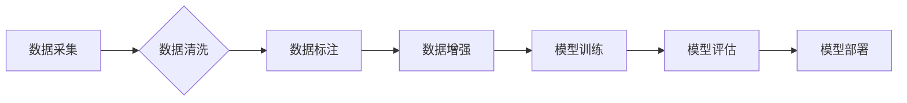

> 生成式AI，AIGC，数据，训练，模型，质量，伦理

## 1. 背景介绍

在上一篇文章中，我们探讨了生成式AIGC的潜力和挑战，并分析了模型架构和训练方法对AIGC质量的影响。然而，无论模型多么先进，训练数据始终是AIGC成功的基石。高质量的数据是生成式AIGC模型训练的燃料，也是模型性能的关键因素。

数据质量直接决定了AIGC模型的输出质量。如果训练数据存在偏差、错误或不完整，模型将学习到这些缺陷，并将其反映在输出结果中。因此，数据质量对于生成式AIGC的成功至关重要。

## 2. 核心概念与联系

### 2.1 数据的本质

数据是信息的基本单位，是AIGC模型学习和训练的基础。数据可以是文本、图像、音频、视频等各种形式。

### 2.2 数据与模型的关系

AIGC模型通过学习大量的训练数据来识别模式和规律，并将其应用于生成新的内容。数据是模型学习的原料，模型的性能直接取决于数据的质量和数量。

### 2.3 数据质量与AIGC质量的关系

数据质量直接影响AIGC模型的输出质量。高质量的数据可以帮助模型学习到更准确、更丰富的知识，从而生成更优质的内容。

**Mermaid 流程图**



## 3. 核心算法原理 & 具体操作步骤

### 3.1 算法原理概述

生成式AIGC模型通常基于深度学习算法，例如Transformer、GAN等。这些算法通过多层神经网络结构，学习数据中的模式和规律，并将其应用于生成新的内容。

### 3.2 算法步骤详解

1. **数据预处理:** 将原始数据进行清洗、转换和格式化，使其适合模型训练。
2. **模型训练:** 使用训练数据训练AIGC模型，调整模型参数，使其能够生成高质量的内容。
3. **模型评估:** 使用测试数据评估模型的性能，例如准确率、流畅度、多样性等。
4. **模型优化:** 根据评估结果，调整模型参数或训练方法，提高模型性能。
5. **模型部署:** 将训练好的模型部署到生产环境中，用于生成新的内容。

### 3.3 算法优缺点

**优点:**

* 可以生成高质量、多样化的内容。
* 可以自动完成内容创作任务，提高效率。
* 可以应用于多种领域，例如文本生成、图像生成、音频生成等。

**缺点:**

* 训练数据量大，计算资源消耗高。
* 模型训练时间长，需要专业知识和技术支持。
* 模型可能存在偏差或错误，需要进行严格的评估和监控。

### 3.4 算法应用领域

* 文本生成：文章、故事、诗歌、代码等。
* 图像生成：图片、视频、动画等。
* 音频生成：音乐、语音合成等。
* 其他领域：药物研发、材料设计、金融预测等。

## 4. 数学模型和公式 & 详细讲解 & 举例说明

### 4.1 数学模型构建

生成式AIGC模型通常基于概率模型，例如变分自编码器（VAE）和生成对抗网络（GAN）。

**VAE模型:**

VAE模型将输入数据映射到一个低维潜在空间，然后从潜在空间中采样生成新的数据。

**GAN模型:**

GAN模型由两个网络组成：生成器和判别器。生成器试图生成逼真的数据，而判别器试图区分真实数据和生成数据。两者相互竞争，最终生成器能够生成逼真的数据。

### 4.2 公式推导过程

VAE模型的损失函数通常由两个部分组成：

* **重构损失:** 衡量模型重构输入数据的能力。
* **KL散度:** 衡量潜在空间的分布与标准正态分布的差异。

GAN模型的损失函数通常由两个部分组成：

* **生成器损失:** 衡量生成器生成的假数据被判别器误判为真实数据的概率。
* **判别器损失:** 衡量判别器区分真实数据和生成数据的准确率。

### 4.3 案例分析与讲解

**VAE模型应用于图像生成:**

VAE模型可以用于生成逼真的图像。例如，可以训练一个VAE模型来生成猫的图像。

**GAN模型应用于图像超分辨率:**

GAN模型可以用于提高图像分辨率。例如，可以训练一个GAN模型来将低分辨率图像提升到高分辨率图像。

## 5. 项目实践：代码实例和详细解释说明

### 5.1 开发环境搭建

* Python 3.7+
* TensorFlow/PyTorch
* CUDA/cuDNN

### 5.2 源代码详细实现

```python
# VAE模型代码示例
import tensorflow as tf

# 定义编码器
encoder = tf.keras.Sequential([
    tf.keras.layers.Conv2D(32, (3, 3), activation='relu', input_shape=(28, 28, 1)),
    tf.keras.layers.MaxPooling2D((2, 2)),
    tf.keras.layers.Conv2D(64, (3, 3), activation='relu'),
    tf.keras.layers.MaxPooling2D((2, 2)),
    tf.keras.layers.Flatten(),
    tf.keras.layers.Dense(128, activation='relu'),
    tf.keras.layers.Dense(latent_dim)
])

# 定义解码器
decoder = tf.keras.Sequential([
    tf.keras.layers.Dense(7 * 7 * 64, activation='relu'),
    tf.keras.layers.Reshape((7, 7, 64)),
    tf.keras.layers.Conv2DTranspose(64, (3, 3), strides=(2, 2), activation='relu'),
    tf.keras.layers.Conv2DTranspose(32, (3, 3), strides=(2, 2), activation='relu'),
    tf.keras.layers.Conv2D(1, (3, 3), activation='sigmoid')
])

# 定义VAE模型
vae = tf.keras.Model(inputs=inputs, outputs=decoder(encoder(inputs)))

# 定义损失函数
reconstruction_loss = tf.keras.losses.BinaryCrossentropy()
kl_loss = tf.keras.losses.KLDivergence()

# 定义总损失函数
def vae_loss(x, x_recon):
    reconstruction_loss_value = reconstruction_loss(x, x_recon)
    kl_loss_value = kl_loss(x, x_recon)
    return reconstruction_loss_value + kl_loss_value

# 训练模型
vae.compile(optimizer='adam', loss=vae_loss)
vae.fit(x_train, x_train, epochs=10)

```

### 5.3 代码解读与分析

* **编码器:** 将输入数据映射到低维潜在空间。
* **解码器:** 从潜在空间中采样生成新的数据。
* **损失函数:** 衡量模型的重构能力和潜在空间的分布。
* **训练过程:** 使用训练数据训练模型，调整模型参数。

### 5.4 运行结果展示

训练完成后，可以使用模型生成新的数据。例如，可以使用训练好的VAE模型生成新的猫的图像。

## 6. 实际应用场景

### 6.1 文本生成

* **内容创作:** 自动生成文章、故事、诗歌等内容。
* **聊天机器人:** 构建更自然、更智能的聊天机器人。
* **代码生成:** 自动生成代码片段，提高开发效率。

### 6.2 图像生成

* **图像合成:** 生成逼真的图像，例如人物、场景、物体等。
* **图像修复:** 修复损坏的图像，例如去除噪点、修复缺失部分等。
* **图像风格迁移:** 将图像转换为不同的艺术风格。

### 6.3 音频生成

* **音乐创作:** 生成新的音乐作品，例如旋律、伴奏等。
* **语音合成:** 生成逼真的语音，例如播报、朗读等。
* **音频特效:** 生成各种音频特效，例如音效、背景音乐等。

### 6.4 未来应用展望

* **个性化内容生成:** 根据用户的喜好和需求生成个性化的内容。
* **虚拟现实和增强现实:** 生成逼真的虚拟场景和增强现实体验。
* **医疗保健:** 生成医学图像、辅助诊断等。

## 7. 工具和资源推荐

### 7.1 学习资源推荐

* **书籍:**
    * 《深度学习》
    * 《生成对抗网络》
* **在线课程:**
    * Coursera: 深度学习
    * Udacity: 生成对抗网络
* **博客和论坛:**
    * TensorFlow博客
    * PyTorch博客
    * Kaggle论坛

### 7.2 开发工具推荐

* **TensorFlow:** 开源深度学习框架
* **PyTorch:** 开源深度学习框架
* **Keras:** 高级深度学习API

### 7.3 相关论文推荐

* **Generative Adversarial Networks**
* **Auto-Encoding Variational Bayes**
* **Transformer Networks**

## 8. 总结：未来发展趋势与挑战

### 8.1 研究成果总结

生成式AIGC技术取得了显著进展，能够生成高质量、多样化的内容。

### 8.2 未来发展趋势

* **模型能力提升:** 模型将更加强大，能够生成更逼真、更复杂的內容。
* **应用场景拓展:** 生成式AIGC将应用于更多领域，例如医疗保健、教育、娱乐等。
* **伦理问题解决:** 研究人员将致力于解决生成式AIGC带来的伦理问题，例如版权问题、虚假信息问题等。

### 8.3 面临的挑战

* **数据质量问题:** 数据质量直接影响AIGC模型的性能，需要不断提高数据质量。
* **计算资源需求:** 训练大型AIGC模型需要大量的计算资源，成本较高。
* **伦理问题:** 生成式AIGC可能被用于生成虚假信息、侵犯版权等，需要制定相应的伦理规范。

### 8.4 研究展望

未来，生成式AIGC技术将继续发展，并对社会产生深远影响。我们需要加强对该技术的研究和应用，并积极应对其带来的挑战。

## 9. 附录：常见问题与解答

* **什么是生成式AIGC？**

生成式AIGC是指利用人工智能技术生成新内容的系统。

* **生成式AIGC有哪些应用场景？**

生成式AIGC应用场景广泛，例如文本生成、图像生成、音频生成等。

* **生成式AIGC的未来发展趋势是什么？**

未来，生成式AIGC模型将更加强大，应用场景将更加广泛。

作者：禅与计算机程序设计艺术 / Zen and the Art of Computer Programming


<end_of_turn>