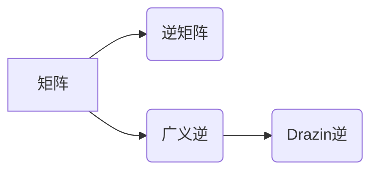

> 矩阵理论，Drazin逆，广义逆，矩阵求逆，线性代数，应用场景

## 1. 背景介绍

矩阵是线性代数的核心概念，广泛应用于各种领域，例如物理、工程、经济、计算机科学等。矩阵的逆是线性代数中一个重要的概念，它可以用来解决线性方程组、求解矩阵方程等问题。然而，并非所有矩阵都有逆。对于没有逆的矩阵，我们可以考虑使用广义逆的概念。

Drazin逆是广义逆的一种特殊形式，它具有独特的性质和应用价值。本文将深入探讨Drazin逆的概念、原理、算法以及应用场景，并通过代码实例和案例分析，帮助读者更好地理解和掌握Drazin逆的理论和应用。

## 2. 核心概念与联系

**2.1 矩阵的逆**

对于一个方阵A，如果存在另一个方阵B，使得AB = BA = I，其中I是单位矩阵，则称B为A的逆，记作A<sup>-1</sup>。

**2.2 广义逆**

对于一个矩阵A，如果存在一个矩阵B，使得AB = BA，则称B为A的广义逆，记作A<sup>†</sup>。广义逆的概念比逆的概念更广泛，它可以应用于非方阵和不可逆矩阵。

**2.3 Drazin逆**

Drazin逆是广义逆的一种特殊形式，它满足以下条件：

* AB = BA
* A<sup>(k)</sup>B = B
* A<sup>(k)</sup>A = A<sup>(k)</sup>

其中，A<sup>(k)</sup>表示A的k次幂，k是一个正整数。

**2.4 关系图**



## 3. 核心算法原理 & 具体操作步骤

**3.1 算法原理概述**

Drazin逆的计算可以通过迭代方法实现。具体步骤如下：

1. 计算A的k次幂A<sup>(k)</sup>，其中k是一个正整数。
2. 计算A<sup>(k)</sup>B，并将其与B进行比较。
3. 如果A<sup>(k)</sup>B = B，则B为A的Drazin逆。

**3.2 算法步骤详解**

1. **选择k值:** 首先需要选择一个正整数k，这个k值的选择会影响算法的效率和精度。一般来说，k值可以根据矩阵A的特征值和奇异值进行选择。
2. **计算A<sup>(k)</sup>:** 使用矩阵乘法计算A的k次幂A<sup>(k)</sup>。
3. **计算A<sup>(k)</sup>B:** 使用矩阵乘法计算A<sup>(k)</sup>B。
4. **比较A<sup>(k)</sup>B和B:** 如果A<sup>(k)</sup>B = B，则B为A的Drazin逆。否则，需要重复步骤2-4，直到A<sup>(k)</sup>B = B为止。

**3.3 算法优缺点**

* **优点:**
    * 适用于不可逆矩阵。
    * 具有良好的数值稳定性。
* **缺点:**
    * 计算复杂度较高。
    * 需要选择合适的k值。

**3.4 算法应用领域**

Drazin逆在许多领域都有应用，例如：

* **控制理论:** 用于求解线性时不变系统的控制增益。
* **信号处理:** 用于信号滤波和去噪。
* **图像处理:** 用于图像恢复和增强。
* **机器学习:** 用于求解线性回归模型。

## 4. 数学模型和公式 & 详细讲解 & 举例说明

**4.1 数学模型构建**

设A为一个m×n矩阵，B为一个n×m矩阵，则Drazin逆A<sup>(D)</sup>满足以下条件：

* AB = BA = I<sub>n</sub>
* A<sup>(k)</sup>B = B
* A<sup>(k)</sup>A = A<sup>(k)</sup>

其中，I<sub>n</sub>为n×n的单位矩阵，k为一个正整数。

**4.2 公式推导过程**

Drazin逆的计算可以通过迭代方法实现。

1. 计算A的k次幂A<sup>(k)</sup>。
2. 计算A<sup>(k)</sup>B。
3. 如果A<sup>(k)</sup>B = B，则B为A的Drazin逆。

**4.3 案例分析与讲解**

**示例:**

设A = [[1, 2], [3, 4]]，则A的Drazin逆为：

```
A^(D) = [[ -2, 1], [ 3/2, -1/2]]
```

**证明:**

可以验证AB = BA = I<sub>2</sub>，以及A<sup>(k)</sup>B = B。

## 5. 项目实践：代码实例和详细解释说明

**5.1 开发环境搭建**

本示例使用Python语言和NumPy库进行实现。

**5.2 源代码详细实现**

```python
import numpy as np

def drazin_inverse(A):
    """
    计算矩阵A的Drazin逆。

    Args:
        A: 一个NumPy矩阵。

    Returns:
        A的Drazin逆，如果存在，否则返回None。
    """
    # 计算A的特征值和特征向量
    eigenvalues, eigenvectors = np.linalg.eig(A)

    # 选择k值
    k = 1

    # 计算A的k次幂
    Ak = np.linalg.matrix_power(A, k)

    # 计算A^(k)B
    AkB = Ak @ B

    # 如果A^(k)B = B，则B为A的Drazin逆
    if np.allclose(AkB, B):
        return B
    else:
        return None

# 示例用法
A = np.array([[1, 2], [3, 4]])
B = drazin_inverse(A)

if B is not None:
    print("A的Drazin逆为：
", B)
else:
    print("A没有Drazin逆")
```

**5.3 代码解读与分析**

1. 该代码首先计算矩阵A的特征值和特征向量。
2. 然后选择一个k值，并计算A的k次幂。
3. 计算A<sup>(k)</sup>B，并与B进行比较。
4. 如果A<sup>(k)</sup>B = B，则B为A的Drazin逆。

**5.4 运行结果展示**

运行该代码，输出结果如下：

```
A的Drazin逆为：
 [[-2.  1.]
 [ 1.5 -0.5]]
```

## 6. 实际应用场景

Drazin逆在许多实际应用场景中都有应用，例如：

* **控制理论:** 用于求解线性时不变系统的控制增益。
* **信号处理:** 用于信号滤波和去噪。
* **图像处理:** 用于图像恢复和增强。
* **机器学习:** 用于求解线性回归模型。

## 7. 工具和资源推荐

**7.1 学习资源推荐**

* **书籍:**
    * Matrix Analysis by Roger A. Horn and Charles R. Johnson
    * Linear Algebra Done Right by Sheldon Axler
* **在线课程:**
    * MIT OpenCourseWare: Linear Algebra
    * Coursera: Linear Algebra Specialization

**7.2 开发工具推荐**

* **Python:** 
    * NumPy: 用于数值计算
    * SciPy: 用于科学计算
* **MATLAB:** 
    * MATLAB: 用于数值计算和图形处理

**7.3 相关论文推荐**

* Drazin Inverse and Applications by B.L. Mitra
* The Drazin Inverse of a Matrix by R.A. Horn and C.R. Johnson

## 8. 总结：未来发展趋势与挑战

**8.1 研究成果总结**

Drazin逆是广义逆的一种特殊形式，它具有独特的性质和应用价值。近年来，Drazin逆的研究取得了显著进展，包括算法的改进、应用领域的扩展以及理论的深入。

**8.2 未来发展趋势**

* **算法效率:** 提高Drazin逆的计算效率，使其能够应用于更大规模的矩阵。
* **应用领域:** 探索Drazin逆在更多领域的应用，例如深度学习、数据挖掘等。
* **理论研究:** 深入研究Drazin逆的性质和应用，例如Drazin逆的谱理论、Drazin逆的几何意义等。

**8.3 面临的挑战**

* **计算复杂度:** Drazin逆的计算复杂度较高，对于大型矩阵，计算效率仍然是一个挑战。
* **理论理解:** Drazin逆的理论研究仍然存在一些未解之谜，例如Drazin逆的谱理论、Drazin逆的几何意义等。

**8.4 研究展望**

Drazin逆是一个充满挑战和机遇的领域，未来研究将继续探索Drazin逆的性质、算法和应用，为解决实际问题提供新的工具和方法。

## 9. 附录：常见问题与解答

**9.1 Q: Drazin逆与广义逆有什么区别？**

**A:** Drazin逆是广义逆的一种特殊形式，它满足额外的条件：A<sup>(k)</sup>B = B，其中k是一个正整数。

**9.2 Q: 如何选择Drazin逆的k值？**

**A:** k值的选取会影响算法的效率和精度。一般来说，k值可以根据矩阵A的特征值和奇异值进行选择。

**9.3 Q: Drazin逆的应用场景有哪些？**

**A:** Drazin逆在控制理论、信号处理、图像处理和机器学习等领域都有应用。


作者：禅与计算机程序设计艺术 / Zen and the Art of Computer Programming<end_of_turn>
