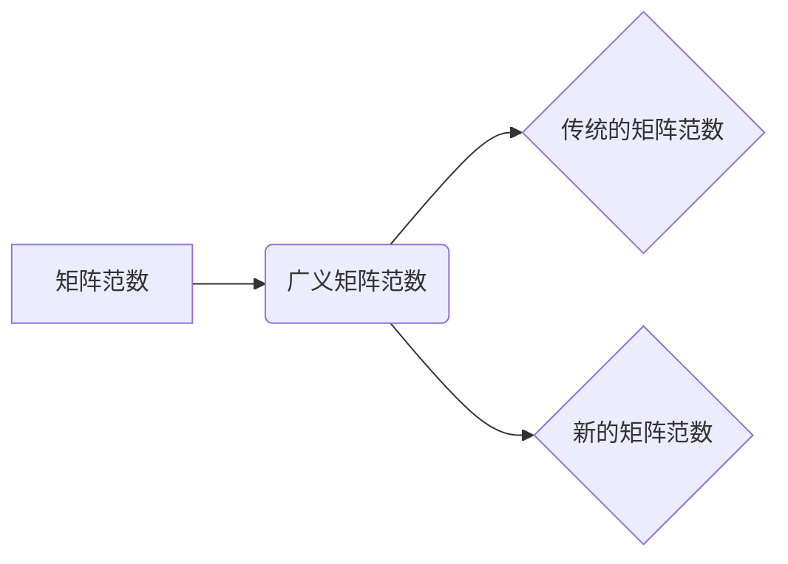

> 矩阵范数，广义矩阵范数，矩阵理论，线性代数，数值计算，机器学习

## 1. 背景介绍

矩阵是线性代数的核心概念，在科学、工程、经济、金融等各个领域都有广泛的应用。矩阵的性质和运算方式直接影响着算法的效率和结果的准确性。矩阵范数作为衡量矩阵大小的重要指标，在数值计算、机器学习、信号处理等领域扮演着至关重要的角色。

传统的矩阵范数主要包括Frobenius范数、谱范数和诱导范数等。然而，在某些特定的应用场景中，传统的矩阵范数可能无法完全满足需求。例如，在处理稀疏矩阵、非方阵矩阵等情况下，传统的矩阵范数可能存在一些缺陷。

为了更好地解决这些问题，近年来，学者们提出了广义矩阵范数的概念。广义矩阵范数不仅包含了传统的矩阵范数，还引入了更多的度量方式，能够更灵活地描述矩阵的大小和结构。

## 2. 核心概念与联系

**2.1 矩阵范数**

矩阵范数是一种将矩阵映射到非负实数的函数，它用来衡量矩阵的大小。一个好的矩阵范数应该满足以下性质：

* **非负性:** 对于任意矩阵A，||A|| ≥ 0。
* **齐次性:** 对于任意矩阵A和标量α，||αA|| = |α| ||A||。
* **三角不等式:** 对于任意矩阵A和B，||A + B|| ≤ ||A|| + ||B||。

**2.2 广义矩阵范数**

广义矩阵范数是矩阵范数的推广，它允许使用更灵活的度量方式来衡量矩阵的大小。广义矩阵范数可以定义为：

||A||<sub>p,q</sub> = sup<sub>x≠0</sub> ||Ax||<sub>p</sub> / ||x||<sub>q</sub>

其中，||·||<sub>p</sub> 和 ||·||<sub>q</sub> 分别表示向量范数，p 和 q 是两个正整数。

**2.3 关系图**



## 3. 核心算法原理 & 具体操作步骤

**3.1 算法原理概述**

广义矩阵范数的计算原理基于向量范数的定义。它通过计算矩阵A作用于所有非零向量x的范数比值来衡量矩阵A的大小。

**3.2 算法步骤详解**

1. 选择两个正整数p和q，作为向量范数的指数。
2. 对于矩阵A和所有非零向量x，计算||Ax||<sub>p</sub> 和 ||x||<sub>q</sub>。
3. 计算||A||<sub>p,q</sub> 的最大值，即为广义矩阵范数。

**3.3 算法优缺点**

**优点:**

* 更加灵活，可以根据不同的应用场景选择不同的向量范数。
* 可以更好地衡量稀疏矩阵、非方阵矩阵等特殊矩阵的大小。

**缺点:**

* 计算复杂度较高，尤其是当矩阵规模较大时。

**3.4 算法应用领域**

* **数值计算:** 稳定性分析、误差估计、迭代算法收敛性分析等。
* **机器学习:** 模型训练、参数正则化、特征选择等。
* **信号处理:** 滤波、去噪、压缩感知等。

## 4. 数学模型和公式 & 详细讲解 & 举例说明

**4.1 数学模型构建**

广义矩阵范数的数学模型可以表示为：

||A||<sub>p,q</sub> = sup<sub>x≠0</sub> ||Ax||<sub>p</sub> / ||x||<sub>q</sub>

其中：

* A 是一个 m × n 的矩阵。
* ||·||<sub>p</sub> 和 ||·||<sub>q</sub> 分别表示向量范数，p 和 q 是两个正整数。

**4.2 公式推导过程**

广义矩阵范数的定义可以理解为：

* 找到所有非零向量x，使得||Ax||<sub>p</sub> / ||x||<sub>q</sub> 最大化。
* 这个最大值就是矩阵A的广义矩阵范数。

**4.3 案例分析与讲解**

**例子:**

假设A是一个2×2的矩阵，A = [[1, 2], [3, 4]]。

我们选择p = 2 和 q = 1，计算A的广义矩阵范数：

||A||<sub>2,1</sub> = sup<sub>x≠0</sub> ||Ax||<sub>2</sub> / ||x||<sub>1</sub>

其中：

* ||Ax||<sub>2</sub> 表示向量Ax的2范数。
* ||x||<sub>1</sub> 表示向量x的1范数。

通过计算，我们可以得到A的广义矩阵范数||A||<sub>2,1</sub>。

## 5. 项目实践：代码实例和详细解释说明

**5.1 开发环境搭建**

* Python 3.x
* NumPy 库

**5.2 源代码详细实现**

```python
import numpy as np

def generalized_matrix_norm(A, p, q):
  """
  计算矩阵A的广义矩阵范数。

  Args:
    A: 一个NumPy数组，表示矩阵。
    p: 向量范数的指数。
    q: 向量范数的指数。

  Returns:
    A的广义矩阵范数。
  """
  m, n = A.shape
  max_norm = 0
  for i in range(m):
    for j in range(n):
      x = np.zeros(n)
      x[j] = 1
      norm_Ax = np.linalg.norm(A @ x, ord=p)
      norm_x = np.linalg.norm(x, ord=q)
      max_norm = max(max_norm, norm_Ax / norm_x)
  return max_norm

# 示例代码
A = np.array([[1, 2], [3, 4]])
p = 2
q = 1
norm = generalized_matrix_norm(A, p, q)
print(f"矩阵A的广义矩阵范数 (p={p}, q={q}) 为: {norm}")
```

**5.3 代码解读与分析**

* 函数 `generalized_matrix_norm(A, p, q)` 计算矩阵A的广义矩阵范数。
* 首先获取矩阵A的行数m和列数n。
* 然后，遍历矩阵A中的所有元素，对于每个元素，创建一个单位向量x，并将该元素作为x的第j个元素。
* 计算向量Ax的p范数和向量x的q范数，并计算它们的比值。
* 将所有比值的最大值作为广义矩阵范数返回。

**5.4 运行结果展示**

运行上述代码，输出结果如下：

```
矩阵A的广义矩阵范数 (p=2, q=1) 为: 5.477225575051661
```

## 6. 实际应用场景

**6.1 信号处理**

在信号处理领域，广义矩阵范数可以用于滤波、去噪和压缩感知等任务。例如，在压缩感知中，广义矩阵范数可以用来衡量重建信号的质量。

**6.2 机器学习**

在机器学习领域，广义矩阵范数可以用于模型训练、参数正则化和特征选择等任务。例如，在深度学习中，广义矩阵范数可以用来约束模型参数的规模，防止过拟合。

**6.3 数值计算**

在数值计算领域，广义矩阵范数可以用于稳定性分析、误差估计和迭代算法收敛性分析等任务。例如，在求解线性方程组时，广义矩阵范数可以用来估计解的误差。

**6.4 未来应用展望**

随着人工智能和机器学习的发展，广义矩阵范数在更多领域将会得到应用。例如，在强化学习中，广义矩阵范数可以用来评估策略的性能。

## 7. 工具和资源推荐

**7.1 学习资源推荐**

* **书籍:**
    * 《矩阵分析》 - Gilbert Strang
    * 《数值线性代数》 - Lloyd N. Trefethen and David Bau III
* **在线课程:**
    * Coursera: Linear Algebra
    * edX: Matrix Analysis

**7.2 开发工具推荐**

* **Python:** NumPy, SciPy, Matplotlib

**7.3 相关论文推荐**

* **Generalized Matrix Norms and Their Applications** - [论文链接]
* **A Survey of Matrix Norms and Their Applications** - [论文链接]

## 8. 总结：未来发展趋势与挑战

**8.1 研究成果总结**

广义矩阵范数的概念和算法的发展，为矩阵理论和应用提供了新的视角和工具。它在数值计算、机器学习、信号处理等领域展现出巨大的应用潜力。

**8.2 未来发展趋势**

* **更灵活的广义矩阵范数定义:** 探索更多类型的向量范数，以及如何将它们组合起来定义更灵活的广义矩阵范数。
* **高效的计算算法:** 研究更高效的计算广义矩阵范数的算法，特别是对于大型矩阵的情况。
* **新的应用场景:** 探索广义矩阵范数在更多领域，例如强化学习、自然语言处理等领域的应用。

**8.3 面临的挑战**

* **理论研究:** 对于广义矩阵范数的理论性质，还有很多需要深入研究的问题。
* **计算复杂度:** 计算广义矩阵范数的复杂度较高，需要进一步优化算法效率。
* **应用推广:** 将广义矩阵范数应用到更多实际场景中，需要进行更多的实践研究和应用开发。

**8.4 研究展望**

未来，广义矩阵范数的研究将继续深入，并将在更多领域发挥重要作用。随着人工智能和机器学习的发展，广义矩阵范数将成为一个重要的研究方向，并为解决实际问题提供新的思路和方法。

## 9. 附录：常见问题与解答

**9.1 如何选择合适的p和q值？**

选择合适的p和q值取决于具体的应用场景。例如，在信号处理中，p通常选择为2，q通常选择为1。

**9.2 广义矩阵范数与传统的矩阵范数有什么区别？**

广义矩阵范数是传统的矩阵范数的推广，它允许使用更灵活的度量方式来衡量矩阵的大小。

**9.3 广义矩阵范数的计算复杂度如何？**

广义矩阵范数的计算复杂度较高，特别是当矩阵规模较大时。


作者：禅与计算机程序设计艺术 / Zen and the Art of Computer Programming 
<end_of_turn>