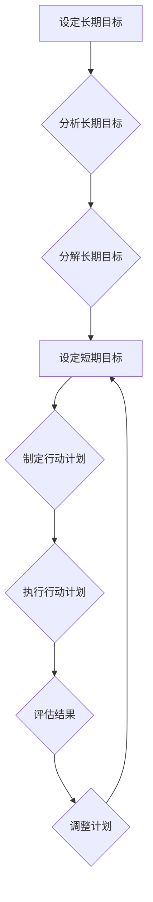

> 意识管理，短期目标，长期目标，时间管理，优先级排序，专注力，目标设定，自我激励，个人成长

## 1. 背景介绍

在当今快节奏的社会，我们每个人都面临着来自各方面的压力和挑战。工作、学习、生活，各种任务和目标交织在一起，很容易让我们感到迷茫和不知所措。如何有效地管理时间和精力，实现个人目标，成为了一个至关重要的议题。

意识管理作为一种重要的个人成长工具，可以帮助我们更好地理解自己，明确目标，提高效率，最终实现自我价值。而短期目标和长期目标的意识管理，则是意识管理的核心内容之一。

## 2. 核心概念与联系

**2.1 短期目标与长期目标**

短期目标是指在短期内（通常在几个月或几年内）可以实现的目标，例如完成一个项目、学习一项新技能、减肥等。长期目标是指在较长的时间内（通常在几年或更长时间内）可以实现的目标，例如获得学位、创业成功、实现财务自由等。

**2.2 意识管理**

意识管理是指通过提高自我觉察能力，了解自己的想法、情绪、行为模式，并有意识地引导和调整这些因素，从而达到提升自我效能、实现个人目标的目的。

**2.3 核心概念联系**

短期目标和长期目标是相互关联的，短期目标是实现长期目标的基石。通过设定和完成一个个短期目标，我们可以逐步积累经验和能力，最终实现长期目标。而意识管理则可以帮助我们更好地制定和执行短期和长期目标。

**2.4 流程图**



## 3. 核心算法原理 & 具体操作步骤

**3.1 算法原理概述**

短期目标与长期目标的意识管理，本质上是一种目标分解和时间管理的算法。

**3.2 算法步骤详解**

1. **设定长期目标:** 明确自己想要达成的最终目标，并将其描述得清晰、具体、可衡量、可实现、相关和有时间限制（SMART）。
2. **分析长期目标:** 深入思考长期目标的内涵，分析实现该目标所需的资源、能力、时间和条件。
3. **分解长期目标:** 将长期目标分解成多个可实现的短期目标，每个短期目标都应该与长期目标密切相关，并具有明确的截止日期。
4. **设定短期目标:** 为每个短期目标设定具体的行动计划，包括需要完成的任务、所需的时间、所需的资源和评估标准。
5. **制定行动计划:** 制定详细的行动计划，将短期目标分解成更小的任务，并安排执行时间和顺序。
6. **执行行动计划:** 按照计划执行任务，并定期跟踪进度和效果。
7. **评估结果:** 定期评估短期目标的完成情况，并根据实际情况调整行动计划。
8. **调整计划:** 根据评估结果，对行动计划进行调整，确保能够有效地实现短期目标，最终实现长期目标。

**3.3 算法优缺点**

* **优点:**

    * 能够帮助我们更好地理解和实现个人目标。
    * 能够提高时间管理效率，避免时间浪费。
    * 能够增强自我激励和执行力。
    * 能够促进个人成长和发展。

* **缺点:**

    * 需要花费时间和精力进行目标设定和计划制定。
    * 需要具备一定的自我管理能力和自律性。
    * 可能会遇到不可预见的变故，需要灵活调整计划。

**3.4 算法应用领域**

* 个人成长和发展
* 工作和学习效率提升
* 项目管理和时间管理
* 创业和创新

## 4. 数学模型和公式 & 详细讲解 & 举例说明

**4.1 数学模型构建**

我们可以用一个简单的数学模型来描述短期目标和长期目标之间的关系：

```latex
L = \sum_{i=1}^{n} S_i
```

其中：

* L 代表长期目标
* S_i 代表第 i 个短期目标
* n 代表短期目标的数量

**4.2 公式推导过程**

这个公式表明，长期目标可以看作是多个短期目标的总和。也就是说，通过完成一个个短期目标，我们可以逐步积累经验和能力，最终实现长期目标。

**4.3 案例分析与讲解**

例如，假设我们的长期目标是“成为一名优秀的软件工程师”。我们可以将其分解成以下几个短期目标：

* 学习编程基础知识
* 掌握至少一种编程语言
* 完成一个小型软件项目
* 参加开源项目贡献
* 积累工作经验

通过完成这些短期目标，我们可以逐步积累所需的知识、技能和经验，最终实现长期目标。

## 5. 项目实践：代码实例和详细解释说明

**5.1 开发环境搭建**

为了更好地理解短期目标和长期目标的意识管理，我们可以使用代码来实现一个简单的目标管理工具。

**5.2 源代码详细实现**

```python
class Goal:
    def __init__(self, name, description, deadline):
        self.name = name
        self.description = description
        self.deadline = deadline
        self.status = "未完成"

    def update_status(self, status):
        self.status = status

    def __str__(self):
        return f"目标名称: {self.name}
描述: {self.description}
截止日期: {self.deadline}
状态: {self.status}"

class GoalManager:
    def __init__(self):
        self.goals = []

    def add_goal(self, goal):
        self.goals.append(goal)

    def view_goals(self):
        for goal in self.goals:
            print(goal)

    def update_goal_status(self, goal_name, status):
        for goal in self.goals:
            if goal.name == goal_name:
                goal.update_status(status)
                print(f"目标 '{goal_name}' 状态已更新为 '{status}'")
                return
        print(f"目标 '{goal_name}' 不存在")

# 示例用法
manager = GoalManager()
manager.add_goal(Goal("学习Python", "掌握Python编程基础", "2024-03-31"))
manager.add_goal(Goal("完成项目", "开发一个简单的网站", "2024-06-30"))
manager.view_goals()
manager.update_goal_status("学习Python", "已完成")
manager.view_goals()
```

**5.3 代码解读与分析**

这个代码实现了一个简单的目标管理工具，包含了目标类和目标管理类。

* **Goal类:** 代表一个目标，包含目标名称、描述、截止日期和状态等属性。
* **GoalManager类:** 管理多个目标，提供添加目标、查看目标、更新目标状态等功能。

**5.4 运行结果展示**

运行代码后，可以查看添加的目标信息，并更新目标状态。

## 6. 实际应用场景

**6.1 个人目标管理**

我们可以使用这个工具来管理个人学习、工作、生活等方面的目标。例如，我们可以设定学习新技能、完成项目、减肥等短期目标，并将其分解成更小的任务，最终实现长期目标。

**6.2 项目管理**

在项目管理中，我们可以使用这个工具来管理项目任务和进度。例如，我们可以将项目分解成多个子任务，并分配给不同的团队成员，并跟踪每个任务的完成情况。

**6.3 学习计划**

学生可以使用这个工具来制定学习计划，并跟踪学习进度。例如，我们可以设定学习某个课程的短期目标，并将其分解成更小的学习任务，例如阅读教材、完成练习题、参加讨论等。

**6.4 未来应用展望**

随着人工智能技术的不断发展，目标管理工具将会更加智能化和个性化。未来，我们可以期待看到能够自动生成目标计划、提供个性化建议、并根据用户行为进行动态调整的目标管理工具。

## 7. 工具和资源推荐

**7.1 学习资源推荐**

* **书籍:**
    * 《Getting Things Done: The Art of Stress-Free Productivity》
    * 《Atomic Habits: An Easy & Proven Way to Build Good Habits & Break Bad Ones》
    * 《The 7 Habits of Highly Effective People》

* **网站:**
    * https://www.zenhabits.net/
    * https://www.lifehacker.com/
    * https://www.mindtools.com/

**7.2 开发工具推荐**

* **Trello:** https://trello.com/
* **Asana:** https://asana.com/
* **Todoist:** https://todoist.com/

**7.3 相关论文推荐**

* **Goal Setting Theory:** Locke, E. A., & Latham, G. P. (2002). Building a practically useful theory of goal setting and task motivation: A 35-year odyssey. American Psychologist, 57(9), 705-717.
* **Self-Regulation Theory:** Carver, C. S., & Scheier, M. F. (1981).  Attention and self-regulation: A control-theory approach to human behavior. New York: Springer.

## 8. 总结：未来发展趋势与挑战

**8.1 研究成果总结**

短期目标与长期目标的意识管理，已经成为个人成长和发展的重要工具。通过设定和完成一个个短期目标，我们可以逐步积累经验和能力，最终实现长期目标。

**8.2 未来发展趋势**

未来，目标管理工具将会更加智能化和个性化。人工智能技术将会被应用于目标设定、计划制定、进度跟踪等方面，为用户提供更加个性化的服务。

**8.3 面临的挑战**

* 如何更好地理解用户的需求和目标，并提供更加个性化的服务。
* 如何提高目标管理工具的智能化水平，使其能够更加准确地预测用户行为和提供建议。
* 如何确保目标管理工具的安全性、可靠性和隐私性。

**8.4 研究展望**

未来，我们将继续研究短期目标与长期目标的意识管理，探索更有效的目标管理方法，并开发更加智能化、个性化的目标管理工具，帮助人们更好地实现个人目标。

## 9. 附录：常见问题与解答

**9.1 如何设定有效的短期目标？**

* **SMART原则:** 目标应该具体、可衡量、可实现、相关和有时间限制。
* **分解长期目标:** 将长期目标分解成多个可实现的短期目标。
* **优先级排序:** 根据目标的重要性进行排序，优先完成重要的目标。

**9.2 如何保持目标管理的持续性？**

* **定期回顾和调整:** 定期回顾目标进度和计划，并根据实际情况进行调整。
* **建立良好的习惯:** 将目标管理纳入日常工作和生活习惯。
* **寻求支持和鼓励:** 与朋友、家人或导师分享目标，并寻求他们的支持和鼓励。


作者：禅与计算机程序设计艺术 / Zen and the Art of Computer Programming 
<end_of_turn>