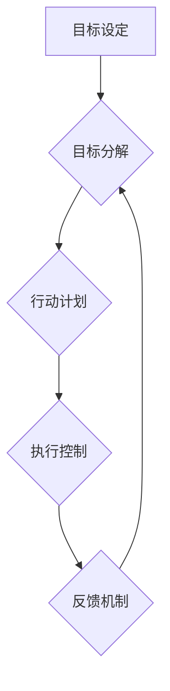

>  短期目标、意识功能、认知科学、时间管理、效率提升、目标分解、行动计划、反馈机制

## 1. 背景介绍

在当今快节奏的社会中，高效地管理时间和精力至关重要。我们每天面临着无数的任务和挑战，如何有效地规划和执行目标，才能在纷繁复杂的现实中保持专注和前进的动力？短期目标管理作为一种重要的时间管理方法，能够帮助我们更好地聚焦当下，提升效率，实现个人和团队的目标。

意识功能在短期目标管理中扮演着至关重要的角色。它指我们对自身目标、任务和环境的感知、理解和控制能力。通过提升意识功能，我们可以更清晰地认识自己的目标，更有效地分解任务，更精准地执行行动，最终实现目标的达成。

## 2. 核心概念与联系

**2.1 短期目标**

短期目标是指在短期内（通常为几天、几周或几个月）可实现的目标。它通常是长期目标的分解产物，是实现长期目标的步骤和里程碑。

**2.2 意识功能**

意识功能是指我们对自身目标、任务和环境的感知、理解和控制能力。它包括以下几个方面：

* **目标感知:** 明确认识自己的目标是什么，以及这些目标的优先级和重要性。
* **任务分解:** 将复杂的长期目标分解成一系列可执行的短期目标和任务。
* **行动计划:** 制定详细的行动计划，明确每个任务的步骤、时间安排和资源需求。
* **执行控制:** 能够集中注意力，克服干扰，高效地执行行动计划。
* **反馈机制:** 定期评估行动效果，及时调整计划，确保目标的达成。

**2.3 核心概念联系**

短期目标管理的核心在于利用意识功能，将长期目标分解成可执行的短期目标，并制定相应的行动计划，最终实现目标的达成。

**Mermaid 流程图**



## 3. 核心算法原理 & 具体操作步骤

**3.1 算法原理概述**

短期目标管理的核心算法原理是基于“分解、计划、执行、反馈”的循环模式。

* **分解:** 将长期目标分解成一系列可执行的短期目标。
* **计划:** 为每个短期目标制定详细的行动计划。
* **执行:** 按照计划高效地执行行动。
* **反馈:** 定期评估行动效果，及时调整计划。

**3.2 算法步骤详解**

1. **设定长期目标:** 明确自己想要达成的长期目标。
2. **分解长期目标:** 将长期目标分解成一系列可执行的短期目标。
3. **设定短期目标:** 为每个短期目标设定具体的、可衡量的、可实现的、相关的和有时间限制的目标（SMART）。
4. **制定行动计划:** 为每个短期目标制定详细的行动计划，包括具体步骤、时间安排和资源需求。
5. **执行行动计划:** 按照计划高效地执行行动。
6. **跟踪进度:** 定期跟踪行动进度，确保按计划执行。
7. **评估效果:** 定期评估行动效果，分析成功和失败的原因。
8. **调整计划:** 根据评估结果，及时调整行动计划，优化执行策略。

**3.3 算法优缺点**

**优点:**

* **提高效率:** 通过分解目标和制定计划，可以提高执行效率，避免精力分散。
* **增强专注力:** 将注意力集中在短期目标上，可以增强专注力，提高工作质量。
* **增强动力:** 逐步完成短期目标，可以带来成就感，增强动力，激励继续前进。

**缺点:**

* **过于机械化:** 如果过于注重计划和执行，可能会忽略灵活性和创造性。
* **缺乏全局视野:** 过于关注短期目标，可能会忽略长期目标的整体规划。
* **容易产生压力:** 如果短期目标设定过高或过于密集，可能会导致压力过大。

**3.4 算法应用领域**

短期目标管理方法广泛应用于各个领域，例如：

* **个人时间管理:** 帮助个人高效地安排时间，完成工作和学习任务。
* **团队协作:** 帮助团队成员明确目标，协同完成项目。
* **项目管理:** 帮助项目经理分解项目任务，制定计划，跟踪进度，确保项目顺利完成。
* **个人成长:** 帮助个人设定目标，制定计划，实现个人成长。

## 4. 数学模型和公式 & 详细讲解 & 举例说明

**4.1 数学模型构建**

我们可以用一个简单的数学模型来描述短期目标管理的过程：

```
T = Σ(S_i)
```

其中：

* T 代表长期目标
* S_i 代表每个短期目标

**4.2 公式推导过程**

这个公式表明，长期目标可以看作是多个短期目标的总和。通过分解长期目标，我们可以将复杂的目标分解成一系列可管理的短期目标，从而更容易实现。

**4.3 案例分析与讲解**

例如，假设一个人的长期目标是“成为一名优秀的程序员”。我们可以将其分解成以下几个短期目标：

* 学习Python编程语言
* 完成一个简单的个人项目
* 参加一个编程竞赛
* 找到一份编程工作

通过完成这些短期目标，最终可以实现长期目标。

## 5. 项目实践：代码实例和详细解释说明

**5.1 开发环境搭建**

为了演示短期目标管理的实践应用，我们可以使用Python语言开发一个简单的任务管理工具。

**开发环境:**

* Python 3.x
* Jupyter Notebook

**5.2 源代码详细实现**

```python
class Task:
    def __init__(self, name, description, due_date):
        self.name = name
        self.description = description
        self.due_date = due_date
        self.completed = False

    def mark_complete(self):
        self.completed = True

    def __str__(self):
        return f"Task: {self.name}
Description: {self.description}
Due Date: {self.due_date}
Completed: {self.completed}"

class TaskManager:
    def __init__(self):
        self.tasks = []

    def add_task(self, name, description, due_date):
        task = Task(name, description, due_date)
        self.tasks.append(task)
        print(f"Task '{name}' added successfully.")

    def view_tasks(self):
        if not self.tasks:
            print("No tasks added yet.")
            return

        for i, task in enumerate(self.tasks):
            print(f"{i+1}. {task}")

    def mark_task_complete(self, task_index):
        if 0 <= task_index < len(self.tasks):
            self.tasks[task_index].mark_complete()
            print(f"Task '{self.tasks[task_index].name}' marked as complete.")
        else:
            print("Invalid task index.")

# Example usage
manager = TaskManager()
manager.add_task("Learn Python", "Study Python programming concepts", "2023-12-31")
manager.add_task("Build a website", "Create a personal website using Python", "2024-01-15")
manager.view_tasks()
manager.mark_task_complete(0)
manager.view_tasks()
```

**5.3 代码解读与分析**

这段代码实现了一个简单的任务管理工具。

* `Task` 类定义了一个任务的结构，包括任务名称、描述、截止日期和完成状态。
* `TaskManager` 类管理多个任务，提供添加任务、查看任务、标记任务完成等功能。

**5.4 运行结果展示**

运行这段代码，可以创建一个任务管理工具，添加任务、查看任务列表、标记任务完成等操作。

## 6. 实际应用场景

**6.1 个人时间管理**

我们可以使用短期目标管理方法来规划每天的工作和学习任务，提高时间利用率。例如，我们可以将每天的工作分解成几个小时的时段，每个时段完成一个特定的任务，并设定相应的截止时间。

**6.2 团队协作**

在团队协作中，我们可以使用短期目标管理方法来分解项目任务，分配给不同的团队成员，并制定相应的进度计划。

**6.3 项目管理**

在项目管理中，我们可以使用短期目标管理方法来分解项目目标，制定详细的项目计划，并跟踪项目进度，确保项目按计划完成。

**6.4 未来应用展望**

随着人工智能技术的不断发展，短期目标管理方法将更加智能化和个性化。未来，我们可以期待看到以下应用场景：

* **智能目标设定:** 基于个人目标、能力和时间安排，智能系统可以自动设定个性化的短期目标。
* **智能计划生成:** 基于任务内容、时间限制和资源需求，智能系统可以自动生成最佳的行动计划。
* **智能进度跟踪:** 智能系统可以实时跟踪任务进度，并根据实际情况自动调整计划。
* **个性化反馈:** 智能系统可以根据个人行为和反馈，提供个性化的建议和指导。

## 7. 工具和资源推荐

**7.1 学习资源推荐**

* **书籍:**
    * 《Getting Things Done: The Art of Stress-Free Productivity》 by David Allen
    * 《Atomic Habits: An Easy & Proven Way to Build Good Habits & Break Bad Ones》 by James Clear
* **在线课程:**
    * Coursera: Time Management
    * Udemy: Productivity Mastery

**7.2 开发工具推荐**

* **任务管理工具:**
    * Todoist
    * Asana
    * Trello
* **笔记工具:**
    * Evernote
    * Notion
    * OneNote

**7.3 相关论文推荐**

* **The Science of Goal Setting and Achievement** by Locke and Latham
* **Mindfulness and Goal Pursuit: A Meta-Analysis** by Brown and Ryan

## 8. 总结：未来发展趋势与挑战

**8.1 研究成果总结**

短期目标管理方法已经取得了显著的成果，帮助人们提高效率、增强专注力和实现目标。

**8.2 未来发展趋势**

未来，短期目标管理方法将更加智能化、个性化和自动化。

**8.3 面临的挑战**

* 如何更好地结合短期目标管理与长期目标规划，避免过度关注短期目标而忽略长期目标。
* 如何克服人们的惰性和拖延心理，提高短期目标的执行效率。
* 如何确保短期目标管理方法的公平性和可持续性，避免过度依赖技术而忽视人性的需求。

**8.4 研究展望**

未来研究将重点关注以下几个方面：

* 开发更智能、更个性化的短期目标管理系统。
* 研究短期目标管理与不同个体、不同文化背景之间的差异。
* 探讨短期目标管理与其他时间管理方法的结合。

## 9. 附录：常见问题与解答

**9.1 如何设定SMART目标？**

SMART目标是指具体的 (Specific)、可衡量的 (Measurable)、可实现的 (Achievable)、相关的 (Relevant) 和有时间限制的 (Time-bound)。

**9.2 如何克服拖延心理？**

* 将任务分解成更小的步骤，更容易完成。
* 设置明确的截止时间，并提醒自己。
* 奖励自己完成任务。
* 找到一个安静、舒适的工作环境。

**9.3 如何平衡短期目标和长期目标？**

* 将长期目标分解成多个短期目标，并确保每个短期目标都与长期目标相关。
* 定期回顾短期目标和长期目标，并进行调整。
* 保持对长期目标的清晰认识，并将其作为行动的动力。


作者：禅与计算机程序设计艺术 / Zen and the Art of Computer Programming 
<end_of_turn>