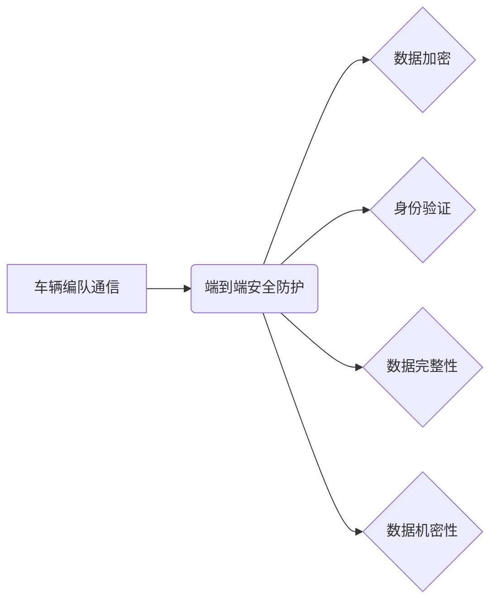

> 自动驾驶,车辆编队,通信安全,端到端,安全防护,网络安全,密码学,区块链

## 1. 背景介绍

随着自动驾驶技术的快速发展，车辆编队技术作为一种提高道路交通效率和安全性的重要手段，逐渐受到广泛关注。车辆编队是指多个车辆按照预定的顺序和距离紧密行驶，通过协同控制和信息共享，实现更优的交通流和行驶体验。然而，车辆编队通信的安全防护问题也日益凸显。

传统的车辆通信系统主要依赖于车载设备和路侧基础设施之间的点对点通信，存在着安全漏洞，容易受到黑客攻击和数据篡改。端到端安全防护技术能够有效解决这些问题，确保车辆编队通信的安全性、可靠性和隐私性。

## 2. 核心概念与联系

**2.1 车辆编队通信**

车辆编队通信是指多个自动驾驶车辆之间进行信息交换和协同控制的通信过程。信息交换包括车辆状态信息、路径规划信息、安全预警信息等，协同控制则通过信息共享实现车辆编队行驶的稳定性和安全性。

**2.2 端到端安全防护**

端到端安全防护是指从发送方到接收方，整个通信过程中的数据始终处于加密状态，只有授权用户才能解密和访问数据。它通过一系列安全技术，例如加密算法、数字签名、身份验证等，确保通信过程中的数据完整性、机密性和不可否认性。

**2.3 核心概念关系图**



## 3. 核心算法原理 & 具体操作步骤

**3.1 算法原理概述**

端到端安全防护的核心算法主要包括：

* **对称加密算法**: 使用相同的密钥对数据进行加密和解密，例如AES算法。
* **非对称加密算法**: 使用一对密钥对进行加密和解密，公钥用于加密，私钥用于解密，例如RSA算法。
* **数字签名**: 使用私钥对数据进行数字签名，验证者使用公钥验证签名，确保数据来源和完整性。
* **身份验证**: 使用用户名、密码、生物识别等方式验证用户的身份，确保只有授权用户才能访问数据。

**3.2 算法步骤详解**

1. **密钥生成**: 使用随机数生成器生成对称密钥或非对称密钥对。
2. **数据加密**: 使用对称密钥或公钥对数据进行加密。
3. **数字签名**: 使用私钥对数据进行数字签名。
4. **数据传输**: 将加密后的数据和数字签名发送到接收方。
5. **数据解密**: 接收方使用私钥或对称密钥解密数据，并使用公钥验证数字签名。

**3.3 算法优缺点**

* **对称加密算法**: 优点是加密速度快，效率高；缺点是密钥分发和管理较为复杂。
* **非对称加密算法**: 优点是密钥分发和管理相对简单；缺点是加密速度慢，效率低。
* **数字签名**: 优点是能够保证数据的完整性和不可否认性；缺点是需要额外的计算资源。
* **身份验证**: 优点是能够确保只有授权用户才能访问数据；缺点是需要复杂的认证机制。

**3.4 算法应用领域**

端到端安全防护算法广泛应用于各种领域，例如：

* **金融交易**: 保护金融交易数据的安全性和隐私性。
* **医疗信息**: 保护患者医疗信息的机密性和完整性。
* **物联网**: 保护物联网设备和数据的安全性和可靠性。
* **自动驾驶**: 保护车辆编队通信数据的安全性和可靠性。

## 4. 数学模型和公式 & 详细讲解 & 举例说明

**4.1 数学模型构建**

车辆编队通信安全防护的数学模型可以描述为一个多方交互系统，其中每个参与方都有自己的密钥和身份信息。系统需要保证以下特性：

* **保密性**: 只有授权用户才能访问数据。
* **完整性**: 数据在传输过程中不会被篡改。
* **不可否认性**: 发送方无法否认发送过数据。
* **身份验证**: 每个参与方都需要进行身份验证。

**4.2 公式推导过程**

* **加密公式**:  C = E(K, M)，其中C为加密后的数据，K为密钥，M为明文数据。
* **解密公式**: M = D(K, C)，其中M为明文数据，K为密钥，C为加密后的数据。
* **数字签名公式**: S = H(M) * Kp，其中S为数字签名，H为哈希函数，M为明文数据，Kp为私钥。
* **数字签名验证公式**: H(M) * Kp = S，其中H为哈希函数，M为明文数据，Kp为公钥，S为数字签名。

**4.3 案例分析与讲解**

假设车辆A想要发送数据M给车辆B，则需要进行以下步骤：

1. 车辆A使用私钥Kp生成数字签名S。
2. 车辆A使用对称密钥K加密数据M，得到加密数据C。
3. 车辆A将加密数据C和数字签名S发送给车辆B。
4. 车辆B使用公钥Kp验证数字签名S，确保数据来源和完整性。
5. 车辆B使用对称密钥K解密数据C，得到明文数据M。

## 5. 项目实践：代码实例和详细解释说明

**5.1 开发环境搭建**

* 操作系统: Ubuntu 20.04
* 编程语言: Python 3.8
* 软件包: OpenSSL, PyCryptodome, Flask

**5.2 源代码详细实现**

```python
# server.py
from flask import Flask, request, jsonify
from cryptography.fernet import Fernet

app = Flask(__name__)

# 生成密钥
key = Fernet.generate_key()
fernet = Fernet(key)

@app.route('/encrypt', methods=['POST'])
def encrypt():
    data = request.get_json()['data']
    encrypted_data = fernet.encrypt(data.encode())
    return jsonify({'encrypted_data': encrypted_data.decode()})

@app.route('/decrypt', methods=['POST'])
def decrypt():
    data = request.get_json()['data']
    decrypted_data = fernet.decrypt(data.encode()).decode()
    return jsonify({'decrypted_data': decrypted_data})

if __name__ == '__main__':
    app.run(debug=True)
```

```python
# client.py
import requests

# 密钥
key = b'...'  # 从服务器获取密钥

# 加密数据
data = 'This is a secret message.'
fernet = Fernet(key)
encrypted_data = fernet.encrypt(data.encode())

# 发送加密数据到服务器
response = requests.post('http://localhost:5000/encrypt', json={'data': encrypted_data.decode()})
print(response.json())

# 解密数据
decrypted_data = fernet.decrypt(response.json()['encrypted_data'].encode()).decode()
print(decrypted_data)
```

**5.3 代码解读与分析**

* **服务器端**: 使用Flask框架构建一个简单的API，提供加密和解密服务。
* **客户端**: 使用requests库发送加密数据到服务器，并接收解密后的数据。
* **加密和解密**: 使用Fernet库实现对称加密和解密。

**5.4 运行结果展示**

运行上述代码，客户端将发送加密数据到服务器，服务器将返回解密后的数据。

## 6. 实际应用场景

**6.1 自动驾驶车辆编队**

在自动驾驶车辆编队中，车辆之间需要实时共享位置、速度、方向等信息，以实现协同控制和安全行驶。端到端安全防护技术可以确保车辆编队通信数据的安全性和可靠性，防止黑客攻击和数据篡改。

**6.2 智能交通系统**

智能交通系统需要收集和分析大量道路交通数据，例如车辆流量、交通拥堵情况等。端到端安全防护技术可以保护这些敏感数据，防止泄露和滥用。

**6.3 无人机编队**

无人机编队技术在物流、农业、监控等领域具有广泛应用前景。端到端安全防护技术可以确保无人机编队通信的安全性，防止恶意攻击和数据泄露。

**6.4 未来应用展望**

随着自动驾驶技术和物联网技术的不断发展，端到端安全防护技术将在更多领域得到应用，例如：

* **智慧城市**: 保护城市基础设施和公共服务的安全性和可靠性。
* **工业互联网**: 保护工业设备和生产数据的安全性和隐私性。
* **医疗远程诊断**: 保护患者医疗数据的机密性和完整性。

## 7. 工具和资源推荐

**7.1 学习资源推荐**

* **书籍**:
    * 《密码学原理与实践》
    * 《网络安全》
    * 《区块链技术》
* **在线课程**:
    * Coursera: Cryptography I
    * edX: Introduction to Cybersecurity
    * Udemy: Blockchain Technology

**7.2 开发工具推荐**

* **加密库**: OpenSSL, PyCryptodome
* **网络安全工具**: Wireshark, Nmap
* **区块链平台**: Ethereum, Hyperledger Fabric

**7.3 相关论文推荐**

* **端到端安全防护**:
    * "End-to-End Secure Communication for Autonomous Vehicles"
    * "A Survey of End-to-End Secure Communication Protocols"
* **车辆编队**:
    * "Cooperative Adaptive Cruise Control: A Review"
    * "Vehicle Platooning: A Review of Technologies and Applications"

## 8. 总结：未来发展趋势与挑战

**8.1 研究成果总结**

端到端安全防护技术在车辆编队通信领域取得了显著进展，能够有效保障车辆编队通信的安全性、可靠性和隐私性。

**8.2 未来发展趋势**

* **人工智能**: 将人工智能技术应用于端到端安全防护，提高安全防护的智能化和自动化程度。
* **区块链**: 利用区块链技术构建去中心化的安全防护系统，增强安全防护的可靠性和抗攻击性。
* **量子计算**: 研究量子计算对端到端安全防护的影响，并开发相应的量子安全防护技术。

**8.3 面临的挑战**

* **密钥管理**: 如何安全地管理和分发密钥，防止密钥泄露和盗用。
* **网络攻击**: 如何应对越来越复杂的网络攻击，例如拒绝服务攻击和中间人攻击。
* **标准化**: 缺乏统一的端到端安全防护标准，导致不同系统之间难以互操作。

**8.4 研究展望**

未来，端到端安全防护技术将继续朝着更加智能化、安全可靠的方向发展，为自动驾驶车辆编队和智能交通系统提供更加强大的安全保障。

## 9. 附录：常见问题与解答

**9.1 如何选择合适的加密算法？**

选择合适的加密算法需要根据具体的应用场景和安全需求进行考虑。对称加密算法速度快，但密钥分发较为复杂；非对称加密算法密钥分发简单，但速度慢。

**9.2 如何防止密钥泄露？**

可以使用硬件安全模块（HSM）存储密钥，并采用多因素身份验证机制来保护密钥。

**9.3 如何应对网络攻击？**

可以使用防火墙、入侵检测系统（IDS）和入侵防御系统（IPS）等安全工具来防御网络攻击。


作者：禅与计算机程序设计艺术 / Zen and the Art of Computer Programming 
<end_of_turn>