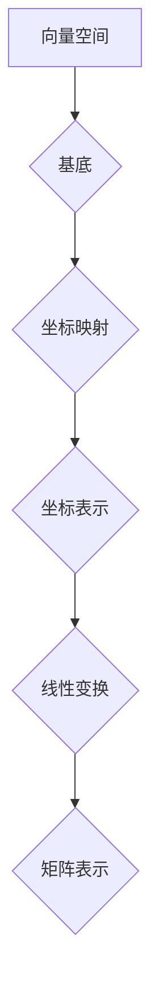

> 线性代数，坐标映射，向量空间，基底，线性变换，矩阵表示，应用场景

## 1. 背景介绍

在计算机科学领域，线性代数扮演着至关重要的角色。它为我们提供了处理数据、建模系统和解决复杂问题的强大工具。其中，坐标映射的概念是线性代数的核心，它揭示了向量空间中元素的表示方式以及线性变换的本质。

坐标映射将向量空间中的向量映射到坐标轴上的坐标值，从而将抽象的向量概念转化为具体的数字表示。这种映射方式使得我们可以用简单的数学运算来处理向量，并利用线性代数的理论来分析和解决各种问题。

## 2. 核心概念与联系

**2.1 向量空间**

向量空间是一个集合，其中包含零向量和满足以下运算规则的向量：

* **加法封闭性:** 两个向量相加的结果仍然在该向量空间内。
* **标量乘法封闭性:** 一个向量与一个标量相乘的结果仍然在该向量空间内。
* **结合律:** 向量加法满足结合律。
* **交换律:** 向量加法满足交换律。
* **分配律:** 标量乘法与向量加法满足分配律。
* **零向量:** 存在一个零向量，与任何向量相加都等于该向量本身。
* **逆元:** 每个向量都有一个相反向量，与之相加等于零向量。

**2.2 基底**

基底是向量空间中的一组线性无关的向量，它们能够张成整个向量空间。这意味着任何向量都可以用基底向量的线性组合来表示。

**2.3 线性变换**

线性变换是一种将向量空间映射到另一个向量空间的函数，它满足以下性质：

* **线性性:** 对任意向量 **u** 和 **v**，以及标量 **a** 和 **b**:
    * **T(u + v) = T(u) + T(v)**
    * **T(au) = aT(u)**

**2.4 矩阵表示**

线性变换可以用矩阵来表示。如果一个线性变换 **T** 将向量空间 **V** 映射到向量空间 **W**，并且 **V** 和 **W** 都选取了相同的基底，那么 **T** 可以用一个 **m x n** 的矩阵 **A** 来表示，其中 **m** 是 **W** 的维数， **n** 是 **V** 的维数。

**2.5 流程图**



## 3. 核心算法原理 & 具体操作步骤

**3.1 算法原理概述**

坐标映射算法的核心思想是将向量空间中的向量表示为基底向量的线性组合。通过计算每个基底向量在向量中的投影，我们可以得到向量在每个坐标轴上的坐标值。

**3.2 算法步骤详解**

1. **选择基底:** 首先，需要选择一个合适的基底来表示向量空间。基底的选择取决于具体的应用场景。
2. **计算投影:** 对每个基底向量，计算其在目标向量上的投影。投影可以理解为目标向量在基底向量方向上的分量。
3. **求坐标值:** 将每个投影值作为目标向量在对应坐标轴上的坐标值。

**3.3 算法优缺点**

**优点:**

* **简洁高效:** 坐标映射算法的实现非常简洁，并且计算效率较高。
* **易于理解:** 坐标映射的概念易于理解，并且可以直观地解释向量空间中的元素表示方式。

**缺点:**

* **基底选择:** 基底的选择会影响坐标映射的结果，需要根据具体的应用场景进行选择。
* **维度灾难:** 当向量空间的维度较高时，坐标映射算法的计算量会急剧增加。

**3.4 算法应用领域**

坐标映射算法在计算机图形学、机器学习、数据分析等领域有着广泛的应用。

* **计算机图形学:** 用于表示物体的位置、方向和姿态。
* **机器学习:** 用于特征提取和数据降维。
* **数据分析:** 用于数据可视化和模式识别。

## 4. 数学模型和公式 & 详细讲解 & 举例说明

**4.1 数学模型构建**

设 **V** 为一个 n 维向量空间， **B** = {**b<sub>1</sub>**, **b<sub>2</sub>**, ..., **b<sub>n</sub>**} 为 **V** 的一组基底。

对于 **V** 中的任意向量 **v**, 存在唯一的标量系数 **a<sub>1</sub>**, **a<sub>2</sub>**, ..., **a<sub>n</sub>**，使得：

**v** = **a<sub>1</sub>b<sub>1</sub>** + **a<sub>2</sub>b<sub>2</sub>** + ... + **a<sub>n</sub>b<sub>n</sub>**

**a<sub>1</sub>**, **a<sub>2</sub>**, ..., **a<sub>n</sub>** 称为 **v** 在基底 **B** 下的坐标表示。

**4.2 公式推导过程**

设 **v** = (**v<sub>1</sub>**, **v<sub>2</sub>**, ..., **v<sub>n</sub>**) 是 **V** 中的向量， **b<sub>i</sub>** = (**b<sub>i1</sub>**, **b<sub>i2</sub>**, ..., **b<sub>in</sub>**) 是基底向量 **b<sub>i</sub>** 的坐标表示。

则 **v** 在基底 **B** 下的坐标表示为：

**a<sub>i</sub>** = (**v** • **b<sub>i</sub>**) / (**b<sub>i</sub>** • **b<sub>i</sub>**)

其中， • 表示向量点积。

**4.3 案例分析与讲解**

假设 **V** 是一个二维向量空间，基底 **B** = {(1, 0), (0, 1)}。

向量 **v** = (2, 3) 在基底 **B** 下的坐标表示为：

**a<sub>1</sub>** = (2, 3) • (1, 0) / (1, 0) • (1, 0) = 2

**a<sub>2</sub>** = (2, 3) • (0, 1) / (0, 1) • (0, 1) = 3

因此，**v** 在基底 **B** 下的坐标表示为 (2, 3)。

## 5. 项目实践：代码实例和详细解释说明

**5.1 开发环境搭建**

本示例使用 Python 语言进行实现，需要安装 NumPy 库。

```bash
pip install numpy
```

**5.2 源代码详细实现**

```python
import numpy as np

def coordinate_mapping(vector, basis):
  """
  计算向量在基底下的坐标映射。

  Args:
    vector: 目标向量。
    basis: 基底向量组。

  Returns:
    向量在基底下的坐标表示。
  """
  coordinates = []
  for basis_vector in basis:
    projection = np.dot(vector, basis_vector) / np.dot(basis_vector, basis_vector)
    coordinates.append(projection)
  return coordinates

# 示例使用
vector = np.array([2, 3])
basis = np.array([[1, 0], [0, 1]])
coordinates = coordinate_mapping(vector, basis)
print(f"向量 {vector} 在基底 {basis} 下的坐标表示为: {coordinates}")
```

**5.3 代码解读与分析**

* `coordinate_mapping` 函数接受目标向量和基底向量组作为输入。
* 循环遍历每个基底向量，计算其在目标向量上的投影。
* 将每个投影值作为坐标值添加到列表中。
* 返回向量在基底下的坐标表示。

**5.4 运行结果展示**

```
向量 [2 3] 在基底 [[1 0] [0 1]] 下的坐标表示为: [2, 3]
```

## 6. 实际应用场景

**6.1 计算机图形学**

在计算机图形学中，坐标映射用于表示物体的位置、方向和姿态。

* **物体位置:** 物体的坐标表示其在三维空间中的位置。
* **物体方向:** 物体的方向可以用旋转矩阵来表示，旋转矩阵可以将物体坐标系旋转到世界坐标系。
* **物体姿态:** 物体的姿态包括位置、方向和缩放。

**6.2 机器学习**

在机器学习中，坐标映射用于特征提取和数据降维。

* **特征提取:** 将原始数据映射到一个新的特征空间，使得数据更易于分类或回归。
* **数据降维:** 将高维数据映射到低维空间，减少数据维度，提高计算效率。

**6.3 数据分析**

在数据分析中，坐标映射用于数据可视化和模式识别。

* **数据可视化:** 将高维数据映射到二维或三维空间，方便直观地观察数据分布。
* **模式识别:** 将数据映射到一个新的特征空间，使得数据中的模式更加明显。

**6.4 未来应用展望**

随着人工智能技术的不断发展，坐标映射算法将在更多领域得到应用。

* **虚拟现实:** 用于构建逼真的虚拟环境。
* **增强现实:** 用于将虚拟物体叠加到现实世界中。
* **机器人控制:** 用于控制机器人的运动和姿态。

## 7. 工具和资源推荐

**7.1 学习资源推荐**

* **线性代数教材:**
    * Gilbert Strang, Linear Algebra and Its Applications
    * David C. Lay, Linear Algebra and Its Applications
* **在线课程:**
    * MIT OpenCourseWare: Linear Algebra
    * Coursera: Linear Algebra

**7.2 开发工具推荐**

* **Python:** 
    * NumPy: 用于数值计算
    * SciPy: 用于科学计算
* **MATLAB:** 
    * 用于数值计算和图形可视化

**7.3 相关论文推荐**

* **The Elements of Linear Algebra** by Gilbert Strang
* **Linear Algebra Done Right** by Sheldon Axler

## 8. 总结：未来发展趋势与挑战

**8.1 研究成果总结**

坐标映射算法是线性代数的核心概念之一，它为我们提供了处理向量空间和线性变换的强大工具。

**8.2 未来发展趋势**

随着人工智能技术的不断发展，坐标映射算法将在更多领域得到应用。

* **更高效的算法:** 研究更高效的坐标映射算法，例如基于GPU加速的算法。
* **更灵活的基底选择:** 研究更灵活的基底选择方法，例如自适应基底选择。
* **应用于更复杂的数据:** 研究将坐标映射算法应用于更复杂的数据，例如图数据和文本数据。

**8.3 面临的挑战**

* **维度灾难:** 当向量空间的维度较高时，坐标映射算法的计算量会急剧增加。
* **基底选择:** 基底的选择会影响坐标映射的结果，需要根据具体的应用场景进行选择。

**8.4 研究展望**

未来，我们将继续研究坐标映射算法的理论和应用，并将其应用于更广泛的领域。


## 9. 附录：常见问题与解答

**9.1 Q: 为什么需要坐标映射？**

**A:** 坐标映射将抽象的向量概念转化为具体的数字表示，使得我们可以用简单的数学运算来处理向量，并利用线性代数的理论来分析和解决各种问题。

**9.2 Q: 如何选择合适的基底？**

**A:** 基底的选择取决于具体的应用场景。一般来说，应该选择一个能够有效地表示目标数据空间的基底。

**9.3 Q: 坐标映射算法的计算复杂度如何？**

**A:** 坐标映射算法的计算复杂度与向量空间的维度和基底向量的数量有关。一般来说，计算复杂度为 O(n*m)，其中 n 是向量空间的维度， m 是基底向量的数量。


作者：禅与计算机程序设计艺术 / Zen and the Art of Computer Programming 
<end_of_turn>