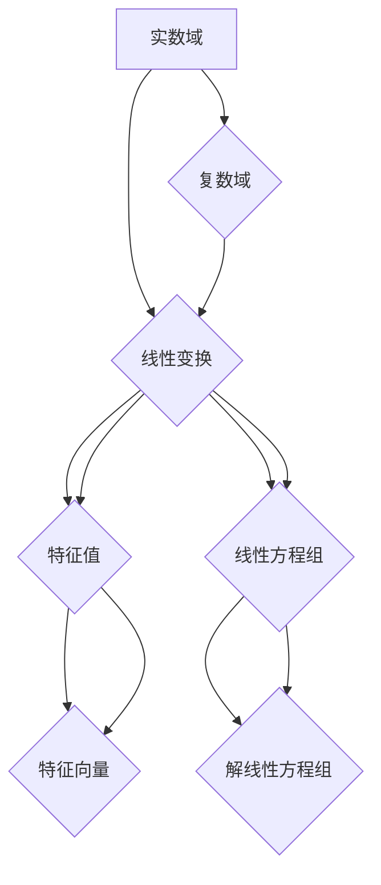

> 线性代数，实数域，复数域，矩阵，向量，线性变换，特征值，特征向量，应用场景

## 1. 背景介绍

线性代数作为数学领域的重要分支，为计算机科学、物理学、工程学等众多领域提供了强大的工具和理论基础。它研究向量、矩阵、线性变换等概念，并通过一系列算法和方法解决各种实际问题。

在计算机科学中，线性代数应用广泛，例如：

* **计算机图形学:**  用于物体变换、投影、光照计算等。
* **机器学习:**  用于特征提取、模型训练、数据降维等。
* **人工智能:**  用于神经网络的训练和推理。
* **信号处理:**  用于信号分析、滤波、压缩等。

本篇文章将从实数域和复数域出发，深入探讨线性代数的基本概念和应用，并通过具体的例子和代码实例，帮助读者理解线性代数的魅力和实用价值。

## 2. 核心概念与联系

**2.1 实数域与复数域**

实数域 (R) 包含所有实数，例如 0, 1, -2, √2 等。复数域 (C) 包含所有复数，复数可以表示为 a + bi 的形式，其中 a 和 b 是实数，i 是虚数单位，满足 i² = -1。

**2.2 向量与矩阵**

* **向量:**  向量是具有大小和方向的量，可以表示为一列数，例如 [1, 2, 3]。
* **矩阵:**  矩阵是按照行和列排列的数的集合，例如：

```
[1 2 3]
[4 5 6]
```

**2.3 线性变换**

线性变换是一种将向量映射到另一个向量空间的函数，满足以下性质：

* **加性:** T(u + v) = T(u) + T(v)
* **齐次性:** T(cu) = cT(u)

**2.4 特征值与特征向量**

对于一个线性变换 T，如果存在一个非零向量 v 和一个标量 λ，满足以下方程：

```
T(v) = λv
```

则 λ 称为 T 的特征值，v 称为 T 的特征向量。

**2.5 线性方程组**

线性方程组是一组线性方程的集合，例如：

```
x + 2y = 3
3x - y = 1
```

可以使用矩阵和向量来表示线性方程组，并通过解线性方程组来求解未知数。

**2.6 Mermaid 流程图**



## 3. 核心算法原理 & 具体操作步骤

### 3.1 算法原理概述

线性代数算法主要用于解决线性方程组、求解矩阵的特征值和特征向量、进行矩阵分解等问题。这些算法通常基于矩阵的运算规则和线性变换的性质。

### 3.2 算法步骤详解

* **高斯消元法:** 用于解线性方程组，通过一系列行变换将系数矩阵转化为阶梯形矩阵，从而求解未知数。
* **特征值和特征向量算法:**  常用的算法包括特征值分解法、QR算法等，通过迭代或矩阵分解的方法求解特征值和特征向量。
* **矩阵分解算法:**  例如 LU 分解、QR 分解等，将矩阵分解成多个简单矩阵的乘积，方便进行后续计算。

### 3.3 算法优缺点

* **高斯消元法:** 优点：简单易懂，易于实现。缺点：计算量较大，对于大型方程组效率较低。
* **特征值和特征向量算法:** 优点：可以用于解决许多实际问题，例如数据降维、信号处理等。缺点：计算复杂度较高，对于大型矩阵效率较低。
* **矩阵分解算法:** 优点：可以将复杂矩阵分解成多个简单矩阵，方便进行后续计算。缺点：算法复杂度较高，需要选择合适的分解方法。

### 3.4 算法应用领域

* **计算机图形学:**  用于物体变换、投影、光照计算等。
* **机器学习:**  用于特征提取、模型训练、数据降维等。
* **人工智能:**  用于神经网络的训练和推理。
* **信号处理:**  用于信号分析、滤波、压缩等。

## 4. 数学模型和公式 & 详细讲解 & 举例说明

### 4.1 数学模型构建

**4.1.1 向量空间:**

向量空间是一个集合，其中元素称为向量，并满足以下条件：

* **加法封闭性:**  任意两个向量相加的结果仍然在该向量空间内。
* **标量乘法封闭性:**  任意向量与标量相乘的结果仍然在该向量空间内。
* **结合律:**  (u + v) + w = u + (v + w)
* **交换律:**  u + v = v + u
* **零向量:**  存在一个零向量，满足 u + 0 = u
* **逆向量:**  对于任意向量 u，存在一个逆向量 -u，满足 u + (-u) = 0
* **标量乘法分配律:**  c(u + v) = cu + cv
* **标量乘法结合律:**  (c d)u = c(d u)

**4.1.2 线性变换:**

线性变换 T: V → W 是一个从向量空间 V 到向量空间 W 的映射，满足以下性质：

* **加性:** T(u + v) = T(u) + T(v)
* **齐次性:** T(cu) = cT(u)

**4.1.3 特征值和特征向量:**

对于一个线性变换 T，如果存在一个非零向量 v 和一个标量 λ，满足以下方程：

```
T(v) = λv
```

则 λ 称为 T 的特征值，v 称为 T 的特征向量。

### 4.2 公式推导过程

**4.2.1 特征值方程:**

特征值方程的推导过程如下：

```
T(v) = λv
```

将 T(v) 用矩阵表示，得到：

```
Av = λv
```

其中 A 是线性变换 T 的矩阵表示，v 是特征向量，λ 是特征值。

将等式两边同时减去 λv，得到：

```
Av - λv = 0
```

将等式左边提取出 v，得到：

```
(A - λI)v = 0
```

其中 I 是单位矩阵。

为了使上述方程有非零解，必须满足以下条件：

```
det(A - λI) = 0
```

这就是特征值方程。

**4.2.2 特征向量求解:**

解特征值方程后，可以得到特征值 λ。将 λ 代入方程 (A - λI)v = 0，可以求解出对应的特征向量 v。

### 4.3 案例分析与讲解

**4.3.1 旋转矩阵:**

旋转矩阵是一个将向量旋转一定角度的线性变换。

```
R(θ) = [cos(θ) -sin(θ)]
       [sin(θ) cos(θ)]
```

其中 θ 是旋转角度。

**4.3.2 特征值和特征向量:**

旋转矩阵的特征值是 1 和 -1，对应的特征向量是沿着旋转轴的方向。

## 5. 项目实践：代码实例和详细解释说明

### 5.1 开发环境搭建

本项目使用 Python 语言进行开发，需要安装 NumPy 和 Matplotlib 库。

```bash
pip install numpy matplotlib
```

### 5.2 源代码详细实现

```python
import numpy as np
import matplotlib.pyplot as plt

# 定义旋转矩阵
def rotation_matrix(theta):
    return np.array([[np.cos(theta), -np.sin(theta)],
                     [np.sin(theta), np.cos(theta)]])

# 生成一个向量
v = np.array([1, 0])

# 计算旋转后的向量
theta = np.pi / 4
R = rotation_matrix(theta)
v_rotated = R @ v

# 绘制原始向量和旋转后的向量
plt.figure(figsize=(6, 6))
plt.quiver(0, 0, v[0], v[1], angles='xy', scale_units='xy', scale=1, color='r', label='原始向量')
plt.quiver(0, 0, v_rotated[0], v_rotated[1], angles='xy', scale_units='xy', scale=1, color='b', label='旋转后的向量')
plt.legend()
plt.title(f'旋转角度: {theta:.2f}')
plt.show()
```

### 5.3 代码解读与分析

* `rotation_matrix(theta)` 函数定义了旋转矩阵，根据给定的角度 θ 计算旋转矩阵。
* `v` 是一个二维向量，表示原始向量。
* `theta` 是旋转角度，这里设置为 π/4。
* `R` 是旋转矩阵，通过调用 `rotation_matrix(theta)` 函数计算得到。
* `v_rotated` 是旋转后的向量，通过矩阵乘法 `R @ v` 计算得到。
* `plt.quiver()` 函数用于绘制向量，`angles='xy'` 表示向量方向以 xy 坐标系为参考。
* `plt.legend()` 函数用于显示图例。
* `plt.title()` 函数用于设置标题。
* `plt.show()` 函数用于显示图形。

### 5.4 运行结果展示

运行代码后，将显示一个图形，其中包含原始向量和旋转后的向量。

## 6. 实际应用场景

### 6.1 计算机图形学

在计算机图形学中，线性代数用于物体变换、投影、光照计算等。例如，可以使用旋转矩阵将物体旋转到指定位置，可以使用缩放矩阵将物体放大或缩小，可以使用平移矩阵将物体移动到指定位置。

### 6.2 机器学习

在机器学习中，线性代数用于特征提取、模型训练、数据降维等。例如，可以使用线性回归模型预测连续变量，可以使用支持向量机分类数据，可以使用主成分分析降维数据。

### 6.3 人工智能

在人工智能中，线性代数用于神经网络的训练和推理。例如，可以使用反向传播算法训练神经网络，可以使用线性变换计算神经网络的输出。

### 6.4 未来应用展望

随着人工智能、机器学习等技术的快速发展，线性代数在未来将有更广泛的应用场景。例如，可以用于开发更智能的机器人、更精准的医疗诊断系统、更安全的网络安全系统等。

## 7. 工具和资源推荐

### 7.1 学习资源推荐

* **书籍:**
    * 《线性代数及其应用》 - Gilbert Strang
    * 《线性代数及其应用》 - David C. Lay
* **在线课程:**
    * MIT OpenCourseWare 线性代数课程
    * Coursera 线性代数课程

### 7.2 开发工具推荐

* **Python:**  Python 是一个非常流行的编程语言，拥有丰富的科学计算库，例如 NumPy、SciPy、Pandas 等。
* **NumPy:**  NumPy 是 Python 的数值计算库，提供了高效的数组操作和线性代数运算。
* **SciPy:**  SciPy 是 Python 的科学计算库，提供了更高级的科学计算功能，例如优化、积分、信号处理等。
* **Matplotlib:**  Matplotlib 是 Python 的绘图库，可以用于绘制各种类型的图形，例如线图、散点图、柱状图等。

### 