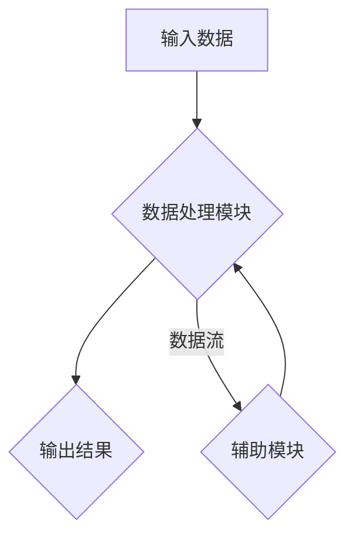

> 结构化思维，算法设计，数据结构，编程实践，软件架构，复杂系统

## 1. 背景介绍

在当今科技日新月异的时代，软件开发和系统设计面临着越来越大的挑战。复杂系统、海量数据、实时交互等需求不断涌现，传统的开发模式已难以满足。在这种背景下，结构化思维的重要性日益凸显。

结构化思维是一种逻辑严谨、层次清晰、系统化的思维方式，它能够帮助我们将复杂问题分解成一个个可管理的小问题，并通过清晰的逻辑关系和步骤进行解决。在软件开发领域，结构化思维被广泛应用于算法设计、数据结构选择、软件架构设计等各个环节，它能够提高开发效率、降低开发成本、提升软件质量。

## 2. 核心概念与联系

结构化思维的核心概念包括：

* **模块化:** 将复杂系统分解成一个个独立、可重用的模块，每个模块都有明确的功能和接口。
* **层次化:** 将系统按照功能或逻辑层次进行划分，每个层次都包含着更具体的子系统或组件。
* **数据流:** 分析系统中数据的流动路径，明确数据的来源、处理过程和最终目的。
* **控制流:** 分析系统中程序执行的顺序和分支逻辑，确保程序的正确性和可靠性。

**Mermaid 流程图:**



## 3. 核心算法原理 & 具体操作步骤

### 3.1  算法原理概述

算法是一种解决特定问题的步骤或规则，它需要明确的输入、输出和操作步骤。结构化思维在算法设计中体现在以下几个方面：

* **分解问题:** 将复杂问题分解成若干个子问题，每个子问题都相对简单易解。
* **选择算法:** 根据问题的特点选择合适的算法，例如排序算法、搜索算法、图算法等。
* **设计步骤:** 明确算法的执行步骤，并确保步骤的逻辑性和正确性。

### 3.2  算法步骤详解

以冒泡排序算法为例，详细说明其步骤：

1. 比较相邻的两个元素，如果顺序错误，则交换它们的位置。
2. 重复步骤1，直到整个数组排序完成。

### 3.3  算法优缺点

冒泡排序算法的特点：

* **优点:** 算法简单易懂，实现代码容易编写。
* **缺点:** 效率较低，时间复杂度为O(n^2)，不适合处理大型数据。

### 3.4  算法应用领域

冒泡排序算法主要应用于：

* **小型数据排序:** 当数据量较小的时候，冒泡排序算法的效率足够满足需求。
* **教学演示:** 由于算法简单易懂，常被用于讲解排序算法的基本原理。

## 4. 数学模型和公式 & 详细讲解 & 举例说明

### 4.1  数学模型构建

对于冒泡排序算法，我们可以用数学模型来描述其时间复杂度：

* **时间复杂度:** T(n) = O(n^2)

其中，n表示数组的长度。

### 4.2  公式推导过程

时间复杂度表示算法执行时间与输入数据大小的增长关系。冒泡排序算法需要进行n-1轮比较，每轮比较需要进行n-i次比较，其中i为当前轮数。因此，总的时间复杂度为：

```
T(n) = (n-1) + (n-2) + ... + 2 + 1
```

这个等式可以化简为：

```
T(n) = n(n-1)/2
```

由于n(n-1)/2 ≈ n^2，所以时间复杂度为O(n^2)。

### 4.3  案例分析与讲解

假设我们有一个长度为10的数组，需要进行冒泡排序。根据公式推导，算法执行时间为：

```
T(10) = 10(10-1)/2 = 45
```

这意味着算法需要执行45次比较才能完成排序。

## 5. 项目实践：代码实例和详细解释说明

### 5.1  开发环境搭建

本项目使用Python语言进行开发，需要安装Python解释器和相关库。

### 5.2  源代码详细实现

```python
def bubble_sort(arr):
    n = len(arr)
    for i in range(n):
        for j in range(0, n-i-1):
            if arr[j] > arr[j+1]:
                arr[j], arr[j+1] = arr[j+1], arr[j]
    return arr

# 测试代码
arr = [64, 34, 25, 12, 22, 11, 90]
sorted_arr = bubble_sort(arr)
print("排序后的数组:", sorted_arr)
```

### 5.3  代码解读与分析

* `bubble_sort(arr)`函数接收一个数组作为输入，并返回排序后的数组。
* 外层循环 `for i in range(n)` 控制排序轮数，每次循环将最大的元素“冒泡”到数组末尾。
* 内层循环 `for j in range(0, n-i-1)` 比较相邻元素，如果顺序错误，则交换它们的位置。
* `if arr[j] > arr[j+1]:` 判断相邻元素的顺序，如果错误，则交换。
* `arr[j], arr[j+1] = arr[j+1], arr[j]` 使用Python的元组解包语法进行元素交换。

### 5.4  运行结果展示

```
排序后的数组: [11, 12, 22, 25, 34, 64, 90]
```

## 6. 实际应用场景

结构化思维在软件开发领域有着广泛的应用场景，例如：

* **软件架构设计:** 将大型软件系统分解成多个模块，每个模块负责特定的功能，并通过接口进行通信。
* **算法设计:** 使用结构化思维设计高效、可靠的算法，解决各种计算问题。
* **数据结构选择:** 根据数据特点选择合适的结构，例如数组、链表、树、图等，提高数据存储和访问效率。
* **代码编写:** 使用结构化编程方法编写代码，提高代码的可读性、可维护性和可扩展性。

### 6.4  未来应用展望

随着人工智能、大数据、云计算等技术的快速发展，结构化思维将变得更加重要。它将帮助我们更好地理解和应对复杂系统，开发出更高效、更智能的软件系统。

## 7. 工具和资源推荐

### 7.1  学习资源推荐

* **书籍:** 《程序员的思维方式》、《代码的艺术》、《设计模式》
* **在线课程:** Coursera、edX、Udemy等平台提供结构化思维和软件开发相关的课程。
* **博客和论坛:** 关注软件开发领域的博客和论坛，学习其他开发者的经验和技巧。

### 7.2  开发工具推荐

* **IDE:** Eclipse、IntelliJ IDEA、Visual Studio Code等集成开发环境可以帮助我们编写和调试代码。
* **版本控制系统:** Git、SVN等版本控制系统可以帮助我们管理代码版本和协同开发。
* **测试工具:** JUnit、pytest等测试工具可以帮助我们编写测试用例，确保代码质量。

### 7.3  相关论文推荐

* **论文:** “结构化思维在软件开发中的应用研究”
* **期刊:** IEEE Transactions on Software Engineering、ACM Transactions on Software Engineering and Methodology等期刊发表了大量关于结构化思维和软件开发的论文。

## 8. 总结：未来发展趋势与挑战

### 8.1  研究成果总结

结构化思维在软件开发领域取得了显著的成果，它提高了开发效率、降低了开发成本、提升了软件质量。

### 8.2  未来发展趋势

未来，结构化思维将继续发展和完善，并与人工智能、大数据等新技术相结合，推动软件开发领域的新突破。

### 8.3  面临的挑战

结构化思维的应用也面临着一些挑战，例如：

* **复杂系统:** 随着系统规模和复杂度的增加，结构化思维的应用变得更加困难。
* **跨学科合作:** 软件开发是一个跨学科的领域，需要不同学科的专家进行合作，如何有效地将结构化思维应用于跨学科合作中是一个挑战。
* **人才培养:** 需要培养更多具备结构化思维能力的软件开发人才。

### 8.4  研究展望

未来研究方向包括：

* **复杂系统结构化思维方法:** 研究适用于复杂系统结构化思维的方法和工具。
* **跨学科合作结构化思维框架:** 建立跨学科合作的结构化思维框架，促进不同学科的专家有效合作。
* **结构化思维人才培养模式:** 建立有效的结构化思维人才培养模式，培养更多具备结构化思维能力的软件开发人才。

## 9. 附录：常见问题与解答

### 9.1  常见问题

* **什么是结构化思维？**

结构化思维是一种逻辑严谨、层次清晰、系统化的思维方式，它能够帮助我们将复杂问题分解成一个个可管理的小问题，并通过清晰的逻辑关系和步骤进行解决。

* **结构化思维在软件开发中有什么作用？**

结构化思维在软件开发中可以提高开发效率、降低开发成本、提升软件质量。

* **如何培养结构化思维能力？**

可以通过学习相关书籍、参加在线课程、关注软件开发领域的博客和论坛等方式培养结构化思维能力。

### 9.2  解答

* **结构化思维的应用范围:** 结构化思维不仅应用于软件开发，也应用于其他领域，例如科学研究、决策分析、问题解决等。
* **结构化思维与创造力:** 结构化思维并非阻碍创造力的，它可以帮助我们更有效地组织和表达我们的想法，从而促进创造力。

作者：禅与计算机程序设计艺术 / Zen and the Art of Computer Programming


<end_of_turn>