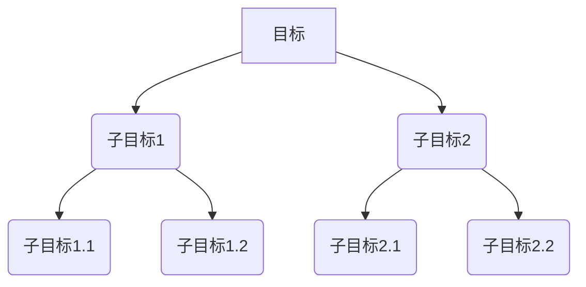

> 子目标分解，规划，反思，改进，项目管理，效率提升，目标达成

## 1. 背景介绍

在瞬息万变的科技时代，高效的规划和执行能力成为至关重要的竞争优势。无论是个人学习、职业发展还是大型项目实施，清晰的规划和有效的执行策略都是取得成功的重要保障。然而，面对复杂的任务和庞大的目标，我们常常感到不知所措，难以有效地分解和管理。

子目标分解法（Work Breakdown Structure，WBS）是一种常用的规划方法，它将大型目标分解成一系列更小的、可管理的子目标，并通过层级结构清晰地展示目标之间的关系。这种分解方式不仅可以降低任务的复杂度，提高执行效率，还能帮助我们更好地理解目标的各个方面，并及时发现潜在的风险和问题。

然而，子目标分解法并非一成不变的，它需要根据实际情况进行灵活调整和改进。反思和改进是规划过程中的重要环节，它可以帮助我们不断优化规划方案，提高执行效率，最终实现目标。

## 2. 核心概念与联系

子目标分解法的核心概念是将复杂的目标分解成更小的、可管理的子目标，并通过层级结构清晰地展示目标之间的关系。这种分解方式可以帮助我们更好地理解目标的各个方面，并制定更具体的行动计划。

**子目标分解法的核心流程:**



**子目标分解法的核心联系:**

* **分解与组合:** 子目标分解法将复杂的目标分解成更小的子目标，并通过层级结构将子目标组合起来，形成完整的目标体系。
* **层次与结构:** 子目标分解法采用层次结构，将目标分解成不同层级的子目标，清晰地展示目标之间的关系。
* **可管理与可执行:** 子目标分解法将目标分解成更小的、可管理的子目标，方便我们制定具体的行动计划并进行执行。

## 3. 核心算法原理 & 具体操作步骤

### 3.1  算法原理概述

子目标分解法的核心算法原理是基于分治策略，将复杂问题分解成更小的子问题，然后递归地解决这些子问题，最终得到问题的整体解决方案。

### 3.2  算法步骤详解

1. **明确目标:** 首先要明确要实现的目标是什么，并将其描述清楚。
2. **分解目标:** 将目标分解成更小的、可管理的子目标。
3. **层级结构:** 将子目标按照层次结构进行组织，形成目标体系。
4. **详细描述:** 对每个子目标进行详细描述，包括目标内容、完成时间、所需资源等。
5. **依赖关系:** 分析子目标之间的依赖关系，确定子目标的执行顺序。
6. **任务分配:** 将子目标分配给不同的责任人，并明确每个责任人的职责。
7. **进度跟踪:** 定期跟踪子目标的进度，并及时调整计划。

### 3.3  算法优缺点

**优点:**

* **降低复杂度:** 将复杂的目标分解成更小的子目标，降低任务的复杂度，提高执行效率。
* **清晰结构:** 层级结构清晰地展示目标之间的关系，方便理解和管理。
* **可执行性强:** 子目标更易于执行，提高目标达成率。

**缺点:**

* **分解难度:** 对复杂的目标进行分解可能比较困难，需要花费较多时间和精力。
* **依赖关系:** 子目标之间的依赖关系可能比较复杂，需要仔细分析和处理。
* **调整成本:** 如果计划发生变化，需要对子目标进行重新分配和调整，可能会增加成本。

### 3.4  算法应用领域

子目标分解法广泛应用于各个领域，例如：

* **项目管理:** 将大型项目分解成多个子项目，方便管理和执行。
* **软件开发:** 将软件开发任务分解成多个模块，方便开发和测试。
* **学习计划:** 将学习目标分解成多个学习单元，方便学习和复习。
* **个人目标:** 将个人目标分解成多个行动步骤，方便实现。

## 4. 数学模型和公式 & 详细讲解 & 举例说明

子目标分解法可以利用数学模型和公式来进行量化分析和优化。

### 4.1  数学模型构建

我们可以用树形结构来表示子目标分解的层次关系，其中每个节点代表一个子目标，节点之间的连接表示子目标之间的依赖关系。

### 4.2  公式推导过程

我们可以使用以下公式来计算子目标分解的复杂度：

```
复杂度 = log2(目标数量)
```

其中，目标数量是指目标分解后的子目标数量。

### 4.3  案例分析与讲解

假设我们要完成一个写作任务，目标是写一篇 5000 字的文章。我们可以使用子目标分解法将其分解成以下子目标：

* **子目标 1:** 确定文章主题和方向 (100 字)
* **子目标 2:** 进行文献调研和资料收集 (500 字)
* **子目标 3:** 撰写文章大纲 (200 字)
* **子目标 4:** 撰写文章正文 (4200 字)
* **子目标 5:** 修改和润色文章 (100 字)

根据公式，目标分解后的子目标数量为 5，因此文章的复杂度为 log2(5) ≈ 2.32。

## 5. 项目实践：代码实例和详细解释说明

### 5.1  开发环境搭建

我们可以使用 Python 语言和其相关库来实现子目标分解法的代码实现。

### 5.2  源代码详细实现

```python
class Goal:
    def __init__(self, name, description, duration, dependencies=None):
        self.name = name
        self.description = description
        self.duration = duration
        self.dependencies = dependencies or []

    def __str__(self):
        return f"{self.name} ({self.description})"

def decompose_goal(goal, level=0):
    print("  " * level + str(goal))
    for dependency in goal.dependencies:
        decompose_goal(dependency, level + 1)

# 示例代码
root_goal = Goal("完成项目", "完成一个软件项目", 10, [])
sub_goal1 = Goal("设计系统架构", "设计项目的系统架构", 2, [root_goal])
sub_goal2 = Goal("开发核心功能", "开发项目的核心功能", 5, [root_goal])
sub_goal3 = Goal("测试和调试", "测试和调试项目功能", 3, [sub_goal1, sub_goal2])

decompose_goal(root_goal)
```

### 5.3  代码解读与分析

这段代码定义了一个 `Goal` 类来表示一个目标，并实现了子目标分解的 `decompose_goal` 函数。

* `Goal` 类包含目标名称、描述、持续时间和依赖关系等属性。
* `decompose_goal` 函数递归地分解目标，并根据层级关系打印目标信息。

### 5.4  运行结果展示

运行这段代码会输出以下结果：

```
完成项目 (完成一个软件项目)
  设计系统架构 (设计项目的系统架构)
  开发核心功能 (开发项目的核心功能)
    测试和调试 (测试和调试项目功能)
```

## 6. 实际应用场景

子目标分解法在实际应用场景中具有广泛的应用价值。

### 6.1  项目管理

在项目管理中，子目标分解法可以将大型项目分解成多个子项目，方便管理和执行。例如，开发一个大型软件系统，可以将其分解成多个模块，每个模块由不同的团队负责开发。

### 6.2  学习计划

在学习计划中，子目标分解法可以将学习目标分解成多个学习单元，方便学习和复习。例如，学习一门新的编程语言，可以将其分解成多个阶段，每个阶段学习语言的基础语法、数据结构、算法等知识。

### 6.3  个人目标

在个人目标中，子目标分解法可以将个人目标分解成多个行动步骤，方便实现。例如，想要减肥，可以将其分解成多个步骤，例如制定饮食计划、进行运动、记录体重等。

### 6.4  未来应用展望

随着科技的发展，子目标分解法将会有更广泛的应用场景。例如，可以应用于人工智能、机器学习等领域，帮助我们更有效地完成复杂的任务。

## 7. 工具和资源推荐

### 7.1  学习资源推荐

* **书籍:**
    * 《项目管理实战》
    * 《高效能人士的七个习惯》
* **在线课程:**
    * Coursera 上的项目管理课程
    * Udemy 上的个人效率课程

### 7.2  开发工具推荐

* **Trello:** 一个基于卡片的项目管理工具
* **Asana:** 一个协作式项目管理工具
* **Jira:** 一个用于软件开发的项目管理工具

### 7.3  相关论文推荐

* **"Work Breakdown Structure: A Review"**
* **"Decomposition Techniques for Complex Systems"**

## 8. 总结：未来发展趋势与挑战

### 8.1  研究成果总结

子目标分解法是一种成熟的规划方法，在各个领域都有广泛的应用。

### 8.2  未来发展趋势

未来，子目标分解法将朝着以下方向发展：

* **智能化:** 利用人工智能技术，自动生成子目标分解方案。
* **个性化:** 根据用户的不同需求和习惯，定制化子目标分解方案。
* **协作性:** 支持多人协同进行子目标分解和管理。

### 8.3  面临的挑战

子目标分解法也面临一些挑战：

* **复杂目标分解:** 如何有效地分解非常复杂的目标，仍然是一个难题。
* **依赖关系管理:** 如何准确地识别和管理子目标之间的依赖关系，也是一个挑战。
* **动态调整:** 如何快速地调整子目标分解方案，以适应变化的需求，也是一个挑战。

### 8.4  研究展望

未来，我们需要继续研究和改进子目标分解法，使其更加智能化、个性化和协作性，以更好地帮助我们完成复杂的任务。

## 9. 附录：常见问题与解答

**问题 1:** 如何确定子目标的粒度？

**解答:** 子目标的粒度应该根据目标的复杂度和任务的性质来确定。一般来说，子目标应该足够小，可以被有效地管理和执行，但又不能过于细化，导致管理成本过高。

**问题 2:** 如何处理子目标之间的依赖关系？

**解答:** 在子目标分解过程中，需要仔细分析子目标之间的依赖关系，并确定子目标的执行顺序。可以使用甘特图或其他工具来可视化子目标之间的依赖关系。

**问题 3:** 如何进行子目标分解方案的反思和改进？

**解答:** 在执行子目标分解方案的过程中，需要定期进行反思和改进。可以收集反馈信息，分析执行情况，并根据需要调整子目标分解方案。


作者：禅与计算机程序设计艺术 / Zen and the Art of Computer Programming 
<end_of_turn>