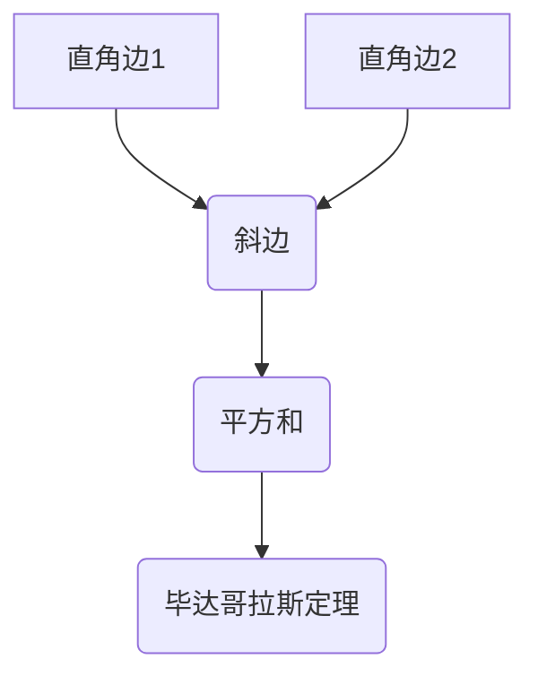

> 计算、无理数、毕达哥拉斯定理、数学模型、算法、编程、计算机科学

## 1. 背景介绍

数千年来，人类一直试图用逻辑和数学来理解世界。从古埃及人建造金字塔到古希腊人探索几何学，数学一直是人类探索宇宙奥秘的工具。而计算，作为数学的应用，更是推动人类文明进步的重要力量。

然而，在人类探索数学的道路上，也充满了困惑和挑战。其中，无理数的发现就是一个经典的例子。

公元前6世纪，古希腊数学家毕达哥拉斯和他的追随者们相信，所有数字都是可以被表示为两个整数的比值，即有理数。他们建立了著名的毕达哥拉斯定理，指出直角三角形的两条直角边的平方和等于斜边的平方。这个定理在几何学和工程学中有着广泛的应用。

然而，当毕达哥拉斯的追随者们试图用这个定理来计算一些特殊的三角形时，他们遇到了一个令人困惑的问题：某些三角形的斜边长度无法用整数的比值来表示，而只能用无限不循环的小数来表示。这些无法用有理数表示的数字被称为无理数。

无理数的发现对古希腊数学家们来说是一个巨大的冲击。它打破了他们对数字世界的固有认知，也引发了他们对数学本质的深刻思考。

## 2. 核心概念与联系

### 2.1 有理数与无理数

* **有理数**: 可以表示为两个整数的比值，例如 1/2, 3, -5/7 等。
* **无理数**: 不能表示为两个整数的比值，例如 π, √2 等。

### 2.2 毕达哥拉斯定理

在直角三角形中，两条直角边的平方和等于斜边的平方。



### 2.3 无理数的发现

古希腊数学家们在尝试用毕达哥拉斯定理计算某些特殊的三角形时，发现斜边长度无法用整数的比值表示，从而发现了无理数。

## 3. 核心算法原理 & 具体操作步骤

### 3.1 算法原理概述

无理数的发现并非一个具体的算法，而是数学家们在探索数学规律的过程中发现的性质。

### 3.2 算法步骤详解

1. 观察和分析：观察和分析不同的三角形，特别是直角三角形。
2. 尝试计算：尝试用毕达哥拉斯定理计算斜边长度，并观察结果。
3. 发现异常：发现某些斜边长度无法用整数的比值表示，而只能用无限不循环的小数来表示。
4. 推理和证明：通过推理和证明，确定这些无法用有理数表示的数字是无理数。

### 3.3 算法优缺点

* **优点**: 揭示了数学世界中隐藏的规律，拓展了人类对数字的理解。
* **缺点**: 无法用具体的算法计算出无理数的精确值，只能用无限不循环的小数来近似表示。

### 3.4 算法应用领域

无理数的发现对数学、物理、工程等多个领域都有着深远的影响。例如：

* **数学**: 无理数是数学中一个重要的概念，它推动了数学的发展，并为许多数学分支奠定了基础。
* **物理**: 无理数在物理学中也扮演着重要的角色，例如圆周率π和自然对数e都是无理数，它们在描述物理现象时起着关键作用。
* **工程**: 无理数在工程学中也得到广泛应用，例如在计算圆形、球体等几何形状时，都需要用到无理数。

## 4. 数学模型和公式 & 详细讲解 & 举例说明

### 4.1 数学模型构建

毕达哥拉斯定理可以用数学模型来表示：

*  a² + b² = c²

其中：

* a 和 b 是直角三角形的两条直角边长度。
* c 是斜边长度。

### 4.2 公式推导过程

毕达哥拉斯定理的推导过程可以参考几何证明，例如利用面积相等原理。

### 4.3 案例分析与讲解

例如，一个直角三角形，其中一条直角边长度为3，另一条直角边长度为4，那么根据毕达哥拉斯定理，斜边长度为：

```latex
c = \sqrt{a^2 + b^2} = \sqrt{3^2 + 4^2} = \sqrt{9 + 16} = \sqrt{25} = 5
```

## 5. 项目实践：代码实例和详细解释说明

### 5.1 开发环境搭建

可以使用任何支持Python语言的开发环境，例如PyCharm、VS Code等。

### 5.2 源代码详细实现

```python
import math

def calculate_hypotenuse(a, b):
  """
  计算直角三角形的斜边长度。

  Args:
    a: 直角边1长度。
    b: 直角边2长度。

  Returns:
    斜边长度。
  """
  c = math.sqrt(a**2 + b**2)
  return c

# 示例用法
a = 3
b = 4
c = calculate_hypotenuse(a, b)
print(f"直角边长度为 {a} 和 {b} 的直角三角形的斜边长度为 {c}")
```

### 5.3 代码解读与分析

* 该代码定义了一个名为`calculate_hypotenuse`的函数，该函数接受两个参数，分别代表直角三角形的两条直角边长度。
* 函数内部使用`math.sqrt()`函数计算斜边长度，并返回结果。
* 代码示例演示了如何使用该函数计算一个特定直角三角形的斜边长度。

### 5.4 运行结果展示

```
直角边长度为 3 和 4 的直角三角形的斜边长度为 5.0
```

## 6. 实际应用场景

毕达哥拉斯定理和无理数在现实生活中有着广泛的应用场景，例如：

* **建筑工程**: 计算建筑物的高度、长度、角度等。
* **导航系统**: 计算船只、飞机等航行的路线和距离。
* **地图制作**: 计算地图上的距离和比例。
* **计算机图形学**: 生成逼真的三维图形和动画。

### 6.4 未来应用展望

随着计算机技术的发展，毕达哥拉斯定理和无理数将在更多领域得到应用，例如：

* **人工智能**: 用于训练机器学习模型，提高模型的精度和效率。
* **量子计算**: 用于开发新的量子算法，解决传统计算机无法解决的问题。
* **生物信息学**: 用于分析生物数据，例如基因序列和蛋白质结构。

## 7. 工具和资源推荐

### 7.1 学习资源推荐

* **书籍**:
    * 《数学原理》 -  欧几里得
    * 《几何原本》 -  欧几里得
    * 《数学分析》 -  Walter Rudin
* **在线课程**:
    * Coursera: 数学分析
    * edX: 线性代数
    * Khan Academy: 几何学

### 7.2 开发工具推荐

* **Python**: 
    * PyCharm
    * VS Code
* **数学软件**:
    * Mathematica
    * Maple
    * MATLAB

### 7.3 相关论文推荐

* **无理数的发现**:
    *  "On the Irrationality of the Square Root of 2" -  G. Cantor
* **毕达哥拉斯定理的应用**:
    * "Pythagorean Theorem and Its Applications" -  J. H. Conway

## 8. 总结：未来发展趋势与挑战

### 8.1 研究成果总结

毕达哥拉斯定理和无理数的发现是人类数学探索的重要里程碑，它们不仅拓展了人类对数字世界的理解，也为许多科学领域的发展奠定了基础。

### 8.2 未来发展趋势

随着计算机技术的发展，毕达哥拉斯定理和无理数将在更多领域得到应用，例如人工智能、量子计算、生物信息学等。

### 8.3 面临的挑战

* 如何更有效地计算和处理无理数。
* 如何将毕达哥拉斯定理和无理数应用于更复杂的问题。
* 如何探索无理数的更深层次的性质。

### 8.4 研究展望

未来，研究人员将继续探索无理数的性质，并将其应用于更广泛的领域。

## 9. 附录：常见问题与解答

* **什么是无理数？**

无理数是指不能表示为两个整数的比值，只能用无限不循环的小数来表示的数字。

* **毕达哥拉斯定理是什么？**

毕达哥拉斯定理指出，在直角三角形中，两条直角边的平方和等于斜边的平方。

* **如何计算无理数？**

无法用具体的算法计算出无理数的精确值，只能用无限不循环的小数来近似表示。

* **无理数有什么应用？**

无理数在数学、物理、工程等多个领域都有着广泛的应用。


作者：禅与计算机程序设计艺术 / Zen and the Art of Computer Programming 
<end_of_turn>