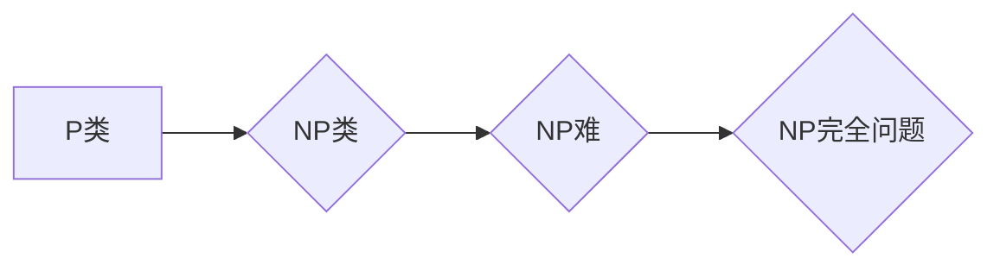

> NP完全问题，复杂度理论，算法，NP问题，多重背包问题，旅行商问题，SAT问题，图着色问题

## 1. 背景介绍

在计算机科学领域，计算复杂性理论是研究算法效率和资源消耗的理论分支。它试图量化算法的复杂度，并根据复杂度将问题分类。其中，NP完全问题是计算复杂性理论中最重要和最具挑战性的问题之一。

NP完全问题是指一类问题，它们满足以下三个条件：

1. **属于NP类**: 对于NP完全问题，如果给出一个解，可以通过多项式时间验证其正确性。
2. **NP难**: 任何NP问题都可以被多项式时间还原到该NP完全问题。
3. **完全性**: 任何NP完全问题都可以被多项式时间还原到另一个NP完全问题。

这意味着，如果找到了一种多项式时间算法解决任意一个NP完全问题，那么就可以解决所有NP问题。

## 2. 核心概念与联系

NP完全问题是计算复杂性理论的核心概念之一，它与其他概念密切相关，例如：

* **P类**: 包含所有可以在多项式时间内被解决的问题。
* **NP类**: 包含所有可以在多项式时间内被验证的问题。
* **NP难**: 指的是那些不能在多项式时间内被解决的问题，但可以通过多项式时间验证其解的正确性。

**Mermaid 流程图**



## 3. 核心算法原理 & 具体操作步骤

由于NP完全问题没有已知的多项式时间算法，因此解决这些问题通常需要采用近似算法或启发式算法。

### 3.1  算法原理概述

近似算法的目标是找到问题的近似解，而不是精确解。启发式算法则利用启发式规则来寻找可能的解，但不能保证找到最优解。

### 3.2  算法步骤详解

具体算法步骤取决于所解决的NP完全问题。例如，解决旅行商问题可以使用遗传算法或模拟退火算法。

### 3.3  算法优缺点

近似算法和启发式算法的优点是能够在有限时间内找到可接受的解，而缺点是不能保证找到最优解。

### 3.4  算法应用领域

NP完全问题广泛存在于现实世界中，例如：

* **组合优化**: 旅行商问题、背包问题、调度问题等。
* **人工智能**: 逻辑推理、知识表示、机器学习等。
* **密码学**: 密码体制的设计和破解。

## 4. 数学模型和公式 & 详细讲解 & 举例说明

NP完全问题的数学模型和公式通常基于图论、组合数学和逻辑学。

### 4.1  数学模型构建

例如，旅行商问题可以被表示为一个图论问题，其中每个城市是一个节点，两座城市之间的距离是一个边权。目标是找到一条路径，使得路径上的总距离最小。

### 4.2  公式推导过程

可以使用动态规划算法或分支限界搜索算法来解决旅行商问题。

### 4.3  案例分析与讲解

可以通过实例分析来理解NP完全问题的数学模型和公式。例如，可以分析一个包含5个城市的旅行商问题，并使用动态规划算法求解其最短路径。

## 5. 项目实践：代码实例和详细解释说明

可以使用Python语言实现NP完全问题的算法。

### 5.1  开发环境搭建

需要安装Python语言和相关库，例如NumPy、SciPy等。

### 5.2  源代码详细实现

```python
# 旅行商问题示例代码

import numpy as np

def calculate_distance(city1, city2):
    # 计算两座城市之间的距离
    return np.sqrt((city1[0] - city2[0])**2 + (city1[1] - city2[1])**2)

def calculate_total_distance(tour):
    # 计算路径上的总距离
    total_distance = 0
    for i in range(len(tour) - 1):
        total_distance += calculate_distance(tour[i], tour[i+1])
    total_distance += calculate_distance(tour[-1], tour[0])
    return total_distance

# 城市坐标
cities = np.array([[0, 0], [1, 1], [2, 0], [0, 2], [1, 2]])

# 使用遗传算法求解旅行商问题
# ...

# 输出最短路径
print("最短路径:", tour)
print("总距离:", calculate_total_distance(tour))
```

### 5.3  代码解读与分析

代码首先定义了计算城市间距离和路径总距离的函数。然后，使用遗传算法求解旅行商问题，并输出最短路径和总距离。

### 5.4  运行结果展示

运行代码后，将输出最短路径和总距离。

## 6. 实际应用场景

NP完全问题在现实世界中有着广泛的应用场景。

### 6.1  组合优化

* **旅行商问题**: 寻找最短路径访问多个城市。
* **背包问题**: 在容量限制下，选择物品以最大化价值。
* **调度问题**: 优化资源分配和任务安排。

### 6.2  人工智能

* **逻辑推理**: 解决复杂逻辑问题，例如证明定理。
* **知识表示**: 建立知识图谱，表示和推理知识。
* **机器学习**: 训练机器学习模型，例如分类和回归。

### 6.3  密码学

* **密码体制**: 设计安全的密码体制，例如RSA加密算法。
* **密码破解**: 破解密码体制，例如攻击RSA加密算法。

### 6.4  未来应用展望

随着计算能力的提升和算法的改进，NP完全问题的应用场景将会更加广泛。例如，在人工智能领域，可以利用NP完全问题的求解方法来解决更复杂的任务，例如自动驾驶和机器人控制。

## 7. 工具和资源推荐

### 7.1  学习资源推荐

* **书籍**:
    * 《计算复杂性导论》
    * 《算法导论》
* **在线课程**:
    * Coursera: Computational Complexity
    * edX: Introduction to Algorithms

### 7.2  开发工具推荐

* **Python**: 广泛用于算法开发和数据分析。
* **C++**: 高性能编程语言，适合开发复杂算法。

### 7.3  相关论文推荐

* **NP-completeness**:
    * Cook, S. A. (1971). The complexity of theorem-proving procedures.
* **Approximation algorithms**:
    * Vazirani, U. V. (2001). Approximation algorithms.

## 8. 总结：未来发展趋势与挑战

NP完全问题是计算复杂性理论的核心问题，其研究对计算机科学的发展具有重要意义。

### 8.1  研究成果总结

在过去几十年中，对NP完全问题的研究取得了重要进展，例如：

* 发现了许多NP完全问题。
* 开发了近似算法和启发式算法。
* 研究了NP完全问题的性质和特性。

### 8.2  未来发展趋势

未来，NP完全问题的研究将继续朝着以下方向发展：

* 寻找新的NP完全问题。
* 开发更有效的近似算法和启发式算法。
* 研究NP完全问题的性质和特性。

### 8.3  面临的挑战

NP完全问题的研究面临着许多挑战，例如：

* 证明P=NP或P≠NP。
* 找到NP完全问题的多项式时间算法。
* 开发更有效的近似算法和启发式算法。

### 8.4  研究展望

尽管NP完全问题仍然是一个未解之谜，但研究者们将继续努力，探索其奥秘，并为计算机科学的发展做出贡献。

## 9. 附录：常见问题与解答

### 9.1  P类和NP类有什么区别？

P类包含所有可以在多项式时间内被解决的问题，而NP类包含所有可以在多项式时间内被验证的问题。

### 9.2  NP完全问题有什么特点？

NP完全问题是NP类中难度最大的问题，它们满足以下三个条件：

1. 属于NP类
2. NP难
3. 完全性

### 9.3  如何解决NP完全问题？

由于NP完全问题没有已知的多项式时间算法，因此通常需要采用近似算法或启发式算法。

### 9.4  NP完全问题有哪些应用场景？

NP完全问题广泛存在于现实世界中，例如组合优化、人工智能和密码学。


作者：禅与计算机程序设计艺术 / Zen and the Art of Computer Programming 
<end_of_turn>